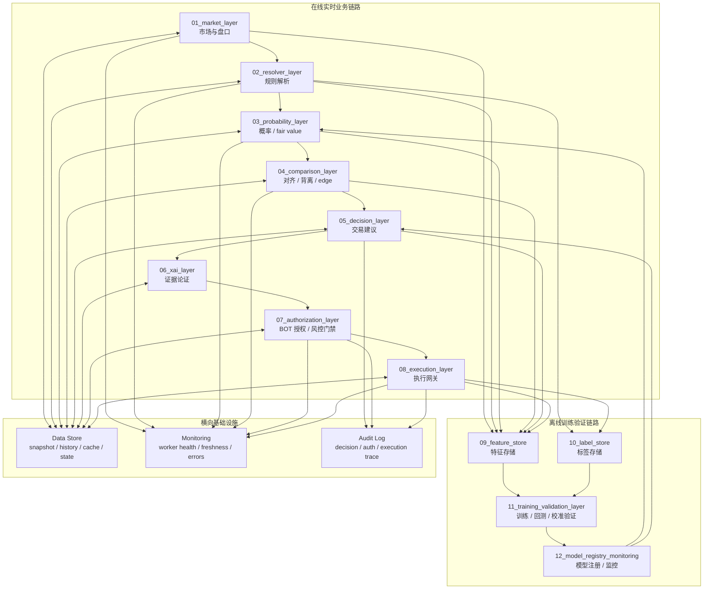

# AARS Polymarket Weather Trading Console 架构设计文档

版本：v0.1  
日期：2026-04-17  
定位：Polymarket 天气市场实时分析、证据论证、BOT 授权与执行控制台

---

## 1. 设计目标

本系统的目标不是普通天气看板，而是面向 Polymarket 天气 / 气候预测市场的实时交易研究与执行控制台。

它需要同时回答五个核心问题：

1. 我现在看的是哪个市场？
2. 这个市场当前盘口状态是什么？
3. 模型 / resolver 对该市场的支持证据是什么？
4. 市场赔率与模型判断是对齐还是背离，背离程度有多大？
5. 在当前证据和权限条件下，BOT 能不能自动执行？

系统最终形态应具备三条闭环：

- 实时决策闭环：market -> resolver -> probability -> comparison -> decision -> authorization -> execution。
- 证据论证闭环：resolver trace -> probability trace -> comparison evidence -> XAI argument -> operator review。
- 训练验证闭环：realtime events -> feature store -> label store -> backtest / validation -> model registry -> live / shadow model。

---

## 2. 总体架构



---

## 3. 实时链路

推荐的实时链如下：

```text
Polymarket Realtime
    -> 01_market_layer
       -> market_snapshot / orderbook_state / market_implied_probability

Polymarket Metadata + market question
    -> 02_resolver_layer
       -> market_rule / station_mapping / variable_mapping / data_requirement

ECMWF / HRRR / METAR / official obs
    -> weather_data_adapters
       -> forecast_snapshot / observation_snapshot / source_confidence

market layer + resolver layer + weather snapshots
    -> 03_probability_layer
       -> fair_value / model_probability / forecast_support_score / confidence

probability layer + market implied probability
    -> 04_comparison_layer
       -> divergence / edge / confidence_adjusted_edge / history

comparison layer
    -> 05_decision_layer
       -> side / size / action_hint / reason_code

decision layer
    -> 06_xai_layer
       -> evidence_bundle / argument_trace
    -> dashboard / telegram
    -> 07_authorization_gate
       -> can_execute / block_reasons / allowed_action
    -> 08_execution_gateway
       -> dry_run / order_intent / order_receipt
```

关键原则：

- Polymarket 产生市场与盘口。
- Resolver 解释市场规则。
- Weather adapters 负责拉取并标准化天气 / 气候数据。
- Probability layer 计算模型概率和 fair value。
- Comparison layer 计算 edge 与 divergence。
- Decision layer 生成交易候选，不直接执行。
- Authorization gate 判断 BOT 是否允许动。
- Execution gateway 只执行通过授权与风控门禁的动作。

---

## 4. 八层业务架构

### 4.1 01_market_layer

职责：负责 Polymarket 市场发现、搜索、watchlist、盘口状态归一化。

输入：

- Gamma markets / events
- CLOB WebSocket
- 用户搜索结果
- pinned market / watchlist

输出：

- `MarketSnapshot`
- `OrderbookState`
- `MarketImpliedProbability`
- `MarketWatchlist`
- `MarketWatchlistProjection`
  - resolver_status
  - edge_bucket
  - freshness_bucket

示例：

```json
{
  "market_id": "379803",
  "market_question": "Highest temperature in Shanghai on April 16?",
  "market_family": "temperature_daily_max",
  "slug": "highest-temperature-in-shanghai-on-april-16-2026",
  "yes_price": 0.63,
  "no_price": 0.37,
  "favored_side": "yes",
  "market_implied_probability": 0.63,
  "updated_at": "2026-04-17T01:00:00Z"
}
```

边界：不解析天气规则，不计算交易建议。

---

### 4.2 02_resolver_layer

职责：把 Polymarket 自然语言问题解析成可计算规则。

输入：

- market question
- slug
- event title
- known rulebook
- historical resolver overrides

输出：

- `MarketRule`
- `StationMapping`
- `VariableMapping`
- `DataRequirement`
- `BandScheme`
- `ResolverSourceContract`

示例：

```json
{
  "market_id": "379803",
  "market_family": "temperature_daily_max",
  "location_name": "Shanghai",
  "station_id": "ZSPD",
  "station_name": "Shanghai Pudong Intl Airport",
  "target_date": "2026-04-16",
  "variable_name": "daily_max_temperature",
  "unit": "celsius",
  "required_sources": ["wunderground_zspd_history", "wunderground_zspd_realtime", "forecast_station_mapping"],
  "band_scheme": "temperature_celsius_integer",
  "resolver_status": "matched",
  "resolver_confidence": 0.92,
  "settlement_source_type": "station_observation",
  "official_vs_proxy_source": "official",
  "source_match_grade": "exact_station",
  "official_source_url": "https://www.wunderground.com/history/weekly/cn/shanghai/ZSPD"
}
```

边界：resolver 只回答“这个市场到底问什么、去哪取数、如何分 band、当前 source contract 到底有多精确”，不负责实际拉数据和下交易判断。

Phase 18 之后，resolver layer 还必须输出一组稳定的 source contract 字段：

- `required_sources`
- `settlement_source_type`
- `official_vs_proxy_source`
- `source_match_grade`
- `official_source_url`
- `source_note`

这些字段会直接进入：

- dashboard `Resolver Status`
- `Data Alignment Audit`
- `Execution Gate`

因此 resolver 已不再只是“分类器”，而是上游 contract provider。

---

### 4.3 Weather Data Adapters

天气源不应直接进入 resolver layer，而应由 resolver 输出 `DataRequirement` 后再由 adapter 执行。

支持来源：

- ECMWF
- HRRR
- METAR
- Wunderground
- official observations
- climate index / sea ice official datasets

输出：

- `ForecastSnapshot`
- `ObservationSnapshot`
- `SourceConfidence`

示例：

```json
{
  "market_id": "379803",
  "source": "wunderground_zspd",
  "timestamp": "2026-04-17T01:00:00Z",
  "target_date": "2026-04-16",
  "variable_name": "daily_max_temperature",
  "forecast_value": 30.0,
  "observed_value": null,
  "source_confidence": 0.82
}
```

---

### 4.4 03_probability_layer

职责：将市场概率、模型支持、天气预测、置信度统一成可比较的概率表达。

输出：

- `fair_value`
- `model_probability`
- `forecast_support_score`
- `confidence`
- `probability_contract.v1`
- `calibration_status`
- `probability_mode`
- `execution_constraint`

示例：

```json
{
  "market_id": "379803",
  "market_implied_probability": 0.63,
  "model_probability": 0.71,
  "fair_value": 0.71,
  "forecast_support_score": 0.86,
  "confidence": 0.82,
  "method": "band_support_heuristic",
  "calibration_status": "not_calibrated",
  "probability_mode": "heuristic_not_calibrated",
  "execution_constraint": "manual_advisory_only",
  "probability_contract": {
    "contract_version": "probability_contract.v1",
    "probability_mode": "heuristic_not_calibrated",
    "calibration_status": "not_calibrated",
    "execution_constraint": "manual_advisory_only",
    "model_id": null,
    "validation_ref": null
  }
}
```

注意：

- `fair_value` 是模型估计，不是交易保证值。
- 当前阶段必须显式标注 `not_calibrated` 或 `heuristic_not_calibrated`。
- Phase 17 开始，probability layer 通过 validation-driven state machine 输出三态：
  - `heuristic_not_calibrated`
  - `shadow_calibrated_candidate`
  - `live_approved`
- Phase 21 开始，这三态已收口为 `probability_contract.v1`，并被 ProbabilityState、Unified Status、Dashboard OrderIntent、Telegram signal 与 Gateway live gate 共同消费。
- 这三态定义概率层可信度和执行约束，但仍不替代 authorization / exposure / readiness 等其他风控门禁。

---

### 4.5 04_comparison_layer

职责：比较市场隐含概率与模型 fair value，计算 edge、divergence 与历史变化。

输出：

- `ComparisonPoint`
- `DivergenceState`
- `EdgeState`
- `ComparisonHistory`

示例：

```json
{
  "market_id": "379803",
  "timestamp": "2026-04-17T01:00:00Z",
  "market_probability": 0.63,
  "fair_value": 0.71,
  "edge": 0.08,
  "confidence_adjusted_edge": 0.065,
  "market_band": "29",
  "model_band": "30",
  "band_distance": 1,
  "divergence_status": "positive_edge"
}
```

边界：comparison 只判断背离与 edge，不决定是否下单。

---

### 4.6 05_decision_layer

职责：根据 comparison、confidence、liquidity、spread、risk policy 生成交易候选。

输出：

- `TradeDecision`
- `side`
- `size`
- `action_hint`
- `reason_code`

示例：

```json
{
  "market_id": "379803",
  "side": "yes",
  "size": "small",
  "action_hint": "watch_or_small_entry",
  "reason_code": "positive_edge_with_medium_confidence",
  "decision_status": "candidate",
  "decision_type": "heuristic_decision_aid"
}
```

边界：decision layer 只生成候选建议，不直接触发 BOT。

---

### 4.7 06_xai_layer

职责：把 resolver、probability、comparison、decision 的过程组织成可审查证据链。

输出：

- `EvidenceBundle`
- `ArgumentTrace`
- `XAIExplanation`

示例：

```json
{
  "market_id": "379803",
  "topline": "YES has estimated positive edge.",
  "argument_step": "resolver_station_match",
  "xai_level": "physical_evidence",
  "evidence": [
    "Resolver mapped market to ZSPD daily max temperature.",
    "Forecast support implies fair value 0.71.",
    "Market implied probability is 0.63.",
    "Confidence-adjusted edge is positive."
  ],
  "warnings": [
    "Probability is heuristic, not calibrated.",
    "Official settlement value is not available yet."
  ]
}
```

边界：XAI 解释决策，不改变决策本身。

---

### 4.8 07_authorization_layer

职责：管理 BOT 自动交易授权与风控门禁。

授权的本质是：

> 操作员允许 BOT 在满足风控条件时自动执行交易。

授权不是“证据支持授权”，也不是“模型正确性证明”。

输入：

- `TradeDecision`
- operator authorization
- resolver status
- data freshness
- liquidity / spread
- risk limits
- execution gateway health
- probability contract state
- compact gate stack summary

输出：

- `AuthorizationState`
- `RiskGateDecision`

示例：

```json
{
  "market_id": "379803",
  "operator_authorized": true,
  "risk_gate_status": "blocked",
  "can_bot_execute": false,
  "block_reasons": [
    "forecast_snapshot_stale",
    "resolver_confidence_below_threshold"
  ],
  "authorized_at": "2026-04-17T01:00:00Z",
  "authorized_by": "operator"
}
```

---

### 4.9 08_execution_layer

职责：执行通过授权与风控门禁的交易动作。

输入：

- `ExecutionIntent`
- approved authorization
- `probability_contract.v1`
- order policy
- account / CLOB credentials

输出：

- `OrderRequest`
- `OrderReceipt`
- `ExecutionAuditLog`

示例：

```json
{
  "market_id": "379803",
  "side": "yes",
  "order_type": "limit",
  "limit_price": 0.62,
  "size": 5,
  "mode": "dry_run",
  "decision_ref": "decision_abc",
  "authorization_ref": "auth_xyz",
  "status": "created"
}
```

边界：execution layer 不做分析、不做 resolver、不改概率。

---

## 5. 训练与验证架构

如果要使用市场数据进行训练，系统必须增加离线训练验证链。

重要原则：

> Polymarket 盘口数据不能直接等同真实标签。它适合作为特征、市场共识、流动性与价格行为信号；真正标签应来自 official resolution、official observations、settlement value 或未来价格 / PnL。

### 5.1 市场数据可作为哪些特征

盘口状态特征：

```json
{
  "market_id": "379803",
  "timestamp": "2026-04-17T01:00:00Z",
  "yes_price": 0.63,
  "no_price": 0.37,
  "mid_price": 0.625,
  "spread": 0.02,
  "liquidity": 2500,
  "volume_24h": 900
}
```

盘口动态特征：

```json
{
  "market_id": "379803",
  "timestamp": "2026-04-17T01:00:00Z",
  "price_change_5m": 0.03,
  "price_change_1h": 0.08,
  "volume_change_1h": 1200,
  "volatility_1h": 0.06,
  "orderbook_imbalance": 0.22
}
```

天气 / resolver 特征：

```json
{
  "market_id": "379803",
  "station_id": "ZSPD",
  "variable_name": "daily_max_temperature",
  "forecast_value": 30.0,
  "forecast_delta_6h": 1.2,
  "forecast_spread_models": 1.8,
  "model_agreement_score": 0.74
}
```

comparison / edge 特征：

```json
{
  "market_id": "379803",
  "market_probability": 0.63,
  "model_probability": 0.71,
  "edge": 0.08,
  "confidence_adjusted_edge": 0.065,
  "divergence_status": "positive_edge"
}
```

---

## 6. Feature Store

建议新增 `09_feature_store`，先用 DuckDB / SQLite，后续可扩展到更正式的数据仓库。

推荐表：

```text
feature_store/
  market_features
  orderbook_features
  resolver_features
  weather_features
  probability_features
  comparison_features
  decision_features
  execution_features
```

每条特征必须携带：

```text
market_id
timestamp
feature_time
source
schema_version
producer_version
```

训练约束：

> 数据集构建必须 point-in-time safe。任何训练样本只能使用当时已经可见的数据，禁止使用未来发布的 forecast、obs、settlement 信息。

---

## 7. Label Store

建议新增 `10_label_store`，标签至少分四类。

### 7.1 Weather Outcome Label

用于训练天气结果模型。

```json
{
  "market_id": "379803",
  "label_type": "weather_outcome",
  "official_value": 30.0,
  "official_band": "30",
  "station_id": "ZSPD",
  "resolved_at": "2026-04-17T00:00:00Z",
  "source": "official_obs"
}
```

### 7.2 Market Settlement Label

用于训练市场结果预测。

```json
{
  "market_id": "379803",
  "label_type": "market_settlement",
  "settlement_outcome": "yes",
  "settlement_value": 1,
  "resolved_at": "2026-04-17T00:00:00Z",
  "source": "polymarket_resolution"
}
```

### 7.3 Price Movement Label

用于训练短期盘口反应。

```json
{
  "market_id": "379803",
  "label_type": "price_forward_return",
  "horizon": "1h",
  "price_now": 0.63,
  "price_future": 0.69,
  "forward_return": 0.06
}
```

### 7.4 Trade PnL Label

用于训练 decision / sizing。

```json
{
  "market_id": "379803",
  "label_type": "trade_pnl",
  "side": "yes",
  "entry_price": 0.63,
  "settlement_value": 1,
  "gross_return": 0.37,
  "net_return": 0.35
}
```

---

## 8. Training / Validation Layer

建议新增 `11_training_validation_layer`。

职责：

```text
training_validation_layer/
  dataset_builder
  point_in_time_joiner
  train_test_splitter
  backtester
  calibration_evaluator
  strategy_evaluator
  model_trainer
  validation_reporter
```

输出示例：

```json
{
  "model_name": "weather_fair_value_v1",
  "train_period": "2025-01-01/2026-03-31",
  "validation_period": "2026-04-01/2026-04-15",
  "brier_score": 0.18,
  "log_loss": 0.54,
  "calibration_error": 0.07,
  "roi_backtest": 0.12,
  "max_drawdown": 0.09,
  "sample_count": 842,
  "approved_for_live": false
}
```

验证指标分三类：

概率模型指标：

- Brier Score
- Log Loss
- Calibration Error
- AUC
- Reliability Curve

交易策略指标：

- ROI
- Max Drawdown
- Hit Rate
- Average Edge Captured
- Slippage Impact
- Turnover
- Position Concentration

Resolver 质量指标：

- resolver_match_rate
- station_mapping_accuracy
- variable_mapping_accuracy
- target_date_accuracy
- unmatched_market_rate
- manual_override_rate

---

## 9. Model Registry / Monitoring

建议新增 `12_model_registry_monitoring`。

模型部署模式：

```text
offline_only
shadow
live
```

模型注册示例：

```json
{
  "model_id": "fair_value_weather_v3",
  "model_type": "probability",
  "trained_at": "2026-04-17T00:00:00Z",
  "features_version": "weather_features_v2",
  "training_data_range": "2025-01-01/2026-04-01",
  "validation_metrics": {
    "brier_score": 0.18,
    "log_loss": 0.54,
    "calibration_error": 0.07
  },
  "approved_for_live": false,
  "deployment_mode": "shadow"
}
```

上线原则：

- `offline_only`：只训练验证，不进入实时链。
- `shadow`：实时计算但不影响决策。
- `live`：允许进入 probability layer 或 decision layer。

---

## 10. 监控层设计

建议输出 `monitoring_status.json`。

示例：

```json
{
  "generated_at": "2026-04-17T01:00:00Z",
  "workers": [
    {
      "name": "polymarket_realtime",
      "status": "ok",
      "last_seen_at": "2026-04-17T00:59:55Z",
      "freshness_seconds": 5
    },
    {
      "name": "forecast_resolver",
      "status": "warning",
      "last_seen_at": "2026-04-17T00:48:00Z",
      "freshness_seconds": 720
    }
  ],
  "sources": [
    {
      "name": "gamma_api",
      "status": "ok"
    },
    {
      "name": "wunderground_zspd",
      "status": "manual_cache",
      "last_error": null
    }
  ],
  "resolver_coverage": {
    "tracked_markets": 12,
    "matched": 5,
    "unmatched": 7
  }
}
```

Dashboard 顶部应展示：

- market data freshness
- resolver status
- forecast freshness
- comparison freshness
- BOT authorization state
- execution gateway health

---

## 11. 推荐目录结构

实际 Python 包名不建议使用数字开头，推荐用语义目录，同时在文档和 UI 中保留层级编号。

```text
src/aars_weather_trading/
  market_layer/
    gamma_discovery.py
    clob_stream.py
    market_snapshot.py
    watchlist_service.py

  resolver_layer/
    market_rule.py
    resolver_engine.py
    station_matcher.py
    variable_mapper.py
    band_scheme_mapper.py

  probability_layer/
    market_probability.py
    forecast_probability.py
    fair_value.py
    calibration_status.py

  comparison_layer/
    comparison_point.py
    divergence_engine.py
    edge_engine.py
    freshness_checker.py

  decision_layer/
    trade_decision.py
    heuristic_decision_engine.py
    decision_reason_codes.py

  xai_layer/
    evidence_bundle.py
    argument_trace.py
    xai_renderer.py

  authorization_layer/
    authorization_state.py
    risk_gate.py
    policy.py

  execution_layer/
    execution_intent.py
    order_gateway.py
    execution_receipt.py

  training_validation_layer/
    dataset_builder.py
    backtester.py
    calibration_evaluator.py
    model_trainer.py

  infrastructure/
    data_store/
    feature_store/
    label_store/
    monitoring/
    audit_log/
    model_registry/
```

---

## 12. 当前模块迁移映射

```text
polymarket-weather-ingest
  -> 01_market_layer

weather-rules-research
  -> 02_resolver_layer
  -> weather_data_adapters

weather-comparison-engine
  -> 03_probability_layer
  -> 04_comparison_layer
  -> 05_decision_layer

weather-dashboard
  -> 06_xai_layer presentation
  -> 07_authorization_layer UI
  -> operator console

weather-telegram-console
  -> notification / human-in-loop authorization channel

weather-execution-gateway
  -> 08_execution_layer
```

迁移原则：

- Dashboard 不再承担核心业务计算。
- Resolver 不再承担实际交易判断。
- Decision 不直接执行。
- Authorization 只控制 BOT 权限和风控门禁。
- Execution 只消费已授权且通过 gate 的动作。

---

## 13. 分阶段落地路线

### 阶段 1：架构止血

目标：让当前系统稳定、边界清楚。

- 定义核心 schema：`MarketSnapshot`、`MarketRule`、`ForecastSnapshot`、`ProbabilityState`、`ProbabilityContract`、`ComparisonPoint`、`TradeDecision`、`EvidenceBundle`、`AuthorizationState`、`ExecutionIntent`。
- 将外部请求全部改为非阻塞：手动刷新、缓存、worker 异步写入。
- 新增 `monitoring_status.json`。
- Dashboard 顶部展示数据新鲜度和 worker health。

### 阶段 2：Resolver 中心化

目标：让“市场到底对应什么气象站 / 指标 / 规则”成为核心能力。

- 新增 resolver engine。
- 上海市场输出 ZSPD + daily max temperature。
- 全球 hottest year 输出 global temperature index。
- sea ice 输出 official sea ice extent source。
- 未匹配市场明确输出 `resolver_status=unmatched`。

### 阶段 3：训练数据积累

目标：为模型训练和回测建立可靠数据基础。

- 新增 feature store。
- 新增 label store。
- 记录 market、resolver、forecast、probability、comparison、decision、authorization、execution 全链路事件。
- 构建 point-in-time safe dataset builder。

### 阶段 4：回测与 Shadow Model

目标：先验证 heuristic，再引入模型。

- 回测现有 heuristic edge 策略。
- 训练简单概率模型。
- 以 `shadow` 模式接入实时链。
- 比较 heuristic 与 trained model 的实际表现。

### 阶段 5：受控执行

目标：生产化 BOT 执行闭环。

- 完成 risk gate。
- Execution gateway 默认 dry-run。
- 只有 `approved_for_live=true` 的模型与策略可进入自动执行。
- 所有授权、风控、执行动作进入 audit log。

---

## 14. 关键风险与控制

### 14.1 Resolver 错误风险

风险：市场规则解析错，会导致后续所有判断错误。

控制：

- resolver confidence
- manual override
- resolver audit trace
- unmatched market block

### 14.2 概率未校准风险

风险：heuristic probability 被误认为真实概率。

控制：

- 明确标注 `not_calibrated`
- 使用 calibration validation
- 模型未通过 registry 不得 live

### 14.3 Look-ahead Bias

风险：训练时使用未来信息，导致回测虚高。

控制：

- point-in-time dataset builder
- feature_time / label_time 分离
- 禁止 future observation join

### 14.4 外部数据源阻塞

风险：Wunderground、Gamma、weather API 阻塞 dashboard 首屏。

控制：

- 外部请求不在首屏同步执行
- cache-first
- manual refresh
- worker 异步刷新
- monitoring status 显示 source health

### 14.5 BOT 自动执行风险

风险：授权语义与交易执行混淆。

控制：

- authorization gate 独立
- risk gate 独立
- execution gateway dry-run first
- audit log 全记录

---

## 15. 总结

本架构将 AARS Polymarket Weather Trading Console 从“实时 dashboard + 若干 worker”升级为分层交易研究与执行平台。

核心设计为：

```text
market layer
  -> resolver layer
  -> probability layer
  -> comparison layer
  -> decision layer
  -> xai layer
  -> authorization layer
  -> execution layer
```

同时新增：

```text
feature store
label store
training / validation layer
model registry / monitoring
audit log
```

最终目标是：

> 以 MarketRule 为规则核心，以标准化 snapshot 为数据契约，以 fair value / edge 为分析核心，以 XAI 证据链支撑操作员判断，以 authorization gate 控制 BOT 自动交易，以 feature / label store 支撑持续训练和验证。

---

## 16. Phase 22-23 架构增补（Contract / Automation Runtime）

### 16.1 新增治理平面

在原八层业务链路之外，新增“治理与运行时平面”：

```text
Unified Status
  -> gate_stack_api.v1
  -> gate_stack_automation_summary.v1
  -> gate_stack_ops_alert.v1 (jsonl)
  -> telegram_ops_notification.v1 (queue jsonl)
```

用途：

- 对外提供稳定 gate contract（不再每个端自己推导）。
- 对调度器提供稳定执行信号（exit code + automation_signal）。
- 对通知系统提供稳定告警桥接（ops alert -> telegram queue）。

### 16.2 关键输出与消费路径

```text
weather-comparison-engine
  unified_status.json
    -> gate_stack_api.json
    -> gate_stack_automation_summary.json
    -> gate_stack_ops_alerts.jsonl

weather-telegram-console
  sync-gate-alerts
    gate_stack_ops_alerts.jsonl -> telegram_ops_notifications.jsonl
  dispatch-ops-queue
    pending -> sent
  ack-ops
    sent -> acked
```

### 16.3 新增状态机（通知队列）

```text
pending -> sent -> acked
```

语义边界：

- `pending`：已入队，等待发送
- `sent`：bot 或分发器已投递
- `acked`：操作员或系统已确认回执

### 16.4 设计收益

1. dashboard / telegram / gateway 对 gate 语义完全统一。
2. 自动化调度不再依赖脆弱脚本解析，直接消费 contract 与退出码。
3. 告警通知形成可审计链路（event -> queue -> delivery -> ack）。
