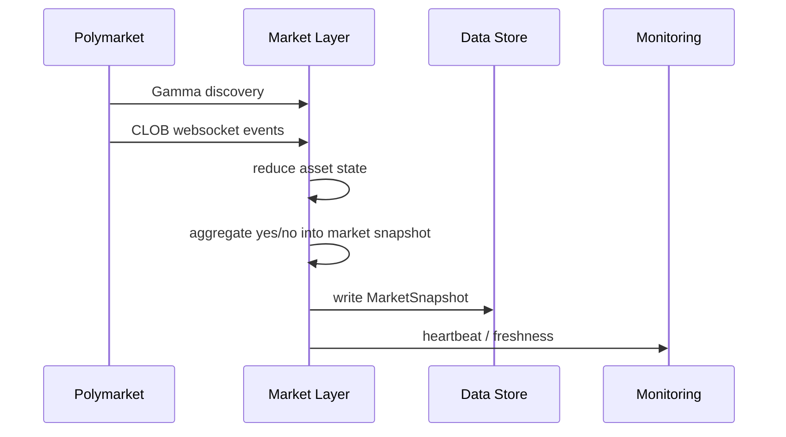
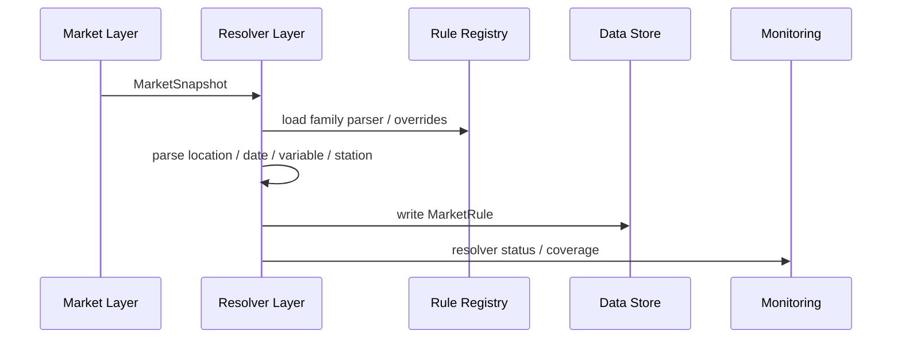
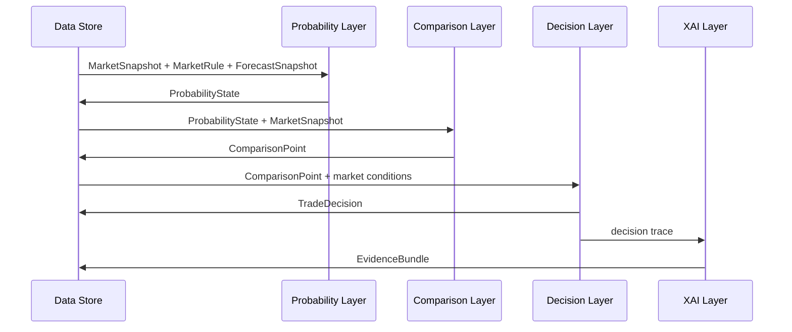
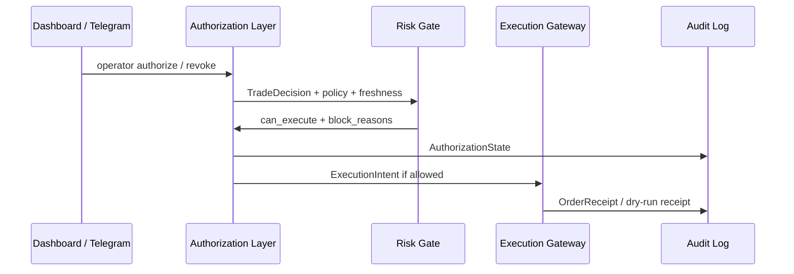

# AARS Polymarket Weather Trading Console 详细设计报告

版本：v0.1  
日期：2026-04-17  
关联文档：

- [AARS_Polymarket_Weather_Trading_Architecture.md](./AARS_Polymarket_Weather_Trading_Architecture.md)
- [AARS_Polymarket_Weather_Trading_Functional_Requirements.md](./AARS_Polymarket_Weather_Trading_Functional_Requirements.md)

---

## 1. 文档目的

本文档基于架构设计和功能需求，进一步定义 AARS Polymarket Weather Trading Console 的模块设计、数据结构、接口契约、运行流程、存储布局、监控设计、训练验证设计和迁移计划。

---

## 2. 设计原则

1. Dashboard 不做核心业务计算，只负责展示、选择、解释和授权。
2. Resolver 是市场理解的中心，所有 forecast / obs 都必须由 MarketRule 驱动。
3. Probability 与 market implied probability 必须分离。
4. Decision 只能生成候选动作，不能绕过 authorization gate。
5. Execution gateway 只消费已授权且通过 risk gate 的 ExecutionIntent。
6. 外部请求不阻塞首屏，所有外部数据源采用 cache-first 或 worker 异步写入。
7. 所有实时事件都沉淀到 feature store / audit log，为训练验证服务。
8. 所有模型必须通过 model registry 进入 shadow 或 live。

---

## 3. 模块划分

```text
aars_weather_trading/
  market_layer/
  resolver_layer/
  weather_data_adapters/
  probability_layer/
  comparison_layer/
  decision_layer/
  xai_layer/
  authorization_layer/
  execution_layer/
  training_validation_layer/
  infrastructure/
    data_store/
    feature_store/
    label_store/
    monitoring/
    audit_log/
    model_registry/
```

当前仓库迁移映射：

```text
polymarket-weather-ingest
  -> market_layer

weather-rules-research
  -> resolver_layer
  -> weather_data_adapters

weather-comparison-engine
  -> probability_layer
  -> comparison_layer
  -> decision_layer

weather-dashboard
  -> presentation
  -> xai presentation
  -> authorization UI

weather-execution-gateway
  -> execution_layer

weather-telegram-console
  -> notification / human-in-loop channel
```

---

## 4. 核心数据模型

### 4.1 MarketSnapshot

来源：market_layer

用途：表示某个 Polymarket market 在某一时刻的盘口状态。

```json
{
  "schema_version": "market_snapshot.v1",
  "market_id": "379803",
  "event_id": "evt_1",
  "market_question": "Highest temperature in Shanghai on April 16?",
  "market_family": "temperature_daily_max",
  "slug": "highest-temperature-in-shanghai-on-april-16-2026",
  "active": true,
  "closed": false,
  "yes_asset_id": "123",
  "no_asset_id": "456",
  "yes_price": 0.63,
  "no_price": 0.37,
  "best_bid": 0.62,
  "best_ask": 0.64,
  "spread": 0.02,
  "liquidity": 2500.0,
  "volume_24h": 900.0,
  "favored_side": "yes",
  "market_implied_probability": 0.63,
  "updated_at": "2026-04-17T01:00:00Z",
  "source": "polymarket_clob"
}
```

### 4.2 MarketRule

来源：resolver_layer

用途：表示一个 market 的可计算结算规则。

```json
{
  "schema_version": "market_rule.v1",
  "market_id": "379803",
  "market_family": "temperature_daily_max",
  "location_name": "Shanghai",
  "station_id": "ZSPD",
  "station_name": "Shanghai Pudong Intl Airport",
  "target_date": "2026-04-16",
  "target_window": {
    "start": "2026-04-16T00:00:00+08:00",
    "end": "2026-04-16T23:59:59+08:00",
    "timezone": "Asia/Shanghai"
  },
  "variable_name": "daily_max_temperature",
  "unit": "celsius",
  "required_sources": ["wunderground_zspd_history", "wunderground_zspd_realtime", "forecast_station_mapping"],
  "band_scheme": "temperature_celsius_integer",
  "resolver_status": "matched",
  "resolver_confidence": 0.92,
  "settlement_source_type": "station_observation",
  "official_vs_proxy_source": "official",
  "source_match_grade": "exact_station",
  "official_source_url": "https://www.wunderground.com/history/weekly/cn/shanghai/ZSPD",
  "rule_version": "resolver.v1"
}
```

### 4.3 ForecastSnapshot

来源：weather_data_adapters / probability preprocessor

```json
{
  "schema_version": "forecast_snapshot.v1",
  "market_id": "379803",
  "rule_id": "379803:zspd:daily_max_temperature",
  "timestamp": "2026-04-17T01:00:00Z",
  "target_date": "2026-04-16",
  "variable_name": "daily_max_temperature",
  "forecast_value": 30.0,
  "model_band": "30",
  "source": "wunderground_zspd",
  "source_mode": "manual_cache",
  "source_confidence": 0.82,
  "station_id": "ZSPD"
}
```

### 4.4 ObservationSnapshot

来源：official obs / METAR / settlement source

```json
{
  "schema_version": "observation_snapshot.v1",
  "market_id": "379803",
  "rule_id": "379803:zspd:daily_max_temperature",
  "observed_at": "2026-04-16T23:59:59+08:00",
  "official_value": 30.0,
  "official_band": "30",
  "source": "official_obs",
  "station_id": "ZSPD",
  "settlement_ready": true
}
```

### 4.5 ProbabilityState

来源：probability_layer

```json
{
  "schema_version": "probability_state.v1",
  "market_id": "379803",
  "timestamp": "2026-04-17T01:00:00Z",
  "market_implied_probability": 0.63,
  "model_probability": 0.71,
  "fair_value": 0.71,
  "forecast_support_score": 0.86,
  "confidence": 0.82,
  "method": "band_support_heuristic",
  "calibration_status": "not_calibrated",
  "model_id": null
}
```

### 4.6 ComparisonPoint

来源：comparison_layer

```json
{
  "schema_version": "comparison_point.v1",
  "market_id": "379803",
  "timestamp": "2026-04-17T01:00:00Z",
  "market_probability": 0.63,
  "fair_value": 0.71,
  "edge": 0.08,
  "confidence_adjusted_edge": 0.065,
  "market_band": "29",
  "model_band": "30",
  "band_distance": 1,
  "divergence_status": "positive_edge",
  "market_snapshot_ref": "market_snapshot_id",
  "forecast_snapshot_ref": "forecast_snapshot_id",
  "probability_state_ref": "probability_state_id"
}
```

### 4.7 TradeDecision

来源：decision_layer

```json
{
  "schema_version": "trade_decision.v1",
  "decision_id": "decision_abc",
  "market_id": "379803",
  "timestamp": "2026-04-17T01:00:00Z",
  "side": "yes",
  "size": "small",
  "action_hint": "watch_or_small_entry",
  "reason_code": "positive_edge_with_medium_confidence",
  "decision_status": "candidate",
  "decision_type": "heuristic_decision_aid",
  "comparison_ref": "comparison_point_id"
}
```

### 4.8 EvidenceBundle

来源：xai_layer

```json
{
  "schema_version": "evidence_bundle.v1",
  "market_id": "379803",
  "decision_ref": "decision_abc",
  "topline": "YES has estimated positive edge.",
  "argument_step": "resolver_station_match",
  "xai_level": "physical_evidence",
  "evidence": [
    {
      "type": "station_match",
      "claim": "Resolver mapped Shanghai market to ZSPD.",
      "source": "resolver_trace",
      "confidence": 0.92
    }
  ],
  "warnings": [
    "Probability is heuristic, not calibrated."
  ]
}
```

### 4.9 AuthorizationState

来源：authorization_layer

```json
{
  "schema_version": "authorization_state.v1",
  "authorization_id": "auth_xyz",
  "market_id": "379803",
  "operator_authorized": true,
  "risk_gate_status": "blocked",
  "can_bot_execute": false,
  "block_reasons": ["forecast_snapshot_stale"],
  "authorized_at": "2026-04-17T01:00:00Z",
  "authorized_by": "operator"
}
```

### 4.10 ExecutionIntent

来源：execution_layer

```json
{
  "schema_version": "execution_intent.v1",
  "intent_id": "intent_123",
  "market_id": "379803",
  "side": "yes",
  "order_type": "limit",
  "limit_price": 0.62,
  "size": 5,
  "mode": "dry_run",
  "decision_ref": "decision_abc",
  "authorization_ref": "auth_xyz",
  "contract_version": "probability_contract.v1",
  "probability_mode": "heuristic_not_calibrated",
  "execution_constraint": "manual_advisory_only",
  "probability_contract": {
    "contract_version": "probability_contract.v1",
    "probability_mode": "heuristic_not_calibrated",
    "calibration_status": "not_calibrated",
    "execution_constraint": "manual_advisory_only",
    "model_id": null,
    "validation_ref": null
  },
  "status": "created"
}
```

---

## 5. 运行流程设计

### 5.1 实时市场采集流程



### 5.2 Resolver 流程



### 5.3 Probability / Comparison / Decision 流程



### 5.4 Authorization / Execution 流程



---

## 6. 接口设计

### 6.1 Market Layer 输出接口

路径建议：

```text
data/normalized/market_snapshots/{market_id}.json
data/normalized/market_snapshots/latest.json
```

方法：

```python
class MarketSnapshotStore:
    def write(snapshot: MarketSnapshot) -> None: ...
    def load_latest(market_id: str | None = None) -> MarketSnapshot | None: ...
    def load_watchlist() -> list[MarketSnapshot]: ...
```

### 6.2 Resolver 接口

```python
class MarketResolver:
    def resolve(snapshot: MarketSnapshot) -> MarketRule:
        ...
```

Resolver 返回值必须包含：

- resolver_status
- resolver_confidence
- required_sources
- band_scheme
- settlement_source_type
- official_vs_proxy_source
- source_match_grade
- official_source_url
- failure_reason, when unmatched

### 6.3 Weather Adapter 接口

```python
class WeatherAdapter:
    source_name: str

    def fetch(rule: MarketRule) -> ForecastSnapshot | ObservationSnapshot:
        ...
```

所有 adapter 必须：

- 支持 timeout。
- 支持 cache。
- 不在 dashboard 首屏同步调用。
- 记录 last_error。

### 6.4 Probability 接口

```python
class ProbabilityEngine:
    def estimate(
        market: MarketSnapshot,
        rule: MarketRule,
        forecast: ForecastSnapshot | None,
        observation: ObservationSnapshot | None = None,
    ) -> ProbabilityState:
        ...
```

### 6.5 Comparison 接口

```python
class ComparisonEngine:
    def compare(
        market: MarketSnapshot,
        probability: ProbabilityState,
    ) -> ComparisonPoint:
        ...
```

### 6.6 Decision 接口

```python
class DecisionEngine:
    def decide(
        comparison: ComparisonPoint,
        market: MarketSnapshot,
        policy: dict,
    ) -> TradeDecision:
        ...
```

### 6.7 Authorization 接口

```python
class AuthorizationGate:
    def evaluate(
        decision: TradeDecision,
        operator_authorized: bool,
        system_status: dict,
        risk_policy: dict,
    ) -> AuthorizationState:
        ...
```

### 6.8 Execution 接口

```python
class ExecutionGateway:
    def submit(intent: ExecutionIntent) -> OrderReceipt:
        ...
```

---

## 7. 存储设计

### 7.1 MVP JSON 布局

```text
data/
  raw/
    polymarket/
    weather/

  normalized/
    market_snapshots/
    market_rules/
    forecast_snapshots/
    observation_snapshots/

  derived/
    probability_states/
    comparison_history.json
    latest_dashboard_rows.json
    trade_decisions.json
    evidence_bundles.json
    authorization_states.json
    execution_intents.json

  cache/
    gamma_search_cache.json
    wunderground_shanghai_snapshot.json

  state/
    watchlist.json
    pinned_market.json
    recent_markets.json
    removed_markets.json

  monitoring/
    monitoring_status.json

  audit/
    decision_audit.jsonl
    authorization_audit.jsonl
    execution_audit.jsonl
```

### 7.2 中期 DuckDB / SQLite 表

```text
market_snapshots
market_rules
forecast_snapshots
observation_snapshots
probability_states
comparison_points
trade_decisions
evidence_bundles
authorization_states
execution_intents
feature_store_market
feature_store_weather
label_store_outcomes
model_registry
worker_health
audit_log
```

---

## 8. Dashboard 设计

Dashboard 应只读取标准化输出，不直接承担核心计算。

页面结构：

```text
Header
  - 当前市场
  - Market probability
  - Resolver status
  - Forecast freshness
  - Comparison status
  - BOT authorization state

Current Analysis
  - Comparison Focus
  - Trade Decision
  - Live Status
  - Historical Data / Future Forecast

Markets
  - Gamma search
  - Watchlist
  - Recent Markets
  - Pin / Remove

Charts
  - Comparison Table
  - Divergence Chart
  - Timeseries

History
  - Timeline
  - Historical odds vs forecast / official value

Evidence
  - Rule Station
  - Bias Summary
  - Raw JSON
```

Dashboard 禁止行为：

- 不在首屏同步调用外部 API。
- 不直接计算 fair value。
- 不直接提交真实订单。
- 不将 heuristic probability 表述为 calibrated probability。

---

## 9. Monitoring 设计

### 9.1 monitoring_status.json

```json
{
  "schema_version": "monitoring_status.v1",
  "generated_at": "2026-04-17T01:00:00Z",
  "workers": [
    {
      "name": "polymarket_realtime",
      "status": "ok",
      "last_seen_at": "2026-04-17T00:59:55Z",
      "freshness_seconds": 5
    }
  ],
  "layers": [
    {
      "layer": "02_resolver_layer",
      "status": "warning",
      "message": "7 unmatched markets"
    }
  ],
  "sources": [
    {
      "name": "wunderground_zspd",
      "status": "manual_cache",
      "last_error": null
    }
  ],
  "resolver_coverage": {
    "tracked_markets": 12,
    "matched": 5,
    "unmatched": 7
  }
}
```

### 9.2 健康状态规则

```text
ok
  数据新鲜，worker 正常

warning
  数据 stale、resolver unmatched、source manual cache

critical
  worker stopped、execution gateway unavailable、risk gate failed unexpectedly
```

---

## 10. Risk Gate 设计

Risk gate 输入：

- TradeDecision
- Operator authorization
- Resolver status
- Forecast freshness
- Market freshness
- Liquidity
- Spread
- Confidence
- Model deployment mode
- Execution gateway status

规则示例：

```text
block if operator_authorized == false
block if resolver_status != matched
block if forecast_freshness_seconds > threshold
block if market_freshness_seconds > threshold
block if liquidity < minimum_liquidity
block if spread > maximum_spread
block if decision_type == heuristic and policy requires calibrated model
block if execution_gateway_status != ok
```

输出：

```json
{
  "can_execute": false,
  "block_reasons": [
    "operator_not_authorized",
    "forecast_snapshot_stale"
  ]
}
```

---

## 11. Training / Validation 详细设计

### 11.1 Dataset Builder

职责：

- 从 feature store 读取 point-in-time features。
- 从 label store 读取 future labels。
- 按 market_id + timestamp 对齐。
- 防止 look-ahead bias。

接口：

```python
class DatasetBuilder:
    def build(
        start_time: str,
        end_time: str,
        horizon: str,
        label_type: str,
    ) -> TrainingDataset:
        ...
```

### 11.2 Backtester

职责：

- 回测 heuristic decision。
- 回测 shadow model decision。
- 输出 ROI、drawdown、hit rate、slippage impact。

接口：

```python
class Backtester:
    def run(dataset: TrainingDataset, strategy: Strategy) -> BacktestReport:
        ...
```

### 11.3 Calibration Evaluator

职责：

- 评估 Brier Score。
- 评估 Log Loss。
- 评估 calibration error。
- 输出 reliability curve 数据。

接口：

```python
class CalibrationEvaluator:
    def evaluate(y_true: list[int], y_prob: list[float]) -> CalibrationReport:
        ...
```

### 11.4 Model Trainer

职责：

- 训练 probability model。
- 训练 market reaction model。
- 训练 decision / sizing model。
- 输出 model artifact 和 validation report。

上线前要求：

- validation report 存档。
- model registry 注册。
- 默认 deployment_mode = shadow。

---

## 12. Model Registry 设计

字段：

```json
{
  "model_id": "fair_value_weather_v3",
  "model_type": "probability",
  "artifact_path": "models/fair_value_weather_v3.pkl",
  "trained_at": "2026-04-17T00:00:00Z",
  "features_version": "weather_features_v2",
  "training_data_range": "2025-01-01/2026-04-01",
  "validation_metrics": {
    "brier_score": 0.18,
    "log_loss": 0.54,
    "calibration_error": 0.07,
    "roi_backtest": 0.12,
    "max_drawdown": 0.09
  },
  "approved_for_live": false,
  "deployment_mode": "shadow"
}
```

部署模式：

```text
offline_only
shadow
live
```

控制规则：

- `offline_only` 不进入实时链。
- `shadow` 进入实时计算但不影响 decision。
- `live` 可影响 probability / decision，但仍必须通过 authorization gate。

---

## 13. 错误处理设计

### 13.1 外部 API 失败

处理方式：

- 使用最近 cache。
- 标记 source_status=stale。
- 记录 last_error。
- Dashboard 展示 warning。
- 不阻塞首屏。

### 13.2 Resolver unmatched

处理方式：

- 输出 MarketRule with resolver_status=unmatched。
- Probability layer 不输出 misleading fair value。
- Decision layer 输出 WAIT / BLOCK。
- XAI 显示 unmatched reason。

### 13.3 Forecast stale

处理方式：

- Comparison layer 标记 stale。
- Decision layer 降级为 watch。
- Authorization gate block execution。

### 13.4 Execution failure

处理方式：

- Execution receipt 标记 failed。
- Audit log 记录错误。
- Monitoring 标记 execution_gateway warning / critical。
- 不自动重试真实订单，除非 policy 明确允许。

---

## 14. 测试设计

### 14.1 单元测试

覆盖：

- resolver parsers
- station matcher
- band scheme mapper
- probability engine
- comparison engine
- decision engine
- risk gate
- JSON / DB stores

### 14.2 集成测试

覆盖：

- market snapshot -> resolver -> forecast -> probability -> comparison -> decision
- authorization blocked / passed
- execution dry-run
- dashboard loading with missing external sources

### 14.3 回归测试

覆盖：

- Shanghai ZSPD market
- global hottest year market
- sea ice extent market
- unmatched market
- stale forecast
- Gamma SSL failure
- Wunderground failure

### 14.4 训练验证测试

覆盖：

- point-in-time join
- no future label leakage
- calibration metrics
- backtest metrics
- model registry mode switch

---

## 15. 迁移计划

### Step 1：Schema First

新增 Pydantic schema：

- MarketSnapshot
- MarketRule
- ForecastSnapshot
- ProbabilityState
- ProbabilityContract
- ComparisonPoint
- TradeDecision
- EvidenceBundle
- AuthorizationState
- ExecutionIntent

### Step 2：Dashboard 瘦身

从 dashboard 移出：

- trade heuristic
- resolver 判断
- BOT can_execute 判断
- 外部数据同步请求

Dashboard 改为读取标准 outputs。

### Step 3：Resolver 中心化

新增 resolver service：

- temperature parser
- global index parser
- sea ice parser
- station matcher
- manual override

### Step 4：Monitoring 输出

新增 monitoring worker：

- worker freshness
- source status
- resolver coverage
- layer health

### Step 5：Feature / Label Store

先用 DuckDB 或 SQLite 实现：

- feature writes from realtime chain
- labels from official obs / settlement
- dataset builder

### Step 6：Training / Shadow Model

实现：

- heuristic backtest
- probability model shadow mode
- model registry

### Step 7：Execution Dry Run

实现：

- risk gate
- dry-run order intent
- order receipt
- audit log

---

## 16. 验收标准

详细设计落地后，应满足：

- Dashboard 首屏稳定，不被外部 API 阻塞。
- 每个 tracked market 都有 MarketSnapshot。
- 支持 market 能生成 MarketRule。
- Unsupported market 明确 unmatched。
- ProbabilityState 明确 calibrated / not_calibrated。
- ComparisonPoint 可按 market_id 形成历史。
- TradeDecision 不绕过 AuthorizationState。
- ExecutionIntent 默认 dry-run。
- 所有 decision / authorization / execution 可审计。
- Feature store 可构建 point-in-time dataset。
- Model registry 支持 offline_only / shadow / live。

---

## 17. 总结

本详细设计报告将系统拆为明确的业务层、基础设施层和训练验证层。

工程落地的核心路径是：

```text
schema first
  -> resolver centralization
  -> dashboard slimming
  -> monitoring
  -> feature / label store
  -> training validation
  -> risk-gated execution
```

最终系统应从当前的 dashboard-first MVP 演进为：

> 以 MarketRule 为中心、以标准 snapshot 为契约、以 fair value / edge 为分析核心、以 XAI 和 audit log 为信任机制、以 authorization / risk gate 为执行边界、以 feature / label store 为持续训练基础的 Polymarket Weather Trading Platform。

---

## 18. Phase 22-23 详细设计增补

### 18.1 新增 Contract 产物

comparison-engine 当前新增并固化以下产物：

- `gate_stack_api.v1`  
  文件：`weather-comparison-engine/data/outputs/gate_stack_api.json`
- `gate_stack_automation_summary.v1`  
  文件：`weather-comparison-engine/data/outputs/gate_stack_automation_summary.json`
- `gate_stack_ops_alert.v1`（JSONL）  
  文件：`weather-comparison-engine/data/outputs/gate_stack_ops_alerts.jsonl`

关键字段（摘要）：

- `gate_stack_api.v1`：`market_gate_views`、`severity`、`recommended_operator_action`
- `automation_summary.v1`：`automation_signal`、`primary_block_reason`
- `ops_alert.v1`：`event_type`、`market_id`、`block_reasons`、`recommended_operator_action`

### 18.2 Runtime 命令与退出码契约

命令：

- `run-gate-stack-automation-check --fail-on-signal {red|amber|never}`

退出码：

- `0`：通过当前阈值
- `2`：命中阈值阻断（例如 red/amber）

该命令用于 cron/worker 调度器判断，不要求外部再解析复杂 JSON 字段。

### 18.3 Telegram Ops Bridge 设计

新增 bridge 分两段：

1. alert -> queue  
   `weather-telegram-ops-bridge sync-gate-alerts`
2. queue lifecycle  
   `dispatch-ops-queue` / `ack-ops`

文件：

- `telegram_ops_notifications.jsonl`（`telegram_ops_notification.v1`）
- `ops_alert_bridge_state.json`（去重游标）
- `telegram_ops_delivery_log.jsonl`（sent/acked 事件）

### 18.4 队列生命周期与状态回写

```text
pending -> sent -> acked
```

状态回写原则：

- 只有明确发送动作才写 `sent_at`
- 只有明确确认动作才写 `acked_at`
- 每次状态变化都写 delivery log 事件

### 18.5 对现有模块边界的影响

1. comparison-engine：负责“产生合同与运行时告警”
2. telegram-console：负责“告警桥接、队列状态流转与回执”
3. dashboard/gateway：继续只消费 contract，不负责通知分发

这保证了执行边界清晰：

- 业务判断在 gate contract
- 运维执行在 runtime worker
- 通知分发在 telegram bridge
