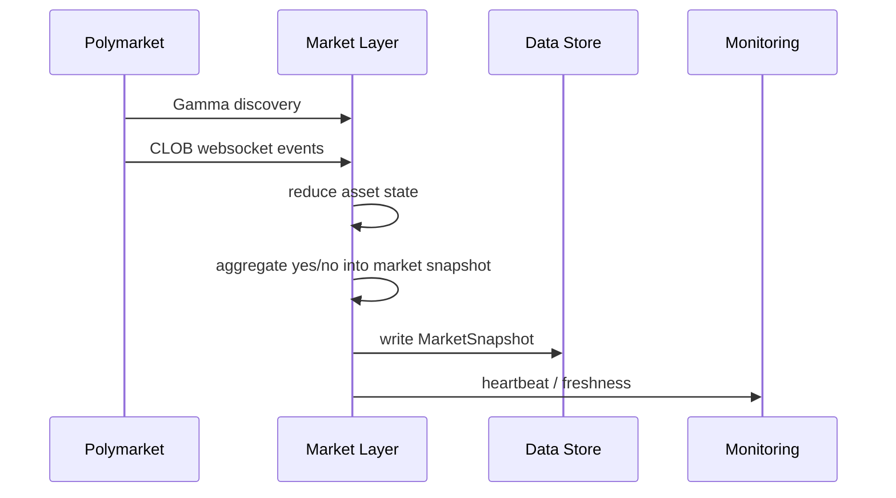
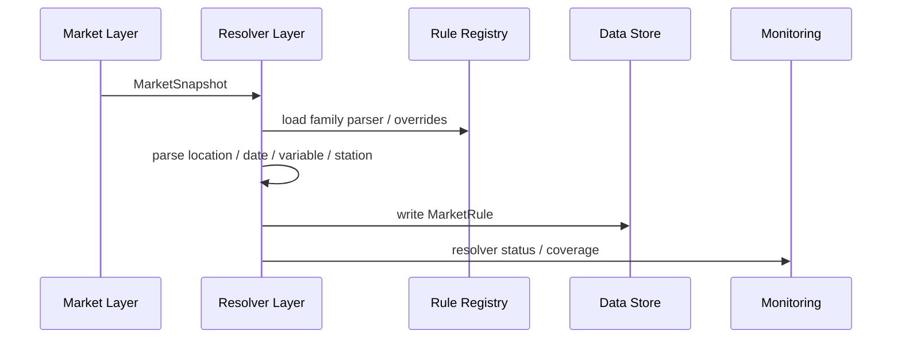
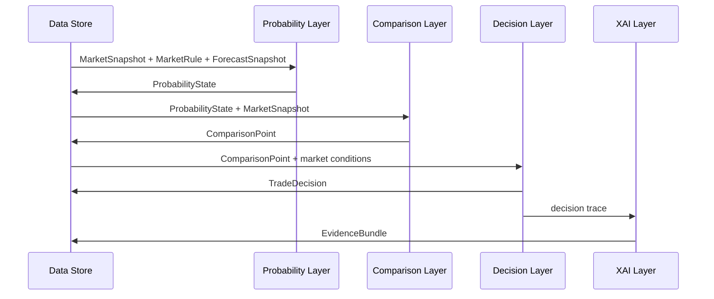
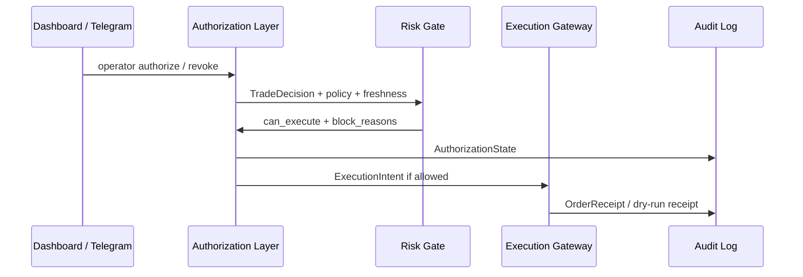

# AARS Polymarket Weather Trading Console 详细设计报告

版本：v0.2  
日期：2026-04-21  
关联文档：

- [AARS_Polymarket_Weather_Trading_Architecture.md](./AARS_Polymarket_Weather_Trading_Architecture.md)
- [AARS_Polymarket_Weather_Trading_Functional_Requirements.md](./AARS_Polymarket_Weather_Trading_Functional_Requirements.md)
- [AARS_Polymarket_Weather_Trading_Monitoring_Collection_And_Indicator_Governance.md](./AARS_Polymarket_Weather_Trading_Monitoring_Collection_And_Indicator_Governance.md)

---

## 1. 文档目的

本文档基于架构设计和功能需求，进一步定义 AARS Polymarket Weather Trading Console 的模块设计、数据结构、接口契约、运行流程、存储布局、监控设计、训练验证设计和迁移计划。

---

## 2. 设计原则

1. Dashboard 不做核心业务计算，只负责展示、选择、解释和授权。
2. Resolver 是市场理解的中心，所有 forecast / obs 都必须由 MarketRule 驱动。
3. Probability 与 market implied probability 必须分离。
4. Decision 只能生成候选动作，不能绕过 authorization gate。
5. Execution gateway 只消费已授权且通过 risk gate 的 ExecutionIntent。
6. 外部请求不阻塞首屏，所有外部数据源采用 cache-first 或 worker 异步写入。
7. 所有实时事件都沉淀到 feature store / audit log，为训练验证服务。
8. 所有模型必须通过 model registry 进入 shadow 或 live。

### 2.1 数据治理原则

1. 市场发现、市场录入、resolver、forecast、comparison、展示必须共享同一份可追溯事实源。
2. 上游快照一旦确定，UI 只能消费，不得在展示层重新发明市场事实。
3. `TopParameterView` 只是首屏聚合合同，不是新的事实源。
4. 非适用 family 的字段必须折叠或隐藏，避免不同表面对同一市场产生不同语义密度。
5. 任何派生字段都必须能够回指到 `market_snapshot`、`market_rule`、`forecast_snapshot`、`observation_snapshot` 或 `comparison_point` 之一。

### 2.2 上游数据流水线

建议把上游事实链明确拆成以下五段，每一段都有唯一输入、唯一输出和可回指的引用：

1. **市场研究 / 市场录入**
   - 输入：Gamma / CLOB 市场元数据、watchlist、人工选择。
   - 输出：`MarketSnapshot`、`market_realtime_simple*.json`。
   - 要求：优先保留有价格市场，不让 metadata-only 空壳覆盖主快照。

2. **resolver 解析**
   - 输入：`MarketSnapshot`、规则库、手工 override。
   - 输出：`MarketRule`、`ResolverSourceContract`、`resolved_market_rules/*.json`。
   - 要求：必须回指 `market_id`，并给出 station / source / band 的唯一解释。

3. **forecast / observation 采集**
   - 输入：`MarketRule`、station mapping、weather source adapters。
   - 输出：`ForecastSnapshot`、`ObservationSnapshot`、`forecast_realtime_snapshot.json`。
   - 要求：forecast 快照必须和当前市场 question、target_date、station mapping 对齐。

4. **comparison / probability 生成**
   - 输入：`MarketSnapshot`、`MarketRule`、`ForecastSnapshot`、`ObservationSnapshot`。
   - 输出：`ProbabilityState`、`ComparisonPoint`、`DashboardRow`、`TopParameterView`。
   - 要求：比较层只做派生，不得改写上游事实。

5. **展示 / operator surface**
   - 输入：`TopParameterView`、`gate_stack_api.v1`、`unified_status.json`。
   - 输出：Dashboard、Telegram、Gateway read-only snapshot。
   - 要求：只消费同一条事实链，不在 UI 层重新拼接真实数据。

### 2.3 流水线验收矩阵

| 步骤 | 主要输入 | 主要输出 | 检查点 |
|---|---|---|---|
| 市场研究 / 市场录入 | Gamma / watchlist / 人工选择 | `MarketSnapshot`、`market_realtime_simple*.json` | 唯一主快照、价格优先、避免空壳 |
| resolver 解析 | `MarketSnapshot`、规则库、override | `MarketRule`、`ResolverSourceContract` | 同一 `market_id`、station / source / band 一致 |
| forecast / observation | `MarketRule`、station mapping、weather adapters | `ForecastSnapshot`、`ObservationSnapshot` | `target_date`、station mapping、source_mode 对齐 |
| comparison / probability | 上述四类快照 | `ComparisonPoint`、`ProbabilityState`、`TopParameterView` | 只派生不改写、market_probability 可追溯 |
| 展示 / operator surface | `TopParameterView`、`gate_stack_api.v1`、`unified_status.json` | Dashboard / Telegram / Gateway snapshot | 同链展示、空字段折叠、family-specific 标签 |

### 2.4 责任归属表

| 流水线阶段 | 主要仓库 | 主要模块 / 文件 | 责任边界 |
|---|---|---|---|
| 市场研究 / 市场录入 | `polymarket-weather-ingest` | `scripts/run_polymarket_realtime.py`、`market_realtime_simple*.json` | 价格优先、唯一主快照 |
| resolver 解析 | `weather-rules-research` | `scripts/run_weather_realtime.py`、`resolved_market_rules/*.json` | market rule、station mapping、source contract |
| forecast / observation | `weather-rules-research` | `forecast_realtime_snapshot.json`、`manual_station_map.json` | 站点 / 日期 / source_mode 对齐 |
| comparison / probability | `weather-comparison-engine` | `status/top_parameter_view.py`、`main.py`、`latest_dashboard_rows.json` | 仅派生，不改写事实 |
| 展示 / operator surface | `weather-dashboard`、`weather-telegram-console`、`weather-execution-gateway` | `top_parameter_ribbon.py`、`status_api.py`、`market_api.py`、`gates.py` | 只消费统一事实链，不重新推导市场事实 |

---

## 3. 模块划分

```text
aars_weather_trading/
  market_layer/
  resolver_layer/
  weather_data_adapters/
  probability_layer/
  comparison_layer/
  monitoring_layer/
  decision_layer/
  xai_layer/
  authorization_layer/
  execution_layer/
  training_validation_layer/
  infrastructure/
    data_store/
    feature_store/
    label_store/
    monitoring/
    audit_log/
    model_registry/
```

当前仓库迁移映射：

```text
polymarket-weather-ingest
  -> market_layer

weather-rules-research
  -> resolver_layer
  -> weather_data_adapters

weather-comparison-engine
  -> probability_layer
  -> comparison_layer
  -> decision_layer

weather-dashboard
  -> presentation
  -> xai presentation
  -> authorization UI

weather-execution-gateway
  -> execution_layer

weather-telegram-console
  -> notification / human-in-loop channel
```

---

## 4. 核心数据模型

### 4.1 MarketSnapshot

来源：market_layer

用途：表示某个 Polymarket market 在某一时刻的盘口状态。

```json
{
  "schema_version": "market_snapshot.v1",
  "market_id": "379803",
  "event_id": "evt_1",
  "market_question": "Highest temperature in Shanghai on April 16?",
  "market_family": "temperature_daily_max",
  "slug": "highest-temperature-in-shanghai-on-april-16-2026",
  "active": true,
  "closed": false,
  "yes_asset_id": "123",
  "no_asset_id": "456",
  "yes_price": 0.63,
  "no_price": 0.37,
  "best_bid": 0.62,
  "best_ask": 0.64,
  "spread": 0.02,
  "liquidity": 2500.0,
  "volume_24h": 900.0,
  "favored_side": "yes",
  "market_implied_probability": 0.63,
  "updated_at": "2026-04-17T01:00:00Z",
  "source": "polymarket_clob"
}
```

### 4.2 MarketRule

来源：resolver_layer

用途：表示一个 market 的可计算结算规则。

```json
{
  "schema_version": "market_rule.v1",
  "market_id": "379803",
  "market_family": "temperature_daily_max",
  "location_name": "Shanghai",
  "station_id": "ZSPD",
  "station_name": "Shanghai Pudong Intl Airport",
  "target_date": "2026-04-16",
  "target_window": {
    "start": "2026-04-16T00:00:00+08:00",
    "end": "2026-04-16T23:59:59+08:00",
    "timezone": "Asia/Shanghai"
  },
  "variable_name": "daily_max_temperature",
  "unit": "celsius",
  "required_sources": ["wunderground_zspd_history", "wunderground_zspd_realtime", "forecast_station_mapping"],
  "band_scheme": "temperature_celsius_integer",
  "resolver_status": "matched",
  "resolver_confidence": 0.92,
  "settlement_source_type": "station_observation",
  "official_vs_proxy_source": "official",
  "source_match_grade": "exact_station",
  "official_source_url": "https://www.wunderground.com/history/weekly/cn/shanghai/ZSPD",
  "rule_version": "resolver.v1"
}
```

### 4.3 ForecastSnapshot

来源：weather_data_adapters / probability preprocessor

```json
{
  "schema_version": "forecast_snapshot.v1",
  "market_id": "379803",
  "rule_id": "379803:zspd:daily_max_temperature",
  "timestamp": "2026-04-17T01:00:00Z",
  "target_date": "2026-04-16",
  "variable_name": "daily_max_temperature",
  "forecast_value": 30.0,
  "model_band": "30",
  "source": "wunderground_zspd",
  "source_mode": "manual_cache",
  "source_confidence": 0.82,
  "station_id": "ZSPD"
}
```

### 4.4 ObservationSnapshot

来源：official obs / METAR / settlement source

```json
{
  "schema_version": "observation_snapshot.v1",
  "market_id": "379803",
  "rule_id": "379803:zspd:daily_max_temperature",
  "observed_at": "2026-04-16T23:59:59+08:00",
  "official_value": 30.0,
  "official_band": "30",
  "source": "official_obs",
  "station_id": "ZSPD",
  "settlement_ready": true
}
```

### 4.5 ProbabilityState

来源：probability_layer

```json
{
  "schema_version": "probability_state.v1",
  "market_id": "379803",
  "timestamp": "2026-04-17T01:00:00Z",
  "market_implied_probability": 0.63,
  "model_probability": 0.71,
  "fair_value": 0.71,
  "forecast_support_score": 0.86,
  "confidence": 0.82,
  "method": "band_support_heuristic",
  "calibration_status": "not_calibrated",
  "model_id": null
}
```

### 4.6 ComparisonPoint

来源：comparison_layer

```json
{
  "schema_version": "comparison_point.v1",
  "market_id": "379803",
  "timestamp": "2026-04-17T01:00:00Z",
  "market_probability": 0.63,
  "fair_value": 0.71,
  "edge": 0.08,
  "confidence_adjusted_edge": 0.065,
  "market_band": "29",
  "model_band": "30",
  "band_distance": 1,
  "divergence_status": "positive_edge",
  "market_snapshot_ref": "market_snapshot_id",
  "forecast_snapshot_ref": "forecast_snapshot_id",
  "probability_state_ref": "probability_state_id"
}
```

### 4.7 TradeDecision

来源：decision_layer

```json
{
  "schema_version": "trade_decision.v1",
  "decision_id": "decision_abc",
  "market_id": "379803",
  "timestamp": "2026-04-17T01:00:00Z",
  "side": "yes",
  "size": "small",
  "action_hint": "watch_or_small_entry",
  "reason_code": "positive_edge_with_medium_confidence",
  "decision_status": "candidate",
  "decision_type": "heuristic_decision_aid",
  "comparison_ref": "comparison_point_id"
}
```

### 4.8 EvidenceBundle

来源：xai_layer

```json
{
  "schema_version": "evidence_bundle.v1",
  "market_id": "379803",
  "decision_ref": "decision_abc",
  "topline": "YES has estimated positive edge.",
  "argument_step": "resolver_station_match",
  "xai_level": "physical_evidence",
  "evidence": [
    {
      "type": "station_match",
      "claim": "Resolver mapped Shanghai market to ZSPD.",
      "source": "resolver_trace",
      "confidence": 0.92
    }
  ],
  "warnings": [
    "Probability is heuristic, not calibrated."
  ]
}
```

### 4.9 AuthorizationState

来源：authorization_layer

```json
{
  "schema_version": "authorization_state.v1",
  "authorization_id": "auth_xyz",
  "market_id": "379803",
  "operator_authorized": true,
  "risk_gate_status": "blocked",
  "can_bot_execute": false,
  "block_reasons": ["forecast_snapshot_stale"],
  "authorized_at": "2026-04-17T01:00:00Z",
  "authorized_by": "operator"
}
```

### 4.10 ExecutionIntent

来源：execution_layer

```json
{
  "schema_version": "execution_intent.v1",
  "intent_id": "intent_123",
  "market_id": "379803",
  "side": "yes",
  "order_type": "limit",
  "limit_price": 0.62,
  "size": 5,
  "mode": "dry_run",
  "decision_ref": "decision_abc",
  "authorization_ref": "auth_xyz",
  "contract_version": "probability_contract.v1",
  "probability_mode": "heuristic_not_calibrated",
  "execution_constraint": "manual_advisory_only",
  "probability_contract": {
    "contract_version": "probability_contract.v1",
    "probability_mode": "heuristic_not_calibrated",
    "calibration_status": "not_calibrated",
    "execution_constraint": "manual_advisory_only",
    "model_id": null,
    "validation_ref": null
  },
  "status": "created"
}
```

---

### 4.11 TopParameterView

来源：presentation / operator surface

```json
{
  "schema_version": "top_parameter_view.v1",
  "market_id": "379803",
  "market_question": "Highest temperature in Shanghai on April 16?",
  "market_family": "temperature_daily_max",
  "location_name": "Shanghai",
  "target_date": "2026-04-16",
  "variable_name": "daily_max_temperature",
  "polymarket": {
    "yes_price": 0.63,
    "no_price": 0.37,
    "market_probability": 0.63,
    "favored_side": "yes",
    "market_band": "29",
    "spread": 0.02,
    "updated_at": "2026-04-16T10:00:00Z"
  },
  "weather": {
    "observation_value": 29.1,
    "observation_band": "29",
    "observed_at": "2026-04-16T10:00:00Z",
    "station_id": "ZSPD",
    "unit": "celsius",
    "settlement_ready": false
  },
  "forecast": {
    "forecast_value": 30.0,
    "model_band": "30",
    "forecast_timestamp": "2026-04-16T09:00:00Z",
    "source_mode": "daily_forecast_matched",
    "source_confidence": 0.82
  },
  "source_contract": {
    "settlement_source_type": "station_observation",
    "official_vs_proxy_source": "official",
    "source_match_grade": "exact_station",
    "required_sources": ["wunderground_zspd_history", "metar_zspd"],
    "official_source_url": "https://www.wunderground.com/history/weekly/cn/shanghai/ZSPD",
    "freshness_status": "fresh"
  },
  "decision": {
    "fair_value": 0.71,
    "edge": 0.08,
    "probability_mode": "shadow_calibrated_candidate",
    "execution_constraint": "dry_run_only",
    "can_execute": false,
    "primary_block_reason": "shadow_only"
  }
}
```

设计约束：

- `TopParameterView` 是 dashboard / Telegram / gateway / comparison-engine 的首屏统一合同。
- 空字段应在 UI 层折叠，不应以 `-` 强行占位。
- `market_family` 必须驱动 family-specific 渲染模板。
- `market_probability` 应优先来自显式字段或 YES/NO price 计算，不应长期留空。

### 4.12 Data Source Governance Contract

来源：market_layer / resolver_layer / weather_data_adapters / comparison_layer

```json
{
  "schema_version": "data_source_governance.v1",
  "market_id": "379803",
  "source_of_truth": {
    "market_snapshot_ref": "market_realtime_simple.json#379803",
    "market_rule_ref": "resolved_market_rules/market_rule_379803.json",
    "forecast_snapshot_ref": "forecast_realtime_snapshot.json#379803",
    "observation_snapshot_ref": "wunderground_shanghai_snapshot.json",
    "comparison_point_ref": "comparison_point_379803"
  },
  "governance_rules": [
    "single source of truth per market_id",
    "derived views must reference upstream refs",
    "ui must not rewrite factual fields",
    "empty non-applicable family fields must be hidden"
  ],
  "status": "governed"
}
```

设计约束：

- 同一 `market_id` 的市场、规则、forecast、comparison、展示必须对同一条事实链负责。
- 如果上游引用无法对齐，UI 只应显示 mismatch / stale / unavailable，不得静默拼接。
- `TopParameterView` 的所有字段都应能映射回一个上游快照或派生结果。
- 数据治理验收应逐项检查 market snapshot、market rule、forecast snapshot、comparison point 是否同链对齐，以及 dashboard / Telegram / gateway 是否消费同一链路。

### 4.13 当前实现检查结果

基于现有代码与输出产物，当前实现已经满足下列治理约束：

1. 市场发现层已采用价格优先策略，启动时不会让 metadata-only 空壳覆盖主快照。
2. comparison-engine、dashboard、Telegram 已分别实现 `TopParameterView` 适配器，并共享同一 `top_parameter_view.v1` schema。
3. probability 层已支持显式 `market_probability` 与 YES/NO price 推导，不再依赖单一人工字段。
4. `source_mode` 已在天气数据链路中转为面向操作员的人话状态，而不是只暴露内部枚举名。
5. `TopParameterView` 的空字段折叠与 family-specific 标签已在展示层落地。

当前仍需在文档和后续实现中持续强调的点是：

1. `TopParameterView` 不是统一事实源，而是统一聚合合同；它必须继续从 market snapshot、market rule、forecast snapshot、observation snapshot、comparison point 取值。
2. 目前三端是“同 schema、多适配器”实现，不应误写成一个跨仓库共享的单一构建类。
3. 若同一 `market_id` 的上游引用不一致，UI 仍必须显示 mismatch / stale / unavailable，而不是在展示层私下补写事实。

### 4.14 Monitoring Collection Layer

来源：weather_data_adapters / resolver_layer / probability_layer / comparison_layer

监测采集层的职责不是执行交易，而是将 observation、forecast、market、resolver 和 comparison 的偏离、冲击、风险与异常统一成可回放的指标产物。

建议拆成两个子域：

1. **单市场实时预警（Observation Alert）**
   - 关注单市场内的 observation shock、forecast divergence、reaction gap、resolver/source risk。
   - 输出 `market_alert_event.v1`。
2. **Family 级异常发现（Family Anomaly Discovery）**
   - 关注同 family 市场之间的 price velocity、edge dislocation、evidence mismatch、microstructure stress、peer anomaly。
   - 输出 `market_anomaly_event.v1` 与 family scan report。

治理约束：

- 所有指标必须回指到 `MarketSnapshot`、`ResolvedMarketRule`、`ForecastSnapshot`、`ObservationSnapshot`、`ProbabilityState` 或 `ComparisonPoint`。
- `gate_stack_api.v1` 只消费监测结果，不反向定义指标。
- 指标 registry 与 threshold policy registry 应独立于 gate registry。
- `source_match_grade != exact_station` 时，观测型指标只能降级为 review-only / advisory。
- 缺数据必须显式表达为 missing / incomplete / degraded，不得默认为 0。

### 4.15 Monitoring Implementation Blueprint

Phase 27 的最小实现建议优先落在 `weather-comparison-engine`，并以只读消费方式延展到 dashboard / telegram。

建议目录树：

```text
weather-comparison-engine/
  src/weather_comparison_engine/
    monitoring_layer/
      indicator_registry/
      threshold_policy_registry/
      observation_alert_layer/
      family_scanner/
    scripts/
      run_observation_alert_once.py
      run_family_anomaly_scan_once.py
  data/
    registries/
      indicators/
      threshold_policies/
    outputs/
      market_alert_events/
      market_anomaly_events/
      family_scan_reports/
```

建议输出契约：

- `market_alert_event.v1`
- `market_anomaly_event.v1`
- `family_scan_report.v1`

建议最小指标集：

1. 单市场预警：
   - `observation_shock`
   - `forecast_divergence`
   - `market_reaction_gap`
   - `resolver_source_risk`
   - `alert_severity`
2. Family 异常：
   - `price_velocity`
   - `edge_dislocation`
   - `evidence_mismatch`
   - `microstructure_stress`
   - `peer_relative_anomaly`
   - `intervention_like_score`

设计约束：

- `market_alert_event.v1` 与 `market_anomaly_event.v1` 只能引用上游 snapshot 与 threshold policy，不得把 UI 派生值当作正式输入。
- 指标计算必须记录 `indicator_version`、`threshold_policy_version` 与 `contract_refs`。
- dashboard / telegram 只读取监测输出，不在展示层重新定义阈值。

建议最小验证入口：

- `run_observation_alert_once.py` 用于单市场预警回放
- `run_family_anomaly_scan_once.py` 用于 family 扫描回放

最小验收应检查：

1. registry 可读且版本化。
2. alert / anomaly 输出可追溯到上游 contract。
3. source mismatch 时自动降级。
4. dashboard / telegram 仅消费输出，不重算指标。

### 4.16 Phase 27.1 Source / Measurement Registry First

Phase 27.1 不扩 alert 逻辑，而是先把 `source_policy` 与 `measurement_policy` 正式落盘为各仓库可统一消费的 registry 与 loader。

#### 4.16.1 目标

形成以下 5 个 registry：

- `source_policy_registry.json`
- `unit_registry.json`
- `precision_policy_registry.json`
- `rounding_policy_registry.json`
- `band_mapping_policy_registry.json`

并让以下仓库开始 registry-first 消费：

- `weather-rules-research`
- `weather-comparison-engine`
- `weather-dashboard`
- `weather-telegram-console`

#### 4.16.2 仓库级边界

`weather-rules-research`

- 负责 resolver / station mapping / forecast / observation 的上游 contract 绑定
- 增加 loader / validator
- `MarketRule` 输出可回指 policy refs

`weather-comparison-engine`

- 负责 comparison / probability / monitoring 的 registry-first 消费
- freshness threshold 改为 registry 驱动
- 预留 canonical-only 入口

`weather-dashboard`

- 只读消费 canonical / display 语义
- 预留 raw vs canonical / precision / band mapping 展示区

`weather-telegram-console`

- 只读消费 source policy 与 measurement policy 摘要
- 不做本地单位转换

#### 4.16.3 不做的事

- 不全面改写 ForecastSnapshot / ObservationSnapshot schema
- 不实现完整 measurement normalizer
- 不扩 observation alert 逻辑
- 不扩 family anomaly 高阶检测器

### 4.17 Phase 27.2 Normalization-Aware Forecast Snapshot

Phase 27.2 在 27.1 的 registry-first 基础上，先把 forecast 输出契约升级为 normalization-aware schema。目标不是立刻重写所有下游计算，而是先确保 `weather-rules-research` 生产出的 forecast 快照天然携带 raw / canonical / display 语义与 policy refs。

#### 4.17.1 当前实现落点

- `weather-rules-research` 的 `ForecastSnapshot` 已扩展 normalization 字段。
- `OpenMeteoExtractor` 会为 extraction result 挂载 normalization metadata。
- `ForecastPoller` 与 `OpenMeteoForecastClient` 已输出 normalization-aware forecast 记录。
- `normalize_measurement()`、`get_canonical_value()`、`get_display_value()` 已可从 registry 推导单位转换与展示值。

#### 4.17.2 后续扩展方向

- comparison-engine 继续消费 normalization-aware forecast snapshot，而不是在下游重算 raw/canonical 映射。
- dashboard / telegram 只读展示 raw vs canonical 的审查入口，但不做本地单位转换。
- 后续 observation snapshot 与 settlement label 也应沿同一 normalization contract 逐步收口。
- 不改 gate 语义

#### 4.17.3 Phase 27 Completion Note

Phase 27 已完成并作为正式基线归档。当前设计链路已经形成：

- `source_policy` / `measurement_policy` registry-first 治理基座
- `ForecastSnapshot.v2` / `ObservationSnapshot.v2` / `TopParameterView.v2` normalization-aware 语义链
- `market_alert_event.v1` / `market_anomaly_event.v1` / `family_scan_report.v1` canonical-only 监测采集闭环
- dashboard / Telegram / gateway 的 alert / anomaly / gate 分层只读消费面

#### 4.17.4 Phase 28 方向

Phase 28 的首要任务应是让 validation / backtest / calibration 吸收同一套 source + measurement governance，避免在线链路已经 canonical-only、离线验证链路仍混用旧口径。后续再依次扩展 family anomaly 高阶特征与监测联动展示，并将 market alert、family anomaly、gate block 收敛为 operator summary，避免 operator 在监测与执行许可之间来回拼接语义。

#### 4.17.5 Phase 29 方向

Phase 29 建议聚焦 family rollout / calibration feedback / coverage expansion：在 Phase 28 的 validation / backtest / monitoring 基线上，进一步扩展更多 market family 的 resolver / validation 覆盖，并把 calibration drift、family coverage 与 operator summary 视图统一到 dashboard / Telegram 的只读 rollout surface 上。该阶段仍不回到基础治理补洞，也不将 rollout 视图映射为 execution permission。

#### 4.17.6 Phase 29.1 方向

Phase 29.1 建议将 Phase 29 细化为仓库级执行清单，优先补齐 family coverage、calibration drift 与 rollout summary 的只读消费面：`weather-comparison-engine` 负责 drift 与 coverage 的生成，`weather-rules-research` 负责新增 family 的 resolver / normalization 对齐，`weather-dashboard` 与 `weather-telegram-console` 负责 rollout summary 的 operator 视图，`weather-execution-gateway` 继续保持只读审查边界，不把 coverage 或 drift 映射为执行许可。

#### 4.17.7 Phase 29.2 方向

Phase 29.2 已完成 Batch 1 + Batch 2 + Batch 3 + Batch 4 的归档收口。其核心方向是在 Phase 29.1 family rollout summary 首屏可见的基础上，进一步推进 coverage trend / family expansion / calibration drift backfill：`weather-comparison-engine` 负责 trend history 与 drift movement summary，`weather-rules-research` 负责剩余 family resolver / normalization 覆盖补齐，`weather-dashboard` 与 `weather-telegram-console` 负责 coverage trend 的只读展示，`weather-execution-gateway` 继续保持只读审查边界，不把 trend 或 coverage movement 映射为执行许可。

#### 4.17.8 Phase 29.3 方向

Phase 29.3 已完成 Batch 1 + Batch 2 + Batch 3 + Batch 4 的收口，`weather-comparison-engine` 已开始在 trend history 之上生成可操作的 rollout watchlist；后续将继续转向 coverage stall / drift watchlist / expansion backlog：`weather-rules-research` 继续补齐 watchlist 优先 family 的 resolver / normalization 覆盖，`weather-dashboard` 与 `weather-telegram-console` 负责展示 stalled family、drift spike family 与 expansion backlog 的只读视图，`weather-execution-gateway` 仍保持只读审查边界，不把 watchlist 视图映射为执行许可。

#### 4.17.9 新产品化路线（Phase 28 / 29 / 30 / 31）

Phase 27 及其后续 validation / rollout 已完成收口后，产品结构已按机会发现 -> 单市场工作台 -> 验证吸收与高阶异常 -> 持续自动扫描与实时告警四段式推进，并正式进入 Phase 31 完成态。该路线保持 source governance、measurement governance、normalization-aware schema 与 monitoring / gate 分层不变，仅在产品结构层上继续增强 operator 视角。

- Phase 28：Opportunity Board，已完成，提供城市 / family / source stack 的机会发现入口。
- Phase 29：Single Market Workstation，已完成，把单市场页升级为统一工作台，强化证据、异常、gate、ops 四层分离。
- Phase 30：Validation Assimilation + Advanced Anomaly，已完成，把离线验证与高阶异常吸收到 canonical-only 链路中。
- Phase 31：Auto Scan & Realtime Alerting，已完成，把市场发现、证据扫描、异常检测与告警路由收口为持续运行链路。

该路线的默认原则已经在系统中落地：Opportunity Board 负责“找值得看的市场”，Single Market Workstation 负责“把一个市场看透”，Validation Assimilation 负责“让离线验证与异常发现同口径演进”，Auto Scan & Realtime Alerting 负责“持续自动盯住市场并把异常及时送达 operator”。

### 13.1 Phase 31 收口说明

Phase 31 已将以下对象纳入正式基线：

- `market_universe_snapshot.v1`
- `evidence_scan_snapshot.v1`
- `scanner_status.v1`
- `scanner_ops_alert.v1`
- `market_alert_event.v1`
- `market_anomaly_event.v2`
- `alert_queue_status.v1`

该阶段继续遵守 canonical-only compare、freshness-aware alerting、alert / anomaly / gate 分层与只读 operator surface 原则，不引入新的事实源或执行权限。

#### 4.17.10 Phase 28 详细设计（Opportunity Board）

Phase 28 在产品化路线中对应 Opportunity Board 机会发现层。该阶段不改变 execution semantics，不把 opportunity / difficulty / best model 变成执行许可，只为 dashboard / Telegram / gateway 提供统一的机会发现入口。

##### 4.17.10.1 `weather-comparison-engine`

角色：机会发现评分与聚合的主实现仓库。

建议任务：

- 新增 `opportunity_board/` 模块树。
- 实现 `opportunity_score_builder.py`、`difficulty_score_builder.py`、`best_model_recommender.py`。
- 实现 `opportunity_row_builder.py` 与 `opportunity_board_writer.py`。
- 输出 `opportunity_board_view.v1`。
- 所有行必须带 upstream refs，不能只保留分数。

##### 4.17.10.2 `weather-dashboard`

角色：Opportunity Board 首页与 drill-down 的只读消费面。

建议任务：

- 新增 Opportunity Board 一级页面。
- 支持 global summary、opportunity table、detail preview 与过滤 / 排序。
- 点击行后进入单市场工作台，并带上 source precision / freshness / best model / latest alert-anomaly context。

##### 4.17.10.3 `weather-telegram-console`

角色：机会摘要的轻量消费面。

建议任务：

- 新增 `/opportunities`。
- 新增 `/opportunity <city>`。
- 只读展示 City / Family / Opp / Diff / Best Model / Alert / Action。

##### 4.17.10.4 `weather-rules-research`

角色：机会发现的上游合同供给方。

建议任务：

- 提供 source precision、resolver stability、station / city / family 对齐结果。
- 保持 ForecastSnapshot.v2 / ObservationSnapshot.v2 语义链一致。

##### 4.17.10.5 `weather-execution-gateway`

角色：只读审查边界。

建议任务：

- 仅消费 Opportunity Board 的 review context。
- 不把 opportunity score、difficulty score 或 anomaly score 映射为 can_execute。

##### 4.17.10.6 建议批次

- Batch 1：`weather-comparison-engine` opportunity data object + scoring MVP
- Batch 2：`weather-dashboard` Opportunity Board 页面 + filters / preview
- Batch 3：`weather-telegram-console` `/opportunities` 与 `/opportunity <city>`
- Batch 4：`best_model` / `difficulty explainability` / regression / docs

##### 4.17.10.7 数据模型与输出契约

Phase 28 的核心产物应至少包含以下三个对象：

1. `opportunity_board_view.v1`
   - 顶层字段：`schema_version`、`generated_at`、`row_count`、`rows`
   - 行字段：`row_id`、`city`、`country`、`market_family`、`active_market_count`、`opportunity_score`、`opportunity_rank`、`difficulty_score`、`difficulty_label`、`best_model`、`best_source_stack`、`source_precision_score`、`freshness_status`、`alert_count`、`latest_alert_severity`、`anomaly_count`、`latest_anomaly_score`、`gate_risk_summary`、`recommended_action`、`upstream_refs`

2. `opportunity_feature_row.v1`
   - 用于 service 内部聚合与评分，不一定直接暴露给前端
   - 至少应包含：`edge_mean`、`edge_max`、`confidence_adjusted_edge_mean`、`market_lag_score`、`liquidity_score`、`spread_penalty`、`source_precision_score`、`resolver_stability_score`、`freshness_score`、`alert_density`、`anomaly_density`、`best_model_candidate`、`best_source_stack_candidate`

3. `opportunity_explanation.v1`
   - 用于 row preview / tooltip / drill-down
   - 至少应包含：`row_id`、`opportunity_components`、`difficulty_components`、`best_model_reason`、`recommended_action_reason`

##### 4.17.10.8 文件输出与读取约定

建议全部先走文件输出，避免提前引入新的 HTTP API 语义：

- `data/outputs/opportunity_board/opportunity_board_view.json`
- `data/outputs/opportunity_board/opportunity_explanations.json`
- `data/outputs/opportunity_board/city_opportunity_<city>.json`
- `data/outputs/opportunity_board/opportunity_feature_rows.json`

读取层建议：

- dashboard 读取 `opportunity_board_view.json` 与 `opportunity_explanations.json`
- Telegram 读取 `opportunity_board_view.json` 与 `city_opportunity_<city>.json`
- row click / drill-down 需要传递 `market_ids`、`best_model`、`best_source_stack`、`recommended_action`

未来若要升级 HTTP API，可后置保留：

- `GET /opportunity-board`
- `GET /opportunity-board/{row_id}`
- `GET /opportunity-board/city/{city}`
- `GET /opportunity-board/family/{family}`

##### 4.17.10.9 核心规则细化

Phase 28 的三个核心输出都应视为 operator prioritization aid，不是自动交易结论：

1. `opportunity_score`
   - 目标：回答“这个城市 / family 现在值不值得优先进入单市场工作台审查”
   - 输入因子：
     - edge / confidence-adjusted edge
     - market lag / reaction lag
     - source precision
     - freshness
     - liquidity / spread
     - anomaly penalty
   - 建议公式：
     - `opportunity_score = 0.30 * edge_component + 0.20 * market_lag_component + 0.15 * source_precision_component + 0.10 * freshness_component + 0.15 * liquidity_component - 0.10 * anomaly_penalty_component`
   - 组件建议：
     - `edge_component`：优先用 confidence-adjusted edge，并按 family 内分位数归一化
     - `market_lag_component`：仅在 source precision / freshness 过关时生效
     - `source_precision_component`：由 `source_match_grade`、`official_vs_proxy_source`、`resolver_confidence` 映射
     - `freshness_component`：fresh / stale / unavailable 分别映射为 1.0 / 0.45 / 0.0
     - `liquidity_component`：spread 越小越高、liquidity 越高越高
     - `anomaly_penalty_component`：以 0.0 - 1.0 之间的分段惩罚表达噪声与不稳定性
   - 输出建议：
     - `opportunity_score`
     - `opportunity_rank`
     - `opportunity_components`

2. `difficulty_score`
   - 目标：回答“这个市场做起来难不难”
   - 输入因子：
     - source precision difficulty
     - resolver stability difficulty
     - settlement clarity difficulty
     - freshness reliability difficulty
     - market complexity difficulty
   - 建议公式：
     - `difficulty_score = 0.30 * source_precision_difficulty + 0.20 * resolver_stability_difficulty + 0.20 * settlement_clarity_difficulty + 0.15 * freshness_reliability_difficulty + 0.15 * market_complexity_difficulty`
   - 标签映射：
     - `0.00 - 0.33 -> easy`
     - `0.34 - 0.66 -> medium`
     - `0.67 - 1.00 -> hard`
   - 输出建议：
     - `difficulty_score`
     - `difficulty_label`
     - `difficulty_components`

3. `best_model` / `best_source_stack`
   - 目标：回答“当前这个城市 / family，优先参考哪套 forecast / observation 组合最合理”
   - 推荐逻辑：
     - 先按 family 做源候选过滤
     - 再按城市 / 市场上下文打分
     - 最后输出推荐模型与推荐源栈
   - 建议评分公式：
     - `model_score = 0.30 * family_fit + 0.20 * source_availability + 0.20 * source_precision_fit + 0.15 * freshness_reliability + 0.15 * validation_support`
   - 输出建议：
     - `best_model`
     - `best_source_stack`
     - `best_model_reason`

##### 4.17.10.10 不做的事

- 不改变 gate 语义
- 不把 opportunity score 变成 execution permission
- 不在 UI 层重新发明 measurement 语义
- 不回头补 Phase 27 基础治理

##### 4.17.10.11 Repo 级实现任务清单

Phase 28 的实现应按仓库边界推进：

1. `weather-comparison-engine`
   - 新增 `opportunity_board/` 模块树：
     - `models.py`
     - `opportunity_feature_loader.py`
     - `opportunity_score_builder.py`
     - `difficulty_score_builder.py`
     - `best_model_recommender.py`
     - `opportunity_row_builder.py`
     - `opportunity_explanation_builder.py`
     - `opportunity_board_writer.py`
   - `opportunity_feature_loader.py` 统一读取：
     - `MarketSnapshot`
     - `ResolvedMarketRule`
     - `ForecastSnapshot.v2`
     - `ObservationSnapshot.v2`
     - `ComparisonPoint`
     - `market_alert_event.v1`
     - `market_anomaly_event.v1`
     - `gate_stack_api.v1`
   - `opportunity_score_builder.py` 首版采用 rule-based 加权：
     - confidence-adjusted edge
     - market lag
     - source precision
     - freshness
     - liquidity
     - anomaly penalty
   - `difficulty_score_builder.py` 采用：
     - source precision difficulty
     - resolver stability difficulty
     - settlement clarity difficulty
     - freshness reliability difficulty
     - market complexity difficulty
   - `best_model_recommender.py` 采用 family candidate filtering + source availability / precision fit / freshness / validation support 规则
   - `opportunity_board_writer.py` 输出：
     - `data/outputs/opportunity_board/opportunity_board_view.json`
     - `data/outputs/opportunity_board/opportunity_explanations.json`
     - `data/outputs/opportunity_board/city_opportunity_<city>.json`
     - `data/outputs/opportunity_board/opportunity_feature_rows.json`
   - 增加 `scripts/run_opportunity_board_once.py` 作为联调入口

2. `weather-rules-research`
   - 保证 `ResolvedMarketRule` 稳定输出：
     - `market_family`
     - `location_name`
     - `station_id`
     - `required_sources`
     - `settlement_source_type`
     - `official_vs_proxy_source`
     - `source_match_grade`
     - `resolver_confidence`
     - measurement policy refs
   - 提供 family candidate sources、source availability、source fit metadata
   - 保持 `ForecastSnapshot.v2` / `ObservationSnapshot.v2` 语义链一致

3. `weather-dashboard`
   - 新增 Opportunity Board 一级 tab 或首页
   - 表格字段至少包含：
     - City
     - Family
     - Active Markets
     - Opp
     - Diff
     - Best Model
     - Source Precision
     - Freshness
     - Alerts
     - Anomalies
     - Action
   - 支持 row preview：
     - opportunity_score / difficulty_score 组成
     - best model reason
     - latest alert / anomaly summary
     - gate risk summary
     - open workstation button
   - 支持过滤 / 排序：
     - city
     - family
     - best model
     - difficulty
     - freshness
     - alert presence
     - anomaly presence
   - row click 时可传递 selected city / family / market_id / best model / best source stack / latest alert-anomaly summary 给单市场页

4. `weather-telegram-console`
   - 新增 `/opportunities`
   - 新增 `/opportunity <city>`
   - 仅做轻量摘要，不在 bot 侧重算任何 score
   - 支持把 `/opportunities` 结果引导到 `/market <id>` 或 dashboard workstation

5. `weather-execution-gateway`
   - 仅作为 review / advisory 上下文消费面
   - 允许显示 opportunity / difficulty / best model 但不改变 `can_execute`

##### 4.17.10.12 建议批次

- Batch 1：`weather-comparison-engine` opportunity data object + scoring MVP + writer + 文件输出
- Batch 2：`weather-dashboard` Opportunity Board 页面 + filters / preview + row drill-down
- Batch 3：`weather-telegram-console` `/opportunities` 与 `/opportunity <city>`
- Batch 4：`best_model` / `difficulty explainability` / regression / docs

##### 4.17.10.13 新增测试建议

- `opportunity_score` 测试：edge / lag / freshness 上升时分数上升，anomaly penalty 上升时分数下降
- `difficulty_score` 测试：source_match_grade 变差时难度上升，settlement clarity 变差时难度上升
- `best_model` 测试：不同 family 推荐不同模型 / 源栈，source unavailable 时可切换候选
- board output 测试：`opportunity_board_view.v1` 结构完整，upstream refs 齐全
- cross-surface consistency 测试：dashboard / telegram 使用同一份 board 输出，字段解释一致

#### 4.16.4 验收

- registry 文件可加载、可校验、可版本化
- resolver / comparison / dashboard / telegram 皆可消费 policy-first 语义
- 任何 unit / precision / rounding / band mapping 计算都不在 UI 层硬编码

---

## 5. 运行流程设计

### 5.1 实时市场采集流程



### 5.2 Resolver 流程



### 5.3 Probability / Comparison / Decision 流程



### 5.4 Authorization / Execution 流程



---

## 6. 接口设计

### 6.1 Market Layer 输出接口

路径建议：

```text
data/normalized/market_snapshots/{market_id}.json
data/normalized/market_snapshots/latest.json
```

方法：

```python
class MarketSnapshotStore:
    def write(snapshot: MarketSnapshot) -> None: ...
    def load_latest(market_id: str | None = None) -> MarketSnapshot | None: ...
    def load_watchlist() -> list[MarketSnapshot]: ...
```

### 6.2 Resolver 接口

```python
class MarketResolver:
    def resolve(snapshot: MarketSnapshot) -> MarketRule:
        ...
```

Resolver 返回值必须包含：

- resolver_status
- resolver_confidence
- required_sources
- band_scheme
- settlement_source_type
- official_vs_proxy_source
- source_match_grade
- official_source_url
- failure_reason, when unmatched

### 6.3 Weather Adapter 接口

```python
class WeatherAdapter:
    source_name: str

    def fetch(rule: MarketRule) -> ForecastSnapshot | ObservationSnapshot:
        ...
```

所有 adapter 必须：

- 支持 timeout。
- 支持 cache。
- 不在 dashboard 首屏同步调用。
- 记录 last_error。

### 6.4 Probability 接口

```python
class ProbabilityEngine:
    def estimate(
        market: MarketSnapshot,
        rule: MarketRule,
        forecast: ForecastSnapshot | None,
        observation: ObservationSnapshot | None = None,
    ) -> ProbabilityState:
        ...
```

### 6.5 Comparison 接口

```python
class ComparisonEngine:
    def compare(
        market: MarketSnapshot,
        probability: ProbabilityState,
    ) -> ComparisonPoint:
        ...
```

### 6.6 Decision 接口

```python
class DecisionEngine:
    def decide(
        comparison: ComparisonPoint,
        market: MarketSnapshot,
        policy: dict,
    ) -> TradeDecision:
        ...
```

### 6.7 Authorization 接口

```python
class AuthorizationGate:
    def evaluate(
        decision: TradeDecision,
        operator_authorized: bool,
        system_status: dict,
        risk_policy: dict,
    ) -> AuthorizationState:
        ...
```

### 6.8 Execution 接口

```python
class ExecutionGateway:
    def submit(intent: ExecutionIntent) -> OrderReceipt:
        ...
```

---

## 7. 存储设计

### 7.1 MVP JSON 布局

```text
data/
  raw/
    polymarket/
    weather/

  normalized/
    market_snapshots/
    market_rules/
    forecast_snapshots/
    observation_snapshots/

  derived/
    probability_states/
    comparison_history.json
    latest_dashboard_rows.json
    trade_decisions.json
    evidence_bundles.json
    authorization_states.json
    execution_intents.json

  cache/
    gamma_search_cache.json
    wunderground_shanghai_snapshot.json

  state/
    watchlist.json
    pinned_market.json
    recent_markets.json
    removed_markets.json

  monitoring/
    monitoring_status.json

  audit/
    decision_audit.jsonl
    authorization_audit.jsonl
    execution_audit.jsonl
```

### 7.2 中期 DuckDB / SQLite 表

```text
market_snapshots
market_rules
forecast_snapshots
observation_snapshots
probability_states
comparison_points
trade_decisions
evidence_bundles
authorization_states
execution_intents
feature_store_market
feature_store_weather
label_store_outcomes
model_registry
worker_health
audit_log
```

---

## 8. Dashboard 设计

Dashboard 应只读取标准化输出，不直接承担核心计算。

页面结构：

```text
Header
  - 当前市场
  - Market probability
  - Resolver status
  - Forecast freshness
  - Comparison status
  - BOT authorization state

Current Analysis
  - Comparison Focus
  - Trade Decision
  - Live Status
  - Historical Data / Future Forecast

Markets
  - Gamma search
  - Watchlist
  - Recent Markets
  - Pin / Remove

Charts
  - Comparison Table
  - Divergence Chart
  - Timeseries

History
  - Timeline
  - Historical odds vs forecast / official value

Evidence
  - Rule Station
  - Bias Summary
  - Raw JSON
```

Dashboard 禁止行为：

- 不在首屏同步调用外部 API。
- 不直接计算 fair value。
- 不直接提交真实订单。
- 不将 heuristic probability 表述为 calibrated probability。

---

## 9. Monitoring 设计

### 9.1 monitoring_status.json

```json
{
  "schema_version": "monitoring_status.v1",
  "generated_at": "2026-04-17T01:00:00Z",
  "workers": [
    {
      "name": "polymarket_realtime",
      "status": "ok",
      "last_seen_at": "2026-04-17T00:59:55Z",
      "freshness_seconds": 5
    }
  ],
  "layers": [
    {
      "layer": "02_resolver_layer",
      "status": "warning",
      "message": "7 unmatched markets"
    }
  ],
  "sources": [
    {
      "name": "wunderground_zspd",
      "status": "manual_cache",
      "last_error": null
    }
  ],
  "resolver_coverage": {
    "tracked_markets": 12,
    "matched": 5,
    "unmatched": 7
  }
}
```

### 9.2 健康状态规则

```text
ok
  数据新鲜，worker 正常

warning
  数据 stale、resolver unmatched、source manual cache

critical
  worker stopped、execution gateway unavailable、risk gate failed unexpectedly
```

---

## 10. Risk Gate 设计

Risk gate 输入：

- TradeDecision
- Operator authorization
- Resolver status
- Forecast freshness
- Market freshness
- Liquidity
- Spread
- Confidence
- Model deployment mode
- Execution gateway status

规则示例：

```text
block if operator_authorized == false
block if resolver_status != matched
block if forecast_freshness_seconds > threshold
block if market_freshness_seconds > threshold
block if liquidity < minimum_liquidity
block if spread > maximum_spread
block if decision_type == heuristic and policy requires calibrated model
block if execution_gateway_status != ok
```

输出：

```json
{
  "can_execute": false,
  "block_reasons": [
    "operator_not_authorized",
    "forecast_snapshot_stale"
  ]
}
```

---

## 11. Training / Validation 详细设计

### 11.1 Dataset Builder

职责：

- 从 feature store 读取 point-in-time features。
- 从 label store 读取 future labels。
- 按 market_id + timestamp 对齐。
- 防止 look-ahead bias。

接口：

```python
class DatasetBuilder:
    def build(
        start_time: str,
        end_time: str,
        horizon: str,
        label_type: str,
    ) -> TrainingDataset:
        ...
```

### 11.2 Backtester

职责：

- 回测 heuristic decision。
- 回测 shadow model decision。
- 输出 ROI、drawdown、hit rate、slippage impact。

接口：

```python
class Backtester:
    def run(dataset: TrainingDataset, strategy: Strategy) -> BacktestReport:
        ...
```

### 11.3 Calibration Evaluator

职责：

- 评估 Brier Score。
- 评估 Log Loss。
- 评估 calibration error。
- 输出 reliability curve 数据。

接口：

```python
class CalibrationEvaluator:
    def evaluate(y_true: list[int], y_prob: list[float]) -> CalibrationReport:
        ...
```

### 11.4 Model Trainer

职责：

- 训练 probability model。
- 训练 market reaction model。
- 训练 decision / sizing model。
- 输出 model artifact 和 validation report。

上线前要求：

- validation report 存档。
- model registry 注册。
- 默认 deployment_mode = shadow。

---

## 12. Model Registry 设计

字段：

```json
{
  "model_id": "fair_value_weather_v3",
  "model_type": "probability",
  "artifact_path": "models/fair_value_weather_v3.pkl",
  "trained_at": "2026-04-17T00:00:00Z",
  "features_version": "weather_features_v2",
  "training_data_range": "2025-01-01/2026-04-01",
  "validation_metrics": {
    "brier_score": 0.18,
    "log_loss": 0.54,
    "calibration_error": 0.07,
    "roi_backtest": 0.12,
    "max_drawdown": 0.09
  },
  "approved_for_live": false,
  "deployment_mode": "shadow"
}
```

部署模式：

```text
offline_only
shadow
live
```

控制规则：

- `offline_only` 不进入实时链。
- `shadow` 进入实时计算但不影响 decision。
- `live` 可影响 probability / decision，但仍必须通过 authorization gate。

---

## 13. 错误处理设计

### 13.1 外部 API 失败

处理方式：

- 使用最近 cache。
- 标记 source_status=stale。
- 记录 last_error。
- Dashboard 展示 warning。
- 不阻塞首屏。

### 13.2 Resolver unmatched

处理方式：

- 输出 MarketRule with resolver_status=unmatched。
- Probability layer 不输出 misleading fair value。
- Decision layer 输出 WAIT / BLOCK。
- XAI 显示 unmatched reason。

### 13.3 Forecast stale

处理方式：

- Comparison layer 标记 stale。
- Decision layer 降级为 watch。
- Authorization gate block execution。

### 13.4 Execution failure

处理方式：

- Execution receipt 标记 failed。
- Audit log 记录错误。
- Monitoring 标记 execution_gateway warning / critical。
- 不自动重试真实订单，除非 policy 明确允许。

---

## 14. 测试设计

### 14.1 单元测试

覆盖：

- resolver parsers
- station matcher
- band scheme mapper
- probability engine
- comparison engine
- decision engine
- risk gate
- JSON / DB stores

### 14.2 集成测试

覆盖：

- market snapshot -> resolver -> forecast -> probability -> comparison -> decision
- authorization blocked / passed
- execution dry-run
- dashboard loading with missing external sources

### 14.3 回归测试

覆盖：

- Shanghai ZSPD market
- global hottest year market
- sea ice extent market
- unmatched market
- stale forecast
- Gamma SSL failure
- Wunderground failure

### 14.4 训练验证测试

覆盖：

- point-in-time join
- no future label leakage
- calibration metrics
- backtest metrics
- model registry mode switch

---

## 15. 迁移计划

### Step 1：Schema First

新增 Pydantic schema：

- MarketSnapshot
- MarketRule
- ForecastSnapshot
- ProbabilityState
- ProbabilityContract
- ComparisonPoint
- TradeDecision
- EvidenceBundle
- AuthorizationState
- ExecutionIntent

### Step 2：Dashboard 瘦身

从 dashboard 移出：

- trade heuristic
- resolver 判断
- BOT can_execute 判断
- 外部数据同步请求

Dashboard 改为读取标准 outputs。

### Step 3：Resolver 中心化

新增 resolver service：

- temperature parser
- global index parser
- sea ice parser
- station matcher
- manual override

### Step 4：Monitoring 输出

新增 monitoring worker：

- worker freshness
- source status
- resolver coverage
- layer health

### Step 5：Feature / Label Store

先用 DuckDB 或 SQLite 实现：

- feature writes from realtime chain
- labels from official obs / settlement
- dataset builder

### Step 6：Training / Shadow Model

实现：

- heuristic backtest
- probability model shadow mode
- model registry

### Step 7：Execution Dry Run

实现：

- risk gate
- dry-run order intent
- order receipt
- audit log

---

## 16. 验收标准

详细设计落地后，应满足：

- Dashboard 首屏稳定，不被外部 API 阻塞。
- 每个 tracked market 都有 MarketSnapshot。
- 支持 market 能生成 MarketRule。
- Unsupported market 明确 unmatched。
- ProbabilityState 明确 calibrated / not_calibrated。
- ComparisonPoint 可按 market_id 形成历史。
- TradeDecision 不绕过 AuthorizationState。
- ExecutionIntent 默认 dry-run。
- 所有 decision / authorization / execution 可审计。
- Feature store 可构建 point-in-time dataset。
- Model registry 支持 offline_only / shadow / live。

---

## 17. 总结

本详细设计报告将系统拆为明确的业务层、基础设施层和训练验证层。

工程落地的核心路径是：

```text
schema first
  -> resolver centralization
  -> dashboard slimming
  -> monitoring
  -> feature / label store
  -> training validation
  -> risk-gated execution
```

最终系统应从当前的 dashboard-first MVP 演进为：

> 以 MarketRule 为中心、以标准 snapshot 为契约、以 fair value / edge 为分析核心、以 XAI 和 audit log 为信任机制、以 authorization / risk gate 为执行边界、以 feature / label store 为持续训练基础的 Polymarket Weather Trading Platform。

---

## 18. Phase 22-23 详细设计增补

### 18.1 新增 Contract 产物

comparison-engine 当前新增并固化以下产物：

- `gate_stack_api.v1`  
  文件：`weather-comparison-engine/data/outputs/gate_stack_api.json`
- `gate_stack_automation_summary.v1`  
  文件：`weather-comparison-engine/data/outputs/gate_stack_automation_summary.json`
- `gate_stack_ops_alert.v1`（JSONL）  
  文件：`weather-comparison-engine/data/outputs/gate_stack_ops_alerts.jsonl`

关键字段（摘要）：

- `gate_stack_api.v1`：`market_gate_views`、`severity`、`recommended_operator_action`
- `automation_summary.v1`：`automation_signal`、`primary_block_reason`
- `ops_alert.v1`：`event_type`、`market_id`、`block_reasons`、`recommended_operator_action`

### 18.2 Runtime 命令与退出码契约

命令：

- `run-gate-stack-automation-check --fail-on-signal {red|amber|never}`

退出码：

- `0`：通过当前阈值
- `2`：命中阈值阻断（例如 red/amber）

该命令用于 cron/worker 调度器判断，不要求外部再解析复杂 JSON 字段。

### 18.3 Telegram Ops Bridge 设计

新增 bridge 分两段：

1. alert -> queue  
   `weather-telegram-ops-bridge sync-gate-alerts`
2. queue lifecycle  
   `dispatch-ops-queue` / `ack-ops`

文件：

- `telegram_ops_notifications.jsonl`（`telegram_ops_notification.v1`）
- `ops_alert_bridge_state.json`（去重游标）
- `telegram_ops_delivery_log.jsonl`（sent/acked 事件）

### 18.4 队列生命周期与状态回写

```text
pending -> sent -> acked
```

状态回写原则：

- 只有明确发送动作才写 `sent_at`
- 只有明确确认动作才写 `acked_at`
- 每次状态变化都写 delivery log 事件

### 18.5 对现有模块边界的影响

1. comparison-engine：负责“产生合同与运行时告警”
2. telegram-console：负责“告警桥接、队列状态流转与回执”
3. dashboard/gateway：继续只消费 contract，不负责通知分发

这保证了执行边界清晰：

- 业务判断在 gate contract
- 运维执行在 runtime worker
- 通知分发在 telegram bridge
### Phase 28 Seed Input：opportunity_seed_list.v1

`opportunity_seed_list.v1` 已作为 Opportunity Board 的冷启动输入格式落地。它承接人工研究图中的热门城市 / family 先验，用于在真实 comparison / alert / anomaly / gate refs 尚不充分时提供候选池与初始排序参考。

治理边界：

- 该 seed list 不是 market truth。
- 该 seed list 不进入 `gate_stack_api.v1`、execution、`market_alert_event.v1`、`market_anomaly_event.v1` 或 `MarketRule` truth。
- 当系统已有同一 `city × family` 的真实机会行时，真实系统 row 优先，seed row 不重复生成。
- Dashboard / Telegram 只能把 seed 显示为 `seeded_from_manual_research` / `cold_start_prior_only`。

默认文件：

- `weather-comparison-engine/data/inputs/opportunity_seeds/opportunity_seed_list.json`

### Phase 28 Opportunity Policy Registry

Phase 28 已新增 opportunity policy registry，作为 Opportunity Board 的 scoring / recommendation / action 统一规则源：

- `weather-comparison-engine/data/registries/opportunity_policy_registry/opportunity_scoring_policy.json`
- `weather-comparison-engine/data/registries/opportunity_policy_registry/difficulty_scoring_policy.json`
- `weather-comparison-engine/data/registries/opportunity_policy_registry/model_recommendation_policy.json`
- `weather-comparison-engine/data/registries/opportunity_policy_registry/action_mapping_policy.json`
- `weather-comparison-engine/data/registries/opportunity_policy_registry/freshness_mapping_policy.json`
- `weather-comparison-engine/data/registries/opportunity_policy_registry/source_precision_policy.json`

消费边界：

- `opportunity_score_builder.py` 只从 scoring / freshness / source precision policy 读取权重与映射。
- `difficulty_score_builder.py` 只从 difficulty scoring policy 读取权重与 label 阈值。
- `best_model_recommender.py` 只从 model recommendation policy 与 seed prior / validation context 生成推荐。
- `recommended_action_mapper.py` 只从 action mapping policy 生成 operator action。
- Dashboard / Telegram 只展示 builder 输出，不在前端重算 score、difficulty、model 或 action。

输出要求：

- `opportunity_board_view.v1` row 必须携带 policy refs。
- `opportunity_explanation.v1` 必须携带 `policy_refs`。
- `opportunity_feature_rows.json` 必须保留 policy refs，便于回放与审计。
- `scoring_policy_ref` 作为规范字段必须与 `opportunity_policy_ref` 一并输出。
- `source_precision_policy.json` 采用组合映射优先：`source_match_grade + official_vs_proxy_source` 直接决定基线 score，resolver confidence 仅可作为 fallback 微调，不得覆盖组合映射。

---

## 19. Phase 29：Single Market Workstation 详细设计

Phase 29 的目标，是把当前单市场分析页从“功能区块集合”升级成统一上下文工作台。Operator 进入某个 selected market 后，应能在一个页面内完成参数理解、resolver/source contract 审查、forecast / observation / market evidence 审查、alert / anomaly 审查、validation / model compare 审查，以及 gate / advisory / dry-run 决策。

Phase 29 承接 Phase 28 的 Opportunity Board：

- Phase 28 回答：先看哪个市场。
- Phase 29 回答：这个市场到底是什么情况。
- Gate / execution 层继续回答：现在能不能动。

Phase 29 不替代 gate，不扩 execution 权限，不让 alert / anomaly 直接生成执行许可，不引入新的事实源，也不在 UI 端做本地单位转换或 band 映射。

### 19.1 工作台总布局

建议采用“顶部固定上下文 + 左中右三栏 + 下方验证层”的工作台结构：

```text
┌──────────────────────────────────────────────────────────────┐
│ Top Parameter Ribbon                                         │
├───────────────┬──────────────────────────────┬───────────────┤
│ Rule / Source │ Evidence Timeline / History  │ Gate /        │
│ / Model Panel │ / Alert / Anomaly            │ Advisory /    │
│               │                              │ Dry-run       │
├───────────────┴──────────────────────────────┴───────────────┤
│ Validation / Compare / Promotion / Coverage Panel            │
└──────────────────────────────────────────────────────────────┘
```

### 19.2 Top Parameter Ribbon 强化

顶部必须常态显示 selected market 的核心上下文，并继续只消费 `TopParameterView.v2`。

字段分组：

- Market：`market_question`、`market_family`、`location_name`、`target_date`、`market_id`
- Polymarket：`yes_price`、`no_price`、`market_implied_probability`、`spread`、`market_band`
- Weather / Observation：`display_value`、`display_unit`、`observation_band`、`observed_at`、`station_id`、`settlement_ready`
- Forecast：`display_value`、`display_unit`、`model_band`、`forecast_timestamp`、`source_mode`、`source_confidence`
- Source Contract：`settlement_source_type`、`official_vs_proxy_source`、`source_match_grade`、`freshness_status`
- Decision / Gate：`fair_value`、`edge`、`probability_mode`、`execution_constraint`、`can_execute`、`primary_block_reason`

展开审查模式显示：

- `raw_value`
- `raw_unit`
- `canonical_value`
- `canonical_unit`
- `precision_policy_ref`
- `rounding_policy_ref`
- `band_mapping_policy_ref`
- `upstream_refs`

### 19.3 左侧 Rule / Source / Model Panel

左侧 panel 是“市场规则与可信度说明区”，不放执行按钮。

板块：

- Market Rule：`market_family`、`variable_name`、`location_name`、`station_id`、`target_date`、`band_scheme`
- Source Contract：`required_sources`、`settlement_source_type`、`official_vs_proxy_source`、`source_match_grade`、`official_source_url`、`resolver_confidence`
- Best Model / Best Source Stack：`best_model`、`best_source_stack`、`best_model_reason`
- Measurement Policy：canonical unit、precision policy、rounding policy、band mapping policy
- Difficulty Explainability：source precision difficulty、resolver stability difficulty、settlement clarity difficulty、freshness reliability difficulty、market complexity difficulty

### 19.4 中间 Evidence Timeline / History 主区

Evidence Timeline 是单市场工作台的视觉中心，用于统一展示 market、forecast、observation、alert、anomaly、gate 变化。

建议轨道：

- Market Probability Timeline：`market_implied_probability`，可选 spread / liquidity shading
- Forecast Timeline：forecast canonical value 与 model band transitions
- Observation Timeline：observation canonical value、observation band transitions、threshold crossings
- Event Markers：`market_alert_event.v1`、`market_anomaly_event.v1`、gate state change markers、ops alert markers

交互：

- hover 查看某时刻完整参数
- click marker 打开 event detail
- 切换时间范围
- 选择只看 market / forecast / observation / events

所有曲线和 band 必须基于 canonical fields。

### 19.5 右侧 Gate / Advisory / Dry-run Panel

右侧是操作边界区，必须固定可见，并明确把 action 区和 evidence 区分开。

板块：

- Gate Summary：`data_gate`、`resolver_gate`、`probability_gate`、`freshness_gate`、`authorization_gate`、`execution_gate`、`can_execute`、`primary_block_reason`
- Advisory Summary：`recommended_operator_action`、`advisory_reason`、latest alert summary、latest anomaly summary
- Dry-run Action Area：simulate review、create dry-run intent、open approval flow
- Authorization Context：execution constraint、probability mode、manual advisory only / dry-run only / live-approved

Anomaly 高分不得渲染成“立刻可执行”。

### 19.6 下方 Validation / Compare Panel

Validation / Compare Panel 用于说明当前模型、概率和模式为什么可信或不可信，不直接显示交易操作。

板块：

- Model Compare：current best model、runner-up model、model/source stack compare、source availability
- Validation Freshness：validation age、label coverage、source coverage、normalization consistency
- Promotion / Demotion Summary：current probability mode、why current mode、demotion reason
- Coverage Panel：official label support、observation coverage、forecast coverage、city/family coverage quality

### 19.7 Alert / Anomaly / Gate / Ops 四层分离

单市场工作台必须显式分离四层语义：

- Market Alert：`market_alert_event.v1`、severity、primary reason、recommended action
- Family Anomaly：latest anomaly、anomaly score、family context、peer outlier status
- Gate：current block / allow、primary block reason、execution constraint
- Ops：runtime worker health、ops blocking condition、queue / alert delivery issues

这四层应使用不同区域、badge 或标题，避免 operator 把 anomaly / alert 误读为 execution permission。

### 19.8 market_workstation_view.v1

建议新增页面级聚合合同：

```json
{
  "schema_version": "market_workstation_view.v1",
  "selected_market_id": "397991",
  "generated_at": "2026-04-22T00:00:00Z",
  "top_parameter_view": {},
  "rule_source_model_panel": {},
  "evidence_timeline": {},
  "validation_compare_panel": {},
  "gate_advisory_panel": {},
  "latest_alert": {},
  "latest_anomaly": {},
  "latest_gate": {},
  "latest_ops": {},
  "upstream_refs": {}
}
```

该对象只聚合上游标准对象，不成为新的事实源。Dashboard 与 Telegram `/market` 后续应逐步向同一对象靠拢。

### 19.9 与 Opportunity Board 的衔接

从 Opportunity Board 进入单市场工作台时，应传递：

- selected city
- selected family
- selected / default market id
- best model
- best source stack
- difficulty score
- recommended action
- latest alert / anomaly summary

目标是让单市场页承接机会板初筛结果，而不是从零开始。

### 19.10 Telegram 对应设计

Telegram 不完整复制工作台，但 `/market <id>` 应映射关键结构：

1. Top Parameter
2. Alert Summary
3. Anomaly Summary
4. Gate Summary
5. Validation / Coverage Summary
6. Open dashboard workstation 提示

### 19.11 仓库实现建议

`weather-dashboard`：

- `market_workstation_page.py`
- `evidence_timeline_panel.py`
- `rule_source_model_panel.py`
- `validation_compare_panel.py`
- `gate_advisory_panel.py`

`weather-comparison-engine`：

- `market_workstation/market_workstation_view_builder.py`
- `market_workstation/evidence_timeline_builder.py`
- `market_workstation/validation_compare_builder.py`
- `market_workstation/gate_advisory_builder.py`

`weather-telegram-console`：

- 增强 `/market`
- 按 alert / anomaly / gate / validation 分层输出

`weather-execution-gateway`：

- 只读取 gate / advisory 上下文
- 不读取 raw weather values 做执行判断

### 19.12 Phase 29 批次

- Batch 1：`market_workstation_view.v1`、页面骨架、顶部 ribbon + 左右两栏
- Batch 2：Evidence Timeline、latest alert / anomaly / gate / ops summary
- Batch 3：Validation / Compare Panel、Opportunity Board 跳转上下文联动
- Batch 4：Telegram `/market` 对齐、回归测试、文档更新

### 19.13 验收标准

- AC-29-1：单市场工作台可在一屏内展示参数、证据、alert/anomaly、gate、validation。
- AC-29-2：顶部参数面常态可见，且只消费 `TopParameterView.v2`。
- AC-29-3：Evidence Timeline 能统一展示 market / forecast / observation / event markers。
- AC-29-4：左侧能解释 source contract / best model / difficulty。
- AC-29-5：右侧能独立完成 advisory / dry-run 审查，不混淆 anomaly 与 gate。
- AC-29-6：Dashboard 与 Telegram 对同一 selected market 的关键语义一致。
- AC-29-7：单市场页不引入新的事实源或本地单位转换逻辑。

---

## 20. UI Runtime View Contracts v1

本节承接 UI Runtime Architecture Refactor v1，定义页面级 view contract 对齐目标。Dashboard 不应直接从 raw data 推导页面状态，而应消费下列 contracts。

### 20.1 页面与主 contract

| 页面 | 主 contract |
|---|---|
| Operations Monitor | `operations_monitor_view.v1` |
| Monitoring Signals | `monitoring_signals_view.v1` |
| Opportunity Board | `opportunity_board_view.v1` |
| Workstation | `market_workstation_view.v1` |
| Command | `command_context_view.v1` |
| Pipeline | `pipeline_status_view.v1` |
| Markets | `markets_inventory_view.v1` |
| Charts | `charts_analysis_view.v1` |
| History | `history_event_view.v1` |
| Evidence / Raw | `evidence_raw_view.v1` |

### 20.2 通用状态字段

所有 market-level view row / card / summary 均应支持：

```json
{
  "market_id": "mkt_ny_rain_50mm",
  "primary_state": "BLOCKED",
  "primary_state_reason": "Gate blocked by validation coverage below threshold",
  "secondary_states": ["LIVE", "DATA_QUALITY_B"],
  "display_priority": 92,
  "next_operator_action": "review_evidence",
  "gate_summary": {
    "can_execute": false,
    "primary_block_reason": "validation coverage < 80%"
  },
  "upstream_refs": {},
  "policy_refs": {}
}
```

### 20.3 `command_context_view.v1`

Command 页面主对象：

```json
{
  "schema_version": "command_context_view.v1",
  "selected_market_id": "new_york_rainfall_50mm",
  "entry_source": "operations_monitor_focus",
  "primary_state": "BLOCKED",
  "next_operator_action": "review_evidence",
  "gate_stack_summary": {},
  "operator_decision_panel": {},
  "authorization_gateway_panel": {},
  "audit_trail": [],
  "available_actions": [],
  "disabled_actions": []
}
```

### 20.4 `markets_inventory_view.v1`

Markets 页面主对象：

```json
{
  "schema_version": "markets_inventory_view.v1",
  "generated_at": "2026-04-25T00:00:00Z",
  "summary": {},
  "groups": {
    "focus_markets": [],
    "watchlist_markets": [],
    "auto_discovered_markets": [],
    "hidden_removed_markets": []
  },
  "rows": []
}
```

### 20.5 `charts_analysis_view.v1`

Charts 页面主对象：

```json
{
  "schema_version": "charts_analysis_view.v1",
  "generated_at": "2026-04-25T00:00:00Z",
  "presets": ["market_evidence", "alert_anomaly", "source_freshness", "validation_quality", "opportunity_trend"],
  "market_evidence_timeline": {},
  "charts": []
}
```

### 20.6 `evidence_raw_view.v1`

Evidence / Raw 页面主对象：

```json
{
  "schema_version": "evidence_raw_view.v1",
  "generated_at": "2026-04-25T00:00:00Z",
  "audit_warning": "AUDIT / RAW DATA VIEW - not for primary operational decision",
  "rows": [],
  "selected_evidence_detail": {
    "raw_value": null,
    "canonical_value": null,
    "display_value": null,
    "conversion_policy_ref": null,
    "lineage": []
  }
}
```

### 20.7 Surface 一致性

Dashboard、Telegram、CLI、报告必须读取同一 contracts：

```text
Dashboard /monitor  -> operations_monitor_view.v1
Telegram /monitor   -> operations_monitor_summary.v1
Dashboard /command  -> command_context_view.v1
Telegram /command   -> command_context_summary.v1
Dashboard /history  -> history_event_view.v1
Telegram /history   -> history_event_summary.v1
```
