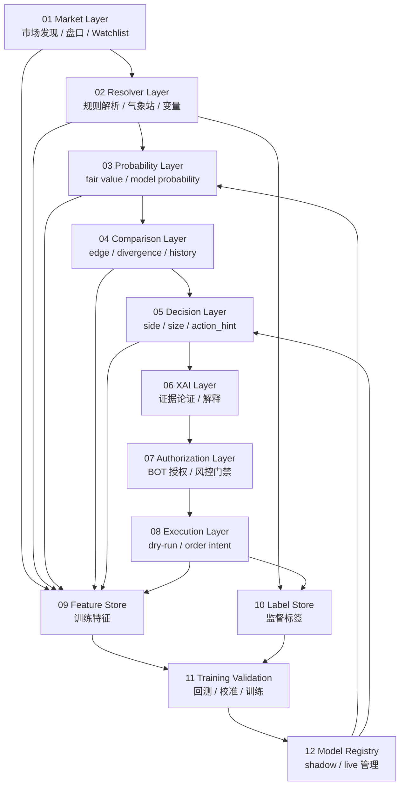

# AARS Polymarket Weather Trading Console 功能需求报告

版本：v0.2  
日期：2026-04-21  
关联文档：[AARS_Polymarket_Weather_Trading_Architecture.md](./AARS_Polymarket_Weather_Trading_Architecture.md) / [AARS_Polymarket_Weather_Trading_Monitoring_Collection_And_Indicator_Governance.md](./AARS_Polymarket_Weather_Trading_Monitoring_Collection_And_Indicator_Governance.md)

---

## 1. 文档目的

本文档定义 AARS Polymarket Weather Trading Console 的功能需求、用户场景、核心业务流程、验收标准与非功能性要求。

系统目标是构建一个面向 Polymarket 天气 / 气候预测市场的实时交易研究与执行控制台，支持市场发现、规则解析、概率估计、盘口比较、交易建议、证据论证、BOT 授权、执行网关、训练验证、系统监控和监测采集。

---

## 2. 业务目标

系统需要支撑以下核心业务目标：

1. 实时跟踪 Polymarket 天气 / 气候相关市场。
2. 自动解析市场规则，包括地点、气象站、变量、目标日期、结算规则和 band scheme。
3. 接入 ECMWF、HRRR、METAR、Wunderground、official obs 等天气 / 气候数据源。
4. 生成模型概率、fair value、forecast support score 和 confidence。
5. 比较市场隐含概率与模型 fair value，识别 edge、divergence 和历史变化。
6. 生成交易候选建议，包括 side、size、action_hint 和 reason_code。
7. 通过 XAI 证据链解释建议来源。
8. 通过 authorization gate 控制 BOT 自动执行权限。
9. 通过 execution gateway 输出 dry-run / order intent / order receipt。
10. 将实时数据沉淀为 feature store 和 label store，用于训练、回测、校准验证和模型注册。
11. 提供单市场预警与 family 级异常发现能力，为 dashboard / telegram / automation 提供统一监测语义。

---

## 3. 用户角色

### 3.1 操作员 Operator

职责：

- 查看当前市场状态。
- 搜索并固定关注市场。
- 审查 resolver、forecast、comparison 和 decision 证据。
- 授权或撤销 BOT 自动交易权限。
- 查看系统健康状态和执行记录。

### 3.2 研究员 Researcher

职责：

- 分析历史盘口与天气数据。
- 构建 feature / label 数据集。
- 回测 heuristic 和 trained model。
- 评估 calibration、ROI、drawdown 和 resolver coverage。

### 3.3 风控 / 审计 Risk Reviewer

职责：

- 检查 authorization gate 和 risk gate。
- 审查 decision / authorization / execution audit log。
- 确认自动执行是否满足策略、权限和数据新鲜度要求。

### 3.4 系统服务 Worker

职责：

- 采集 Polymarket 市场与盘口。
- 拉取天气 / 气候数据。
- 运行 resolver、probability、comparison、decision、monitoring 等后台任务。

---

## 4. 核心问题闭环

系统所有 UI 和后台链路必须持续回答五个问题：

1. 当前关注的是哪个市场？
2. 这个市场当前赔率和盘口状态是什么？
3. 模型 / resolver 对这个市场的支持证据是什么？
4. 市场赔率与模型判断是对齐还是背离，背离程度有多大？
5. 在当前证据和权限条件下，BOT 能不能自动执行？

---

## 5. 总体功能范围



---

## 6. 功能需求

### FR-01 市场发现与 Watchlist

系统应支持从 Polymarket Gamma API 和 CLOB 实时流中发现天气 / 气候市场。

功能要求：

- 支持 Gamma 搜索 Polymarket market。
- 支持模糊搜索 market question、market id、location、family。
- 支持将搜索结果加入 watchlist。
- 支持从 watchlist 删除市场。
- 支持 pin / unpin 当前市场。
- 支持 recent markets，记录最近选择时间和来源。
- 支持 watchlist 按 market family 分组和筛选。
- 支持 watchlist 按 resolver status、edge、freshness 进行联合筛选。
- 支持 fallback 到本地缓存，避免 Gamma 不可用时页面失效。

验收标准：

- 输入 “Shanghai temperature” 能返回或展示相关市场。
- 点击 Add to list 后，市场进入 watchlist，并刷新后仍然保留。
- 点击 Remove 后，市场从 watchlist 隐藏，并刷新后仍然不显示。
- Pin 状态可设置、取消和持久化。

---

### FR-02 Polymarket 实时盘口采集

系统应采集 Polymarket 实时盘口数据。

功能要求：

- 订阅 CLOB WebSocket asset ids。
- 维护 asset-level market state。
- 聚合 yes / no asset 为 market-level snapshot。
- 输出 market implied probability。
- 输出 yes_price、no_price、favored_side、spread、updated_at。
- 支持 market_realtime_snapshot 和 market_realtime_simple 输出。
- 市场发现、市场录入和后续比较必须共享同一份市场快照，避免不同表面对同一市场产生不一致事实。

验收标准：

- CLOB 更新后，market snapshot 文件更新时间变化。
- Dashboard 能显示最新 yes/no price 和 market probability。
- 当 CLOB 不可用时，系统显示 stale 或 unavailable，而不是页面空白。

---

### FR-03 Market Resolver

系统应解析 Polymarket market question，生成可计算的 MarketRule。

功能要求：

- 识别 market_family。
- 识别 location。
- 识别 target_date。
- 识别 variable_name。
- 匹配 station 或 official source。
- 输出 band_scheme。
- 输出 resolver_status 和 resolver_confidence。
- 输出 `required_sources`。
- 输出 `settlement_source_type`。
- 输出 `official_vs_proxy_source`。
- 输出 `source_match_grade`。
- 输出 `official_source_url`。
- 对 unmatched market 输出明确原因。

典型 market family：

- `temperature_daily_max`
- `temperature_daily_min`
- `precipitation_amount`
- `global_temperature_index`
- `sea_ice_extent`
- `hurricane_landfall`

验收标准：

- 上海温度市场应解析为 ZSPD / Shanghai Pudong Intl Airport / daily_max_temperature。
- 上海温度市场应输出 `official_vs_proxy_source=official`、`source_match_grade=exact_station`。
- 全球 hottest year 市场应解析为 global temperature index。
- 全球 hottest year 市场应输出 family-level resolver contract，而不是伪装成 exact station match。
- sea ice extent 市场应解析为对应 official sea ice extent 数据源。
- 未支持市场不得伪装为 matched，必须输出 `resolver_status=unmatched`。
- source 仅为 family-level 或 fallback 时，UI 和 gate 必须能识别并降级提示。

---

### FR-04 Weather Data Adapters

系统应根据 resolver 输出的数据需求拉取天气 / 气候数据。

功能要求：

- 支持 ECMWF / HRRR forecast adapter。
- 支持 METAR / official obs adapter。
- 支持 Wunderground station adapter。
- 支持 official climate index / sea ice dataset adapter。
- 所有外部请求不得阻塞 dashboard 首屏。
- 支持 cache-first、manual refresh 和 worker 异步刷新。

验收标准：

- 上海 ZSPD 数据可手动刷新并写入本地 cache。
- 页面首次加载不因 Wunderground / Gamma / weather API 卡住。
- 数据不可用时，UI 显示 source status 和 last_error。

---

### FR-05 Probability Layer

系统应生成模型概率和 fair value。

功能要求：

- 接收 MarketSnapshot、MarketRule、ForecastSnapshot、ObservationSnapshot。
- 输出 `model_probability`。
- 输出 `fair_value`。
- 输出 `forecast_support_score`。
- 输出 `confidence`。
- 标注 `calibration_status`。
- 支持 heuristic mode、shadow model mode、live model mode。

验收标准：

- 当前 heuristic 概率必须标注 `not_calibrated`。
- Fair value 必须与 market implied probability 区分显示。
- 若 resolver unmatched，则 probability layer 不得输出误导性 fair value。

---

### FR-06 Comparison Layer

系统应比较 market implied probability 与 model fair value。

功能要求：

- 计算 edge。
- 计算 confidence_adjusted_edge。
- 计算 band_distance。
- comparison 与 dashboard 展示必须消费同一份上游快照，不得在 UI 层重新发明事实源。
- 判断 divergence_status。
- 追加 comparison history。
- 对相同 market 的重复点做去重。
- 限制每个 market 的历史点数量。
- 支持历史赔率 vs forecast / official value 可视化。

验收标准：

- Comparison history 按 market_id 独立去重。
- 同一 market 重复状态不会无限追加。
- Dashboard 能显示 edge / divergence / history trend。

---

### FR-07 Decision Layer

系统应生成交易候选建议。

功能要求：

- 输出 recommended side。
- 输出 size 建议。
- 输出 action_hint。
- 输出 reason_code。
- 输出 decision_status。
- 支持 heuristic decision。
- 支持 trained model shadow decision。
- 支持 decision audit log。

验收标准：

- Decision layer 不直接触发真实交易。
- UI 中必须显示“决策辅助，不是校准概率”。
- 当数据 stale、resolver unmatched、risk blocked 时，action_hint 应为 WAIT / BLOCK。

---

### FR-08 XAI Layer

系统应提供可解释证据链。

功能要求：

- 输出 EvidenceBundle。
- 输出 ArgumentTrace。
- 支持三层解释：结论、物理证据、孪生推演。
- 规程步应与证据层绑定。
- XAI 应解释 resolver、probability、comparison、decision 的来源。

验收标准：

- 操作员能看到“为什么建议 YES / NO / WAIT”。
- 操作员能看到 station、variable、target date、source、confidence。
- XAI 不应改变决策，只解释决策。

---

### FR-09 Authorization Layer

系统应支持 BOT 自动交易授权和风控门禁。

功能要求：

- 支持 operator authorize / revoke。
- 授权状态持久化。
- Risk gate 检查 resolver status、data freshness、liquidity、spread、confidence、execution gateway health。
- 输出 can_execute。
- 输出 block_reasons。
- 授权只代表允许 BOT 自动执行，不代表模型判断正确。

验收标准：

- 未授权时 BOT 不可执行。
- 已授权但 risk gate 不通过时 BOT 仍不可执行。
- UI 明确显示 block reason。

---

### FR-10 Execution Layer

系统应通过执行网关提交 dry-run 或真实订单意图。

功能要求：

- 支持 dry-run mode。
- 支持 order intent。
- 支持 order receipt。
- 支持 execution audit log。
- 执行层只消费通过 authorization gate 的动作。

验收标准：

- 默认执行模式为 dry-run。
- 未通过 gate 的决策不会产生 order intent。
- 每次执行动作必须可审计。

---

### FR-11 Dashboard

系统应提供交易台式 Dashboard。

功能要求：

- 顶层应以 `TopParameterView` 作为首屏常态参数面，统一展示 market identity、Polymarket params、weather / forecast params、resolver/source contract 与 decision / gate summary。
- 首屏应优先显示非空字段，非适用 family 的字段应折叠或隐藏，不应以大量 `-` 占位。
- 顶部显示当前市场、盘口、resolver、forecast、comparison、BOT 状态。
- 主区域回答五个核心问题。
- Markets tab 支持搜索、watchlist、recent、pin、remove。
- Command tab 应提供 compact gate stack，聚合 alignment / probability contract / execution gate 状态。
- Detailed execution controls 应折叠或迁移到次级视图，避免首屏过长。
- Current Analysis tab 显示 comparison focus、trade decision、live status、history / forecast。
- Charts tab 显示 comparison table、divergence chart、timeseries。
- History tab 显示 timeline 和 odds vs forecast / official value。
- Evidence tab 显示 bias summary、rule station、raw JSON。
- 外部数据刷新应局部化，不应全页面阻塞。

验收标准：

- 页面首次打开不空白。
- 数据源不可用时显示 fallback / cache / stale，而不是崩溃。
- 操作员能在一个页面内掌握当前状态。
- 操作员能在 Markets tab 内通过 family / resolver / edge / freshness 快速缩小 watchlist。

---

### FR-12 Telegram Console

系统应支持 Telegram 作为通知和 human-in-loop 通道。

功能要求：

- `/status` 与 `/market` 应消费与 Dashboard 一致的 `TopParameterView` 与 `gate_stack_api.v1`，避免不同表面对首屏语义分叉。
- 推送 market alert。
- 推送 divergence alert。
- 推送 BOT authorization request。
- 推送 execution dry-run / receipt。
- 支持 `/status` 展示 unified status 与 probability contract。
- 支持 `/market [market_id]` 展示市场摘要、snapshot refs 与 manual advisory 状态。
- 支持 `/timeline [market_id]` 展示比较历史。
- 支持人工确认或拒绝。

验收标准：

- Telegram 不直接绕过 authorization gate。
- Telegram 操作必须进入 audit log。
- Telegram 默认 market 应跟随 dashboard `operator_market_context.json`。
- Telegram 必须展示并传递 `probability_contract.v1`，但不得单独放开交易。

---

### FR-13 Feature Store

系统应沉淀训练特征。

功能要求：

- 存储 market_features。
- 存储 orderbook_features。
- 存储 resolver_features。
- 存储 weather_features。
- 存储 probability_features。
- 存储 comparison_features。
- 存储 decision_features。
- 存储 execution_features。
- 每条特征必须包含 feature_time、source、schema_version。

验收标准：

- 可以基于 feature store 构建 point-in-time safe dataset。
- 不允许训练样本使用未来数据。

---

### FR-14 Label Store

系统应沉淀监督标签。

功能要求：

- 支持 weather outcome label。
- 支持 market settlement label。
- 支持 price movement label。
- 支持 trade PnL label。
- 标签必须记录 label_time、source、resolved_at。

验收标准：

- Polymarket 盘口数据不得直接当作真实 outcome 标签。
- official obs / settlement value 必须与 market_id 或 rule_id 可关联。

---

### FR-15 Training / Validation

系统应支持训练、回测和验证。

功能要求：

- 构建 point-in-time safe dataset。
- 支持 heuristic 回测。
- 支持概率模型训练。
- 支持 calibration evaluation。
- 支持 strategy evaluation。
- 支持 shadow model 对比。
- 输出 validation report。

验收标准：

- 每个模型必须有 validation metrics。
- 未通过验证的模型不得 live。
- 回测报告必须包含 ROI、max drawdown、calibration error。

---

### FR-16 Model Registry

系统应支持模型注册和部署模式控制。

功能要求：

- 记录 model_id、model_type、features_version、training_range、validation_metrics。
- 支持 offline_only / shadow / live。
- 支持 `approved_for_live` 标记，作为 validation 侧候选输入，不直接等同于 `live_approved`。
- 支持模型回滚。

验收标准：

- 只有 `approved_for_live=true` 且 `probability_mode=live_approved` 的模型可以进入 live decision。
- Shadow model 不影响真实 BOT 执行。
- `approved_for_live` 仅作为 validation 侧输入，不应与 `live_approved` 混为同一语义。

---

### FR-17 Monitoring

系统应提供监视层。

功能要求：

- 输出 worker health。
- 输出 data freshness。
- 输出 source status。
- 输出 resolver coverage。
- 输出 comparison freshness。
- 输出 execution gateway health。
- Dashboard 顶部展示监控状态。

验收标准：

- 任一 worker 失效时，dashboard 显示 warning。
- 任一数据源 stale 时，dashboard 显示 freshness。
- 监控状态不得依赖 dashboard 才能生成。

---

### FR-18 Gate Stack External Contract / Automation Summary

系统应对外输出稳定的 gate contract 与 automation summary，供 dashboard / telegram / gateway / scheduler 统一消费。

功能要求：

- 输出 `gate_stack_api.v1`。
- 输出 `gate_stack_automation_summary.v1`。
- `gate_stack_api` 支持多市场视图（`market_gate_views`）。
- 输出 `severity`、`recommended_operator_action`、`primary_block_reason`。
- `run-gate-stack-automation-check` 支持 `fail-on-signal` 退出码策略。

验收标准：

- 无 unified status 直连时，telegram 与 gateway 仍可消费 gate API。
- scheduler 可仅根据退出码判断是否命中阻断阈值。
- 多市场情况下可按 market_id 定位 gate 结果。

### FR-19 Ops Alert Bridge / Queue Lifecycle

系统应支持把运行时 red 告警桥接到 Telegram 可消费队列，并维护发送与回执状态。

功能要求：

- comparison-engine 输出 `gate_stack_ops_alert.v1` JSONL 事件。
- telegram bridge 能把 alert 转换为 `telegram_ops_notification.v1` 队列。
- 支持去重状态文件，避免重复告警风暴。
- 支持 lifecycle 状态流转：`pending -> sent -> acked`。
- 记录 delivery log（sent/acked 事件）用于审计。

验收标准：

- 重复 alert 不应重复入队。
- 分发后通知状态应更新为 sent，并记录 sent 事件。
- 回执后通知状态应更新为 acked，并记录 acked 事件。

---

### FR-20 Top Parameter Surface

系统应把市场参数、天气参数、forecast 参数、resolver/source contract 与比较 / gate 摘要收口为统一首屏合同。

功能要求：

- 输出 `TopParameterView`。
- 支持 `market_family` 驱动的 family-specific 顶层参数模板。
- 支持空字段折叠，避免非适用字段遮蔽核心信息。
- 支持 comparison history / history relationship / evidence chart / timeline 复用同一份合同。

验收标准：

- Dashboard 与 Telegram 顶层首屏展示同一组核心字段。
- 非温度 family 不应强制显示温度专属字段。
- `market_probability` 应优先从上游显式字段或 yes/no price 计算得到，不应长期空白。

### FR-21 上游数据流水线治理

系统应把市场研究、市场录入、resolver、forecast、comparison 与展示统一到同一条可追溯流水线。

功能要求：

- 市场发现 / 录入必须明确唯一主快照。
- resolver 输出必须回指同一 `market_id` 与唯一事实源。
- forecast / observation 必须与 resolver 与 target_date 对齐。
- comparison 只能消费上游快照，不得在 UI 层重写事实。
- Dashboard / Telegram / Gateway 必须消费同一条上游事实链。

验收标准：

- 同一 `market_id` 的 market / rule / forecast / comparison 可互相回指。
- 任一表面都不能独立生成与上游冲突的“当前事实”。
- 当上游源不一致时，UI 只能显示 mismatch / stale / unavailable，而不能静默拼接。

### FR-22 监测采集层与异常发现

当前状态：已实现，作为 Phase 27 完成后的正式基线能力收口。

系统应提供统一的监测采集层，用于单市场实时预警与 family 级异常发现。

功能要求：

- 支持 observation shock、forecast divergence、market reaction gap、resolver / source risk 等单市场指标。
- 支持 price velocity、edge dislocation、evidence mismatch、microstructure stress、peer relative anomaly、intervention-like score 等 family 指标。
- 指标必须先校验 `market_id`、`station_id`、`variable_name`、`target_date`、`source_match_grade`、`band_scheme` 等 contract，再进入比较或告警。
- 指标必须可回放、可重算，并记录 threshold policy version 与 indicator version。
- `market_alert_event.v1` 与 `market_anomaly_event.v1` 必须可被 dashboard、telegram、automation consumer 统一消费。

验收标准：

- 单市场指标在 source mismatch 时自动降级为 review-only / advisory。
- family anomaly 仅在同 family / 同日期 / 同变量的 peer 对比下输出。
- 缺数据不得被默认为 0，必须显式表达 missing / incomplete / degraded。
- 监测采集结果不得反向改写 gate 语义，gate 仍由 `gate_stack_api.v1` 决定。

Phase 30 已完成后，validation assimilation 与 advanced anomaly 的只读消费面也已接入 dashboard、Telegram 与 workstation，但这些新增可视化仍只消费同一套监测契约，不改变 FR-22 的职责边界。

Phase 31 已完成后，系统进一步新增持续运行的市场发现、证据扫描、异常检测与告警路由链路；这些扫描结果同样只消费既有 resolver / source / measurement / validation 契约，不改变 FR-22 的职责边界，也不把 alert / anomaly 变成 gate 语义。

## 7. 非功能需求

### NFR-01 可用性

- Dashboard 首屏不得被外部请求阻塞。
- 外部 API 失败时必须降级显示。
- JSON / DB 文件缺失时应有 fallback 或明确提示。

### NFR-02 可审计性

- decision、authorization、execution 必须有 audit log。
- 每个模型输出应能追溯 model_id 和 feature version。
- 每个 resolver 输出应能追溯 rule version。

### NFR-03 可扩展性

- 新 market family 应通过 resolver plugin 接入。
- 新 weather source 应通过 adapter 接入。
- 新模型应通过 model registry 接入。

### NFR-04 安全性

- 真实 execution credentials 不得写入代码或普通 JSON。
- BOT 默认 dry-run。
- Authorization 和 risk gate 必须在 execution 前强制执行。

### NFR-05 性能

- Dashboard 首屏目标加载时间小于 3 秒。
- 局部刷新不应导致整页闪烁。
- 历史数据应分页或按 market_id 筛选加载。

### NFR-06 数据质量

- 所有 snapshot 应包含 timestamp。
- 所有实时数据应包含 freshness status。
- 训练数据必须 point-in-time safe。

---

## 7.1 UI Runtime Architecture Functional Requirements

本节补充 UI Runtime Architecture Refactor v1 的功能需求，适用于 Dashboard、Telegram、CLI 与报告 surface。

### FR-UI-01 页面角色边界

系统必须将页面职责明确分离：

- Operations Monitor 负责运行总控。
- Monitoring Signals 负责信号与告警流。
- Opportunity Board 负责机会排序与候选研究入口。
- Workstation 负责单市场证据深度分析。
- Command 负责操作员动作闭环与授权控制。
- Pipeline 负责数据管道与处理诊断。
- Markets 负责市场池和 watchlist 管理。
- Charts 负责趋势与可视化分析。
- History 负责事件回放与审计。
- Evidence / Raw 负责原始证据、canonical conversion 与 lineage。

验收：

- 页面不得重复承担其他页面的核心职责。
- Opportunity Board 不得变成实时监控页。
- Command 不得变成证据深挖或多市场监控页。

### FR-UI-02 View Contract 渲染

Dashboard 页面、Telegram 命令、CLI 摘要和报告必须消费统一 view contracts。

最低要求：

- Operations Monitor 读取 `operations_monitor_view.v1`。
- Opportunity Board 读取 `opportunity_board_view.v1`。
- Workstation 读取 `market_workstation_view.v1`。
- Command 读取 `command_context_view.v1`。
- Markets 读取 `markets_inventory_view.v1`。
- Evidence / Raw 读取 `evidence_raw_view.v1`。

验收：

- 前端页面不得直接从 raw data 推导 `primary_state`、`gate_summary`、`opportunity_score`、`next_operator_action`。
- Telegram 与 Dashboard 对同一 market 的关键状态一致。

### FR-UI-03 主状态治理

系统必须生成并消费统一主状态字段：

```json
{
  "primary_state": "BLOCKED",
  "primary_state_reason": "Gate blocked by validation coverage below threshold",
  "secondary_states": ["LIVE", "DATA_QUALITY_B"],
  "display_priority": 92
}
```

主状态优先级：

```text
BLOCKED > ALERT > ANOM > STALE > NORMAL
```

验收：

- 所有 market card / focus card / quick detail 只显示一个主状态。
- 主状态必须来自 `primary_state_policy`，不由前端自算。
- `OPS` 不得直接成为 market card 主状态，除非 view builder 明确映射。

### FR-UI-04 动作可见性治理

系统必须通过 `action_visibility_policy` 控制动作展示和启用状态。

要求：

- Board / Monitor / Markets 允许 `View`、`Add to Focus`、`Open Workstation`、`Send to Command`。
- Workstation 允许 `Review Evidence`、`Open Charts`、`Send to Command`、secondary `Run Dry-run Review`。
- Command 允许 `Acknowledge`、`Mute`、`Create Pending Intent`、`Run Dry-run`。
- `Live Execute` 只能在未来 gated mode 中由 Command 显示。

验收：

- 非 Command 页面不得把 `Live Execute` 作为主按钮。
- execution-related 按钮必须显示禁用原因。
- action events 必须写入统一 audit trail。

### FR-UI-05 图例与颜色一致性

系统必须统一 `LIVE / STALE / ALERT / ANOM / BLOCKED / ALLOW / B / OPS` 的状态语义与颜色语义。

验收：

- 红色只用于 `BLOCKED`、`ALERT red`、critical `OPS` 和顶部风险主数字。
- 琥珀只用于 `ANOM`、warning、medium risk。
- 绿色只用于 `LIVE`、`ALLOW`、`NORMAL`、healthy。
- 品红 `B` 只用于字段级数据质量问题。

### FR-UI-06 导航与页面上下文

系统必须按 operator intent 分组导航：

```text
RUN: Operations Monitor, Monitoring Signals, Command
RESEARCH: Opportunity Board, Workstation, Charts
DATA: Pipeline, Markets, Evidence / Raw, History
SETTINGS: Alerts & Rules, Data & Sources, System
```

验收：

- 页面跳转必须携带必要 entry context。
- `Open Workstation`、`Add to Focus`、`Send to Command`、`Review Evidence`、`View History` 行为一致。
- 页面不得自造局部 context。

---

## 8. MVP 验收清单

MVP 应至少满足：

- 能搜索并加入 Polymarket market。
- 能 pin / unpin / remove watchlist market。
- 能实时显示 market probability。
- 能解析至少三个 market family：Shanghai temperature、global temperature index、sea ice extent。
- 能输出 MarketRule。
- 能输出 ForecastSnapshot。
- 能输出 ProbabilityState。
- 能输出 ComparisonPoint。
- 能输出 TradeDecision。
- 能显示 XAI EvidenceBundle。
- 能显示 BOT 授权状态和 block reason。
- Execution 默认为 dry-run。
- 能输出 monitoring_status.json。
- 能沉淀 feature / label 基础表。
- 能生成一次 heuristic backtest report。

---

## 9. 范围外事项

当前阶段不承诺：

- 真实资金自动交易。
- 完全校准的概率模型。
- 所有 Polymarket 天气市场全覆盖。
- 所有官方气象数据源完整接入。
- 高频交易级别 order book 策略。
- 无人工审核的生产执行。

---

## 10. 风险与依赖

主要风险：

- Resolver coverage 不足。
- Weather source 数据延迟或不可用。
- Market liquidity 低导致 edge 不可交易。
- Heuristic probability 被误解为 calibrated probability。
- 训练数据存在 look-ahead bias。
- BOT 授权语义与真实执行混淆。

关键依赖：

- Polymarket Gamma API / CLOB。
- Weather / climate 数据源。
- Resolver rulebook。
- Feature / label store。
- Monitoring worker。
- Execution gateway。

---

## 11. 总结

本功能需求报告定义了从实时市场分析到模型训练验证、从 XAI 解释到 BOT 授权执行的完整功能范围。

系统应优先保证：

1. 市场与 resolver 对齐准确。
2. Dashboard 稳定可用。
3. Probability 与 decision 明确标注未校准状态。
4. BOT 执行必须经过 authorization gate 和 risk gate。
5. 实时数据必须沉淀为可训练、可验证、可审计的数据资产。
