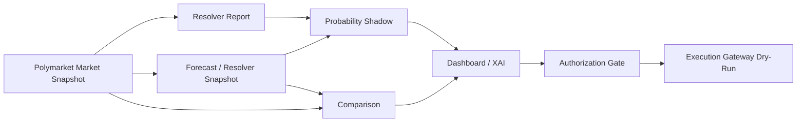
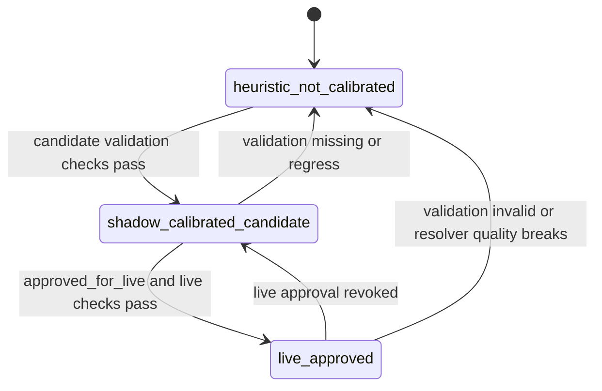

# AARS Polymarket Weather Trading Console 实施计划与完成状态

版本：v0.4  
日期：2026-04-21  
定位：用于后续对话恢复上下文、阶段验收、继续开发排期

关联文档：

- [AARS_Polymarket_Weather_Trading_Architecture.md](./AARS_Polymarket_Weather_Trading_Architecture.md)
- [AARS_Polymarket_Weather_Trading_Functional_Requirements.md](./AARS_Polymarket_Weather_Trading_Functional_Requirements.md)
- [AARS_Polymarket_Weather_Trading_Detailed_Design.md](./AARS_Polymarket_Weather_Trading_Detailed_Design.md)
- [AARS_Polymarket_Weather_Trading_Monitoring_Collection_And_Indicator_Governance.md](./AARS_Polymarket_Weather_Trading_Monitoring_Collection_And_Indicator_Governance.md)
- [AARS_Polymarket_Weather_Trading_UI_Design_Status_Roadmap.md](./AARS_Polymarket_Weather_Trading_UI_Design_Status_Roadmap.md)
- [AARS_Polymarket_Weather_Trading_Signal_Design.md](./AARS_Polymarket_Weather_Trading_Signal_Design.md)
- [AARS_Polymarket_Weather_Trading_Test_Report.md](./AARS_Polymarket_Weather_Trading_Test_Report.md)

---

## 1. 状态图例

| 状态 | 含义 |
|---|---|
| Done | 已实现、已本地验证，可作为后续阶段依赖 |
| Partial | 主链路已实现，但覆盖范围、生产化或数据完整性不足 |
| In Progress | 当前正在推进，已有代码但尚未收口 |
| Next | 下一阶段建议优先开展 |
| Pending | 尚未开始或仅有设计 |
| Blocked | 受外部数据源、凭证、生产权限或未决架构约束阻塞 |

---

## 2. 当前系统主链路



当前已经形成的本地闭环：

```text
market selection
-> activate realtime market input
-> resolver once
-> forecast once
-> probability shadow
-> comparison once
-> dashboard alignment audit
-> pending intent
-> gateway dry-run risk check
```

当前统一 contract / surface 还包括：

- `TopParameterView` 作为 dashboard / Telegram / gateway / comparison-engine 的首屏参数面
- `gate_stack_api.v1` 作为跨表面唯一 gate contract
- `probability_contract.v1` 作为跨表面概率契约
- `execution_intent.v1` 作为 execution gateway 唯一意图对象
- `market_alert_event.v1` / `market_anomaly_event.v1` 作为监测采集层统一输出契约
- `market_realtime_simple*.json` 启动时优先保留有价格市场，避免 metadata-only 空壳覆盖主快照
- 市场发现、市场录入、resolver、forecast、comparison、展示必须共享同一套唯一数据源与同步规则，避免后期表面各自派生出不同事实
- 同一 `market_id` 的 market snapshot / market rule / forecast snapshot / comparison point 必须可回指到同一条事实链，TopParameterView 只做首屏聚合，不改写事实
- `TopParameterView` 当前是“同 schema、多适配器”实现，不应误写成单一跨仓库共享构建类

### 实施检查结果

基于当前代码与运行产物，治理设计已经部分落地为可观察的系统行为：

1. 市场 ingest 已采用价格优先策略，避免 metadata-only 空壳覆盖主快照。
2. comparison-engine、dashboard、Telegram 已分别构建各自的 `TopParameterView` 适配器，但输出 schema 保持一致。
3. `market_probability` 已可以由显式字段或 YES/NO 价格推导，不再依赖单点空值。
4. `source_mode` 已转成面向操作员的人话状态，避免内部枚举直接外露。
5. dashboard / Telegram 的首屏已支持空字段折叠与 family-specific 标签。

当前首屏原则：

- 有内容的字段优先显示
- 空字段自动折叠
- family-specific 标签驱动 weather / forecast 面板
- dashboard / Telegram 的信息密度保持一致
- `TopParameterView` 已同时覆盖 market identity、盘口、天气参数、resolver/source contract 与 gate summary

### 数据治理验收清单

后续所有市场 family、市场录入、forecast、comparison 与展示都应按同一清单验收：

1. 同一 `market_id` 是否共享同一份 market snapshot、market rule、forecast snapshot、comparison point。
2. 是否存在唯一事实源，而不是每个页面各自派生不同字段。
3. `TopParameterView` 是否仅作为首屏聚合，不改写上游事实。
4. 非适用 family 字段是否已自动折叠或隐藏。
5. market probability 是否来自显式字段或 YES/NO 价格计算，而不是空白占位。
6. history / evidence / chart / telegram 是否都回指同一条上游链路。

### 上游数据流水线

建议后续阶段按以下流水线推进验收与排障：

1. 市场研究 / 市场录入：先确保选中的市场是唯一事实源，且价格快照不是 metadata-only 空壳。
2. resolver 解析：确保 market_rule / station / source contract 都能回指同一 `market_id`。
3. forecast / observation：确保站点映射、target_date、forecast snapshot 与市场 question 对齐。
4. comparison / probability：确保比较与概率都是派生结果，不改写事实。
5. 展示 / operator surface：确保 Dashboard、Telegram、Gateway 只消费同一条事实链。

### 流水线验收矩阵

| 阶段 | 主要输入 | 主要输出 | 必须检查 |
|---|---|---|---|
| 市场研究 / 市场录入 | Gamma / watchlist / 人工选择 | `MarketSnapshot`、`market_realtime_simple*.json` | 是否有唯一主快照、是否避免 metadata-only 空壳 |
| resolver 解析 | `MarketSnapshot`、规则库、override | `MarketRule`、`ResolverSourceContract` | 是否回指同一 `market_id`、station / source / band 是否唯一 |
| forecast / observation | `MarketRule`、station mapping、weather adapters | `ForecastSnapshot`、`ObservationSnapshot` | 是否与 target_date、station mapping 对齐 |
| comparison / probability | `MarketSnapshot`、`MarketRule`、`ForecastSnapshot`、`ObservationSnapshot` | `ComparisonPoint`、`ProbabilityState`、`TopParameterView` | 是否完全派生、是否不改写上游事实 |
| 展示 / operator surface | `TopParameterView`、`gate_stack_api.v1`、`unified_status.json` | Dashboard / Telegram / Gateway read-only snapshot | 是否只消费同一条事实链、是否折叠非适用字段 |

### 责任归属表

| 流水线阶段 | 主要仓库 | 主要模块 / 文件 | 责任边界 |
|---|---|---|---|
| 市场研究 / 市场录入 | `polymarket-weather-ingest` | `scripts/run_polymarket_realtime.py`、`market_realtime_simple*.json` | 统一市场发现、价格优先、唯一主快照 |
| resolver 解析 | `weather-rules-research` | `scripts/run_weather_realtime.py`、`resolved_market_rules/*.json` | 统一 market rule、station mapping、source contract |
| forecast / observation | `weather-rules-research` | `forecast_realtime_snapshot.json`、`manual_station_map.json` | 站点映射与 target_date 对齐、forecast / observation 一致 |
| comparison / probability | `weather-comparison-engine` | `status/top_parameter_view.py`、`main.py`、`latest_dashboard_rows.json` | 只派生不改写事实，输出 `ComparisonPoint` / `TopParameterView` |
| 展示 / operator surface | `weather-dashboard`、`weather-telegram-console`、`weather-execution-gateway` | `top_parameter_ribbon.py`、`status_api.py`、`market_api.py`、`gates.py` | 只消费统一事实链，不重新推导市场事实 |

### 仓库速查表

| 仓库 | 主要职责 | 主要产物 |
|---|---|---|
| `polymarket-weather-ingest` | 市场发现 / 录入 / 价格优先主快照 | `market_realtime_simple*.json`、`market_realtime_snapshot.json` |
| `weather-rules-research` | resolver / station mapping / forecast / observation | `resolved_market_rules/*.json`、`forecast_realtime_snapshot.json` |
| `weather-comparison-engine` | comparison / probability / top parameter 聚合 | `latest_dashboard_rows.json`、`TopParameterView`、`unified_status.json` |
| `weather-dashboard` | 首屏展示 / operator surface / gate summary | `TopParameterView` ribbon、history / evidence panels |
| `weather-telegram-console` | `/status` / `/market` / `/timeline` 通道 | Telegram cards、runtime snapshot、approval bridge |
| `weather-execution-gateway` | dry-run / risk gate / exposure / audit | `ExecutionIntent`、`production_readiness_report.json` |

---

## 3. 阶段实施总览

| 阶段 | 名称 | 状态 | 当前产物 | 验证状态 |
|---|---|---|---|---|
| Phase 1 | Live Schema Adapter | Done | market / forecast / comparison schema validator | Passed |
| Phase 2 | Resolver Coverage Report | Done | resolver_report.json, resolved_market_rules | Passed |
| Phase 3 | Probability Shadow 输出 | Done | probability_state_*.json, probability_shadow_report.json | Passed |
| Phase 4 | Dashboard Live Alignment | Done | Pipeline Sync, Data Alignment Audit, alignment logic tests | Passed |
| Phase 5 | Execution Gate Dry-Run | Done | pending intent writer, gateway dry-run check, DEV harness | Passed |
| Phase 6 | Resolver Coverage Expansion | Done | sea ice snapshot resolver, family coverage summary, multi-market forecast snapshots, continuous backfill worker, precipitation/snowfall/wind threshold-aware comparison | Sea ice + multi-market + weather_metric threshold path passed |
| Phase 7 | Historical Feature Store | Done | training_samples.jsonl, feature_store_summary.json, official_records label store, official_history.jsonl, station_settlement_records.json, station settlement / official label / feature store realtime workers, deduped official history append | Historical sample layer passed |
| Phase 8 | Backtest and Calibration | Done | calibration_report.json, backtest_report.json, model_validation_report.json, validation CLI/scripts, dashboard Model Validation tab, validation realtime worker, edge deciles, resolver quality | Validation layer passed |
| Phase 9 | Telegram Human-in-loop | Done | dashboard approval signal bridge, signal approval, approval DB, pending intents, intent/approval binding, approval freshness UI, gateway audit linkage | Human-in-loop approval path passed |
| Phase 10 | Production Execution Readiness | Done / Guarded | production readiness checker, CLOB adapter stub, live-mode policy gate, position exposure reader, readiness checklist dashboard, dry-run safety report | Readiness layer passed; live execution blocked by design |
| Phase 11 | Position Snapshot Producer / Manual Advisory Audit | Done / Manual Advisory MVP | local account positions/open orders/balance reader, manual advisory signal, manual advisory audit log, human fill feedback CLI, normalized exposure schema | Read-only/manual-order mode passed; no private-key integration |
| Phase 12 | Manual Fill Reconciliation | Done / Reconciliation MVP | human fill reconciliation report, position snapshot coverage check, dashboard reconciliation panel | Gateway + Dashboard tests passed |
| Phase 13 | Monitoring Status / Worker Health | Done / Monitoring MVP | monitoring_status.json, worker freshness thresholds, dashboard health strip | Comparison-engine + Dashboard tests passed |
| Phase 14 | Probability / Calibration Status Contract | Done / Contract MVP | probability_mode, execution_constraint, dashboard/telegram/gateway contract fields | Comparison-engine + Dashboard + Telegram tests passed |
| Phase 15 | Compact Gate Stack / Markets Filter Bar | Done / UX Compression MVP | compact gate stack, detailed gate moved to pipeline, watchlist resolver/edge/freshness filters | Dashboard tests passed |
| Phase 16 | Telegram Monitoring Status / Unified Status Model | Done / Unified Status MVP | unified_status.json, telegram /status unified card, dashboard unified status strip | Comparison-engine + Dashboard + Telegram tests passed |
| Phase 17 | Probability Mode Promotion / Unified Status Automation | Done / Promotion Automation MVP | validation-driven probability state machine, auto-refreshed shadow contract, compare worker auto writes monitoring/unified status | Comparison-engine + Dashboard + Telegram tests passed |
| Phase 18 | Resolver Registry / Official Source Contract | Done / Contract Hardening MVP | centralized resolver contract registry, official/proxy/fallback source contract, resolver source mismatch blocker, resolver report v2, dashboard source panel | weather-rules-research + dashboard tests passed |
| Phase 19 | Validation Freshness / Label Coverage Gate | Done | validation freshness report, label coverage report, unified status / gate integration, validation-layer monitoring | Comparison-engine + Dashboard tests passed |
| Phase 20 | Operator Control Surface Hardening | Done | evidence chart, Telegram `/market` + `/timeline`, mode separation, operator market context, missing-data messaging contract, read-only account exposure, pipeline sync alignment summary | Dashboard + Telegram control surface passed |
| Phase 21 | Contract / Registry / Gate Systematization | Done / Systematization Baseline Completed | Unified gate contracts, registry-first resolver core, unified gate stack consumption across dashboard/telegram/gateway, gateway pre-execution contract gates | Multi-surface targeted tests passed |
| Phase 22 | Gate Stack External API / Automation Consumption | Done / External Contract & Automation Baseline Completed | `gate_stack_api.v1` artifact, unified-status auto export, Telegram `/status` API-first consumption, gateway fallback gate API consumption, multi-market gate views, automation hints, dashboard gate source badge, automation summary artifact, contract/versioning spec | Targeted regression passed |
| Phase 23 | Automation Runtime Gate Check | In Progress / Batch 1+2+3+4+5 Completed | `run-gate-stack-automation-check` command, fail-on-signal exit-code policy, cron/worker-friendly runtime summary generation, realtime worker, ops alert bridge JSONL, Telegram ops bridge queue sync CLI, queue lifecycle dispatch/ack, bot loop dispatch/ack handlers | Targeted regression passed |
| Phase 24 | Gate Stack Single Source Hardening | In Progress / Batch 1+2+3+4+5 Completed | dashboard / Telegram / gateway API-first gate consumption, unified fallback normalization (`api` / `unified_fallback` / `local_fallback`), `gate_stack_consumer.py`, `gate_source` / `schema_version_checked` / `gate_generated_at` observability, automation summary propagation, ops alert source traceability, contract consistency checker CLI, telegram/gateway runtime snapshot exporters, schema health + fallback stats panel, runtime periodic consistency trend + mismatch bucket aggregation | Targeted regression passed |
| Phase 24.5 | Top Parameter Surface | Completed | `TopParameterView`, family-specific top ribbon, weather / forecast params hoisted to first screen, empty-field collapse, comparison/history reuse | Targeted regression passed |
| Phase 25 | Automation Ops Contract Closure | Completed | `gate_stack_ops_alert.v1` contract closure, cooldown / suppression / dedupe state machine, `/opsqueue` / `/opsack` idempotency, deterministic exit code matrix, queue lifecycle dispatch / ack / suppressed, ops bridge and Telegram queue field consistency | Targeted regression passed |
| Phase 26 | Promotion Policy Auto-Closure | In Progress / Batch 5 Completed | `promotion_policy.py`, validation freshness / label coverage / resolver precision blockers, auto promotion/demotion, unified status promotion state propagation, gate stack promotion consumption, execution constraint coupling, telegram/gateway promotion_state propagation, dashboard promotion-state readouts, execution/probability/operator focus promotion surfacing, unified status strip promotion surfacing, TopParameterView propagation / family-specific top parameter surface / empty-field collapse | Targeted regression passed |
| Phase 27 | Monitoring Collection / Indicator Governance | Completed | observation shock / forecast divergence / market reaction gap, family anomaly discovery, indicator registry, threshold policy registry, `market_alert_event.v1`, `market_anomaly_event.v1`, scanner outputs | `weather-comparison-engine` monitoring_layer scaffold, scripts, event writers, main CLI commands, and read-only dashboard / telegram / gateway consumers implemented; source governance, measurement governance, normalization-aware schema, and canonical-only alert/anomaly contracts are now part of the stable baseline |
| Phase 28 | Validation Absorption / Anomaly Discovery Enhancement | Completed | validation / backtest absorb source + measurement governance, family anomaly high-order features, monitoring / ops / alert联动增强 | validation/backtest/calibration and operator summary surfaces已完成，Phase 28 作为正式基线收口 |
| Phase 29 | Family Rollout / Calibration Feedback / Coverage Expansion | Next | family coverage expansion, calibration feedback loop, multi-family rollout, validation drift tracking | planning baseline |

---

## 4. 已完成阶段详情

### Phase 1: Live Schema Adapter

状态：Done

目标：

- 对 live market、forecast、comparison 输出建立稳定 schema。
- 避免 dashboard 和下游模块直接依赖松散 JSON。
- 生成 schema validation report，作为实时链路健康检查入口。

已完成：

| 模块 | 文件 / 输出 | 状态 |
|---|---|---|
| weather-comparison-engine | `schemas/market_snapshot.py` | Done |
| weather-comparison-engine | `schemas/forecast_snapshot.py` | Done |
| weather-comparison-engine | `schemas/comparison_point.py` | Done |
| weather-comparison-engine | `adapters/live_schema_validator.py` | Done |
| weather-comparison-engine | `scripts/validate_live_schema.py` | Done |
| output | `schema_validation_report.json` | Done |

验收方式：

```bash
cd /Users/maolei/AARS-Platform/weather-comparison-engine
python scripts/validate_live_schema.py
python -m pytest tests/test_live_schema_validator.py
```

当前结论：

- 已能验证当前 live market、forecast、comparison history 的基本结构。
- 可作为监控层的基础输入。

---

### Phase 2: Resolver Coverage Report

状态：Done

目标：

- 把每个 Polymarket market 显式解析成 market family、resolver、required data source、band scheme。
- 区分 matched 与 unmatched，避免把 resolver 缺失误认为系统故障。
- 为 forecast poller 提供市场感知的规则输入。

已完成：

| 模块 | 文件 / 输出 | 状态 |
|---|---|---|
| weather-rules-research | `models/resolved_market_rule.py` | Done |
| weather-rules-research | `rules/resolver_report.py` | Done |
| weather-rules-research | `scripts/run_resolver_once.py` | Done |
| output | `resolver_report.json` | Done |
| output | `resolved_market_rules/market_rule_*.json` | Done |

当前覆盖：

| Market Family | 状态 | 说明 |
|---|---|---|
| global_temperature_index | matched | 支持 hottest year / ordinal hottest rank |
| station_temperature | partial | 支持规则匹配和站点映射，需扩展真实 market 覆盖 |
| sea_ice_extent | matched | 已接入 snapshot-fed resolver，可进入 forecast / probability / comparison |
| weather_metric.precipitation | matched | 支持 rainfall / precipitation 解析、阈值抽取与 3-way band 比较 |
| weather_metric.snowfall | matched | 支持 snowfall 解析、阈值抽取与 3-way band 比较 |
| weather_metric.wind_speed | matched | 支持 wind speed 解析、阈值抽取与 3-way band 比较 |

验收方式：

```bash
cd /Users/maolei/AARS-Platform/weather-rules-research
python scripts/run_resolver_once.py
python -m pytest tests/test_resolver_report.py tests/test_live_market_resolver.py tests/test_market_resolution_registry.py
```

当前结论：

- `678686` hottest year market 可 matched。
- `693870` sea ice market 已 matched，并已进入 probability / comparison 主链路。
- precipitation 型 market 已可 matched，并支持阈值区间解析。
- snowfall / wind 型 market 已可 matched，并进入 threshold-aware comparison 主链路。

---

### Phase 3: Probability Shadow 输出

状态：Done

目标：

- 在未完成训练校准前，提供明确标注为 heuristic / not calibrated 的 shadow probability。
- 输出 fair_value、model_probability、edge、confidence_adjusted_edge。
- 对整个 watchlist 批量输出 probability state 和 summary report。

已完成：

| 模块 | 文件 / 输出 | 状态 |
|---|---|---|
| weather-comparison-engine | `schemas/probability_state.py` | Done |
| weather-comparison-engine | `probability/shadow_probability_engine.py` | Done |
| weather-comparison-engine | `probability/shadow_probability_report.py` | Done |
| weather-comparison-engine | `scripts/run_probability_shadow.py` | Done |
| output | `probability_states/probability_state_*.json` | Done |
| output | `probability_shadow_report.json` | Done |
| dashboard | `Probability Shadow Report` panel | Done |

当前实际输出：

| 指标 | 当前值 |
|---|---|
| tracked_markets | 2 |
| active_states | 2 |
| blocked_states | 0 |
| active market | 678686 |
| active family | global_temperature_index |
| fair_value | 0.40 |
| market_probability | 0.67 |
| edge | -0.27 |
| confidence_adjusted_edge | -0.2295 |
| blocked market | - |
| blocked reason | - |

验收方式：

```bash
cd /Users/maolei/AARS-Platform/weather-comparison-engine
python scripts/run_probability_shadow.py
python -m pytest tests/test_shadow_probability_engine.py tests/test_shadow_probability_report.py
```

重要边界：

- 当前 probability shadow 是 heuristic。
- 当前 probability shadow 不是 calibrated probability。
- 当前 probability shadow 不能单独作为真实交易执行信号。

---

### Phase 4: Dashboard Live Alignment

状态：Done

目标：

- 解决 UI 选中 market 与 forecast/comparison 不是同一个对象的问题。
- 给 operator 显示清晰的链路对齐状态。
- 支持 selected market 一键激活 pipeline。

已完成：

| 功能 | 状态 |
|---|---|
| Markets tab watchlist Focus / Pin / Unpin / Remove | Done |
| Search result Add to list 持久化 | Done |
| Activate & Run Pipeline | Done |
| Forecast one-shot refresh | Done |
| Data Alignment Audit | Done |
| Data Alignment pure audit builder + tests | Done |
| Pipeline tab layered flow | Done |

Dashboard 当前关键问题回答：

| 问题 | 当前 UI 对应区域 |
|---|---|
| 我现在看的是哪个市场 | Top brief, Command, Data Alignment |
| 当前盘口状态是什么 | Comparison Focus, Live Status |
| resolver / model 支持证据是什么 | Resolver Status, Forecast Snapshot |
| 两者对齐还是背离 | Comparison, Data Alignment, History |
| BOT 能不能动 | Execution Gate, Operator Closure |

验收方式：

```bash
cd /Users/maolei/AARS-Platform/weather-dashboard
python -m pytest tests
PYTHONPATH=src MPLCONFIGDIR=/tmp/mpl-weather-dashboard python - <<'PY'
from streamlit.testing.v1 import AppTest
app = AppTest.from_file('src/weather_dashboard/app.py', default_timeout=20)
app.run()
print('exceptions', len(app.exception))
PY
```

最新验证：

| 日期 | 验证项 | 结果 |
|---|---|---|
| 2026-04-17 | Dashboard unit tests | 30 passed |
| 2026-04-17 | Streamlit AppTest | exceptions 0 |
| 2026-04-17 | Local dashboard HTTP probe | 200 OK on port 8520 |

---

### Phase 5: Execution Gate Dry-Run

状态：Done

目标：

- 将 BOT 授权从 UI 文案推进到 execution gateway dry-run 风控验证。
- 不真实下单，只生成 pending intent 并执行 dry-run check。
- 显示 whitelist、approval、risk gate、execution result。

已完成：

| 模块 | 文件 / 输出 | 状态 |
|---|---|---|
| weather-dashboard | `ui/execution_gate_panel.py` | Done |
| weather-dashboard | pending intent writer | Done |
| weather-execution-gateway | `dry-run-intent-file` command | Done |
| weather-dashboard | gateway dry-run check button | Done |
| weather-dashboard | DEV ONLY local whitelist / approval harness | Done |

执行链路：

```text
Write Pending Intent
-> Run Gateway Dry-Run Check
-> Approval Gate
-> Whitelist Gate
-> Risk Gate
-> Dry-run Execution Result
```

安全边界：

- 不接真实交易。
- 不绕过 execution gateway。
- DEV harness 仅用于本地验证。
- 生产执行仍需独立 risk policy、approval policy、kill switch 和真实 CLOB adapter。

验收方式：

```bash
cd /Users/maolei/AARS-Platform/weather-execution-gateway
python -m pytest tests

cd /Users/maolei/AARS-Platform/weather-dashboard
python -m pytest tests/test_execution_gate_panel.py
```

---

## 5. 下一阶段计划

### Phase 6: Resolver Coverage Expansion

状态：Done

目标：

- 把更多 market family 从识别状态推进到 matched 状态。
- 把 `weather_metric` 从“只显示数值”推进到“可比较、可进入 probability / comparison”。
- 把 station temperature 的市场规则解析和站点映射做成更稳健的 resolver。

阶段完成项：

| 任务 | 说明 | 验收 |
|---|---|---|
| Weather metric threshold schemes | 为 precipitation / snowfall / wind 补齐 band scheme 与阈值解析 | Done |
| Shanghai / ZSPD resolver | 将上海浦东机场市场稳定匹配到 ZSPD | Done |
| Station resolver registry | 扩展站点别名、变量类型、单位转换 | Done |
| Resolver coverage report UI | dashboard 展示 coverage by family | Done |

当前进展：

| 功能 | 状态 |
|---|---|
| Sea ice snapshot loader | Done |
| Sea ice taxonomy promoted to supported pipeline | Done |
| Sea ice resolver status from unmatched -> matched | Done |
| Sea ice forecast snapshot generation | Done |
| Resolver family coverage summary | Done |
| Multi-market forecast snapshots by market_id | Done |
| Multi-market continuous weather backfill worker | Done |
| Precipitation parser + extractor + resolver support | Done |
| Precipitation threshold-aware band comparison | Done |
| Snowfall parser + extractor + resolver support | Done |
| Snowfall threshold-aware band comparison | Done |
| Wind parser + extractor + resolver support | Done |
| Wind threshold-aware band comparison | Done |

最新验证：

| 日期 | 验证项 | 结果 |
|---|---|---|
| 2026-04-17 | `run_weather_backfill_once.py` | wrote snapshots for `678686`, `693870` |
| 2026-04-17 | `run_weather_backfill_realtime.py` | cycled multi-market refresh successfully |
| 2026-04-17 | probability shadow report | `active_states=2`, `blocked_states=0` |
| 2026-04-17 | precipitation resolver support | parser/extractor/resolver tests passed |
| 2026-04-17 | precipitation threshold comparison support | parser/resolver/report/research tests `66 passed` |
| 2026-04-17 | snowfall + wind threshold comparison support | research tests `76 passed`, comparison tests `25 passed`, ingest tests `14 passed` |

建议交付物：

- `weather-rules-research/src/weather_rules_research/sea_ice/`
- `weather-rules-research/data/outputs/sea_ice_extent_snapshot.json`
- `resolver_coverage_report.json`

阶段结论：

- Phase 6 已完成当前 resolver coverage expansion 目标。
- `global_temperature_index / sea_ice_extent / weather_metric(precipitation, snowfall, wind)` 已能进入 resolver -> forecast -> probability/comparison 主链路。
- 下一阶段重点应转向历史样本沉淀与训练验证，即 Phase 7。

---

### Phase 7: Historical Feature Store

状态：Done

目标：

- 沉淀训练与验证所需历史样本。
- 把 odds history、forecast history、official / resolver labels、comparison history join 成统一样本。

当前已完成：

| 模块 | 文件 / 输出 | 状态 |
|---|---|---|
| weather-comparison-engine | `features/history_feature_store.py` | Done |
| weather-comparison-engine | `schemas/training_sample.py` | Done |
| weather-comparison-engine | `scripts/run_feature_store.py` | Done |
| weather-rules-research | `outputs/official_label_store.py` | Done |
| weather-rules-research | `scripts/run_station_settlement_backfill.py` | Done |
| weather-rules-research | `scripts/run_station_settlement_backfill_realtime.py` | Done |
| weather-rules-research | `scripts/run_official_label_store.py` | Done |
| weather-rules-research | `official_obs/station_settlement_backfill.py` | Done |
| output | `training_samples.jsonl` | Done |
| output | `feature_store_summary.json` | Done |
| output | `station_settlement_records.json` | Done |
| output | `station_settlement_summary.json` | Done |
| output | `official_records/official_record_*.json` | Done |
| output | `official_history.jsonl` | Done |
| output | `official_label_summary.json` | Done |
| output | `sample_station_official_records.json` | Done |

当前结果：

| 指标 | 当前值 |
|---|---|
| tracked_rows | 40 |
| tracked_markets | 13 |
| labeled_rows | 4 |
| unlabeled_rows | 36 |
| current label source | snapshot-grade labels + persisted station settlement records + continuous label workers |
| current expansion target | real station settlement-grade history coverage growth |

当前结论：

- Phase 7 主骨架已经落地，comparison history 现在可以稳定导出 point-in-time training sample。
- official label join 已支持，且 snapshot-grade label store 已经开始为 feature store 提供可监督样本。
- 当前已能为 `global_temperature_index`、`sea_ice_extent` 和 sample `station_temperature` 持续产出官方 label record。
- station settlement 已有独立 runner，可先单独落盘 `station_settlement_records.json` / `station_settlement_summary.json`，再并入统一 official label store。
- station settlement 现已补齐 realtime worker，可持续刷新 station settlement records，再由 official label store 统一并入 label history。
- official label store 现已同时输出逐市场 JSON 和统一 `official_history.jsonl`，后续可直接接给 Phase 8。
- comparison-engine 的 feature store 现已优先消费 `official_history.jsonl`，仅在缺失时回退到 `official_records/*.json`。
- official label history 现已支持 append + dedupe，重复运行不会重复污染 `official_history.jsonl`。
- station settlement backfill scaffold 已升级为独立可运行入口和 realtime worker，当前默认走 sample scenarios，后续可切到 `DailySettlementFetcher.fetch_daily_value()`。
- Phase 7 主目标现已收口完成：历史样本、官方 label 流、station settlement 回填、official label append/dedupe、feature store 持续刷新都已具备。
- 后续要继续做的，是扩大真实 settlement-grade official history 覆盖率，这属于 Phase 8 之前的质量增强，而不再阻塞 Phase 7 完成状态。

建议 schema：

| 字段 | 说明 |
|---|---|
| market_id | Polymarket market id |
| timestamp | 样本时间 |
| market_probability | 市场 implied probability |
| yes_price / no_price | 盘口价格 |
| spread | bid / ask spread |
| liquidity / volume | 流动性特征 |
| model_value | resolver / forecast 值 |
| model_band | forecast band |
| expected_band | resolver 目标 band |
| official_value | 最终官方值 |
| resolved_band | 最终结算 band |
| outcome | YES / NO label |
| edge | model_probability - market_probability |

建议交付物：

- `weather-comparison-engine/src/weather_comparison_engine/features/`
- `training_samples.jsonl`
- `feature_store_summary.json`
- dashboard `Model Validation` tab 初版

最新验证：

| 日期 | 验证项 | 结果 |
|---|---|---|
| 2026-04-18 | `python scripts/run_station_settlement_backfill.py` | wrote `station_settlement_records.json` and `station_settlement_summary.json` |
| 2026-04-18 | `STATION_SETTLEMENT_MAX_CYCLES=1 python scripts/run_station_settlement_backfill_realtime.py` | station settlement realtime worker completed one cycle |
| 2026-04-18 | `OFFICIAL_LABEL_MAX_CYCLES=1 python scripts/run_official_label_store_realtime.py` | official label realtime worker completed one cycle |
| 2026-04-18 | `python scripts/run_official_label_store.py` | wrote `official_records/*.json` and `official_label_summary.json` |
| 2026-04-18 | `python scripts/run_official_label_store.py` rerun | `official_history.jsonl` deduped append with `appended=0` |
| 2026-04-18 | `official_history.jsonl` | wrote unified label stream with 4 records |
| 2026-04-18 | `python scripts/run_feature_store.py` | wrote `training_samples.jsonl` and `feature_store_summary.json` |
| 2026-04-18 | `FEATURE_STORE_MAX_CYCLES=1 python scripts/run_feature_store_realtime.py` | feature store realtime worker completed one cycle |
| 2026-04-18 | feature store labeled rows | `labeled_rows=4`, `label_counts={YES:2, NO:2}` |
| 2026-04-18 | station settlement backfill scaffold | sample mode + fetcher mode tests passed |
| 2026-04-18 | `python -m pytest tests` in weather-rules-research | `85 passed` |
| 2026-04-18 | `python -m pytest tests` in weather-comparison-engine | `29 passed` |

---

### Phase 8: Backtest and Calibration

状态：Done

目标：

- 将 Phase 3 的 heuristic shadow probability 逐步升级为可验证模型。
- 生成 calibration bucket、Brier score、log loss、hit rate、edge PnL proxy。

建议指标：

| 指标 | 说明 |
|---|---|
| Brier score | 概率校准误差 |
| Calibration bucket | 预测概率分桶准确率 |
| Hit rate by family | 按 market family 的命中率 |
| Edge decile performance | 按 edge 分位的表现 |
| Resolver failure rate | resolver 未匹配率 |
| Forecast freshness | forecast 数据新鲜度 |

建议交付物：

- `backtest_report.json`
- `calibration_report.json`
- `model_validation_report.json`
- dashboard `Model Validation` tab

当前已完成：

| 模块 | 文件 / 输出 | 状态 |
|---|---|---|
| weather-comparison-engine | `validation/calibration_evaluator.py` | Done |
| weather-comparison-engine | `validation/backtester.py` | Done |
| weather-comparison-engine | `validation/model_validation_report.py` | Done |
| weather-comparison-engine | `scripts/run_model_validation.py` | Done |
| weather-comparison-engine | `main.py build-model-validation` | Done |
| weather-dashboard | `Model Validation` tab / panel | Done |
| weather-comparison-engine | `scripts/run_model_validation_realtime.py` | Done |
| output | `calibration_report.json` | Done |
| output | `backtest_report.json` | Done |
| output | `model_validation_report.json` | Done |

当前结果：

| 指标 | 当前值 |
|---|---|
| model validation sample_count | 40 |
| labeled_sample_count | 4 |
| model_probability sample_count | 3 |
| market_probability baseline sample_count | 1 |
| brier_score | 0.1628 |
| log_loss | 0.510826 |
| calibration_error | 0.393333 |
| roi_backtest | 0.35 |
| max_drawdown | 0.0 |
| hit_rate | 1.0 |
| calibration_status | not_calibrated |
| deployment_mode | shadow |
| family validation | global_temperature_index / sea_ice_extent / unknown |
| resolver_match_rate | 0.075 |
| unmatched_market_rate | 0.925 |
| edge deciles | available |

当前结论：

- Phase 8 第一版 validation scaffold 已落地，`training_samples.jsonl` 现在可以直接生成 calibration / backtest / model validation 三类报告。
- 当前 heuristic shadow probability 已可离线评估，但仍明确保持 `deployment_mode=shadow`、`approved_for_live=false`。
- dashboard 已新增 `Model Validation` tab，可直接展示 validation summary、family breakdown、calibration curve 和 backtest summary。
- validation 报告现已补齐 family validation、edge deciles、resolver quality，并可通过 realtime worker 持续刷新。
- 当前 validation 样本仍较少，尤其 `market_probability` baseline 的可比样本更少，因此这些指标仍主要用于离线验证与结构化监控，而不是生产交易授权。
- Phase 8 主目标现已完成：回测、校准、validation 汇总、dashboard 展示与持续刷新层都已具备。

最新验证：

| 日期 | 验证项 | 结果 |
|---|---|---|
| 2026-04-18 | `python scripts/run_model_validation.py` | wrote `calibration_report.json`, `backtest_report.json`, `model_validation_report.json` |
| 2026-04-18 | `MODEL_VALIDATION_MAX_CYCLES=1 python scripts/run_model_validation_realtime.py` | model validation realtime worker completed one cycle |
| 2026-04-18 | `python -m pytest tests` in weather-comparison-engine | `35 passed` |
| 2026-04-18 | `python -m pytest` in weather-dashboard | `35 passed` |

---

### Phase 9: Telegram Human-in-loop

状态：Done

目标：

- Telegram 成为 operator approval channel。
- dashboard 生成 intent 后，可通过 Telegram approval 与 execution gateway 共享审批记录。

当前已有：

- `weather-telegram-console`
- approval DB
- signal card
- pending intent writer
- dashboard approval freshness UI
- execution-gateway approval / intent audit payload
- dashboard approval signal bridge

当前已完成：

| 模块 | 文件 / 输出 | 状态 |
|---|---|---|
| weather-telegram-console | `bot/handlers/approvals.py` intent binding | Done |
| weather-telegram-console | `integrations/intent_writer.py` dashboard intent reuse | Done |
| weather-telegram-console | `settings.py` dashboard approval signal preference | Done |
| weather-dashboard | `execution_gate_panel.py` approval freshness UI | Done |
| weather-dashboard | `execution_gate_panel.py` dashboard approval signal writer | Done |
| weather-execution-gateway | approval lookup by `intent_id` / `signal_id` | Done |
| output | `dashboard_approval_signal.json` bridge payload | Done |
| output | gateway audit payload with approval metadata | Done |

当前结论：

- dashboard 写 pending intent 时，会同步写 `dashboard_approval_signal.json`，供 Telegram `/signals` 直接展示同一审批对象。
- Telegram signal loader 会优先读取 dashboard approval signal，因此 operator 审批可以直接绑定 dashboard 生成的 `signal_id / intent_id`。
- Telegram 审批现在会优先复用已有 dashboard / pending intent，而不是总是重新生成新 intent。
- `approval_id / intent_id` 绑定现已成立，execution-gateway 可以通过 `intent_id` 读取明确审批。
- dashboard 现已能直接显示审批状态、过期时间、intent 绑定与消费状态。
- audit trail 已延伸到 dry-run 结果文件与 audit log，能看到 approval metadata 与 execution result 的关联。
- Phase 9 主目标已完成：dashboard intent、Telegram approval、execution gateway dry-run 现在共享同一个 intent/approval 语义链。

后续增强：

| 任务 | 说明 |
|---|---|
| active Telegram push | 当前为 Telegram `/signals` 拉取式审批，后续可改成 dashboard 主动推送 Telegram 消息 |
| operator workflow polish | 把 signals / approval / consume / consumed lifecycle 做成更清晰的 operator flow |

最新验证：

| 日期 | 验证项 | 结果 |
|---|---|---|
| 2026-04-18 | `python -m pytest tests` in weather-telegram-console | `11 passed` |
| 2026-04-18 | `python -m pytest` in weather-dashboard | `35 passed` |
| 2026-04-18 | `python -m pytest` in weather-execution-gateway | `13 passed` |

---

### Phase 10: Production Execution Readiness

状态：Done / Guarded

目标：

- 从 dry-run 进入生产级执行前的完整安全闭环。
- 建立一个不会误触发真实交易的 pre-flight gate：即使 operator 已授权，只要生产条件不足，gateway 仍必须保持 dry-run / disabled。

已完成：

| 产物 | 路径 | 状态 |
|---|---|---|
| ProductionReadinessChecker | `weather-execution-gateway/src/weather_execution_gateway/risk/production_readiness.py` | Done |
| CLOB adapter contract | `weather-execution-gateway/src/weather_execution_gateway/polymarket/clob_execution.py` | Done |
| disabled CLOB config | `weather-execution-gateway/config/clob_adapter.yaml` | Done |
| live-mode policy gate | `weather-execution-gateway/config/live_mode_policy.yaml` + readiness check | Done |
| position exposure reader | `weather-execution-gateway/src/weather_execution_gateway/risk/position_exposure.py` | Done |
| position snapshot input | `weather-execution-gateway/data/outputs/position_snapshot.json` | Done |
| readiness CLI | `weather-execution-gateway/src/weather_execution_gateway/main.py` -> `check-production-readiness` | Done |
| approval health probe | `load_latest_approval_probe` reads Telegram approval DB | Done |
| readiness report | `weather-execution-gateway/data/outputs/production_readiness_report.json` | Generated |
| dashboard live gate summary | `weather-dashboard/src/weather_dashboard/ui/execution_gate_panel.py` | Done |
| dashboard readiness checklist | grouped Blocked / Warnings / Passed operator checklist | Done |
| dashboard report path config | `weather-dashboard/src/weather_dashboard/settings.py` -> `EXECUTION_PRODUCTION_READINESS_JSON` | Done |

进入条件：

| 条件 | 当前状态 |
|---|---|
| resolver coverage 足够 | Partial |
| probability calibrated | Shadow only |
| backtest validation passed | Validation layer exists, live approval false |
| human-in-loop approval stable | Implemented for dry-run / operator approval |
| kill switch implemented | Passed in readiness report |
| position / exposure reader | Done |
| real CLOB execution adapter | Pending |
| production risk policy approved | Blocked |

当前 readiness report：

| 字段 | 值 |
|---|---|
| ready_for_live | false |
| status | blocked |
| decision | LIVE_EXECUTION_BLOCKED |
| blocking_count | 5 |
| warning_count | 1 |

当前通过项新增：

| 通过项 | 说明 |
|---|---|
| position_exposure | gateway 已读取持仓快照并计算 market / total notional，默认快照为空仓 |

Phase 10 收口结论：

- production readiness layer 已形成闭环：配置策略、CLOB adapter stub、持仓敞口、审批健康、模型验证、执行模式都进入同一份 readiness report。
- dashboard 已把 readiness report 展示为 operator checklist，能区分 blocked / warning / passed。
- 当前 live execution 仍然被明确阻断，这是安全设计，不是故障。
- Phase 10 的目标不是开真钱交易，而是让“为什么不能 live / 还缺什么才能 live”变成机器可读、界面可见、测试可验证的生产前门控。

当前阻断项：

| 阻断项 | 说明 |
|---|---|
| live_mode_policy | live-mode policy 默认禁用，且未达到多审批/有效期要求 |
| execution_enabled | gateway config 仍为 disabled / dry_run |
| model_validation | model_validation_report 未批准 live，deployment_mode 仍为 shadow |
| clob_adapter | 真实 Polymarket CLOB execution adapter 未启用 |
| execution_modes | execution_modes.yaml 不包含 live mode |

当前 warning：

| warning | 说明 |
|---|---|
| approval_probe | 最近一次 Telegram approval 已过期；这只影响 operator channel freshness，不改变当前 live block 的主因 |

运行命令：

```bash
cd weather-execution-gateway
PYTHONPATH=src python -m weather_execution_gateway.main check-production-readiness
```

生产前禁令：

- 未完成 calibration 前，不允许把 probability shadow 当成真实概率。
- 未完成 risk gate 前，不允许自动下单。
- 未完成 audit trail 前，不允许无人值守执行。
- 未启用真实 CLOB adapter 前，所有 execution gateway 输出只能视为 dry-run / readiness 信号。
- 未通过 live-mode policy 前，不允许单靠 `risk_limits.yaml` 或环境变量打开 live execution。

---

### Phase 11: Position Snapshot Producer / Manual Advisory Audit

状态：Done / Manual Advisory MVP

目标：

- 将 Phase 10 的手动 `position_snapshot.json` 输入升级为可由账户仓位快照生成。
- 保持只读、安全、无私钥、无真实下单。
- 为后续 Polymarket account connector 做接口预留。
- 支持“不直连账户、不自动下单”的人工交易提醒模式：BOT 只提供建议、证据、价格/数量票据和风险上下文，由人工自行在交易所下单。

已完成：

| 产物 | 路径 | 状态 |
|---|---|---|
| local account activity reader | `weather-execution-gateway/src/weather_execution_gateway/polymarket/user_activity.py` | Done |
| position snapshot producer | `weather-execution-gateway/src/weather_execution_gateway/polymarket/position_snapshot_producer.py` | Done |
| open orders normalization | `normalize_open_order` in position snapshot producer | Done |
| balance normalization | `normalize_balance` in position snapshot producer | Done |
| manual advisory signal semantics | dashboard Telegram signal includes `manual_advisory` and `manual_order_required` | Done |
| manual advisory audit store | `weather-execution-gateway/src/weather_execution_gateway/advisory/manual_advisory.py` | Done |
| dashboard signal audit event | `manual_advisory_signal_created` in `manual_advisory_audit.jsonl` | Done |
| Telegram operator ack audit event | `operator_acknowledged_manual_advisory` in `manual_advisory_audit.jsonl` | Done |
| human fill feedback CLI | `weather-execution-gateway/src/weather_execution_gateway/main.py` -> `record-human-fill` | Done |
| human fill output | `weather-execution-gateway/data/outputs/human_fills.jsonl` | Available |
| snapshot build CLI | `weather-execution-gateway/src/weather_execution_gateway/main.py` -> `build-position-snapshot` | Done |
| sample account positions input | `weather-execution-gateway/data/outputs/sample_account_positions.json` | Done |
| generated position snapshot | `weather-execution-gateway/data/outputs/position_snapshot.json` | Generated |

当前能力：

- 支持从本地只读 JSON 读取账户仓位、未成交挂单和账户余额快照。
- 支持 Polymarket 常见字段别名归一化：`conditionId / assetId / balance / currentPrice` 等。
- 自动计算每个 position / open order 的 `notional`。
- exposure reader 会把 `positions` 与 `open_orders` 一起计入 `market_notional / total_notional`。
- balance snapshot 会输出 `available_balance / total_balance / currency / manual_order_only`。
- dashboard 写入 Telegram signal 时，会标记 `execution_mode=manual_advisory`、`manual_order_required=true`、`autonomous_execution_allowed=false`。
- dashboard 写入 Telegram signal 时，会追加 `manual_advisory_signal_created` 审计事件。
- Telegram operator approve 在 `manual_advisory` 模式下表示人工确认，并追加 `operator_acknowledged_manual_advisory` 审计事件。
- operator 人工下单后可通过 `record-human-fill` 回填成交价格、数量、side、operator 和 notes。
- 输出标准 `position_snapshot.v1`，供 readiness 和 dry-run risk gate 使用。

Manual Advisory 设计原则：

| 原则 | 说明 |
|---|---|
| BOT 只提醒 | BOT 发送市场、模型、风险、建议 side/price/size，不代表自动下单 |
| 人工最终执行 | 下单动作由 operator 在 Polymarket 或其他交易界面手动完成 |
| 审批不是自动交易授权 | Telegram approval 在该模式下表示 operator review / acknowledgement |
| 无需账户直连 | 可不挂接真实账户，不需要私钥，不需要 CLOB signed client |
| 风险仍可见 | 即使人工下单，系统仍展示 exposure、余额、挂单、readiness block |
| 全链路可审计 | 建议生成、操作员确认、人工成交回填均写入 JSONL audit trail |

运行命令：

```bash
cd weather-execution-gateway
PYTHONPATH=src python -m weather_execution_gateway.main build-position-snapshot
PYTHONPATH=src python -m weather_execution_gateway.main check-production-readiness
PYTHONPATH=src python -m weather_execution_gateway.main record-human-fill intent_1 market_1 buy 0.61 10 --signal-id sig_1 --operator-user-id 123 --notes "manual operator fill"
```

当前边界：

- 当前 producer 不访问真实账户 API。
- 当前 producer 不处理私钥、签名、下单凭证。
- 当前 producer 不改变 `LIVE_EXECUTION_BLOCKED` 的生产安全结论。
- 当前 manual advisory 不创建自动交易许可，只生成提醒和人工交易票据。
- 当前 human fill feedback 依赖 operator 手动回填，不等于交易所成交回报。

后续可扩展：

| 优先级 | 任务 | 原因 |
|---|---|---|
| P0 | optional read-only Polymarket account connector | 可选接入真实只读账户接口；不作为 manual advisory 的前置条件 |
| P1 | account snapshot archival | 保存每次账户快照，支持审计和回放 |
| P1 | exchange fill import | 若未来接入只读账户，可用交易所成交回报替代 operator 手动回填 |

### Phase 12: Manual Fill Reconciliation

状态：Done / Reconciliation MVP

目标：

- 将 Phase 11 的人工成交回填升级为可核对报告。
- 核对人工成交是否已经出现在最新 position snapshot 或 open orders 中。
- 检查人工成交价格是否偏离 dashboard intent price。
- 在 dashboard 显示人工成交核对状态，支持人工交易后的闭环复盘。

已完成：

| 产物 | 路径 | 状态 |
|---|---|---|
| fill reconciler | `weather-execution-gateway/src/weather_execution_gateway/advisory/fill_reconciliation.py` | Done |
| reconciliation CLI | `weather-execution-gateway/src/weather_execution_gateway/main.py` -> `reconcile-human-fills` | Done |
| reconciliation report | `weather-execution-gateway/data/outputs/human_fill_reconciliation_report.json` | Available |
| dashboard panel | `weather-dashboard/src/weather_dashboard/ui/manual_advisory_reconciliation_panel.py` | Done |
| dashboard setting | `HUMAN_FILL_RECONCILIATION_REPORT_JSON` | Done |

当前能力：

- 读取 `human_fills.jsonl`。
- 读取 `position_snapshot.json` 中的 `positions` 和 `open_orders`。
- 读取 `dashboard_intent_preview.json` 作为 expected price 参考。
- 输出每笔人工 fill 的 `reconciled / unmatched / needs_review` 状态。
- 输出 `price_delta_pct`、`notional_delta_pct`、`matching_position_count`、`matching_open_order_count`。
- Dashboard Command 页显示整体状态、已核对数量、待复核数量、未匹配数量和最新复核原因。

运行命令：

```bash
cd weather-execution-gateway
PYTHONPATH=src python -m weather_execution_gateway.main reconcile-human-fills
```

当前边界：

- 当前 reconciliation 使用 operator 手动回填，尚未接入交易所真实成交 API。
- 若 position snapshot 为空，报告会正确标记为 `needs_review / unmatched`，这不是系统错误，而是“人工成交尚未被账户快照看到”。
- 当前只使用最新 `dashboard_intent_preview.json` 做 price reference；后续可扩展为 intent archive / audit replay。

---

## 6. 当前验证快照

最近一次本地验证：

| 项目 | 命令 | 结果 |
|---|---|---|
| weather-comparison-engine | `python -m pytest` | 37 passed |
| weather-rules-research | `python -m pytest tests` | 76 passed |
| polymarket-weather-ingest | `python -m pytest tests` | 14 passed |
| weather-dashboard | `python -m pytest` | 43 passed |
| weather-execution-gateway | `python -m pytest` | 35 passed |
| weather-telegram-console | `python -m pytest` | 11 passed |
| Streamlit AppTest | `AppTest.from_file('src/weather_dashboard/app.py')` | exceptions 0 |
| Dashboard service | `curl -I http://127.0.0.1:8520` | HTTP 200 |

---

### Phase 13: Monitoring Status / Worker Health

状态：Done / Monitoring MVP

目标：

- 将 worker freshness、source status、last_success_at 提升为统一一等对象。
- 输出 `monitoring_status.json`，供 dashboard 与后续 telegram 共用。
- 在 dashboard 顶部提供统一 health strip，而不是在各 panel 内部分散判断 stale。

已完成：

| 产物 | 路径 | 状态 |
|---|---|---|
| monitoring builder | `weather-comparison-engine/src/weather_comparison_engine/monitoring/status_builder.py` | Done |
| monitoring CLI | `weather-comparison-engine/src/weather_comparison_engine/main.py` -> `build-monitoring-status` | Done |
| monitoring output | `weather-comparison-engine/data/outputs/monitoring_status.json` | Generated |
| dashboard strip | `weather-dashboard/src/weather_dashboard/ui/worker_health_strip.py` | Done |
| dashboard setting | `MONITORING_STATUS_JSON` | Done |

当前能力：

- 统一汇总 market / forecast / resolver / probability / comparison / gateway readiness 六层健康状态。
- 为每层输出 `status / source_status / last_success_at / freshness_seconds / stale_after_seconds / last_error`。
- 计算 `overall_status` 和分层计数。
- Dashboard 顶部显示横向 worker health strip，能直接看出哪些层 stale / warning / missing。

运行命令：

```bash
cd weather-comparison-engine
PYTHONPATH=src python -m weather_comparison_engine.main build-monitoring-status
```

当前边界：

- 当前 comparison output 还只能基于文件时间或已有时间字段推断 freshness，后续建议在 row/schema 中显式加入统一 `updated_at`。
- `monitoring_status.json` 目前先给 dashboard 使用，telegram `/status` 还未接入统一 monitoring 视图。
- 目前尚未将 worker `last_error` 接到真实后台 worker；此字段已预留。

### Phase 14: Probability / Calibration Status Contract

状态：Done / Contract MVP

目标：

- 把概率层“是否已校准、能否用于 live execution”从隐式文案升级为显式契约字段。
- 统一 comparison-engine、dashboard、telegram、gateway intent 对概率状态的理解。
- 明确未校准概率只能用于 `manual_advisory / dry_run`，不能被误读成生产执行概率。

已完成：

| 产物 | 路径 | 状态 |
|---|---|---|
| probability contract fields | `weather-comparison-engine/src/weather_comparison_engine/schemas/probability_state.py` | Done |
| shadow report contract fields | `weather-comparison-engine/src/weather_comparison_engine/probability/shadow_probability_report.py` | Done |
| dashboard probability display | `weather-dashboard/src/weather_dashboard/ui/probability_shadow_panel.py` | Done |
| dashboard trade decision display | `weather-dashboard/src/weather_dashboard/ui/trade_decision_panel.py` | Done |
| execution gate contract passthrough | `weather-dashboard/src/weather_dashboard/ui/execution_gate_panel.py` | Done |
| telegram signal card display | `weather-telegram-console/src/weather_telegram_console/bot/formatters/signal_card.py` | Done |
| gateway intent contract fields | `weather-execution-gateway/src/weather_execution_gateway/models/order_intent.py` | Done |

当前能力：

- `ProbabilityState` 显式输出：
  - `probability_mode`
  - `execution_constraint`
  - `calibration_status`
- 当前 shadow probability 默认输出：
  - `probability_mode=heuristic_not_calibrated`
  - `execution_constraint=manual_advisory_only`
- Dashboard 的 Probability / Trade Decision / Execution Gate 都能看到这两个字段。
- Telegram signal card 也会显示概率状态契约，降低 operator 误读风险。
- Gateway intent 已能携带该契约字段，后续可用于更严格的执行门禁。

当前边界：

- 当前只是 contract MVP，还没有把 `shadow_calibrated_candidate`、`live_approved` 与模型验证报告自动绑定。
- Gateway 当前仍以 guarded dry-run / manual advisory 为主；Phase 21 已新增 `probability_contract.v1` live gate，非 `live_approved + live_execution_allowed + calibrated` 会阻断 live-enabled 路径。
- calibration report / validation report 已通过 probability contract policy 自动映射 `probability_mode`，后续应继续把 Unified Status / Resolver / Freshness 纳入共同 gate 输入。

### Phase 15: Compact Gate Stack / Markets Filter Bar

状态：Done / UX Compression MVP

目标：

- 将 Command 页中的 `Data Alignment Audit` 与 `Execution Gate` 读状态部分压缩成单个紧凑 gate stack。
- 将详细 execution 操作迁移到 Pipeline 页，降低首屏纵向负担。
- 将 Markets tab 升级为真正可筛选的交易台 watchlist，支持 family / resolver / edge / freshness 过滤。

已完成：

| 产物 | 路径 | 状态 |
|---|---|---|
| compact gate stack summary builder | `weather-dashboard/src/weather_dashboard/ui/compact_gate_stack_panel.py` | Done |
| command tab compact gate stack | `weather-dashboard/src/weather_dashboard/app.py` | Done |
| detailed gate moved under expander / pipeline tab | `weather-dashboard/src/weather_dashboard/app.py` | Done |
| watchlist filter bar | `weather-dashboard/src/weather_dashboard/ui/market_snapshots_panel.py` | Done |
| watchlist enrichment (`resolver_status` / `edge_bucket` / `freshness_bucket`) | `weather-dashboard/src/weather_dashboard/app.py` | Done |

当前能力：

- Command 页当前展示：
  - comparison focus
  - trade decision
  - compact gate stack
  - collapsed detailed gate controls
- Pipeline 页保留完整的 alignment audit 与 execution gate，适合深度诊断。
- Markets tab 支持：
  - `family` filter
  - `resolver` filter
  - `edge` filter
  - `freshness` filter
  - text query
- watchlist 行现在能显式携带：
  - `resolver_status`
  - `confidence_adjusted_edge`
  - `edge_bucket`
  - `freshness_bucket`

当前边界：

- 当前 compact gate stack 仍然是 UI 聚合层，尚未把 monitoring 的 freshness 直接并入 gate blockers。
- edge bucket 目前基于 `confidence_adjusted_edge` 的简单阈值分类，后续可与 calibration / validation 状态联动。
- Markets filter bar 目前主要服务 dashboard，本轮尚未同步到 telegram `/status`。

### Phase 16: Telegram Monitoring Status / Unified Status Model

状态：Done / Unified Status MVP

目标：

- 让 Dashboard、Telegram 与后续 Gateway 使用同一套 operator-facing 状态模型。
- 把 monitoring、probability contract、comparison、execution readiness 汇总成统一 contract。
- 让 `/status` 不再只是静态文案，而是真实读取当前系统边界与可动作性。

已完成：

| 产物 | 路径 | 状态 |
|---|---|---|
| unified status builder | `weather-comparison-engine/src/weather_comparison_engine/status/unified_status_builder.py` | Done |
| unified status CLI | `weather-comparison-engine/src/weather_comparison_engine/main.py` | Done |
| unified status output | `weather-comparison-engine/data/outputs/unified_status.json` | Done |
| dashboard unified status strip | `weather-dashboard/src/weather_dashboard/ui/unified_status_strip.py` | Done |
| telegram status api | `weather-telegram-console/src/weather_telegram_console/integrations/status_api.py` | Done |
| telegram `/status` unified card | `weather-telegram-console/src/weather_telegram_console/bot/handlers/status.py` | Done |

统一状态模型当前包含：

| 区块 | 内容 |
|---|---|
| current_market | market_id, question, comparison_status, action_hint, refs |
| monitoring | overall_status, counts, worker summary |
| probability | probability_mode, execution_constraint, calibration_status, edge |
| execution | status, ready_for_live, decision, blocking_count |
| operator | can_bot_trade, human_action_required, execution_mode |
| block_reasons | 当前阻断执行的原因列表 |

验证结果：

| 仓库 | 结果 |
|---|---|
| weather-comparison-engine | 42 passed |
| weather-dashboard | 44 passed |
| weather-telegram-console | 13 passed |

当前结论：

- `/status` 已能直接反映 monitoring stale、probability contract、gateway blocked、manual-only 等真实状态。
- dashboard 顶部已经出现 unified status strip，和 Telegram 使用同一套汇总语义。
- 当前真实系统状态仍是 guarded / degraded，不会因为界面更像交易台而误导成 live-ready。

### Phase 17: Probability Mode Promotion / Unified Status Automation

状态：Done / Promotion Automation MVP

目标：

- 将 `probability_mode` 从静态字段升级为 validation-driven 状态机。
- 让 `probability_shadow_report.json` 与 `probability_state_*.json` 自动继承契约状态。
- 将 monitoring / unified status 纳入 realtime worker 自动刷新链，而不是仅靠手动 CLI。

已完成：

| 产物 | 路径 | 状态 |
|---|---|---|
| probability contract policy | `weather-comparison-engine/src/weather_comparison_engine/probability/contract_policy.py` | Done |
| probability shadow pipeline | `weather-comparison-engine/src/weather_comparison_engine/probability/shadow_pipeline.py` | Done |
| validation-driven contract fields | `weather-comparison-engine/src/weather_comparison_engine/validation/model_validation_report.py` | Done |
| compare worker automation | `weather-comparison-engine/scripts/run_comparison_realtime.py` | Done |
| probability contract visibility | `weather-dashboard/src/weather_dashboard/ui/probability_shadow_panel.py` | Done |

当前状态机实现，是把 `probability_mode` 变成正式状态机，而不是静态字符串：



对应的约束映射当前实现为：

| 状态 | 执行约束 | 说明 |
|---|---|---|
| `heuristic_not_calibrated` | `manual_advisory_only` | 仅人工辅助，不进入自动执行 |
| `shadow_calibrated_candidate` | `dry_run_only` | 可进入 dry-run / intent / operator 审核 |
| `live_approved` | `live_execution_allowed` | 仅表示概率层允许进入下一层 live gate |

Phase 17 当前使用的输入信号：

- `labeled_sample_count`
- `calibration_error`
- `brier_score`
- `market_baseline_brier_score`
- `roi_backtest`
- `resolver_match_rate`
- `approved_for_live`
- `deployment_mode`
- validation / monitoring freshness

当前自动化链路：

```text
comparison realtime worker
-> latest_dashboard_rows.json
-> probability shadow refresh
-> monitoring_status.json refresh
-> unified_status.json refresh
```

当前真实样例结论：

- 当前输出仍回退到 `heuristic_not_calibrated`
- 原因不是状态机失败，而是：
  - `model_validation_report.json` stale
  - `labeled_sample_count` 偏低
  - `resolver_match_rate` 偏低
- 这说明状态机已经开始真实约束系统，而不是做乐观升级

这里要特别强调：

- `live_approved` 不等于自动下单
- 进入 `live_approved` 后，仍必须通过 unified status、gateway readiness、approval / whitelist / exposure 等后续 gate
- 状态机必须支持回退，避免“只升级不降级”

## 7. 下一次继续开发建议

建议下一次进入 Phase 19：Validation Freshness / Label Coverage Gate，仍然保持 live execution 默认关闭。

推荐优先级：

| 优先级 | 任务 | 原因 |
|---|---|---|
| P0 | validation freshness worker | 让 model validation 不再长期 stale，减少状态机误回退 |
| P0 | candidate review workflow | 为 `shadow_calibrated_candidate` 增加 operator review 与解释视图 |
| P1 | optional read-only account connector | 可选接入真实只读账户状态，仍不接私钥、不自动下单 |
| P1 | snapshot archival | 追加保存 position snapshot / reconciliation report 历史版本 |
| P1 | telegram approval / freshness badges | 把 approval validity、freshness、block reasons 进一步结构化展示 |

## 8. Phase 18-20 整改排期

这一轮整改的核心目标，不再是继续铺更多功能，而是把已经打通的主链路收口成更可靠的：

- `contract`
- `registry`
- `gate`
- `operator workspace`

对应优先顺序为：

1. `Resolver Registry / Official Source Contract`
2. `Validation Freshness / Label Coverage Gate`
3. `Operator Control Surface Hardening`

### Phase 18: Resolver Registry / Official Source Contract

状态：Done / Contract Hardening MVP

目标：

- 把 resolver family、station、source、band、official mapping 从零散逻辑收口为中心化 registry。
- 明确区分 `official / proxy / fallback`，避免系统“正常运行但结论错”。
- 让 source mismatch 不只在 UI 展示，而能进入 comparison / authorization blocker。

主要解决问题：

- resolver coverage 不稳定
- source / settlement 口径歧义
- station alias / unit conversion / date parser 分散

本轮已完成：

| 类型 | 已完成产物 |
|---|---|
| registry | `weather-rules-research/src/weather_rules_research/rules/resolver_contract_registry.py` |
| source contract | `required_sources`, `official_source_url`, `settlement_source_type`, `official_vs_proxy_source`, `source_match_grade`, `source_note` |
| resolver output | `ResolvedMarketRule v2`, `resolver_report.v2`, `source_match_grade_counts`, `source_policy_counts` |
| dashboard | Resolver Status panel source badge / official URL / required inputs 展示 |
| blocker | `resolver_source_not_exact` 已进入 dashboard execution gate 与 alignment warning |

验收标准：

- 每个支持 family 都能通过统一 registry 解析，而不是 ad hoc patch
- resolver 输出能稳定包含 official/proxy/fallback source badge 所需字段
- comparison / authorization 遇到 source mismatch 时会自动 downgrade 或 block

本轮验证结果：

1. `weather-rules-research`: `88 passed`
2. `weather-dashboard`: `48 passed`
3. `Resolver Status` 已能区分 `official / proxy / fallback`
4. `Execution Gate` 已能阻断 `family_only / fallback` resolver source contract

落地说明：

- 上海 ZSPD 市场会输出 `official`, `exact_station`, `wunderground_zspd`
- Central Park 这类 rule-backed 站点市场会输出 `exact_station` 和 station URL
- global temperature index 会输出 family-level contract，并明确标记为 `proxy`

### Phase 19: Validation Freshness / Label Coverage Gate

状态：Done

目标：

- 把 validation freshness 和 label coverage 从“报表信息”升级为“系统级 gate 输入”。
- 让 probability state machine 的回退 / 晋级拥有更稳定的数据质量基础。
- 提升 official label coverage 的可见性与约束性。

已完成：

| 类型 | 已完成产物 |
|---|---|
| report | `validation_freshness_status.json` |
| report | `label_coverage_report.json` |
| realtime worker | comparison realtime 自动写出 validation quality reports |
| monitoring | validation freshness / label coverage 已进入 monitoring worker 列表 |
| unified status | `validation` section 已并入 `unified_status.json` |
| dashboard | Validation tab / Compact Gate Stack / Execution Gate 已显示 freshness 与 coverage |
| blocker | `validation_freshness_*`、`label_coverage_*` 已进入 gate blockers 与 unified block reasons |

验收标准：

- `probability_mode` 的 promotion / rollback 不再只依赖单份 stale report
- gate summary 能直接展示 validation freshness 与 label coverage block reasons
- operator 可看到每个 family 的 labeled/unlabeled 覆盖情况

本轮验证结果：

1. `weather-comparison-engine`: validation quality / unified status tests 已覆盖
2. `weather-dashboard`: execution gate / compact gate / validation panel 已消费 freshness 与 coverage 状态
3. `validation_freshness_status.json` 与 `label_coverage_report.json` 已进入 monitoring / unified status 主链路
4. `Execution Gate` 已把 validation freshness 与 label coverage 作为 blocker 输入

### Phase 20: Operator Control Surface Hardening

状态：Done

目标：

- 让 dashboard 和 Telegram 从“能展示状态”升级为“更统一的 operator workspace”。
- 拆清 dev / guarded / production_read_only 语义。
- 增强历史证据可视化与账户侧只读视图。

主要解决问题：

- UI 历史 evidence chart 已补齐为单市场证据时间线
- Pipeline / Markets 触发路径已增加 selected / Telegram default / last sync 对齐摘要
- Telegram 已从 `/status` 扩展为 `/status` + `/market` + `/timeline` 控制面
- dev / guarded / production_read_only 语义已通过 mode badge 与 dev_controls_enabled 分离
- account-side 已补齐 read-only exposure 面板，并接入 readiness exposure limits

计划产物：

| 类型 | 产物 |
|---|---|
| chart | `Market Evidence Chart` |
| telegram | `/market <id>`, `/timeline <id>`, `/status` mode badge |
| mode | `dev_local_harness`, `dry_run_guarded`, `production_read_only` mode badge 与 `dev_controls_enabled` |
| operator context | `operator_market_context.json`, dashboard operator context badge, Telegram 默认市场跟随 |
| sync | Pipeline Sync selected / Telegram default / last sync 对齐摘要 |
| missing-data | dashboard / Telegram operator-facing missing-data messaging contract |
| account | read-only account exposure panel + readiness exposure limit usage |

验收标准：

- operator 能一眼判断“现在看哪个市场、能不能动、为什么不能动”：Passed
- Telegram 与 dashboard 的状态语义保持一致：Passed
- dev-only controls 在非 dev mode 下完全隐藏：Passed
- 历史 odds / forecast / official value / approval marker 可同轴查看：Passed
- read-only account exposure 与 readiness limits 可见：Passed

完成拆分任务：

1. 增加 evidence chart：Done
2. 收口 Pipeline / Markets sync 入口：Done
3. 扩展 Telegram 控制面：Done
4. 统一 mode badge：Done
5. 增加 read-only account panel：Done

### Phase 21: Contract / Registry / Gate Systematization

状态：Done

目标：

- 不再铺更多 UI 功能，而是把已有能力收口为跨 dashboard / Telegram / gateway / worker 的统一 contract、registry 和 gate。
- 优先统一 probability status、monitoring freshness、resolver rule、execution intent 的语义边界。
- 让“能看、能建议、能 dry-run、能 live”由 contract/gate 自动决定，而不是依赖 operator 脑补。

第一批收口：Probability Contract

| 范围 | 状态 | 产物 |
|---|---|---|
| comparison-engine | Done | `ProbabilityContract`, `probability_contract.v1`, ProbabilityState 嵌套 contract |
| dashboard | Done | OrderIntent / Telegram approval signal 携带 `probability_contract` |
| unified status | Done | probability section 输出 `contract_version` 与 `probability_contract` |
| telegram | Done | `/status` 展示 probability contract version |
| gateway | Done | live-enabled risk gate 强制检查 `live_approved + live_execution_allowed + calibrated` |

第二批收口：Unified Status Gate（gateway freshness gate）

| 范围 | 状态 | 产物 |
|---|---|---|
| gateway risk gate | Done | `RiskGateEngine.evaluate(..., unified_status=...)` 支持统一状态输入 |
| freshness gate | Done | `overall_status in {degraded, missing}` 阻断；worker `stale/degraded/missing/error/unknown` 阻断 |
| main workflow wiring | Done | gateway dry-run 主路径显式读取 `weather-comparison-engine/data/outputs/unified_status.json` 并送入 gate |
| tests | Done | gateway 新增 unified status gate 用例并通过 |

第三批收口：Execution Intent Contract（唯一执行入口 contract）

| 范围 | 状态 | 产物 |
|---|---|---|
| contract fields | Done | `OrderIntent` 固化 `schema_version=execution_intent.v1`，并统一 `decision_ref` / `authorization_ref` |
| dashboard intent writer | Done | dashboard 写入 pending intent 时强制携带 execution intent contract 字段 |
| telegram intent writer | Done | Telegram 生成意图时强制携带 contract；审批后 `authorization_ref` 回填为 `approval_id` |
| gateway contract gate | Done | risk gate 新增 execution intent contract 校验，不完整直接 `execution_intent_contract_invalid` |
| tests | Done | gateway/dashboard/telegram 合同字段与 gate 阻断回归通过 |

第四批收口：Contract / Registry / Gate 基础骨架落地（gateway-first）

| 范围 | 状态 | 产物 |
|---|---|---|
| contracts skeleton | Done | `aars_weather_trading/contracts/*`：`probability_contract`、`unified_status_contract`、`execution_intent_contract`、`contract_versions` |
| registries skeleton | Done | `aars_weather_trading/registries/*`：`source_registry`、`station_registry` |
| gates skeleton | Done | `aars_weather_trading/gates/*`：`probability_gate`、`freshness_gate`、`compact_gate_stack`、`gate_result` |
| gateway integration | Done | gateway risk gate 已切换到 `evaluate_probability_gate` / `evaluate_freshness_gate` |
| tests | Done | 新增 contract/gates 单测并通过 |

第五批收口：Resolver Registry-first（band/source）

| 范围 | 状态 | 产物 |
|---|---|---|
| registry files | Done | `weather_rules_research/registries/band_scheme_registry.py`、`source_registry.py` |
| taxonomy integration | Done | `market_taxonomy.py` 已改为从 registry 解析 `band_scheme` 与 `required_data_source` |
| resolver contract integration | Done | `resolver_contract_registry.py` 已改为 source profile 驱动，减少散落常量 |
| tests | Done | resolver 相关回归 + registry 新增测试通过（25 passed） |

第六批收口：Resolver Gate 语义统一

| 范围 | 状态 | 产物 |
|---|---|---|
| resolver gate | Done | `aars_weather_trading/gates/resolver_gate.py`，统一 `resolver_status/confidence/source_match_grade` 阻断规则 |
| compact gate stack | Done | `compact_gate_stack` 新增 `resolver_gate` 维度并保持兼容 |
| multi-surface integration | Done | dashboard compact gate stack 与 Telegram `/market` 卡片均输出 `resolver_gate` + blockers |
| tests | Done | gateway contract gates + dashboard/telegram 展示回归通过 |

第七批收口：Unified Gate Stack Contract（multi-surface consumption）

| 范围 | 状态 | 产物 |
|---|---|---|
| unified status builder | Done | `unified_status.json` 新增 `gate_stack`（resolver/probability/freshness/authorization/execution + reasons + block_reasons） |
| dashboard consumption | Done | compact gate stack 优先消费 `unified_status.gate_stack`，market 匹配时覆盖本地推导 |
| telegram consumption | Done | `/market` summary 优先消费 `unified_status.gate_stack`，并在卡片展示统一 gate 状态 |
| gateway consumption | Done | gateway risk gate 优先消费 `unified_status.gate_stack`，作为单一执行前置 contract |
| tests | Done | comparison-engine + dashboard + telegram + gateway 新增/更新回归通过 |

第八批收口：Status Surface Contract 对齐

| 范围 | 状态 | 产物 |
|---|---|---|
| telegram status api | Done | `/status` 读取 unified status 时强制补齐 `gate_stack`（缺失则自动生成） |
| telegram status card | Done | status 卡片展示 data/resolver/probability/freshness/authorization/execution gate |
| tests | Done | `test_status_api/test_status_card/test_status_handler` 回归通过 |

收口结论：

1. Contract 收口完成：`ProbabilityContract`、`ExecutionIntent`、`UnifiedStatus.gate_stack` 已贯通 comparison-engine / dashboard / telegram / gateway。
2. Registry 收口完成：resolver 核心路径已切换 registry-first（band/source profiles），减少分散规则常量。
3. Gate 收口完成：`resolver/freshness/probability/authorization/execution` 已统一进入 gate stack，并由 gateway 优先消费作为执行前置 contract。

### Phase 22: Gate Stack External API / Automation Consumption

状态：Done

目标：

- 把 `unified_status.gate_stack` 从“内部字段”升级为“外部稳定 contract”。
- 为 automation/外部消费提供固定 schema 与固定输出路径，减少下游自行推导逻辑。
- 在 unified status 缺失时，Telegram 与 gateway 仍可基于统一 gate API 保持一致阻断语义。

已完成批次（Batch 1）：

| 范围 | 状态 | 产物 |
|---|---|---|
| comparison-engine contract export | Done | 新增 `gate_stack_api.v1` 生成器与输出 `gate_stack_api.json` |
| unified status workflow | Done | `build-unified-status` 自动同步产出 `gate_stack_api.json`；新增独立 `build-gate-stack-api` 命令 |
| telegram status consumption | Done | `StatusAPI` 支持优先消费 `gate_stack_api.v1`（含 unified 缺失场景） |
| gateway fallback consumption | Done | gateway dry-run 在 unified status 缺失时可回退读取 `gate_stack_api.v1` 作为执行前 gate 输入 |
| tests | Done | comparison-engine / telegram / gateway 针对性回归通过 |

下一批（Batch 2，待完成）：

1. 输出 `gate_stack_api` 的多市场批量视图（当前为 current market-focused）。
2. 提供 automation-friendly 摘要字段（例如 `severity` / `recommended_operator_action`）。
3. 在 dashboard 增加 API source badge（本地推导 vs unified gate stack vs gate_stack_api）。

已完成批次（Batch 2）：

| 范围 | 状态 | 产物 |
|---|---|---|
| gate_stack_api multi-market | Done | `market_gate_views` + `market_count`，按 market_id 输出 gate contract 视图 |
| automation hints | Done | 顶层与市场视图均输出 `severity`、`recommended_operator_action`、`primary_block_reason` |
| telegram market-specific consumption | Done | `/status` 在 gate stack API 路径优先按 current market 匹配 `market_gate_views` |
| gateway market-specific fallback | Done | unified status 缺失时，gateway 按 intent `market_id` 匹配 gate stack API market view |
| dashboard source badge | Done | Compact Gate Stack 显示 `gate_source`（local/unified/api）与 severity/action |
| tests | Done | comparison-engine + dashboard + telegram + gateway targeted regression passed |

已完成批次（Batch 3 / Final Closeout）：

| 范围 | 状态 | 产物 |
|---|---|---|
| automation consumer artifact | Done | `gate_stack_automation_summary.v1` + CLI `build-gate-stack-automation-summary` |
| automation output path | Done | `weather-comparison-engine/data/outputs/gate_stack_automation_summary.json` |
| contract documentation | Done | `AARS_Polymarket_Weather_Trading_Gate_Stack_API_Contract.md`（schema + consumption + versioning） |
| tests | Done | automation consumer 与 CLI 写出测试通过 |

Phase 22 收口结论：

1. 外部 contract 完成：`gate_stack_api.v1` 已成为稳定可消费接口（多市场 + action hints）。
2. 执行一致性完成：dashboard / telegram / gateway 均按统一 contract 消费 gate 语义。
3. automation baseline 完成：可直接产出 `gate_stack_automation_summary.v1` 供 cron/worker 消费。

### Phase 23: Automation Runtime Gate Check

状态：In Progress

目标：

- 把 automation consumption 从“只产物可读”推进到“可直接作为调度器判定信号”。
- 给 cron/worker 提供统一退出码语义，减少外层脚本重复判断逻辑。

本轮已完成（Batch 1）：

| 范围 | 状态 | 产物 |
|---|---|---|
| runtime check command | Done | `run-gate-stack-automation-check --fail-on-signal {red,amber,never}` |
| exit-code contract | Done | `0`=通过；`2`=命中 fail-on-signal 阈值 |
| outputs | Done | 命令执行会同步刷新 `gate_stack_api.json` 与 `gate_stack_automation_summary.json` |
| tests | Done | automation consumer + runtime command 回归通过 |

下一批（Batch 2）：

1. 将 runtime check 接入统一调度脚本（包含建议 cadence 与 retry/backoff 模板）。
2. 增加 Telegram/ops 通知桥接（当退出码=2 且 signal=red 时推送）。

已完成（Batch 2）：

| 范围 | 状态 | 产物 |
|---|---|---|
| realtime worker script | Done | `scripts/run_gate_stack_automation_realtime.py`（interval + retry backoff + cycle control） |
| ops alert bridge | Done | `gate_stack_ops_alert.v1` + `gate_stack_ops_alerts.jsonl` |
| runtime command alert bridge | Done | `run-gate-stack-automation-check` 在 red 告警时追加 ops alert 事件 |
| settings contract | Done | `GATE_AUTOMATION_*` / `GATE_STACK_OPS_ALERTS_JSONL` |
| tests | Done | comparison-engine targeted regression 通过（包含 alert bridge 与 runtime exit-code） |

Phase 23 当前结论：

- runtime guard 已具备单次检查 + 长循环 worker 双路径。
- ops/telegram 通知桥接基础产物已完成，可直接对接消息分发层。

已完成（Batch 3）：

| 范围 | 状态 | 产物 |
|---|---|---|
| telegram ops bridge | Done | `weather-telegram-ops-bridge sync-gate-alerts` |
| notification queue | Done | `telegram_ops_notifications.jsonl`（`telegram_ops_notification.v1`） |
| dedupe state | Done | `ops_alert_bridge_state.json`（processed keys） |
| tests | Done | telegram-console ops bridge 单测 + CLI 单测通过 |

Phase 23 下一批（Batch 4）：

1. 将 notification queue 与 bot 主循环打通（pending -> sent/acked 状态回写）。
2. 增加告警抑制策略（同 market/reason 的冷却窗口）。

已完成（Batch 4）：

| 范围 | 状态 | 产物 |
|---|---|---|
| queue lifecycle dispatcher | Done | `dispatch-ops-queue`：`pending -> sent` |
| queue ack command | Done | `ack-ops`：`sent -> acked` |
| delivery log | Done | `telegram_ops_delivery_log.jsonl`（sent/acked 事件） |
| tests | Done | telegram-console lifecycle 单测 + CLI 单测通过 |

已完成（Batch 5）：

| 范围 | 状态 | 产物 |
|---|---|---|
| bot ops dispatch handler | Done | `/opsqueue [max]`：读取 pending queue、发送并回写 `sent` |
| bot ops ack handler | Done | `/opsack <notification_id>`：回写 `acked` |
| admin guard | Done | 非管理员调用 `/opsqueue` 与 `/opsack` 将被拒绝 |
| app wiring | Done | `weather_telegram_console.app` 已注册 `opsqueue` / `opsack` command handlers |
| tests | Done | `test_ops_alert_handlers.py` + queue lifecycle 回归通过 |

Phase 23 当前结论（Batch 1~5）：

1. runtime gate check、ops alert bridge、telegram queue、bot loop 已形成端到端闭环。
2. 操作员可通过 bot 原生命令完成 pending->sent->acked 生命周期管理。

Phase 23 下一批（Batch 6）：

1. 增加告警抑制策略（同 market/reason 的冷却窗口）。
2. 为抑制策略补充 contract 字段与可观测统计（suppressed_count / cooldown_until）。

### Phase 24: Gate Stack Single Source Hardening

状态：In Progress（Batch 1+2+3+4+5 Completed）

目标：

- 把 gate stack 收口为跨 dashboard / telegram / gateway 的 API-first 唯一真源消费路径。

本轮已完成（Batch 1）：

| 范围 | 状态 | 产物 |
|---|---|---|
| dashboard compact gate stack | Done | `compact_gate_stack_panel` 改为优先消费 `gate_stack_api.v1`，统一 `gate_source=api|unified_fallback|local_fallback` |
| telegram market summary | Done | `MarketAPI` compact gate stack 改为 API-first；仅在 API 缺失时回退 unified/local |
| gateway risk input | Done | `_run_dry_run_for_intent` 改为 API-first 组装风险状态输入，统一 fallback 语义 |
| tests | Done | dashboard / telegram / gateway 新增与更新回归通过 |

已完成（Batch 2）：

| 范围 | 状态 | 产物 |
|---|---|---|
| gateway fallback-only hardening | Done | `RiskGateEngine` 在 `gate_source=api` 时跳过 unified freshness 派生判定，避免重复 gate 推导 |
| automation summary observability | Done | `gate_stack_automation_summary.v1` 增补 `gate_source` 字段透传（默认 `api`） |
| tests | Done | comparison-engine + gateway targeted regression 通过 |

已完成（Batch 3）：

| 范围 | 状态 | 产物 |
|---|---|---|
| ops alert source traceability | Done | `gate_stack_ops_alert.v1` 事件新增 `gate_source`，并修正 `source_schema_version` 来源 |
| consistency check command | Done | 新增 `check-gate-stack-contract-consistency` CLI 与 `gate_stack_contract_consistency.v1` 产物 |
| tests | Done | comparison-engine targeted regression 通过（automation consumer + consistency command） |

Phase 24 当前结论（Batch 1~3）：

1. API-first 语义已贯通 dashboard / telegram / gateway / automation summary。
2. unified 派生 gate 仅保留 fallback 兜底用途，避免 API 与 local/unified 双重判定冲突。

已完成（Batch 4）：

| 范围 | 状态 | 产物 |
|---|---|---|
| cross-process runtime snapshots | Done | Telegram 新增 `export-status-runtime-snapshot`；Gateway 新增 `export-gate-runtime-snapshot` |
| consistency checker extension | Done | `check-gate-stack-contract-consistency` 已接入 telegram/gateway runtime 快照输入 |
| schema/fallback observability | Done | 一致性报告新增 `schema_health`（分级）与 `fallback_stats`（api/unified/local/unknown） |
| tests | Done | comparison-engine + telegram-console + gateway targeted regression 通过 |

Phase 24 当前结论（Batch 1~4）：

1. API-first 单一真源已扩展为跨进程 artifact 可核验闭环（comparison/telegram/gateway）。
2. schema_version/generated_at 校验风险已可视化分级，fallback 分布具备统计可观测性。

已完成（Batch 5）：

| 范围 | 状态 | 产物 |
|---|---|---|
| periodic consistency runtime hook | Done | `run_gate_stack_automation_realtime.py` 每轮自动生成 consistency report |
| mismatch buckets | Done | `mismatch_buckets` 分桶：`schema_drift` / `source_drift` / `reason_drift` / `other_drift` |
| trend aggregation artifact | Done | 新增 `gate_stack_contract_consistency_trend.v1`（`total_cycles`/`mismatch_cycles`/`bucket_totals`/`recent_cycles`） |
| tests | Done | comparison-engine + telegram + gateway targeted regression 全部通过 |

Phase 24 当前结论（Batch 1~5）：

1. 单一真源一致性已从“静态检查”升级为“周期化漂移监测”。
2. mismatch 已具备类型化统计与趋势累计，可直接支持后续运维阈值策略。

Phase 24 下一批（Batch 6）：

1. 增加 drift 告警阈值与持续 N 周期触发策略。
2. 将 trend 指标接入 dashboard/telegram 轻量可视摘要。

### Phase 24–26 执行卡（排期版）

#### Phase 24 执行卡：Gate Stack Single Source Hardening

目标：

- 将 `gate_stack_api.v1` 固化为 dashboard / telegram / gateway / automation 的唯一真源输入。
- 所有消费端统一执行 `schema_version + generated_at` 校验与 fallback 日志标准。

交付：

1. `gate_stack_consumer.py`（统一消费器）：
   - 统一校验 `schema_version`、`generated_at`、`source_schema_version`。
   - 输出统一 `gate_source` 枚举：`api` / `unified_fallback` / `local_fallback`。
2. dashboard / telegram / gateway 接入统一消费器，不再各自实现版本校验与 fallback 分支。
3. `gate_generated_at`、`schema_version_checked`、`market_gate_views[]` 统一可观测字段。
4. fallback 失败日志规范：
   - `consumer_surface`、`market_id`、`expected_schema`、`actual_schema`、`fallback_to`、`error_code`。
5. gate stack API market-view 优先于 root gate_stack。

风险：

- 统一消费器接入过程中可能引入跨端兼容差异（尤其是 market-view 与 root gate_stack 选择策略）。
- 旧产物缺失 `generated_at` 时可能触发过度 fallback。

测试点：

1. API/unified/local 三路径切换一致性。
2. schema mismatch 与 missing generated_at 的日志与 fallback 行为。
3. 同 market 同时刻多端一致性扫描（dashboard/telegram/gateway/automation）。

验收标准：

- 同 market 同时刻四端 gate status、block_reasons、severity、recommended_action 一致率 100%。
- 版本校验失败时必须产生日志并进入明确 fallback，不允许 silent degrade。

Repo 级任务清单：

- `weather-comparison-engine`：`gate_stack_consumer.py`、consistency checker、runtime trend artifact、API/summary 产物写出。
- `weather-dashboard`：compact gate stack / unified status / page focus 只消费 API-first gate source。
- `weather-telegram-console`：`/status` / `/market` / runtime snapshot 只消费统一 consumer。
- `weather-execution-gateway`：dry-run 风险门控只以 API market-view 为主，fallback 仅保留受控降级路径。

文件级任务清单：

- `weather-comparison-engine/src/weather_comparison_engine/status/gate_stack_api_builder.py`：统一 `schema_version`、`generated_at`、`market_gate_views`、`gate_source` 默认值语义。

#### Phase 24.5 执行卡：Top Parameter Surface

目标：

- 将 `TopParameterView` 固化为 dashboard 首屏的统一参数合同。
- 首屏同时展示 market identity、Polymarket params、weather / forecast params、resolver / source contract 与 comparison / gate summary。

交付：

1. `top_parameter_view.py` 作为聚合 contract：
   - `schema_version`
   - `market_id`
   - `market_family`
   - `market_question`
   - `location_name`
   - `target_date`
   - `variable_name`
   - `cards[]`
2. `top_parameter_ribbon.py` 仅消费 `TopParameterView`，不再隐式拼接多处摘要逻辑。
3. `market_family` 驱动的 weather / forecast 参数模板。
4. 字段字典补齐 `TopParameterView` 默认显示字段与解释。
5. dashboard 首屏确保 weather 参数本体不再只在 Evidence / Raw 出现。
6. comparison history / history relationship panel 复用同一份 `TopParameterView`，让历史图和比较输出共享同一合同。
7. comparison table / market evidence chart / timeline panel 也统一读取同一份 `TopParameterView`，避免历史与比较视图各自拼摘要。

测试点：

1. `TopParameterView` schema version 一致性。
2. `market_family` 不同分支的参数模板覆盖。
3. 顶层参数带是否同时包含 Polymarket / weather / resolver / gate 四类信息。
4. 比较历史中的最新 point 与 dashboard history relationship panel 是否复用同一份 `TopParameterView`。
5. comparison table / evidence chart / timeline 是否显示与历史点一致的顶层参数摘要。

验收标准：

- 首屏可直接读出市场在赌什么、当前天气参数是多少、forecast 是多少、是否对齐结算口径。
- 顶层不依赖 Evidence / Raw 才能看到关键天气参数。
- 顶层不显示空字段占位，非适用 family 的字段应自动折叠。
- 比较历史与 history relationship panel 能直接消费同一份 `TopParameterView`，历史图不再依赖下层明细拼接。
- comparison table / market evidence chart / timeline panel 也能共享同一份 `TopParameterView`，历史输出语义统一。
- `weather-comparison-engine/src/weather_comparison_engine/status/gate_stack_automation_consumer.py`：消费 API-first gate stack，补齐 `gate_source` 与 automation summary 透传。
- `weather-comparison-engine/src/weather_comparison_engine/status/gate_stack_contract_consistency.py`：新增 schema / source / reason 分桶、一致性报告与趋势聚合。
- `weather-comparison-engine/src/weather_comparison_engine/main.py`：CLI 统一写出 gate API、automation summary、consistency report、runtime snapshot。
- `weather-comparison-engine/scripts/run_gate_stack_automation_realtime.py`：周期化写出 trend artifact 与 drift 样本。
- `weather-comparison-engine/tests/test_gate_stack_api_builder.py`：覆盖 API market-view 优先级与字段版本一致性。
- `weather-comparison-engine/tests/test_gate_stack_automation_consumer.py`：覆盖 gate_source 透传、consistency report、CLI 写出与趋势累计。
- `weather-dashboard/src/weather_dashboard/ui/compact_gate_stack_panel.py`：只展示 API-first gate source，fallback 结果仅作诊断。
- `weather-dashboard/src/weather_dashboard/ui/operator_focus_panel.py`：确保 page focus summary 读取同一 gate_source 与 blocker 语义。
- `weather-dashboard/src/weather_dashboard/app.py`：Command / Pipeline / Markets / Evidence 的 gate source 入口统一，不再本地重复推导。
- `weather-dashboard/tests/test_compact_gate_stack_panel.py`：验证 API/unified/local 三路径一致性与 market-view 优先级。
- `weather-telegram-console/src/weather_telegram_console/integrations/status_api.py`：`/status` 优先消费 gate stack API，fallback 语义统一。
- `weather-telegram-console/src/weather_telegram_console/integrations/market_api.py`：`/market` 优先消费 gate stack API market-view。
- `weather-telegram-console/src/weather_telegram_console/runtime_snapshot_cli.py`：导出 `telegram_gate_runtime_snapshot.v1` 与 gate source 元信息。
- `weather-telegram-console/tests/test_status_api.py`：覆盖 API 缺失、market-view 优先级、source schema 透传。
- `weather-telegram-console/tests/test_market_api.py`：覆盖 `/market` API-first consumption 与 fallback 行为。
- `weather-telegram-console/tests/test_runtime_snapshot_cli.py`：覆盖 runtime snapshot 快照字段与 gate source。
- `weather-execution-gateway/src/weather_execution_gateway/main.py`：dry-run / risk gate 优先消费 gate stack API，统一 fallback 输入。
- `weather-execution-gateway/src/weather_execution_gateway/risk/gates.py`：`gate_source=api` 时跳过 unified freshness 派生阻断。
- `weather-execution-gateway/tests/test_gates.py`：覆盖 API 优先与 unified freshness bypass。
- `weather-execution-gateway/tests/test_position_exposure.py`：覆盖 API priority、runtime snapshot 与 gate_source 输出。

#### Phase 25 执行卡：Automation Ops Contract Closure

目标：

- 将告警抑制、去重、分发、确认从“worker 逻辑”升级为显式 contract 状态机，形成可长期运维的 automation gate 闭环。

已完成（Batch 1）：

| 范围 | 状态 | 产物 |
|---|---|---|
| ops alert contract expansion | Done | `gate_stack_ops_alert.v1` 新增 `dedupe_key`、`delivery_state`、`suppressed_count`、`cooldown_until`、`last_sent_at` |
| cooldown-aware sync bridge | Done | Telegram `ops_alert_bridge` 以 `cooldown_until` + `dedupe_key` 进行同类告警抑制 |
| delivery lifecycle | Done | `pending -> sent -> acked` 以及 `suppressed` 状态字段同步 |
| tests | Done | comparison-engine + telegram-console targeted regression 通过 |

已完成（Batch 2）：

| 范围 | 状态 | 产物 |
|---|---|---|
| deterministic exit code matrix | Done | `gate_stack_automation_runner.py` 固化 `red` / `amber` / `never` 对 `green` / `amber` / `red` 的退出码矩阵 |
| summary contract exposure | Done | `gate_stack_automation_summary.v1` 增补 `exit_code_policy` 以供 UI / ops / tests 共用 |
| tests | Done | exit code matrix / summary policy targeted regression 通过 |

已完成（Batch 3）：

| 范围 | 状态 | 产物 |
|---|---|---|
| queue consistency summary | Done | Telegram queue / dispatch / ack 返回 `queue_summary`，暴露 `delivery_state_counts` |
| delivery log alignment | Done | `notification_sent` / `notification_acked` 事件保持字段一致 |
| tests | Done | Telegram ops bridge/dispatcher targeted regression 通过 |

已完成（Batch 4）：

| 范围 | 状态 | 产物 |
|---|---|---|
| queue status CLI | Done | `ops-queue-status` 只读命令输出 `telegram_ops_queue_summary.v1` |
| ops queue observability | Done | 队列状态分布可直接从 CLI 读取 |
| tests | Done | `ops-queue-status` targeted regression 通过 |

已完成（Batch 5）：

| 范围 | 状态 | 产物 |
|---|---|---|
| dashboard ops panel | Done | `Evidence / Raw` 增加只读 `Ops Alert / Queue` 摘要卡 |
| dashboard ops observability | Done | alert / notification / delivery 三端摘要可在 dashboard 一屏核对 |
| tests | Done | dashboard ops panel targeted regression 通过 |

Phase 25 当前结论：

1. 告警 contract、队列状态流、exit code matrix、queue summary 与 dashboard 只读运维面板已形成闭环。
2. `opsqueue` / `opsack` / `ops-queue-status` 与 dashboard ops summary 的字段语义已对齐。
3. Phase 25 已具备可运维验收条件，后续仅保留维护性修补，不再新增主路径契约。

交付：

1. `gate_stack_ops_alert.v1` contract 扩展字段：
   - `dedupe_key`
   - `delivery_state`（`pending|sent|acked|suppressed`）
   - `suppressed_count`
   - `cooldown_until`
   - `last_sent_at`
2. cooldown/suppression 策略与 queue 幂等：
   - 同 `market_id + primary_block_reason` 在冷却窗口内进入 `suppressed`。
3. `/opsqueue` / `/opsack` 幂等与重复保护。
4. deterministic exit code matrix 固化为文档与测试。
5. runtime / queue / telegram 三端状态对齐：
   - 事件日志、通知队列、bot 命令回执状态一致。

风险：

- contract 与现有日志文件并行期间可能出现双写字段不一致。
- 冷却策略参数不当会导致误抑制或告警风暴。

测试点：

1. `pending -> sent -> acked -> suppressed` 全状态机回归。
2. dedupe_key 重复输入的幂等验证。
3. 冷却窗口边界测试（窗口内 suppress、窗口外恢复发送）。
4. exit-code matrix 与 ops alert emission 条件联测。

验收标准：

- 同一事件跨 runtime log / queue / telegram 不出现状态分叉。
- 告警抑制与恢复行为满足 contract 定义，且具备可追溯字段。

Repo 级任务清单：

- `weather-comparison-engine`：runtime alert generation、ops summary、exit code matrix、suppression state machine。
- `weather-telegram-console`：`/opsqueue` / `/opsack` / queue status 视图与幂等保护。
- `weather-dashboard`：ops alert 最近事件只读摘要、cooldown / suppression 显示。
- `weather-execution-gateway`：运行脚本与 exit code 语义一致，向 ops contract 对齐。

#### Phase 26 执行卡：Promotion Policy Auto-Closure

目标：

- 将 promotion/demotion 决策前移为统一 policy 输出，UI / Telegram / Gateway 仅消费结果，不再推断。

交付：

1. `promotion_policy.py`：
   - 输入：`validation_freshness`、`label_coverage`、`resolver_match_rate`、`calibration_error`、`approved_for_live`、`generated_at`、`source_match_grade`、`official_vs_proxy_source`、`required_sources`、`settlement_source_type`、`official_source_url`。
   - 输出：`promotion_state`、`probability_mode`、`execution_constraint`、`promotion_reason`、`demotion_reason`。
2. unified status / gate stack 改为仅消费 policy 输出。
3. resolver/source precision blocker 与 promotion policy 联动：
   - source mismatch / resolver confidence 低直接触发 demotion 或 execution block。
4. promotion state 在 dashboard / telegram / gateway 中统一展示，validation 页面展示 promotion reason / demotion reason。

风险：

- 指标更新延迟会导致误晋级/误降级。
- policy 与 gate 优先级冲突可能造成同一时刻多重原因竞争。

测试点：

1. 晋级/降级矩阵测试（freshness、coverage、resolver quality、approval 组合）。
2. policy 输出与 gate stack 阻断原因映射一致性测试。
3. 历史回放测试：同一输入在不同表面输出一致。

验收标准：

- promotion/demotion 决策不依赖人工切换。
- stale 或 coverage 不足场景自动降级并阻断执行，且理由可追溯到 policy 输出字段。

Repo 级任务清单：

- `weather-rules-research`：resolver / source precision blocker、promotion policy 输入特征、source contract 输出。
- `weather-comparison-engine`：promotion policy 计算、unified status promotion state、gate stack policy consumption。
- `weather-dashboard`：Promotion / Coverage / Freshness / Resolver 指标卡只消费 policy 输出。
- `weather-telegram-console`：`/status` 与 `/market` 展示 promotion / demotion reason，不再本地推导。

已完成（Batch 1）：

- `weather-comparison-engine/tests/test_promotion_policy.py`
- `weather-comparison-engine/tests/test_model_validation_report.py`
- `weather-comparison-engine/tests/test_unified_status_builder.py`
- `weather-comparison-engine/tests/test_probability_contract_policy.py`
- `weather-comparison-engine/tests/test_validation_quality_reports.py`
- `weather-dashboard/tests/test_top_parameter_ribbon.py`
- `weather-dashboard/tests/test_model_validation_panel.py`
- `weather-dashboard/tests/test_operator_focus_panel.py`
- `weather-dashboard/tests/test_compact_gate_stack_panel.py`

已完成（Batch 2）：

- `weather-telegram-console/src/weather_telegram_console/integrations/status_api.py`
- `weather-telegram-console/src/weather_telegram_console/integrations/market_api.py`
- `weather-telegram-console/src/weather_telegram_console/bot/formatters/status_card.py`
- `weather-telegram-console/src/weather_telegram_console/bot/formatters/market_card.py`
- `weather-execution-gateway/src/weather_execution_gateway/main.py`
- `weather-telegram-console/tests/test_status_api.py`
- `weather-telegram-console/tests/test_market_api.py`
- `weather-telegram-console/tests/test_status_card.py`
- `weather-telegram-console/tests/test_market_card.py`
- `weather-execution-gateway/tests/test_position_exposure.py`

状态：

- Phase 26 已完成 promotion policy 的前两批收口，validation / unified status / dashboard / Telegram / gateway 已对齐到同一 promotion state 语义。

已完成（Batch 3）：

- `weather-dashboard/src/weather_dashboard/ui/compact_gate_stack_panel.py`
- `weather-dashboard/src/weather_dashboard/ui/trade_decision_panel.py`
- `weather-dashboard/tests/test_compact_gate_stack_panel.py`
- `weather-dashboard/tests/test_trade_decision_panel.py`
- `weather-dashboard/tests/test_model_validation_panel.py`

状态：

- Phase 26 已完成 promotion policy 的前三批收口，validation / unified status / dashboard / Telegram / gateway 已对齐到同一 promotion state 语义。

已完成（Batch 4）：

- `weather-dashboard/src/weather_dashboard/ui/execution_gate_panel.py`
- `weather-dashboard/src/weather_dashboard/ui/probability_shadow_panel.py`
- `weather-dashboard/src/weather_dashboard/ui/operator_focus_panel.py`
- `weather-dashboard/tests/test_execution_gate_panel.py`
- `weather-dashboard/tests/test_probability_shadow_panel.py`
- `weather-dashboard/tests/test_operator_focus_panel.py`

状态：

- Phase 26 已完成 promotion policy 的前四批收口，validation / unified status / dashboard / Telegram / gateway 已对齐到同一 promotion state 语义。

已完成（Batch 5）：

- `weather-dashboard/src/weather_dashboard/ui/unified_status_strip.py`
- `weather-dashboard/tests/test_unified_status_strip.py`
- `weather-dashboard/tests/test_compact_gate_stack_panel.py`
- `weather-dashboard/tests/test_operator_focus_panel.py`

状态：

- Phase 26 已完成 promotion policy 的前五批收口，validation / unified status / dashboard / Telegram / gateway 已对齐到同一 promotion state 语义。

## 9. 三个最优先整改动作

如果只先做三件事，推荐顺序如下：

1. `Gate Stack Single Source Hardening`
2. `Automation Ops Contract Closure`
3. `Promotion Policy Auto-Closure`

原因：

- 第一项先把“谁说了算”统一，避免后续流程再次分叉
- 第二项把告警/队列/退出码的长期运维闭环收口
- 第三项把可信度与晋级逻辑自动化，形成可长期演进的 policy 基座

---

## 10. 当前终态

当前系统已经收敛到一条明确的治理主线：

1. 市场研究、市场录入、resolver、forecast、comparison、展示必须共享唯一事实源。
2. `TopParameterView` 只是首屏聚合合同，不是新的事实源。
3. dashboard / Telegram / gateway / comparison-engine 必须消费同一条上游链路与统一 contract。
4. 非适用 family 的字段必须折叠，不再用空占位撑满首屏。

后续开发只允许继续向下收口，不再横向扩散新的事实源：

- 继续夯实市场研究与市场录入的价格优先主快照。
- 继续让 forecast / observation / resolver / comparison 全部回指同一条可追溯链。
- 继续把 Phase 24 / 25 / 26 的 contract 收敛为稳定、可运维、可回归的终态。

---

## 11. Phase 27 详细拆分（已完成归档）

Phase 27 已完成并归档。以下内容保留为实现拆分与验收记录，用于后续回溯监测采集层如何从“规范”推进到“可执行目录结构”，并让 observation alert 与 family anomaly 能够形成统一的回放型输出。

### 11.1 `weather-comparison-engine`

负责监测指标的计算、事件写出与 family 扫描。

建议新增：

- `src/weather_comparison_engine/monitoring_layer/`
  - `indicator_registry/`
  - `threshold_policy_registry/`
  - `observation_alert_layer/`
  - `family_scanner/`
- `scripts/run_observation_alert_once.py`
- `scripts/run_family_anomaly_scan_once.py`
- `tests/test_observation_alert_layer.py`
- `tests/test_family_scanner.py`

关键职责：

- 读取 `MarketSnapshot`、`ResolvedMarketRule`、`ForecastSnapshot`、`ObservationSnapshot`、`ProbabilityState`、`ComparisonPoint`
- 产出 `market_alert_event.v1`、`market_anomaly_event.v1`
- 记录 threshold policy version 与 indicator version
- 当 `source_match_grade != exact_station` 或 freshness 不足时自动降级为 review-only / advisory

### 11.2 `weather-rules-research`

负责站点映射、观测值与 forecast 的稳定输入，为监测采集层提供一致的上游源。

建议补强：

- `manual_station_map.json` 的 family / station 对齐检查
- `forecast_realtime_snapshot.json` 写出时保留 `source_mode` 与 `source_path`
- `tests/test_run_weather_realtime.py` 增加 monitoring 输入兼容性断言

关键职责：

- 保证站点、变量、日期、source contract 可回指
- 提供 observation / forecast 的可回放快照

### 11.3 `weather-dashboard`

负责消费监测结果并展示单市场预警与 family 异常摘要。

建议新增：

- `src/weather_dashboard/ui/ops_alert_panel.py` 的监测指标摘要增强
- `src/weather_dashboard/ui/monitoring_panel.py`
- `tests/test_monitoring_panel.py`

关键职责：

- 展示 `market_alert_event.v1` / `market_anomaly_event.v1`
- 保持空字段折叠，不把内部指标术语堆满首屏

### 11.4 `weather-telegram-console`

负责消费监测事件并生成通知队列与首屏摘要。

建议新增：

- `src/weather_telegram_console/integrations/monitoring_api.py`
- `src/weather_telegram_console/bot/formatters/monitoring_card.py`
- `tests/test_monitoring_api.py`
- `tests/test_monitoring_card.py`

关键职责：

- 把监测事件转成 Telegram 只读摘要
- 与 `gate_stack_ops_alert.v1` 保持边界分离，不混淆 monitoring alert 和 ops alert

### 11.5 验收点

Phase 27 的最小验收顺序建议如下：

1. 指标 registry 与 threshold policy 先可读、可版本化。
2. 单市场 observation alert 能输出回放型 `market_alert_event.v1`。
3. family scanner 能按 family / 日期 / 变量聚合输出 `market_anomaly_event.v1`。
4. Dashboard / Telegram 能消费监测结果，但不改写 gate 语义。

### 11.6 仓库级文件骨架

#### `weather-comparison-engine`

建议落点：

- `src/weather_comparison_engine/monitoring_layer/__init__.py`
- `src/weather_comparison_engine/monitoring_layer/indicator_registry/__init__.py`
- `src/weather_comparison_engine/monitoring_layer/indicator_registry/observation_alert_registry.py`
- `src/weather_comparison_engine/monitoring_layer/indicator_registry/family_anomaly_registry.py`
- `src/weather_comparison_engine/monitoring_layer/threshold_policy_registry/__init__.py`
- `src/weather_comparison_engine/monitoring_layer/threshold_policy_registry/observation_alert_policies.py`
- `src/weather_comparison_engine/monitoring_layer/threshold_policy_registry/family_anomaly_policies.py`
- `src/weather_comparison_engine/monitoring_layer/observation_alert_layer/__init__.py`
- `src/weather_comparison_engine/monitoring_layer/observation_alert_layer/models.py`
- `src/weather_comparison_engine/monitoring_layer/observation_alert_layer/observation_shock_detector.py`
- `src/weather_comparison_engine/monitoring_layer/observation_alert_layer/forecast_divergence_detector.py`
- `src/weather_comparison_engine/monitoring_layer/observation_alert_layer/market_reaction_gap_detector.py`
- `src/weather_comparison_engine/monitoring_layer/observation_alert_layer/source_risk_evaluator.py`
- `src/weather_comparison_engine/monitoring_layer/observation_alert_layer/alert_severity_builder.py`
- `src/weather_comparison_engine/monitoring_layer/observation_alert_layer/market_alert_event_writer.py`
- `src/weather_comparison_engine/monitoring_layer/family_scanner/__init__.py`
- `src/weather_comparison_engine/monitoring_layer/family_scanner/models.py`
- `src/weather_comparison_engine/monitoring_layer/family_scanner/family_market_loader.py`
- `src/weather_comparison_engine/monitoring_layer/family_scanner/anomaly_feature_builder.py`
- `src/weather_comparison_engine/monitoring_layer/family_scanner/evidence_mismatch_detector.py`
- `src/weather_comparison_engine/monitoring_layer/family_scanner/microstructure_stress_detector.py`
- `src/weather_comparison_engine/monitoring_layer/family_scanner/peer_relative_anomaly.py`
- `src/weather_comparison_engine/monitoring_layer/family_scanner/intervention_like_scorer.py`
- `src/weather_comparison_engine/monitoring_layer/family_scanner/family_scan_report_writer.py`
- `src/weather_comparison_engine/monitoring_layer/family_scanner/market_anomaly_event_writer.py`
- `scripts/run_observation_alert_once.py`
- `scripts/run_family_anomaly_scan_once.py`
- `tests/test_observation_alert_layer.py`
- `tests/test_family_scanner.py`

#### `weather-rules-research`

建议落点：

- `scripts/run_weather_realtime.py`
- `scripts/run_weather_backfill_realtime.py`
- `src/weather_rules_research/open_meteo/extractors.py`
- `src/weather_rules_research/open_meteo/forecast_poller.py`
- `tests/test_open_meteo_extractor.py`

关键补充：

- 保留 `source_mode` 与 `source_path`
- 保留 `manual_station_map.json` 的同步校验

#### `weather-dashboard`

建议落点：

- `src/weather_dashboard/ui/monitoring_panel.py`
- `src/weather_dashboard/ui/ops_alert_panel.py`
- `src/weather_dashboard/ui/top_parameter_ribbon.py`（仅消费监测结果，不改写语义）
- `tests/test_monitoring_panel.py`
- `tests/test_ops_alert_panel.py`

#### `weather-telegram-console`

建议落点：

- `src/weather_telegram_console/integrations/monitoring_api.py`
- `src/weather_telegram_console/bot/formatters/monitoring_card.py`
- `src/weather_telegram_console/bot/handlers/monitoring.py`
- `tests/test_monitoring_api.py`
- `tests/test_monitoring_card.py`
- `tests/test_monitoring_handler.py`

### 11.7 Phase 27.1：Source Policy + Measurement Policy Registry First

Phase 27.1 的目标，是把 `source_policy` 与 `measurement_policy` 从文档草案推进到各仓库可统一消费的 registry 与 loader。该阶段只做 registry-first 落盘与读取，不扩展 alert 逻辑，不调整 UI 语义，不改 gate 判定。

#### 总目标

形成 5 个可统一消费的 registry：

- `source_policy_registry.json`
- `unit_registry.json`
- `precision_policy_registry.json`
- `rounding_policy_registry.json`
- `band_mapping_policy_registry.json`

并让以下仓库开始按 registry-first 方式消费：

- `weather-rules-research`
- `weather-comparison-engine`
- `weather-dashboard`
- `weather-telegram-console`

#### A. `weather-rules-research`

角色：Phase 27.1 的第一消费端，负责 resolver / station mapping / forecast / observation 的上游 contract 绑定。

建议任务：

- 落盘 `data/registries/source_policy_registry.json`
- 落盘 `data/registries/measurement_registry/unit_registry.json`
- 落盘 `data/registries/measurement_registry/precision_policy_registry.json`
- 落盘 `data/registries/measurement_registry/rounding_policy_registry.json`
- 落盘 `data/registries/measurement_registry/band_mapping_policy_registry.json`
- 新增 `src/weather_rules_research/governance/source_policy_loader.py`
- 新增 `src/weather_rules_research/governance/measurement_policy_loader.py`
- 新增 `src/weather_rules_research/governance/registry_validator.py`
- 让 `MarketRule` / resolver 输出可回指：
  - `source_policy_ref`
  - `unit_policy_ref`
  - `precision_policy_ref`
  - `rounding_policy_ref`
  - `band_mapping_policy_ref`
- 让 adapter 层读取 canonical unit / precision / rounding / band mapping policy，但不在本仓库内重写 measurement 语义

验收：

- `validate-registry` 可通过
- resolver 输出可携带 policy refs
- adapter 能读取 canonical unit policy，不再依赖局部 hardcode

#### B. `weather-comparison-engine`

角色：Phase 27.1 的核心消费端，后续 comparison / probability / monitoring / alert / scanner 都在这里收口。

建议任务：

- 新增 `src/weather_comparison_engine/governance/source_policy_loader.py`
- 新增 `src/weather_comparison_engine/governance/measurement_policy_loader.py`
- 让 monitoring 的 freshness threshold 改为 registry 驱动
- 预留 canonical-only 入口：
  - `get_canonical_value(...)`
  - `get_display_value(...)`
  - `get_band_mapping_policy(...)`
- 让 observation alert / family scanner scaffold 能读取：
  - `source_policy_ref`
  - `precision_policy_ref`
  - `band_mapping_policy_ref`

验收：

- monitoring freshness 规则可从 source policy 查到
- comparison-engine 能加载 measurement policies
- detector/scanner scaffold 不再新增 hardcoded unit / precision 规则

#### C. `weather-dashboard`

角色：只读消费 policy-aware 展示语义，不做本地单位转换。

建议任务：

- 顶部轻量显示：
  - canonical unit
  - freshness status
  - source priority
  - source / fallback mode
- 为 `TopParameterView` 预留 normalization 展示区：
  - raw vs canonical
  - precision policy
  - band mapping policy
- 监控面板显示 source policy 驱动的 freshness 解释

验收：

- dashboard 不新增本地单位转换逻辑
- 页面只消费上游 canonical/display 值
- selected market 能显示当前 canonical unit

#### D. `weather-telegram-console`

角色：轻量 operator surface，只读消费统一 policy 语义。

建议任务：

- `/status` 增加 source policy 摘要
- `/market` 预留 normalized parameter 审查字段
- 不做本地单位转换

验收：

- `/status` 与 dashboard 对 freshness / source priority 的解释一致
- telegram 不再拼自己的 measurement semantics

#### E. 共享文档与测试

文档更新：

- `Detailed Design`
- `Functional Requirements`
- `Implementation Plan Status`
- `Monitoring Collection And Indicator Governance`
- `Development Report`
- `Test Report`

建议新增测试：

- registry load / validate
- source freshness policy
- canonical unit lookup
- band mapping policy lookup

Phase 27.1 建议分批：

- Batch 1：registry 文件落盘、loader / validator 骨架、文档引用更新
- Batch 2：`weather-rules-research` 接入 source / measurement loader，MarketRule 增加 policy refs
- Batch 3：`weather-comparison-engine` monitoring 改为 registry-driven freshness，comparison / probability 预埋 canonical-only hooks
- Batch 4：dashboard / telegram 增加 policy-aware 只读展示，测试回归

本轮已完成（Batch 1）：

- `weather-rules-research` 与 `weather-comparison-engine` 已落盘 5 类 registry：
  - `source_policy_registry.json`
  - `unit_registry.json`
  - `precision_policy_registry.json`
  - `rounding_policy_registry.json`
  - `band_mapping_policy_registry.json`
- 两个仓库均已新增 registry-first loader / validator 骨架，并开放 `validate-registry` CLI
- registry load / validate 回归已通过，canonical unit 与 band mapping lookup 可用

本轮已完成（Batch 2）：

- `weather-rules-research` 已把 `MarketRule` / `ResolvedMarketRule` / resolver contract 接上 policy refs：
  - `source_policy_ref`
  - `unit_policy_ref`
  - `precision_policy_ref`
  - `rounding_policy_ref`
  - `band_mapping_policy_ref`
- `ResolverContractRegistry` 已开始按 registry-first 方式为 station / weather metric / climate family 输出 policy refs
- `ResolvedMarketRule` 现已携带这些 refs，作为 comparison / monitoring 后续消费的稳定入口

本轮已完成（Batch 3）：

- `weather-comparison-engine` 的 monitoring freshness 已改为 registry-driven：
  - `polymarket_clob`
  - `ecmwf`
  - `resolver_registry`
  - `comparison_engine`
  对应 worker 由 source policy registry 解析 `stale_threshold`
- comparison / top-parameter 层已补入 canonical hooks：
  - `get_canonical_value(...)`
  - `get_display_value(...)`
  - `normalize_measurement(...)`
- `TopParameterView` 现已优先通过 measurement hooks 处理观测值 / forecast 值，作为后续 normalization-aware schema 的入口
- monitoring / top-parameter 回归已通过，`weather-comparison-engine` targeted tests `8 passed`

本轮已完成（Batch 4）：

- `weather-dashboard` 与 `weather-telegram-console` 已补入 policy-aware 只读展示：
  - `TopParameterSurface` 显示 `canonical unit`、`source priority`、`fallback mode`、policy refs
  - `Monitoring Signals` / `/monitoring` 显示 `Fallback Policies` 与 source policy 概要
- 两端展示层均保持只读，不做本地 measurement 转换、不改 gate 语义
- dashboard / telegram targeted regression 已通过：
  - `weather-dashboard/tests/test_top_parameter_ribbon.py`
  - `weather-dashboard/tests/test_monitoring_signals_panel.py`
  - `weather-telegram-console/tests/test_status_card.py`
  - `weather-telegram-console/tests/test_market_card.py`
  - `weather-telegram-console/tests/test_monitoring_card.py`
  - 合计 `8 passed`

不做的事：

- 不全面改写 ForecastSnapshot / ObservationSnapshot schema
- 不实现完整 measurement normalizer
- 不扩 observation alert 逻辑
- 不扩 family anomaly 高阶检测器
- 不改 gate 语义

一句话总结：

Phase 27.1 的本质是把 source 和 measurement 规则正式落盘，并让各仓库开始统一读取，为后续 normalization-aware schema 和更高阶监测逻辑打地基。

### 11.8 Phase 27.2：Normalization-Aware Forecast Snapshot

Phase 27.2 的目标，是把 `weather-rules-research` 的 forecast / extraction / poller 链路升级为 normalization-aware schema，先让 forecast 快照携带 raw / canonical / display 语义与 policy refs，再逐步向 comparison / dashboard 透传。当前 Batch 1~4 已完成，`ForecastSnapshot.v2`、`ObservationSnapshot.v2`、`TopParameterView.v2` 已形成统一的 normalization-aware 读取链路。

#### 已完成的最小范围

- `ForecastSnapshot` 扩展了 normalization 字段：
  - `raw_value`
  - `raw_unit`
  - `canonical_value`
  - `canonical_unit`
  - `display_value`
  - `display_unit`
  - `conversion_rule`
  - `conversion_applied`
  - `precision_policy_ref`
  - `rounding_policy_ref`
  - `band_mapping_policy_ref`
  - `normalization_version`
- `OpenMeteoExtractor` 现在会把 extraction result 挂上 normalization metadata。
- `ForecastPoller` 和 `OpenMeteoForecastClient` 输出 normalization-aware forecast 记录。
- `normalize_measurement()` / `get_canonical_value()` / `get_display_value()` 已在 rules-research 侧可用。

#### 下一步建议

- 继续收口 gateway / automation 只读消费面对 v2 schema 的兼容读取。
- 在后续 Phase 27.3 中再把 alert / anomaly 消费链进一步切到 canonical-only 计算。
- 继续增加回归，确保新 family 的 normalization registry 扩展后仍保持同一套 canonical / display 语义。

### 11.9 Phase 27.3：Observation Alert / Family Scanner 收口

Phase 27.3 的目标，是把 Observation Alert 与 Family Anomaly Discovery 收口为可运行、可审计、可被 dashboard / telegram / automation 统一消费的监测采集层。当前 Batch 1 + 2 + 3 + 4 已完成，Observation Alert Layer 已切到 canonical-only 输入检查，`market_alert_event.v1` 写出开始显式标注 `input_mode=canonical_only`，family scanner MVP 与 `market_anomaly_event.v1` / `family_scan_report.v1` 也已完成最小落盘收口。dashboard / telegram 的监测展示已分层为 `alert / anomaly / gate`，其中 Gate / Runtime Block 只读展示 `gate_stack_api.v1` 与 `unified_status.v1`，不再与监测异常混用。`weather-execution-gateway` 的 review context 也已接入 `gateway_gate_runtime_snapshot.v1`，使其只读带出 alert / anomaly / source policy 作为审查上下文，但仍不改变 gate 语义。Phase 27 作为监测采集层正式系统能力已经完成归档。

#### 已完成的最小范围

- Observation Shock / Forecast Divergence / Market Reaction Gap / Source Risk 相关 detector 已开始只消费 canonical fields。
- `market_alert_event.v1` 写出补齐了 canonical 值与 `input_mode` 审计标记。
- `family_scan_report.v1` / `market_anomaly_event.v1` 已补齐 canonical-only 审计标记，作为 family scanner MVP 的落盘边界。
- dashboard / telegram / gateway 仍保持只读消费和 gate / execution 边界不变。

#### 下一步建议

- 继续把 dashboard / telegram / gateway 的只读消费面接上 alert / anomaly 摘要，并保持 Gate / Runtime Block 与监测异常分层展示；gateway review context 只作为审查背景，不作为执行许可。
- 继续增加 observation alert / family anomaly 的 contract tests，确保 canonical-only 语义不回退。

### 11.10 Phase 28：Validation Absorption / Anomaly Discovery Enhancement

Phase 28 的目标，是把 Phase 27 形成的 source governance、measurement governance、normalization-aware schema 和监测采集闭环正式吸收到 validation / backtest / calibration 链路中，并在此基础上继续增强 family anomaly 的高阶特征与监测联动展示。

#### 11.10.1 第一优先级：validation / backtest 吸收 source + measurement governance

建议最先推进的仓库与任务：

- `weather-comparison-engine`
  - feature store 仅保留 canonical fields
  - label store 明确 truth source 与 source contract
  - backtest / calibration 读取 `source_policy_ref`、`precision_policy_ref`、`rounding_policy_ref`、`band_mapping_policy_ref`
  - validation report 增加 source coverage、normalization consistency、family-specific measurement consistency
  - 让 `run_model_validation.py` / `run_model_validation_realtime.py` / validation report loader 统一消费 canonical-only features
  - 让 sample export / label export 明确标注 normalization version 与 contract refs
- `weather-rules-research`
  - 保证上游 snapshot 与 validation 读取的 target_date / station / variable / band_scheme 一致
  - 保持 canonical / display / raw 字段稳定输出，避免离线链路回退为旧口径
  - 为 validation / backtest 提供稳定的 observation / forecast 输入快照与 resolver source contract
- `weather-dashboard` / `weather-telegram-console`
  - 仅展示 validation 结果与回测摘要，不在 UI 层重算 measurement 语义
  - dashboard 继续展示 validation summary、family breakdown、calibration curve、backtest summary
  - telegram 仅展示 validation / calibration 摘要，不新增独立 measurement 口径

验收：

- 离线 validation/backtest 与在线 canonical-only 链路同口径。
- calibration / promotion / demotion 的输入均可追溯到 registry 与 normalization refs。
- family 间指标可比性不再依赖临时单位换算或 display precision。

#### 11.10.1.1 Phase 28.1 建议批次

- Batch 1：feature store / label store / validation loader 吸收 canonical-only schema
- Batch 2：backtest / calibration report 读取 policy refs，并补 source coverage / normalization consistency
- Batch 3：dashboard / telegram 只读展示 validation summary
- Batch 4：回归测试与文档同步

#### 11.10.2 第二优先级：family anomaly 高阶特征增强

建议逐步补强：

- `microstructure_stress`
- `peer_relative_anomaly`
- `intervention_like_score`

验收：

- family scanner 从 MVP 排序升级为更稳定的 anomaly explanation。
- 高阶特征仍保持 canonical-only 输入和可回放 contract。

#### 11.10.2.1 Phase 28.2 建议批次

- Batch 1：family scan report / anomaly event 增强 feature_breakdown 与 signal_summary
- Batch 2：dashboard / telegram 增加 family anomaly 可解释汇总展示
- Batch 3：回归测试与文档同步

当前进度：

- Batch 1 + Batch 2 + Batch 3 已完成，family anomaly 高阶特征已从单一分数升级为可解释的 signal_summary / feature_breakdown 产物，并已在 dashboard / Telegram 只读面可见。

#### 11.10.3 第三优先级：monitoring / ops / alert 联动展示增强

建议聚焦：

- `market alert`
- `family anomaly`
- `gate / ops block`

验收：

- dashboard / telegram 可以同时展示三类信息，但仍保持执行许可与监测异常分层。
- operator 能更快判断“当前异常是什么、是否影响 gate、是否需要人工审查”。

#### 11.10.3.1 Phase 28.3 建议批次

- Batch 1：monitoring / ops / alert 合成 operator summary
- Batch 2：dashboard / telegram 显示 operator summary 与 gate / anomaly 联动视图
- Batch 3：回归测试与文档同步

当前进度：

- Batch 1 + Batch 2 + Batch 3 已完成，dashboard / Telegram 已可展示 operator summary，并把 market alert、family anomaly、gate block 合并成一条 operator-facing 结论，且补充了更短的 summary line / next step。

### 11.11 Phase 28.1：Validation / Backtest 吸收 Source + Measurement Governance

Phase 28.1 的目标，是让 validation / backtest / calibration 从 Phase 27 的治理基座里正式吸收 `source governance` 与 `measurement governance`，避免在线链路已经 canonical-only，而离线验证链路仍然混用旧口径。

#### 11.11.1 总目标

形成以下统一能力：

- feature store 仅保留 canonical fields
- label store 明确 truth source 与 source contract
- backtest / calibration 读取 `source_policy_ref`、`precision_policy_ref`、`rounding_policy_ref`、`band_mapping_policy_ref`
- validation report 增加 source coverage、normalization consistency、family-specific measurement consistency

#### 11.11.2 `weather-comparison-engine`

角色：Phase 28.1 的主实现仓库，负责 validation / backtest / calibration 入口与报告生成。

建议任务：

- 让 `run_model_validation.py` 与 `run_model_validation_realtime.py` 统一消费 canonical-only features
- 让 validation report loader、backtest report writer、calibration report writer 保留 normalization refs
- 让 feature export 只写 canonical value / canonical unit / policy refs，禁止写回临时 display 口径作为正式特征
- 让 label export 明确标注 truth source、source contract、normalization version
- 为 family validation 增加 source coverage、measurement consistency、band consistency 汇总
- 继续保持 `probability_mode / execution_constraint` 与 validation 结果分层，不把 validation 直接写成 gate 语义

验收：

- 离线 validation/backtest 与在线 canonical-only 链路同口径
- calibration / promotion / demotion 的输入均可追溯到 registry 与 normalization refs
- sample export / label export 能稳定回指同一条事实链

#### 11.11.3 `weather-rules-research`

角色：Phase 28.1 的稳定上游输入仓库，负责观察值、forecast、resolver contract 的一致性。

建议任务：

- 保证 forecast / observation snapshot 与 validation 读取的 `target_date`、`station_id`、`variable_name`、`band_scheme` 一致
- 维持 `ForecastSnapshot.v2` / `ObservationSnapshot.v2` 的 raw / canonical / display 输出稳定
- 为 validation / backtest 提供稳定的 observation / forecast 输入快照与 resolver source contract
- 继续保留 `source_mode`、`source_path`、`manual_station_map.json` 的同步校验

验收：

- validation 侧不需要额外推断测量语义
- 任一 validation sample 都能回指同一份 market / rule / forecast / observation contract

#### 11.11.4 `weather-dashboard` / `weather-telegram-console`

角色：Phase 28.1 的只读验证消费面，负责展示 validation / calibration / backtest 摘要。

建议任务：

- dashboard 展示 validation summary、family breakdown、calibration curve、backtest summary
- Telegram 仅展示 validation / calibration 摘要，不新增独立 measurement 口径
- 两端都不在 UI 层重算单位转换、rounding 或 band mapping

验收：

- dashboard / Telegram 对 validation 摘要的理解一致
- 前端仅消费 validation 结果，不改写或重算 measurement 语义

#### 11.11.5 建议批次

- Batch 1：feature store / label store / validation loader 吸收 canonical-only schema
- Batch 2：backtest / calibration report 读取 policy refs，并补 source coverage / normalization consistency
- Batch 3：dashboard / Telegram 只读展示 validation summary
- Batch 4：回归测试与文档同步

当前进度：

- Batch 1 + Batch 2 + Batch 3 + Batch 4 已完成，feature store / validation loader 已开始吸收 canonical-only schema，validation report / backtest report / calibration report 也已开始纳入 source / normalization governance 摘要与 policy refs，dashboard / Telegram 的只读验证摘要展示也已接入，回归测试与文档同步已完成。

#### 11.11.6 不做的事

- 不做 live auto trading 扩展
- 不让 anomaly 直接驱动 execution allow
- 不新增复杂 UI 页面
- 不回头补 Phase 27 的基础治理

### 11.12 Phase 29：Family Rollout / Calibration Feedback / Coverage Expansion

Phase 29 的目标，是在 Phase 28 已经完成的 validation / backtest / monitoring governance 基线上，进一步把系统从“单点可验证”推进到“多 family 可持续演进”。这一阶段不再回头补基础治理，而是围绕 family 覆盖、校准反馈与 operator 可读性做扩展。

#### 11.12.1 总目标

- 扩展 family coverage 与 resolver / validation / anomaly 的覆盖面。
- 让 validation / calibration / backtest 形成可追溯的 family-level feedback loop。
- 让 dashboard / Telegram 的 operator summary 支持多 family rollout 视图与 drift tracking。

#### 11.12.2 `weather-comparison-engine`

角色：Phase 29 的主实现仓库，负责 family rollout 的校准反馈与 validation drift tracking。

建议任务：

- 为 validation / backtest 增加 family-level calibration drift summary。
- 把 label store 与 feature store 的反馈闭环扩展到更多 market family。
- 为 anomaly / calibration 报告增加 family rollout coverage 与 drift 变化趋势。
- 保持 canonical-only / policy-first 口径，不回退到 display precision 或临时 band 映射。

#### 11.12.3 `weather-rules-research`

角色：Phase 29 的稳定上游输入仓库，负责更多 family 的 resolver / source contract 一致性。

建议任务：

- 扩展 family parser / resolver contract 覆盖。
- 保持 `ForecastSnapshot.v2` / `ObservationSnapshot.v2` 的 normalization contract 稳定。
- 为新增 family 的 validation / backtest 提供一致的 source contract 与 station / variable 对齐结果。

#### 11.12.4 `weather-dashboard` / `weather-telegram-console`

角色：Phase 29 的只读 rollout 消费面，负责展示 family coverage、calibration feedback 与 operator summary drift。

建议任务：

- 展示 family coverage 与 calibration drift summary。
- 把 operator summary 扩展为可读的 multi-family rollout 视图。
- 继续保持 alert / anomaly / gate 分层，不把 rollout 视图误作执行许可。

#### 11.12.5 `weather-execution-gateway`

角色：Phase 29 继续保持只读审查边界，不引入新执行语义。

建议任务：

- 只读消费 family rollout 的 review context。
- 不将 calibration drift 或 family coverage 直接映射为 can_execute。

#### 11.12.6 建议批次

- Batch 1：family coverage / calibration drift summary
- Batch 2：validation / backtest feedback loop 扩展
- Batch 3：dashboard / Telegram rollout 可读视图
- Batch 4：回归测试与文档同步

#### 11.12.7 不做的事

- 不回头补 Phase 27 的基础治理
- 不让 monitoring / anomaly 直接驱动 execution allow
- 不新增复杂 live trading 功能
- 不把 rollout 视图混同为 gate 语义

### 11.13 Phase 29.1：Family Coverage / Calibration Drift / Rollout Summary

Phase 29.1 的目标，是把 Phase 29 具体化为可执行的仓库级任务清单，优先补齐 family coverage、calibration drift 和 rollout summary 的只读消费面，让 validation / backtest / dashboard / Telegram 在多 family 场景下保持同一套可解释语义。

#### 11.13.1 `weather-comparison-engine`

角色：Phase 29.1 的主实现仓库，负责 family coverage 与 calibration drift 的生成与回放。

建议任务：

- 为 validation / backtest 增加 family coverage summary。
- 为 calibration report 增加 drift trend、drift bucket、family rollout completion 比例。
- 为 validation loader / backtest report loader 保留 family-level source / measurement refs。
- 保持 canonical-only / policy-first 口径，不回退到 display precision 或临时 band 映射。

#### 11.13.2 `weather-rules-research`

角色：Phase 29.1 的稳定上游输入仓库，负责扩展 family parser / resolver 覆盖。

建议任务：

- 扩展 family parser / resolver contract 覆盖面。
- 为新增 family 保持 `ForecastSnapshot.v2` / `ObservationSnapshot.v2` 的 normalization contract。
- 为 validation / backtest 提供一致的 source contract 与 station / variable 对齐结果。

#### 11.13.3 `weather-dashboard`

角色：Phase 29.1 的可视化 rollout 消费面，负责展示 family coverage 与 calibration drift summary。

建议任务：

- 新增 family coverage / calibration drift 面板。
- 在 operator summary 中增加 multi-family rollout 结论。
- 保持 alert / anomaly / gate 分层，不把 rollout 视图误作执行许可。

#### 11.13.4 `weather-telegram-console`

角色：Phase 29.1 的轻量 rollout 消费面，负责展示可读的 family coverage 与 drift 摘要。

建议任务：

- `/status` 与 `/monitoring` 增加 family coverage / drift 摘要。
- 复用 operator summary 结论，避免再造一套解释语义。
- 继续只读消费，不新增本地 measurement 计算。

#### 11.13.5 `weather-execution-gateway`

角色：Phase 29.1 的只读审查边界，不引入新执行语义。

建议任务：

- 只读消费 rollout review context。
- 不将 drift 或 coverage 直接映射为 can_execute。

#### 11.13.6 建议批次

- Batch 1：family coverage / calibration drift summary
- Batch 2：validation / backtest 反馈闭环
- Batch 3：dashboard / Telegram rollout 视图
- Batch 4：回归测试与文档同步

当前进度：

- Batch 1 已完成，`weather-comparison-engine` 已在 validation / backtest / calibration 报告中补齐 `family_rollout_summary.v1`，可输出 family coverage、calibration drift、drift bucket 与 rollout completion summary。
- Batch 2 已完成，`weather-dashboard` 与 `weather-telegram-console` 已接入 family coverage / calibration drift / rollout summary 的只读展示，validation / backtest 反馈闭环开始可见。
- Batch 3 已完成，dashboard 的统一状态条与 Telegram 的 status card 已补齐 family rollout 摘要首屏，operator 可以更早看到 coverage / ready ratio / top family / drift family。
- Batch 4 已完成，回归测试已补齐 family rollout 摘要的统一状态条与 status card 断言，相关文档同步也已收尾。

#### 11.13.7 不做的事

- 不回头补 Phase 27 的基础治理
- 不让 rollout 视图替代 gate 语义
- 不新增复杂 live trading 功能
- 不在 UI 层重新做 measurement 语义推导

### 11.14 Phase 29.2：Coverage Trend / Family Expansion / Calibration Drift Backfill

Phase 29.2 的目标，是在 Phase 29.1 已经完成 family rollout summary 首屏可见之后，进一步把 family coverage 从静态摘要推进到趋势回放与扩展补齐，让 validation / backtest / dashboard / Telegram 在更多 family 场景下持续看到 coverage 变化、drift 变化和 resolver 覆盖进展。

#### 11.14.1 `weather-comparison-engine`

角色：Phase 29.2 的主实现仓库，负责 family coverage trend、calibration drift backfill 与 rollout movement summary。

建议任务：

- 为 validation / backtest / calibration 增加 coverage trend 与 drift trend summary。
- 为 family rollout summary 增加 top movers 与 coverage delta。
- 为 validation / calibration report 保留 family-level trend history 与 backfill markers。
- 继续保持 canonical-only / policy-first 口径，不回退到 display precision 或临时 band 映射。

#### 11.14.2 `weather-rules-research`

角色：Phase 29.2 的稳定上游输入仓库，负责新增 family resolver / normalization 覆盖补齐。

建议任务：

- 扩展 remaining family parser / resolver 覆盖。
- 为新增 family 维持 `ForecastSnapshot.v2` / `ObservationSnapshot.v2` normalization contract。
- 为 validation / backtest 提供一致的 source contract 与 station / variable 对齐结果。

#### 11.14.3 `weather-dashboard`

角色：Phase 29.2 的可视化 rollout 消费面，负责展示 coverage trend 与 calibration drift movement。

建议任务：

- 新增 coverage trend / drift movement 面板。
- 在 validation 面板与 unified status 中展示 family coverage 变化方向。
- 保持 alert / anomaly / gate 分层，不把 trend 视图误作执行许可。

#### 11.14.4 `weather-telegram-console`

角色：Phase 29.2 的轻量 rollout 消费面，负责展示可读的 coverage trend 与 drift 摘要。

建议任务：

- `/status` 与 `/monitoring` 增加 coverage trend / drift movement 摘要。
- 复用 operator summary 结论，避免再造一套解释语义。
- 继续只读消费，不新增本地 measurement 计算。

#### 11.14.5 `weather-execution-gateway`

角色：Phase 29.2 的只读审查边界，不引入新执行语义。

建议任务：

- 只读消费 rollout review context。
- 不将 trend 或 coverage movement 直接映射为 can_execute。

#### 11.14.6 建议批次

- Batch 1：coverage trend / drift backfill summary
- Batch 2：validation / backtest trend history
- Batch 3：dashboard / Telegram trend view
- Batch 4：回归测试与文档同步

当前进度：

- Batch 1 已完成，`weather-comparison-engine` 已在 validation / backtest / calibration 报告中补齐 `family_rollout_trend_summary.v1`，可输出 coverage trend、drift movement 与 rollout window summary。
- Batch 2 已完成，`weather-dashboard` 与 `weather-telegram-console` 已接入 family coverage trend / calibration drift movement 的只读展示，validation / backtest 的趋势回放开始可见。
- Batch 3 已完成，dashboard 的 family rollout trend 与 Telegram 的 /status validation trend 摘要已经稳定可见，operator 可以更早看到 coverage / ready / drift movement。
- Batch 4 已完成，回归测试与文档同步已收尾，Phase 29.2 可作为完成态继续进入下一阶段。

#### 11.14.7 不做的事

- 不回头补 Phase 27 的基础治理
- 不让 coverage trend 替代 gate 语义
- 不新增复杂 live trading 功能
- 不在 UI 层重新做 measurement 语义推导

### 11.15 Phase 29.3：Coverage Stall / Drift Watchlist / Expansion Backlog

Phase 29.3 的目标，是在 Phase 29.2 已完成 family coverage trend 可见的基础上，把趋势回放进一步收敛为可执行的 rollout watchlist：识别 coverage stall、drift spike、family expansion backlog 与优先补齐家族，让 validation / backtest / dashboard / Telegram 不仅看到趋势，还能看到“该优先补哪几个 family”。

#### 11.15.1 `weather-comparison-engine`

角色：Phase 29.3 的主实现仓库，负责 coverage stall detection、drift watchlist 与 expansion backlog summary。

建议任务：

- 基于 `family_rollout_trend_summary.v1` 生成 `family_rollout_watchlist.v1`。
- 为 watchlist 增加 stalled family、drift spike family、top backlog family 与 suggested attention level。
- 为 validation / calibration report 保留 watchlist history 与 movement markers。
- 继续保持 canonical-only / policy-first 口径，不回退到 display precision 或临时 band 映射。

#### 11.15.2 `weather-rules-research`

角色：Phase 29.3 的稳定上游输入仓库，负责剩余 family resolver / normalization 覆盖补齐。

建议任务：

- 按 watchlist 优先级继续补齐 resolver / normalization 覆盖。
- 对 stalled family 提供更明确的 source contract 与 station / variable 对齐结果。
- 保持 ForecastSnapshot.v2 / ObservationSnapshot.v2 语义链一致。

#### 11.15.3 `weather-dashboard`

角色：Phase 29.3 的可视化 rollout 消费面，负责展示 coverage stall 与 expansion backlog。

建议任务：

- 新增 watchlist 面板，展示 stalled family、drift spike family、backlog family。
- 在 validation 面板与 unified status 中展示优先补齐方向。
- 保持 alert / anomaly / gate 分层，不把 watchlist 误作执行许可。

#### 11.15.4 `weather-telegram-console`

角色：Phase 29.3 的轻量 rollout 消费面，负责展示可读的 watchlist 与 backlog 摘要。

建议任务：

- `/status` 与 `/monitoring` 增加 watchlist 摘要。
- 复用 operator summary 结论，避免再造一套解释语义。
- 继续只读消费，不新增本地 measurement 计算。

#### 11.15.5 `weather-execution-gateway`

角色：Phase 29.3 的只读审查边界，不引入新执行语义。

建议任务：

- 只读消费 rollout watchlist review context。
- 不将 coverage stall 或 backlog 直接映射为 can_execute。

#### 11.15.6 建议批次

- Batch 1：coverage stall / drift watchlist summary
- Batch 2：validation / backtest watchlist history
- Batch 3：dashboard / Telegram watchlist view
- Batch 4：回归测试与文档同步

#### 11.15.7 不做的事

- 不回头补 Phase 27 的基础治理
- 不让 watchlist 替代 gate 语义
- 不新增复杂 live trading 功能
- 不在 UI 层重新做 measurement 语义推导


### 11.16 新产品路线图（Phase 28 / 29 / 30 / 31）

在 Phase 27 及其后续治理、validation 与 rollout 视图完成收口后，下一轮产品升级建议切换为机会发现 -> 单市场工作台 -> 验证吸收与高阶异常三段式路线，不再继续补基础治理。该路线与当前系统的 source / measurement / normalization 底座兼容，并保持 UI / validation / anomaly / gate 的分层边界。

#### 11.16.1 Phase 28：Opportunity Board（机会发现层）

角色：系统一级入口，先帮助 operator 找到值得看的城市、市场、family 与 source stack。

建议任务：

- 新增 Opportunity Board 首页或一级页面。
- 提供 opportunity_score、difficulty_score、best_model、best_source_stack、alert_count、anomaly_count 等字段。
- 让 operator 在进入单市场工作台前完成初筛。
- 由 `weather-comparison-engine` 负责 scoring engine，`weather-dashboard` 负责页面，`weather-telegram-console` 负责 `/opportunities` 摘要。

#### 11.16.2 Phase 29：Single Market Workstation（单市场统一工作台）

角色：将当前单市场分析页升级为研究到执行一体化的统一工作台，但保持天气市场语义。

建议任务：

- 重构单市场页为四区结构：Top Parameter Ribbon、Rule / Source / Model、Evidence Timeline、Validation / Gate / Advisory。
- 全面落地 `TopParameterView.v2`，默认展示 display fields，并支持 raw / canonical / normalization refs 展开审查。
- 在界面上明确分离 Market Alert、Family Anomaly、Gate、Ops 四层语义。
- 由 `weather-dashboard` 负责单市场工作台，`weather-comparison-engine` 负责证据与验证聚合，`weather-telegram-console` 负责 `/market` 详情页结构升级。

#### 11.16.3 Phase 30：Validation Assimilation + Advanced Anomaly（验证吸收与高阶异常层）

角色：把治理底座与产品结构继续吸收进训练验证闭环，并把 anomaly discovery 从 MVP 升级为高阶市场发现引擎。

建议任务：

- 让 validation / backtest / calibration 吸收 source + measurement governance，feature store 仅存 canonical fields。
- 引入 microstructure_stress、peer_relative_anomaly、intervention_like_score 等高阶 anomaly 特征。
- 将 anomaly intensity、intervention-like risk、opportunity confidence 回灌 Opportunity Board。
- 继续保持 anomaly 不直通 execution allow，dashboard / Telegram / automation 只做统一消费。

#### 11.16.4 建议优先级

- 第一优先：Phase 28 Opportunity Board。
- 第二优先：Phase 29 Single Market Workstation。
- 第三优先：Phase 30 Validation Assimilation + Advanced Anomaly。

#### 11.16.5 路线图原则

- 不回头补 Phase 27 基础治理。
- 不让 Opportunity Board 或 Watchlist 替代 gate 语义。
- 不把 anomaly 直接映射为执行许可。
- 不在 UI 层重新发明 measurement 语义。
当前进度：

- Batch 1 + Batch 2 + Batch 3 + Batch 4 已完成，`weather-comparison-engine` 已开始输出 `family_rollout_watchlist.v1`，并将 watchlist history 接入 dashboard / Telegram 的只读消费面，可识别 stalled family、drift spike family 与 expansion backlog family；Batch 3 / Batch 4 已完成 dashboard / Telegram watchlist view 与回归 / 文档收口。

Phase 30 已完成并作为正式基线收口：

- `validation_assimilation_summary.v1` 已落在 `model_validation_report` 中，显式承接 canonical / source / normalization / label / backtest readiness。
- `validation_assimilation_report.json` 已独立落盘，便于 dashboard / Telegram / offline audit 直接读取。
- 旧版 feature store 行对缺失 `model_probability` 已可安全降级，不再阻塞 validation / backtest / calibration 产出。
- Dashboard 与 Telegram 的验证面已显示 assimilation status、feature store ready、label store ready 与 validation watchlist 的只读摘要。
- 高阶 family anomaly 的 `signal_summary`、`anomaly_bucket`、`feature_breakdown` 已在 dashboard / Telegram / workstation 侧统一可见，monitoring / ops / alert 继续与 gate 边界分层。

Phase 30 Batch 收口如下：

- Batch 1 已完成：validation / backtest / calibration 吸收 source + measurement governance，validation report 进入 canonical-only / policy-aware 口径。
- Batch 2 已完成：dashboard validation 面与 Telegram `/status` 已接入 family scan / advanced anomaly 摘要。
- Batch 3 已完成：Opportunity Board 与 Single Market Workstation 已回灌 family anomaly summary，并与 validation / compare 面保持同口径。
- Batch 4 已完成：Telegram `/opportunities` 与 `/market` 已对齐 opportunity / workstation / advanced anomaly 轻量消费面。

#### 11.16.3.1 Phase 30 数据模型表

Phase 30 的核心合同已经固定为 validation / coverage / promotion 与 advanced anomaly 两组输出，并通过 Opportunity Board 与 Single Market Workstation 只读回灌。

`validation_summary.v1`

- `schema_version`: `validation_summary.v1`
- `generated_at`
- `scope_type`: `market | city_family | family`
- `scope_id`
- `validation_status`: `strong | moderate | weak | insufficient`
- `validation_age`
- `label_coverage`
- `source_coverage`
- `normalization_consistency`
- `family_support_level`
- `promotion_readiness`: `ready | conditional | not_ready`
- `reasons[]`
- `policy_refs`
- `upstream_refs`

`coverage_summary.v1`

- `schema_version`
- `generated_at`
- `scope_type`
- `scope_id`
- `label_coverage`
- `official_label_coverage`
- `source_coverage`
- `forecast_coverage`
- `observation_coverage`
- `freshness_reliability`
- `source_precision_reliability`
- `coverage_components`
- `upstream_refs`

`promotion_decision_support.v1`

- `schema_version`
- `generated_at`
- `scope_type`
- `scope_id`
- `current_probability_mode`
- `promotion_readiness`
- `promotion_reason`
- `demotion_reason`
- `blocking_factors[]`
- `validation_summary_ref`
- `policy_refs`

`model_validation_compare.v1`

- `schema_version`
- `generated_at`
- `scope_type`
- `scope_id`
- `candidate_models[]`
- `candidate_source_stacks[]`
- `validation_scores`
- `coverage_scores`
- `freshness_reliability_scores`
- `selected_best_model`
- `selected_best_source_stack`
- `selected_best_model_reason`
- `policy_refs`

`market_anomaly_event.v2`

- `schema_version`: `market_anomaly_event.v2`
- `event_id`
- `generated_at`
- `market_id`
- `market_family`
- `anomaly_score`
- `price_velocity_score`
- `edge_dislocation_score`
- `evidence_mismatch_score`
- `microstructure_stress_score`
- `peer_relative_anomaly_score`
- `intervention_like_score`
- `intervention_like_flag`
- `signals[]`
- `primary_reason`
- `recommended_operator_action`
- `policy_refs`
- `upstream_refs`

`family_anomaly_summary.v1`

- `schema_version`
- `generated_at`
- `market_family`
- `scanned_market_count`
- `high_anomaly_count`
- `high_intervention_like_count`
- `top_anomalies[]`
- `family_risk_summary`
- `policy_refs`

#### 11.16.3.2 Phase 30 文件输出清单

- `data/outputs/validation/validation_summary_<scope_id>.json`
- `data/outputs/validation/coverage_summary_<scope_id>.json`
- `data/outputs/validation/promotion_support_<scope_id>.json`
- `data/outputs/validation/model_validation_compare_<scope_id>.json`
- `data/outputs/anomaly/market_anomaly_<market_id>_v2.json`
- `data/outputs/anomaly/family_anomaly_summary_<family>.json`
- `data/outputs/market_workstation/validation_summary_<market_id>.json`
- `data/outputs/market_workstation/advanced_anomaly_<market_id>.json`

#### 11.16.3.3 Phase 30 Repo 级实现任务清单

##### `weather-comparison-engine`

- 新增 `validation_assimilation/` 模块树：
  - `models.py`
  - `feature_store_adapter.py`
  - `label_store_adapter.py`
  - `coverage_summary_builder.py`
  - `validation_summary_builder.py`
  - `promotion_support_builder.py`
  - `model_validation_compare_builder.py`
  - `validation_writer.py`
- 新增 `advanced_anomaly/` 模块树：
  - `models.py`
  - `microstructure_stress_builder.py`
  - `peer_relative_anomaly_builder.py`
  - `intervention_like_scorer.py`
  - `anomaly_v2_builder.py`
  - `anomaly_writer.py`
- 新增运行脚本：
  - `scripts/run_validation_summary_once.py`
  - `scripts/run_advanced_anomaly_once.py`
- 重点约束：
  - feature store 仅消费 canonical fields
  - label store 必须显式保留 truth source metadata
  - advanced anomaly 只读消费 validation / coverage / opportunity / workstation 回灌，不改写 gate 语义

##### `weather-rules-research`

- 补齐 truth source metadata：
  - truth source name
  - official vs proxy
  - source match grade
  - family support metadata
- 补齐 family support metadata：
  - family candidate models
  - family source support maturity
  - station / source fit metadata

##### `weather-dashboard`

- Workstation 下方面板接入 Validation Panel
- Workstation 接入 Advanced Anomaly Panel
- Opportunity Board 增加 Validation / Promotion / Intervention-like 列

##### `weather-telegram-console`

- 新增 `/validation <market>`
- 增强 `/market <id>` 的 advanced anomaly / intervention-like 摘要
- 增强 `/opportunity <city>` 的 validation / family anomaly 摘要

##### `weather-execution-gateway`

- 仅将 validation / anomaly 作为 review context
- 继续守住 execution boundary，不把 validation / anomaly 映射为 `can_execute=true`

#### 11.16.3.4 Phase 30 测试任务

- Feature / Label Governance Test
- Validation Summary Test
- Model Validation Compare Test
- Advanced Anomaly Test
- Opportunity Board 回灌 Test
- Workstation 回灌 Test
- Gate Boundary Test

### 11.16 新产品化路线（Phase 28 / 29 / 30 / 31）

在 Phase 27 完成并收口为正式基线之后，后续产品升级建议切换为更清晰的三段式路线：

- Phase 28：Opportunity Board，先帮助 operator 找到值得看的城市、市场与 family。
- Phase 29：Single Market Workstation，把单市场分析页升级为统一工作台。
- Phase 30：Validation Assimilation + Advanced Anomaly，把治理底座继续吸收到训练验证与高阶异常层。
- Phase 31：Auto Scan & Realtime Alerting，把市场发现、证据扫描与告警路由收口为持续运行链路。

这条路线不回头补 Phase 27 的基础治理，而是围绕“机会发现 -> 单市场研究 -> 验证吸收”推进产品形态升级，同时保持 dashboard / Telegram / gateway 的语义分层不变。


### 11.17 Phase 28：Opportunity Board（仓库级任务清单）

Phase 28 在产品化路线中对应 Opportunity Board 机会发现层。目标是让 operator 先完成市场初筛，再进入单市场工作台。该阶段不改变 execution semantics，不把 opportunity / difficulty / best model 变成执行许可，只为 dashboard / Telegram / gateway 提供统一的机会发现入口。

#### 11.17.1 `weather-comparison-engine`

角色：Phase 28 的主实现仓库，负责机会发现评分、机会行聚合与 writer。

建议任务：

- 新增 `opportunity_board/` 模块树。
- 实现 `opportunity_score_builder.py`、`difficulty_score_builder.py`、`best_model_recommender.py`。
- 实现 `opportunity_row_builder.py` 与 `opportunity_board_writer.py`，输出 `opportunity_board_view.v1`。
- 聚合上游 `MarketSnapshot`、`ResolvedMarketRule`、`ForecastSnapshot.v2`、`ObservationSnapshot.v2`、`ProbabilityState`、`ComparisonPoint`、`market_alert_event.v1`、`market_anomaly_event.v1`、`gate_stack_api.v1`。
- 为 score / rank / difficulty 保留 upstream refs，不能只保留分数。
- Batch 1 scoring MVP 建议先采用 rule-based 权重：opportunity_score 以 edge / market lag / source precision / freshness / liquidity / anomaly penalty 组合，difficulty_score 以 source precision / resolver stability / settlement clarity / freshness reliability / market complexity 组合，best_model 以 family fit / availability / precision fit / freshness / validation support 组合。

#### 11.17.2 `weather-dashboard`

角色：Phase 28 的可视化机会消费面，负责 Opportunity Board 首页与 drill-down。

建议任务：

- 新增 Opportunity Board 一级页面或首页。
- 实现 global opportunity summary、opportunity table、detail preview、过滤与排序。
- 支持从 board 进入单市场工作台，并携带 source precision / freshness / best model / latest alert-anomaly context。
- 不在页面上重新推导机会分数，不从表格状态反推事实。

#### 11.17.3 `weather-telegram-console`

角色：Phase 28 的轻量机会消费面，负责 `/opportunities` 与 `/opportunity <city>`。

建议任务：

- 新增 `/opportunities` 摘要入口。
- 新增 `/opportunity <city>` 城市级详情入口。
- 只读展示 City / Family / Opp / Diff / Best Model / Alert / Action。
- 不在 Telegram 端重算机会逻辑。

#### 11.17.4 `weather-rules-research`

角色：Phase 28 的稳定上游输入仓库，为机会发现提供 source precision、resolver、station / variable 对齐。

建议任务：

- 提供 source precision、resolver stability、source contract summary。
- 为 Opportunity Board 提供 market family / station / city 对齐结果。
- 保持 ForecastSnapshot.v2 / ObservationSnapshot.v2 语义链一致。

#### 11.17.5 `weather-execution-gateway`

角色：Phase 28 的只读审查边界，不引入新执行语义。

建议任务：

- 只读消费 Opportunity Board 的 review context。
- 不把 opportunity score、difficulty score 或 anomaly score 映射为 can_execute。

#### 11.17.6 建议批次

- Batch 1：`weather-comparison-engine` opportunity data object + scoring MVP
- Batch 2：`weather-dashboard` Opportunity Board 页面 + filters / preview
- Batch 3：`weather-telegram-console` `/opportunities` 与 `/opportunity <city>`
- Batch 4：`best_model` / `difficulty explainability` / regression / docs

#### 11.17.6.1 当前完成态

Phase 28.1 Batch 1 已完成，`weather-comparison-engine` 已开始输出 `opportunity_board_view.v1`，并可生成 opportunity / difficulty / best model / source stack 的首版聚合行；同时已落盘 `opportunity_explanations.json` 与 `opportunity_feature_rows.json` 的文件输出约定，dashboard 与 Telegram 的 Opportunity Board 消费入口也已落地到实现骨架，后续可继续沿 Batch 2~4 推进页面、摘要和回归收口。
Phase 28 Batch 2 已完成，dashboard 侧 Opportunity Board 已补齐更完整的过滤维度、row preview、score breakdown 与 model/difficulty explainability，Opportunity Board 现在可作为一级入口完成市场初筛与 drill-down。
Phase 28 Batch 3 已完成，Telegram 侧 `/opportunities` 与 `/opportunity <city>` 已开始优先消费 city-level payload，并在机会卡片中补齐 `/market <id>` 下一步提示、城市 detail 和轻量机会 drill-down。
Phase 28 Batch 4 已完成，dashboard 侧 Opportunity Board 已补齐 workstation 打开联动，preview 中的 `Open Workstation` 会复用现有 pinned/focus 选择链路把目标 market 推入单市场工作台；同时 best model reason / recommended action reason 的解释字段、机会板回归测试和文档同步也已收尾。
Phase 28 seed 输入已落地，新增 `opportunity_seed_list.v1` 作为 Opportunity Board 的冷启动 prior，文件位于 `weather-comparison-engine/data/inputs/opportunity_seeds/opportunity_seed_list.json`。该 seed list 只用于机会板候选池、watchlist 冷启动与 best model 初始先验，不进入 gate、execution、alert、anomaly 或 MarketRule truth；当同一 `city × family` 已有系统真实 row 时，系统评分会优先并避免重复 seed 行。
Phase 28 Opportunity Policy Registry 已落地并接入 builder，新增 `opportunity_scoring_policy.json`、`difficulty_scoring_policy.json`、`model_recommendation_policy.json`、`action_mapping_policy.json`、`freshness_mapping_policy.json`、`source_precision_policy.json`，统一位于 `weather-comparison-engine/data/registries/opportunity_policy_registry/`。`opportunity_score_builder.py`、`difficulty_score_builder.py`、`best_model_recommender.py`、`recommended_action_mapper.py` 已开始 registry-first 读取这些规则，并在 `opportunity_board_view.v1` / `opportunity_explanation.v1` / `opportunity_feature_rows.json` 中输出 policy refs 以便审计与回放。
本轮审核后补齐两个规范对齐点：Opportunity Board row / explanation / feature rows 均显式输出 `scoring_policy_ref`，同时 `source_precision_policy.json` 支持 `source_match_grade + official_vs_proxy_source` 的组合映射（如 `exact_station:official -> 1.0`、`exact_station:proxy -> 0.8`、`family_exact:official -> 0.7`、`family_exact:proxy -> 0.55`），避免继续依赖局部加权近似。

#### 11.17.8 Phase 28 Repo 级实现任务清单

Phase 28 的实现目标是把 Opportunity Board 从设计对象推进成真正可用的上层入口层。实现优先级按仓库如下：

##### 11.17.8.1 `weather-comparison-engine`

- 新增 `opportunity_board/` 模块树：
  - `models.py`
  - `opportunity_feature_loader.py`
  - `opportunity_score_builder.py`
  - `difficulty_score_builder.py`
  - `best_model_recommender.py`
  - `opportunity_row_builder.py`
  - `opportunity_explanation_builder.py`
  - `opportunity_board_writer.py`
- 统一读取：
  - `MarketSnapshot`
  - `ResolvedMarketRule`
  - `ForecastSnapshot.v2`
  - `ObservationSnapshot.v2`
  - `ComparisonPoint`
  - `market_alert_event.v1`
  - `market_anomaly_event.v1`
  - `gate_stack_api.v1`
- 第一批 scoring MVP 采用 rule-based：
  - `opportunity_score` = edge / market lag / source precision / freshness / liquidity / anomaly penalty
  - `difficulty_score` = source precision difficulty / resolver stability difficulty / settlement clarity difficulty / freshness reliability difficulty / market complexity difficulty
  - `best_model` = family fit / availability / precision fit / freshness / validation support
- 输出文件：
  - `data/outputs/opportunity_board/opportunity_board_view.json`
  - `data/outputs/opportunity_board/opportunity_explanations.json`
  - `data/outputs/opportunity_board/city_opportunity_<city>.json`
  - `data/outputs/opportunity_board/opportunity_feature_rows.json`
- 增加 `scripts/run_opportunity_board_once.py` 作为联调入口

##### 11.17.8.2 `weather-rules-research`

- 保证 `ResolvedMarketRule` 稳定输出：
  - `market_family`
  - `location_name`
  - `station_id`
  - `required_sources`
  - `settlement_source_type`
  - `official_vs_proxy_source`
  - `source_match_grade`
  - `resolver_confidence`
  - measurement policy refs
- 提供 family candidate sources、source availability、source fit metadata
- 保持 `ForecastSnapshot.v2` / `ObservationSnapshot.v2` 语义链一致

##### 11.17.8.3 `weather-dashboard`

- 新增 Opportunity Board 一级 tab 或首页
- 表格字段至少包含：
  - City
  - Family
  - Active Markets
  - Opp
  - Diff
  - Best Model
  - Source Precision
  - Freshness
  - Alerts
  - Anomalies
  - Action
- 支持 row preview：
  - opportunity_score / difficulty_score 组成
  - best model reason
  - latest alert / anomaly summary
  - gate risk summary
  - open workstation button
- 支持过滤 / 排序：
  - city
  - family
  - best model
  - difficulty
  - freshness
  - alert presence
  - anomaly presence
- row click 时可传递 selected city / family / market_id / best model / best source stack / latest alert-anomaly summary 给单市场页

##### 11.17.8.4 `weather-telegram-console`

- 新增 `/opportunities`
- 新增 `/opportunity <city>`
- 仅做轻量摘要，不在 bot 侧重算任何 score
- 支持把机会结果引导到 `/market <id>` 或 dashboard workstation

##### 11.17.8.5 `weather-execution-gateway`

- 只读消费 Opportunity Board 的 review / advisory context
- 可显示 opportunity / difficulty / best model，但不改变 `can_execute`

#### 11.17.9 Phase 28 Batch 与测试建议

- Batch 1：`weather-comparison-engine` opportunity data object + scoring MVP + writer + 文件输出
- Batch 2：`weather-dashboard` Opportunity Board 页面 + filters / preview + row drill-down
- Batch 3：`weather-telegram-console` `/opportunities` 与 `/opportunity <city>`
- Batch 4：`best_model` / `difficulty explainability` / regression / docs

建议新增测试：

- `opportunity_score`：edge / lag / freshness 上升时分数上升，anomaly penalty 上升时分数下降
- `difficulty_score`：`source_match_grade` 变差时难度上升，settlement clarity 变差时难度上升
- `best_model`：不同 family 推荐不同模型 / 源栈，source unavailable 时可切换候选
- board output：`opportunity_board_view.v1` 结构完整，upstream refs 齐全
- cross-surface consistency：dashboard / telegram 使用同一份 board 输出，字段解释一致

#### 11.17.7 不做的事

- 不改变 gate 语义
- 不把 opportunity score 变成 execution permission
- 不在 UI 层重新发明 measurement 语义
- 不回头补 Phase 27 基础治理

### 11.18 Phase 29：Single Market Workstation（单市场统一工作台）

Phase 29 承接 Phase 28 的 Opportunity Board。目标是把当前单市场分析页从“功能区块集合”升级成统一上下文工作台，让 operator 在一个页面内完成参数理解、规则与 source contract 审查、证据审查、alert / anomaly 审查、validation / compare 审查，以及 gate / advisory / dry-run 决策。

Phase 29 不改变 execution semantics，不把 alert / anomaly 直接接成 execution allow，不引入新的事实源，也不在 UI 层重新做单位转换或 band 映射。

#### 11.18.1 总布局

工作台采用：

- 顶部固定：`TopParameterView.v2` 强化 ribbon
- 左侧：Rule / Source / Model Panel
- 中间：Evidence Timeline / History / Alert / Anomaly
- 右侧：Gate / Advisory / Dry-run Panel
- 下方：Validation / Compare / Promotion / Coverage Panel

#### 11.18.2 `weather-comparison-engine`

角色：生成页面级聚合合同与证据时间线数据。

建议新增：

- `market_workstation/market_workstation_view_builder.py`
- `market_workstation/evidence_timeline_builder.py`
- `market_workstation/validation_compare_builder.py`
- `market_workstation/gate_advisory_builder.py`

输出：

- `market_workstation_view.v1`

该对象聚合：

- `TopParameterView.v2`
- `MarketRule`
- `ForecastSnapshot.v2`
- `ObservationSnapshot.v2`
- `ProbabilityState`
- `ComparisonPoint`
- `market_alert_event.v1`
- `market_anomaly_event.v1`
- `gate_stack_api.v1`
- `gate_stack_ops_alert.v1`

#### 11.18.3 `weather-dashboard`

角色：实现单市场统一工作台页面。

建议新增或重构：

- `market_workstation_page.py`
- `evidence_timeline_panel.py`
- `rule_source_model_panel.py`
- `validation_compare_panel.py`
- `gate_advisory_panel.py`

要求：

- 顶部 ribbon 常态可见，只消费 `TopParameterView.v2`
- 左侧解释 source contract / best model / difficulty
- 中间统一展示 market / forecast / observation / alert / anomaly / gate markers
- 右侧独立展示 gate / advisory / dry-run，不混淆 anomaly 与 execution permission
- 下方展示 validation / compare / promotion / coverage

#### 11.18.4 `weather-telegram-console`

角色：将 `/market <id>` 升级为工作台轻量版。

结构：

- Top Parameter
- Alert Summary
- Anomaly Summary
- Gate Summary
- Validation / Coverage Summary
- Open dashboard workstation 提示

#### 11.18.5 `weather-execution-gateway`

角色：保持 execution 边界不变。

- 只读 gate / advisory 上下文
- 不读取 raw weather values 做执行判断
- 不把 alert / anomaly / opportunity / workstation context 映射成 `can_execute=true`

#### 11.18.6 Phase 29 Batch

- Batch 1：`market_workstation_view.v1`、页面骨架、顶部 ribbon + 左右两栏
- Batch 2：Evidence Timeline、latest alert / anomaly / gate / ops summary
- Batch 3：Validation / Compare Panel、Opportunity Board 跳转上下文联动
- Batch 4：Telegram `/market` 对齐、回归测试、文档更新

Batch 1 已完成：`weather-comparison-engine` 已新增 `market_workstation_view.v1` builder 与 contract test，`weather-dashboard` 已新增 Workstation 一级 tab、页面骨架、Rule / Source / Model 左栏、Evidence Timeline 占位中栏、Gate / Advisory / Dry-run 右栏，并通过 Opportunity Board row 上下文补齐 best model / difficulty / source stack。该批次仅聚合和展示既有事实，不新增 execution 语义。

Batch 2 已完成：Workstation 的 `evidence_timeline` 已从占位升级为 `evidence_timeline.v1`，按 canonical-only 口径聚合 market probability、forecast、observation 与 event markers 四轨摘要；dashboard 会读取 selected market 的 history rows、ForecastSnapshot、ObservationSnapshot、latest market alert、latest anomaly、gate 与 ops alert，并在中间 evidence 区展示 latest alert / anomaly / gate / ops marker。该批次仍只做只读聚合，不新增本地单位转换、band mapping 或 execution permission。

Batch 3 已完成：Workstation 底部 Validation / Compare Panel 已升级为 `validation_compare_panel.v1`，直接复用 validation summary 的 promotion state、freshness、label coverage、canonical/source/normalization governance、family rollout/watchlist 摘要；同时新增 `opportunity_workstation_linkage.v1`，把 Opportunity Board 的 row id、opportunity score、difficulty、recommended action、best model/source stack、market/alert/anomaly refs 带入单市场工作台。该批次让“为什么从机会板进入这个市场”和“当前 validation/promotion 为什么不支持执行”在同一页可读，但仍不改变 gate / execution 语义。

Batch 4 已完成：Telegram `/market` 已对齐 Single Market Workstation 轻量版，`MarketAPI` 会只读加载 selected market 的 latest market alert、latest family anomaly、gate boundary、validation/coverage summary 与 Opportunity Board entry，并输出 `telegram_market_workstation_context.v1`；`market_card` 已新增 Market Alert、Family Anomaly、Gate Boundary、Validation / Coverage、Opportunity Entry 五个区块。至此 Phase 29 的 dashboard workstation、engine contract、telegram lightweight view 与回归/文档收口已完成，仍保持 anomaly / alert / opportunity 不替代 `gate_stack_api.v1` execution permission。

Phase 29 启动包中的文件化输出也已补齐：`weather-comparison-engine` 新增 `market_workstation/workstation_writer.py` 与 `scripts/run_market_workstation_once.py`，可生成 `data/outputs/market_workstation/market_workstation_<market_id>.json`、`evidence_timeline_<market_id>.json`、`validation_compare_<market_id>.json` 三类 artifact。当前样例 market `397991` 已成功生成对应工作台输出。

Phase 29 数据模型表中的拆分输出已进一步对齐完成：`workstation_writer.py` 现在同时输出 `rule_source_model_panel_<market_id>.json`、`gate_advisory_panel_<market_id>.json` 与 `market_workstation_summary_<market_id>.json`；主对象也补齐 `entry_context.v1`，用于承接 Opportunity Board 的 `row_id`、opportunity score、difficulty、recommended action、best model 与 source stack。当前样例 market `397991` 已成功生成 6 个 market workstation artifact。

#### 11.18.7 验收标准

- AC-29-1：单市场工作台可在一屏内展示参数、证据、alert/anomaly、gate、validation。
- AC-29-2：顶部参数面常态可见，且只消费 `TopParameterView.v2`。
- AC-29-3：Evidence Timeline 能统一展示 market / forecast / observation / event markers。
- AC-29-4：左侧能解释 source contract / best model / difficulty。
- AC-29-5：右侧能独立完成 advisory / dry-run 审查，不混淆 anomaly 与 gate。
- AC-29-6：Dashboard 与 Telegram 对同一 selected market 的关键语义一致。
- AC-29-7：单市场页不引入新的事实源或本地单位转换逻辑。

### 11.19 Phase 31：Auto Scan & Realtime Alerting（自动扫描与实时告警层）

Phase 31 在 Phase 28 / 29 / 30 已完成收口的基础上，继续把系统推进到持续运行的自动扫描与实时告警链路。该阶段不改变 gate 语义，不新增 execution 权限，也不把 alert / anomaly 映射为执行许可；其目标是让系统能够持续自动发现市场、自动刷新证据、自动检测异常，并把结果稳定路由到 dashboard / Telegram / ops。

#### 11.19.1 `weather-comparison-engine`

角色：Phase 31 的主实施仓库，负责 market discovery、evidence scan、scanner status 与 alert routing。

建议任务：

- 新增 `monitoring_layer/market_scanner/` 模块树：
  - `models.py`
  - `market_discovery_scanner.py`
  - `evidence_scanner.py`
  - `scan_scheduler.py`
  - `scanner_status_builder.py`
- 新增 `monitoring_layer/alerting/` 模块树：
  - `alert_deduper.py`
  - `alert_cooldown_manager.py`
  - `alert_ack_store.py`
  - `market_alert_router.py`
  - `family_anomaly_router.py`
  - `scanner_ops_router.py`
- 新增运行脚本：
  - `scripts/run_scan_pipeline.py`
  - `scripts/run_market_discovery_scan_once.py`
  - `scripts/run_evidence_scan_once.py`
  - `scripts/run_scanner_status_once.py`
- 输出对象：
  - `market_universe_snapshot.v1`
  - `evidence_scan_snapshot.v1`
  - `scanner_status.v1`
  - `scanner_ops_alert.v1`
  - `market_alert_event.v1`
  - `market_anomaly_event.v2`
  - `alert_queue_status.v1`
- 重点约束：
  - 扫描必须先 resolver，再采证据
  - 扫描证据必须 normalization-aware
  - freshness 必须进入 alert / anomaly 判定
  - alert / anomaly 不得替代 gate 语义

#### 11.19.2 `weather-rules-research`

角色：继续提供 resolver contract、source fit 与 truth metadata。

建议任务：

- 继续供给 truth source metadata、source match grade、family support metadata
- 继续供给 city / station / family 对齐与 resolver 输出

#### 11.19.3 `weather-dashboard`

角色：Phase 31 的扫描态与告警态可视化消费面。

建议任务：

- 新增/强化 Scan Status Panel
- 新增/强化 Alert Center
- Opportunity Board 与 Workstation 自动刷新 scanner / alert 结果

#### 11.19.4 `weather-telegram-console`

角色：Phase 31 的轻量扫描 / 告警消费面。

建议任务：

- 新增 `/scanstatus`
- 新增 `/alerts`
- 新增 `/anomalies`
- 新增 `/scanmarket <id>`

#### 11.19.5 `weather-execution-gateway`

角色：继续保持只读审查边界。

- 仅消费 scanner / alert / anomaly 的 review context
- 不把 scanner / alert / anomaly 映射为执行许可

#### 11.19.6 Phase 31 Batch

- Batch 1：Market Discovery Scanner + `market_universe_snapshot.v1`
- Batch 2：Evidence Scanner + `evidence_scan_snapshot.v1` + `scanner_status.v1`
- Batch 3：单市场 alert 自动路由 + alert feed
- Batch 4：family anomaly 自动扫描 + family summary
- Batch 5：alert routing / dedupe / cooldown / ack / dashboard / telegram 接入

#### 11.19.7 验收标准

- AC-31-1：系统可自动发现并维护天气市场扫描池。
- AC-31-2：系统可自动刷新证据并产出标准化 evidence snapshot。
- AC-31-3：系统可自动产出单市场 alert。
- AC-31-4：系统可自动产出 family anomaly summary。
- AC-31-5：系统可自动产出 scanner ops alerts。
- AC-31-6：Dashboard / Telegram 能消费扫描与告警结果。
- AC-31-7：alert / anomaly / gate 边界保持不变。

#### 11.19.8 Phase 31 Completion Note

Phase 31 已完成并作为正式基线收口。市场发现、证据扫描、单市场 alert、family anomaly、scanner ops alert 与 alert routing 已形成持续运行链路；`market_universe_snapshot.v1`、`evidence_scan_snapshot.v1`、`scanner_status.v1`、`scanner_ops_alert.v1`、`market_alert_event.v1`、`market_anomaly_event.v2` 与 `alert_queue_status.v1` 已稳定输出并被 dashboard / Telegram / workstation 只读消费。当前实现继续保持 resolver-first、normalization-aware、freshness-aware 与 alert / anomaly / gate 分层原则，不引入新的执行许可语义。

### 11.20 Phase 32：Operations Monitor v3.1 UI Refactor

状态：Planned

目标：

- 固化 `primary_state`。
- Focus Markets 去重复。
- Quick Detail 默认横条化。
- 右栏 Source / Queue 状态灯矩阵化。
- 红色强度分级，只让最高优先级对象使用强红边框。

交付：

- `operations_monitor_view.v1` 更新。
- `primary_state_policy.default.v1`。
- `display_priority_policy.default.v1`。

验收：

- AC-32-1：所有 market card / focus card 只读 `primary_state`、`secondary_states`、`display_priority`。
- AC-32-2：Focus 市场不在 Grid 中重复展示。
- AC-32-3：Quick Detail 默认横条化，详细信息折叠。
- AC-32-4：红色只用于最高优先级风险和明确阻断。

### 11.21 Phase 33：Navigation & Page Contract Alignment

状态：Planned

目标：

- 重构左侧导航分组为 `RUN / RESEARCH / DATA / SETTINGS`。
- 统一页面间按钮跳转逻辑。
- 所有页面读取统一 view contract。

交付：

- `navigation_policy.default.v1`。
- `action_visibility_policy.default.v1`。
- `page_context_schema.v1`。

验收：

- AC-33-1：左侧导航分组符合 UI Runtime Architecture。
- AC-33-2：按钮跳转目标与 context 由 policy 定义，不由页面散落实现。
- AC-33-3：Dashboard 页面不再自行推导跨页面状态。

### 11.22 Phase 34：Legend & Dynamic Parameter Governance

状态：Planned

目标：

- 统一图例。
- 统一颜色。
- 统一动态字段来源。
- 防止前端自算状态。

交付：

- `ui_legend_policy.default.v1`。
- `ui_color_semantics_policy.default.v1`。
- `dynamic_parameter_governance.md`。

验收：

- AC-34-1：`LIVE / STALE / ALERT / ANOM / BLOCKED / ALLOW / B / OPS` 语义在 Dashboard 与 Telegram 中一致。
- AC-34-2：颜色只表达状态，不做装饰。
- AC-34-3：动态字段生成者在文档和 policy 中明确。

### 11.23 Phase 35：Surface Consistency - Dashboard / Telegram / CLI

状态：Planned

目标：

- Dashboard 与 Telegram 读取同一 view contracts。
- 命令行为与页面按钮一致。
- 审计事件统一。

交付：

- Telegram summary contracts。
- `/monitor`。
- `/signals`。
- `/opportunities`。
- `/command`。
- `/history`。

验收：

- AC-35-1：Dashboard 与 Telegram 对同一 market 的 `primary_state`、gate、alert、anomaly、next action 一致。
- AC-35-2：Telegram command 不自行推导 execution permission。
- AC-35-3：Command 页面动作与 Telegram 动作都写入统一 audit event。
