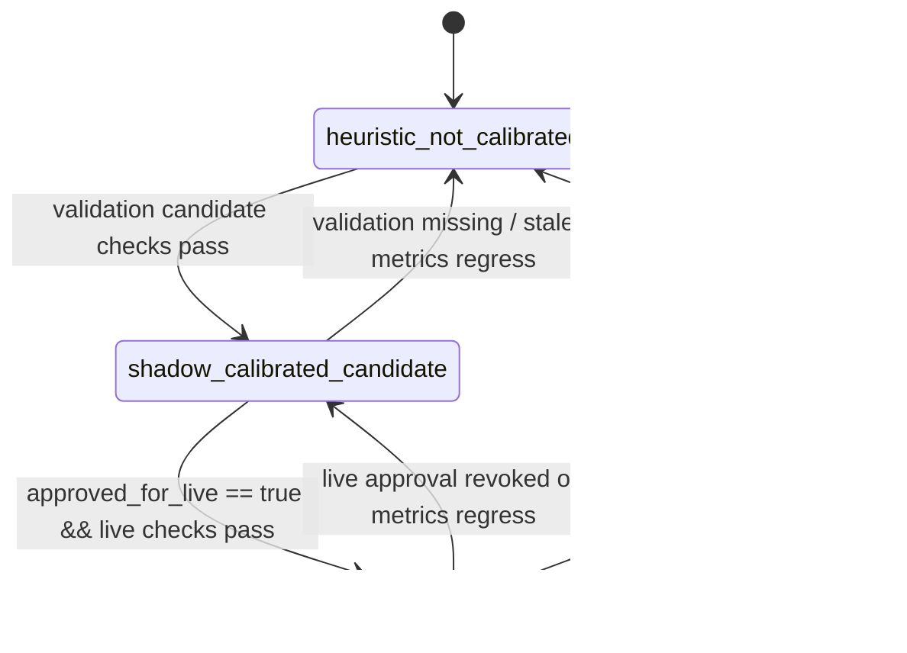

# AARS Polymarket Weather Trading Signal Design

版本：v0.2  
日期：2026-04-21

## 1. 目的

本文件定义跨模块信号与决策相关字段，重点是避免把 heuristic probability 误读为生产可执行概率。

当前设计目标：

- 明确信号是 `decision support` 还是 `execution eligible`
- 统一 dashboard / telegram / gateway 对概率状态的理解
- 保证 `manual_advisory` 与 `probability_mode` 语义不冲突

## 2. 核心信号对象

当前主链路中的信号相关对象包括：

- `ProbabilityState`
- `ProbabilityShadowReport`
- `ResolvedMarketRule`
- `Dashboard approval signal`
- `OrderIntent`
- `Manual advisory audit event`
- `TopParameterView`

## 2.1 Resolver Source Contract

从 Phase 18 开始，`ResolvedMarketRule` 也承担稳定 contract 的职责。当前关键字段包括：

- `required_data_source`
- `required_sources`
- `settlement_source_type`
- `official_vs_proxy_source`
- `source_match_grade`
- `official_source_url`
- `source_note`

建议语义：

| 字段 | 含义 |
|---|---|
| `official_vs_proxy_source` | 当前 resolver 认为结算源是 `official / proxy / fallback / unknown` |
| `source_match_grade` | 当前匹配精度，例如 `exact_station / family_exact / family_only / unmatched` |
| `required_sources` | 当前市场链路需要的关键输入源列表 |

这些字段必须被 dashboard 与 gate 直接消费，而不能只留在 resolver report 中。

`TopParameterView` 应作为 dashboard / telegram / gateway 的统一首屏载体，承载：

- `market_id`
- `market_question`
- `market_family`
- `polymarket` 盘口摘要
- `weather` / `forecast` 参数摘要
- `source_contract`
- `decision`

## 3. Probability Contract

### 3.1 当前字段

`ProbabilityState` 当前显式输出：

- `mode`
- `probability_contract`
- `contract_version=probability_contract.v1`
- `calibration_status`
- `probability_mode`
- `execution_constraint`
- `model_probability`
- `fair_value`
- `edge`
- `confidence_adjusted_edge`

### 3.2 当前默认值

Phase 14 当前默认使用：

```json
{
  "mode": "shadow",
  "contract_version": "probability_contract.v1",
  "calibration_status": "not_calibrated",
  "probability_mode": "heuristic_not_calibrated",
  "execution_constraint": "manual_advisory_only",
  "probability_contract": {
    "contract_version": "probability_contract.v1",
    "probability_mode": "heuristic_not_calibrated",
    "calibration_status": "not_calibrated",
    "execution_constraint": "manual_advisory_only",
    "model_id": null,
    "validation_ref": null
  }
}
```

### 3.3 当前 contract 状态

当前已经统一为三态：

- `heuristic_not_calibrated`
- `shadow_calibrated_candidate`
- `live_approved`

并让 `execution_constraint` 与之联动：

- `manual_advisory_only`
- `dry_run_only`
- `live_execution_allowed`

注意：

- `approved_for_live` 是 validation 侧的布尔输入，用来允许概率层进入 live promotion 候选。
- `live_approved` 是 `probability_mode` 的输出状态，表示概率层已经通过准入。
- 两者不应混为同一个字段。
- `execution_constraint` 只表示概率层允许到哪一步，不等于最终执行结果。

### 3.4 Phase 17 / Phase 21 概率契约状态机

Phase 17 已把 `probability_mode` 从静态字段提升成 validation-driven 状态机。Phase 21 已将其收口为 `probability_contract.v1`，由 comparison-engine、dashboard、Telegram、unified status 与 gateway live gate 共同消费。

注意：

- `approved_for_live` 是 validation 侧的输入条件，不是 `probability_mode` 的状态名。
- `live_approved` 才是 probability layer 最终输出的 live 准入状态。



当前实现来源：

- `validation_policy_v1`
- 代码位置：
  - `weather-comparison-engine/src/weather_comparison_engine/probability/contract_policy.py`
  - `weather-comparison-engine/src/weather_comparison_engine/validation/model_validation_report.py`
  - `weather-comparison-engine/src/weather_comparison_engine/probability/shadow_pipeline.py`

### 3.5 状态输入信号

状态机判断建议读取以下字段：

- `labeled_sample_count`
- `validation_metrics.brier_score`
- `validation_metrics.market_baseline_brier_score`
- `validation_metrics.calibration_error`
- `validation_metrics.roi_backtest`
- `resolver_quality.resolver_match_rate`
- `approved_for_live`
- `deployment_mode`
- `generated_at`

这些字段来自：

- `model_validation_report.json`
- `calibration_report.json`
- `monitoring_status.json`

### 3.6 迁移规则

#### A. `heuristic_not_calibrated -> shadow_calibrated_candidate`

建议最小条件：

- `labeled_sample_count` 达到候选阈值
- `calibration_error` 不高于候选阈值
- `resolver_match_rate` 不低于候选阈值
- validation report 存在且不 stale

迁移结果：

- `probability_mode=shadow_calibrated_candidate`
- `execution_constraint=dry_run_only`
- 允许 dashboard / telegram 显示更强信号，但仍不能 live 自动执行

#### B. `shadow_calibrated_candidate -> live_approved`

建议最小条件：

- `approved_for_live=true`
- `deployment_mode=live`
- `labeled_sample_count` 达到 live 阈值
- `calibration_error` 不高于 live 阈值
- `brier_score <= market_baseline_brier_score`
- `roi_backtest >= live ROI 阈值`
- `resolver_match_rate` 达到 live 阈值

迁移结果：

- `probability_mode=live_approved`
- `execution_constraint=live_execution_allowed`
- 仅表示概率层契约允许进入 live gate，不代表 gateway 必然执行

#### C. 回退规则

回退必须显式支持，避免系统只会升级不会降级：

- candidate report 丢失、过期或指标恶化时：
  - `shadow_calibrated_candidate -> heuristic_not_calibrated`
- live approval 被撤销、validation 失效或 resolver quality 回落时：
  - `live_approved -> shadow_calibrated_candidate`
  - 严重时直接 `live_approved -> heuristic_not_calibrated`

### 3.7 状态与执行约束映射

| probability_mode | 含义 | execution_constraint | 可允许动作 |
|---|---|---|---|
| `heuristic_not_calibrated` | 纯 heuristic，可读但不可当成生产概率 | `manual_advisory_only` | dashboard / telegram 提示，人工判断 |
| `shadow_calibrated_candidate` | 已有一定验证基础，但仍不进入 live execution | `dry_run_only` | pending intent、dry-run gateway、operator 审核 |
| `live_approved` | 概率层通过校准与验证准入 | `live_execution_allowed` | 进入 execution gate 下一层判断 |

### 3.8 状态机边界

即便进入 `live_approved`，也不意味着系统一定自动下单。仍需继续通过：

- monitoring freshness
- unified status block reasons
- execution gateway production readiness
- approval / policy / whitelist / exposure limits

因此：

- `probability_mode` 只解决“概率层是否具备更高可信度”
- `execution_constraint` 只定义“概率层允许到哪一步”
- 真正执行仍受 authorization / gateway / policy 多层 gate 约束

### 3.9 当前样例运行结果解释

当前样例环境中，状态机大概率会停留在：

- `probability_mode=heuristic_not_calibrated`
- `execution_constraint=manual_advisory_only`

这不是失败，而是保护性行为。当前主要原因通常包括：

- `model_validation_report.json` stale
- `labeled_sample_count` 不足
- `resolver_match_rate` 偏低

因此：

- 状态机不应被设计成“只会升级”
- 在真实 validation 条件不达标时，必须明确回退
- dashboard / telegram / unified status 都应展示回退原因，而不是伪装成候选或 live 状态

## 4. Telegram / Dashboard Approval Signal

Dashboard 写入 Telegram 审批信号时，当前必须包含：

- `execution_mode=manual_advisory`
- `manual_order_required=true`
- `autonomous_execution_allowed=false`
- `probability_mode`
- `execution_constraint`
- `probability_contract`
- `manual_trade_ticket`
- `approval_context`

这意味着：

- 审批是 operator review，不是自动交易授权
- probability contract 会跟着信号一起走，避免上下游语义漂移

## 5. OrderIntent Contract

当前 `OrderIntent` 已携带：

- `schema_version=execution_intent.v1`
- `decision_ref`
- `authorization_ref`
- `contract_version=probability_contract.v1`
- `probability_contract`
- `probability_mode`
- `execution_constraint`

Gateway 已同时强制检查 execution intent contract 与 probability contract：

- execution intent contract 缺失（schema/version/ref 不完整）会被 `execution_intent_contract_invalid` 阻断
- live-enabled 路径仍要求 `live_approved + live_execution_allowed + calibrated`
- manual advisory / dry-run 仍保持保守边界

## 6. 当前边界

- 当前系统默认仍以 `heuristic_not_calibrated` 为主
- Phase 17 已把上述状态机接入 validation report 与 realtime worker
- Phase 21 已把 `ProbabilityContract` 接入 gateway live gate
- Telegram 消费并展示 contract，但不单独决定交易

## 7. 下一步建议

优先级：

1. 继续把 Unified Status Contract 变成 compact gate / authorization gate / gateway risk gate 的共同输入
2. 将 Resolver Registry / Source Registry / Band Scheme Registry 继续中心化

## 8. Gate Stack / Ops Bridge Signal 增补

### 8.1 Gate Stack API Contract

当前新增稳定信号对象：

- `gate_stack_api.v1`
- `gate_stack_automation_summary.v1`
- `gate_stack_ops_alert.v1`
- `telegram_ops_notification.v1`

其中：

- `gate_stack_api.v1` 是跨 dashboard / telegram / gateway 的共享 gate 语义层
- `automation_summary.v1` 是调度器直接消费的轻量判定层
- `ops_alert.v1` 是运行时 red 告警事件层
- `telegram_ops_notification.v1` 是通知分发队列层

### 8.2 Runtime Exit Signal

`run-gate-stack-automation-check` 当前输出退出码语义：

- `0`: 未命中阈值
- `2`: 命中阈值（`fail-on-signal` 指定）

这意味着外部调度器可以不解析完整 payload，也能稳定做执行分支。

### 8.3 通知队列生命周期信号

notification queue 状态机：

```text
pending -> sent -> acked
```

状态字段建议：

- `status`
- `sent_at`
- `acked_at`
- `acked_by`
- `dedupe_key`

### 8.4 当前边界说明

- 该信号层只负责“状态与事件合同”，不直接决定交易策略。
- gateway 仍是唯一执行解释者。
- telegram bridge 当前已完成 queue 与回执状态流转，但是否推送到最终运营群仍由部署策略决定。
