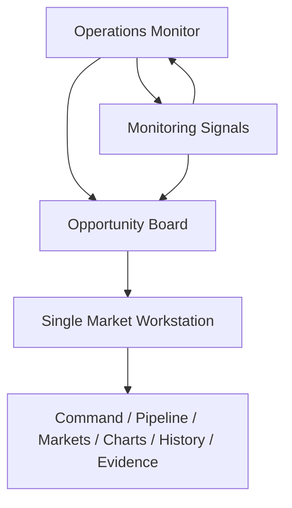
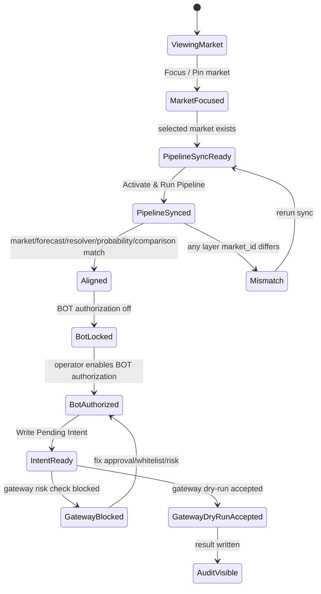

# AARS Polymarket Weather Trading Console UI Design 状态与路线图

版本：v0.3  
日期：2026-04-24  
设计定位：深色工业 HMI 监控台、实时扫描指挥台、证据与执行分层工作台

关联文档：

- [AARS_Polymarket_Weather_Trading_Architecture.md](./AARS_Polymarket_Weather_Trading_Architecture.md)
- [AARS_Polymarket_Weather_Trading_Functional_Requirements.md](./AARS_Polymarket_Weather_Trading_Functional_Requirements.md)
- [AARS_Polymarket_Weather_Trading_Detailed_Design.md](./AARS_Polymarket_Weather_Trading_Detailed_Design.md)
- [AARS_Polymarket_Weather_Trading_Implementation_Plan_Status.md](./AARS_Polymarket_Weather_Trading_Implementation_Plan_Status.md)
- [AARS_Polymarket_Weather_Trading_UI_Legend_Spec.md](./AARS_Polymarket_Weather_Trading_UI_Legend_Spec.md)

---

## 1. UI 设计目标

当前 UI 不是普通 dashboard，而是一个面向 Polymarket 天气 / 气候市场的安全关键 HMI 控制台。

它必须同时服务四类认知任务：

| 任务 | 操作员问题 | UI 应答 |
|---|---|---|
| 系统态势 | 系统整体是否健康，是否需要先看监控面 | Operations Monitor、Scanner Status、Alert Queue |
| 市场态势 | 当前最值得盯的是哪些市场 | Focus Markets、Opportunity Board、Market Monitor Grid |
| 证据论证 | resolver / forecast / observation 为什么支持或不支持该市场 | Single Market Workstation、Resolver Status、Validation Compare |
| 授权执行 | 当前条件下 BOT 能不能动 | Execution Gate、Operator Closure、Gateway Dry-Run |

核心设计原则：

1. 首屏回答关键状态，深层证据进入折叠区、drawer 或 secondary tab。
2. 动态数据局部刷新，避免全页面闪烁。
3. UI 选择必须驱动数据链路，而不只是改变前端展示。
4. 所有 execution 相关按钮必须显示风控语义，不制造“可直接下单”的错觉。
5. Probability Shadow 必须持续标注 heuristic / not calibrated。
6. 状态灯优先于长表格，表格只用于审计和深层检查。
7. 一屏优先，默认视图应尽量容纳监控、风险、下一步动作。
8. 颜色只表达状态，不表达装饰。

---

## 2. 当前视觉方向

当前 UI 采用“安全关键深色工业 HMI”风格。

| 维度 | 当前方向 | 状态 |
|---|---|---|
| 色彩 | 深黑底、钢灰卡片、低饱和蓝 / 琥珀 / 红 / 黄 状态线 | Done |
| 字体 | Condensed 标题 + 高对比正文 + 更大字号的监控值 | Done |
| 密度 | 比传统 Streamlit 更紧凑，但首屏要求一屏可监控 | Done |
| 结构 | 顶部态势条 + 中部监控面 + 右侧操作/警告栏 + 底部详情抽屉 | Done |
| 交易台感 | watchlist 卡片、状态灯、gateway gate、dry-run result | Done |
| 运维感 | scanner / queue / alert / ops heartbeat | Done |
| 品牌签名 | 页脚署名已移除，界面保持中性 | Done |
| 实时性 | 页面带心跳和自动刷新提示 | Done |

当前设计风格关键词：

```text
dark industrial
safety-critical HMI
trading cockpit
operations monitor
evidence console
one-screen monitoring
```

### 2.1 图例规范

UI 的状态颜色与数据质量标记统一由下列规范驱动：

- `LIVE`：实时更新中。
- `STALE`：值已变旧，需要关注刷新。
- `ALERT`：市场告警，需要立即注意。
- `ANOM`：安全黄色异常，需要复核。
- `BLOCKED`：被规则、验证或 gate 阻断。
- `B`：字段级数据质量差，品红色标记。

详细定义见：

- [AARS_Polymarket_Weather_Trading_UI_Legend_Spec.md](./AARS_Polymarket_Weather_Trading_UI_Legend_Spec.md)

---

## 3. 页面信息架构

当前页面结构已经从“单页 tab 拼装”升级为“运营监控台 + 单市场工作台 + 机会发现层”的三层结构：



页面首屏优先展示：

- 全局扫描态
- 重点关注市场
- 最新告警 / 异常 / gate block
- 当前操作建议
- 心跳 / 刷新 / 数据质量

---

## 4. 页面与 Tab 设计状态

### 4.1 Operations Monitor

定位：Dashboard 首页与一级入口，用于实时扫描态势总控。

| 区块 | 作用 | 状态 |
|---|---|---|
| Global Operations Strip | markets scanned、fresh ratio、alert markets、gate blocked、ops alerts | Done |
| Focus Markets Strip | 重点关注市场、pin / unpin、优先监控位 | Done |
| Multi-Market Monitor Grid | 多市场卡片、状态、动作 | Done |
| System Health / Ops Rail | scanner、queue、source、delivery、ops alert | Done |
| Selected Market Quick Detail Drawer | 轻量详情、快速跳转 workstation | Done |

当前体验评价：

- 优点：打开即见扫描态，不需要进 tab 才能看系统健康。
- 优点：重点市场自动抬升为 focus market。
- 风险：市场卡片过多时仍需保持一屏优先，长列表应折叠。
- 下一步：继续压缩首屏信息密度，避免向下滚动。

### 4.2 Monitoring Signals

定位：扫描结果、告警和异常的只读监测面。

| 区块 | 作用 | 状态 |
|---|---|---|
| Scanner Status | 扫描池、fresh / stale、priority mix | Done |
| Universe Snapshot | market universe 概览 | Done |
| Evidence Scan | 标准化证据快照 | Done |
| Alert Queue | market alert / family anomaly / ops alert | Done |

当前体验评价：

- 优点：适合快速看扫描是否健康。
- 风险：不应替代 Operations Monitor 作为首页。
- 下一步：只保留只读监控语义，不承载执行说明。

### 4.3 Opportunity Board

定位：先看哪个市场的机会发现层。

| 区块 | 作用 | 状态 |
|---|---|---|
| Opportunity Summary | overall opportunity / difficulty / freshness | Done |
| Market Rows | 市场优先级排序 | Done |
| Row Preview | score breakdown、best model、action | Done |
| City / Family Drill-down | 机会钻取 | Done |
| Open Workstation | 跳转单市场工作台 | Done |

当前体验评价：

- 优点：进入单市场前先筛市场，减少无效切换。
- 风险：分数只能作为优先级建议，不能变成 gate。

### 4.4 Single Market Workstation

定位：统一单市场工作台，一屏审查参数、证据、异常、gate、validation。

| 区块 | 作用 | 状态 |
|---|---|---|
| Top Parameter Ribbon | 参数、盘口、天气、source contract、decision | Done |
| Rule / Source / Model Panel | rule、source、best model、difficulty | Done |
| Evidence Timeline | market / forecast / observation / event markers | Done |
| Validation / Compare Panel | validation、coverage、promotion | Done |
| Gate / Advisory / Dry-run Panel | gate summary、advisory、dry-run actions | Done |

当前体验评价：

- 优点：能在一个页面内完成完整审查。
- 风险：信息量高，需严格控制首屏只显示最关键字段。

### 4.5 Command / Pipeline / Markets / Charts / History / Evidence

这些 tab 仍然保留，但定位已更明确：

| Tab | 当前定位 | 状态 |
|---|---|---|
| Command | 操作员决策闭环、BOT 授权、State Machine Controls | Done / 仍需继续压缩 |
| Pipeline | 诊断入口、链路同步、comparison / probability / resolver 解释 | Done |
| Markets | 搜索、watchlist、pin / focus / remove | Done |
| Charts | 传统图表与表格分析 | Done |
| History | 历史 comparison / timeline 追踪 | Done |
| Evidence / Raw | 审计、原始数据、低频检查 | Done |

### 4.6 Command Tab

定位：当前市场的操作员决策闭环，含 State Machine Controls、BOT 授权与执行干跑。

当前体验评价：

- 优点：能在一个 tab 内回答“能不能动”。
- 优点：resolver panel 能直接显示 `official / proxy / fallback` 与 `source match grade`。
- 风险：Command tab 内容仍偏多，需要进一步压缩面板高度。
- 下一步：把 Execution Gate 和 Alignment Audit 合并为一个更紧凑的 Gate Stack。

### 4.7 Pipeline Tab

定位：诊断入口、链路同步、comparison / probability / resolver 解释。

当前体验评价：

- 优点：非常适合排查 selected market 与 forecast mismatch。
- 优点：resolver source contract 现在已进入 alignment warning，可直接暴露 `family_only / fallback`。
- 风险：pipeline sync 与 markets tab sync 存在重复入口。
- 下一步：保留 Pipeline tab 作为诊断入口，Markets tab 只保留轻量 sync。

### 4.8 Markets Tab

定位：市场搜索、watchlist 管理、market focus 控制。

当前体验评价：

- 优点：已从普通列表升级为交易台式 watchlist。
- 风险：Gamma API 在本机 SSL 环境下可能失败，仍需 fallback 和证书修复说明。
- 下一步：增加 family filter、resolver status filter、edge filter 的横向筛选条。

### 4.9 Charts Tab

定位：传统图表和表格分析区。

当前体验评价：

- 优点：保留原 dashboard 分析能力。
- 风险：历史赔率 vs forecast / official value 关系还不够显性。
- 下一步：升级成 Market Evidence Chart，以同一时间轴绘制 odds、forecast、official / resolver value。

### 4.10 History Tab

定位：历史 comparison 和 odds / forecast 关系追踪。

当前体验评价：

- 优点：已有 comparison history 的基本可视化。
- 风险：缺少标准 feature store 和 official outcome label，训练验证能力不足。
- 下一步：接入历史 feature store 后重构该 tab。

### 4.11 Evidence / Raw Tab

定位：审计、原始数据、低频检查。

当前体验评价：

- 优点：方便 debug。
- 风险：普通操作员不应频繁进入此 tab。
- 下一步：保留为 developer / audit 视图，默认折叠更多 raw 内容。

---

## 5. 核心组件状态

| 组件 | 文件 | 状态 | 后续动作 |
|---|---|---|---|
| Operations Monitor | `ui/operations_monitor_page.py` | Done | 继续压缩首屏，保持一屏监控 |
| Monitoring Signals | `ui/monitoring_signals_panel.py` | Done | 保持只读监控语义 |
| Opportunity Board | `ui/opportunity_board_panel.py` | Done | 继续强化 drill-down 解释 |
| Market Workstation | `ui/market_workstation_page.py` | Done | 保持工作台结构稳定 |
| Architecture Console | `ui/architecture_console.py` | Done | 继续压缩高度 |
| Market Watchlist | `ui/market_snapshots_panel.py` | Done | 增加筛选条 |
| Recent Markets | `ui/recent_markets_panel.py` | Done | 支持 remove recent |
| Data Alignment Audit | `ui/data_alignment_panel.py` | Done | 与 Execution Gate 合并摘要 |
| Execution Gate | `ui/execution_gate_panel.py` | Done | 接 Telegram approval status |
| Probability Shadow | `ui/probability_shadow_panel.py` | Done | 后续可增加 sparkline / edge badge |
| Resolver Status | `ui/resolver_status_panel.py` | Done | 增加 coverage by family |
| Live Status | `ui/live_status_panel.py` | Done | 进一步紧凑化 |
| Trade Decision | `ui/trade_decision_panel.py` | Done | 分离 heuristic 和 calibrated model |
| Command Center | `ui/command_center.py` | Done / Phase 20 | 继续压缩 State Machine Controls |

---

## 6. 当前 UI 已解决的问题

| 历史问题 | 当前处理方式 | 状态 |
|---|---|---|
| 页面只显示标题 / 正文空白 | 禁用默认全局 theme，外部请求不阻塞首屏 | Done |
| 全页面实时刷新体验差 | 改为数据刷新按钮和局部 fragment | Done |
| UI selected market 与 comparison market 错位 | Activate & Run Pipeline + Data Alignment Audit | Done |
| forecast 仍停留旧 market | 新增 forecast once 到 pipeline sync | Done |
| Add to list 不持久化 | watchlist overrides JSON | Done |
| pinned 无法取消 | Pin / Unpin / Clear Pin 状态统一 | Done |
| remove 后刷新又出现 | removed watchlist JSON | Done |
| Execution 授权只是文案 | pending intent + gateway dry-run | Done |
| Gateway blocked 原因不透明 | dry-run result 回显 approval/risk/execution | Done |
| Probability Shadow 只看单 market | probability shadow report | Done |
| 白底白字 / 默认 Streamlit 风格 | 深色 HMI theme + compact panel token | Done |
| 图例状态不统一 | LIVE / STALE / ALERT / ANOM / BLOCKED / B | Done |
| 数据质量不显性 | 品红 `B` 质量徽标 | Done |

---

## 7. 当前 UI 仍存在的问题

| 问题 | 影响 | 优先级 |
|---|---|---|
| Command tab 仍有较多纵向内容 | 一屏内信息密度还可提升 | P0 |
| Pipeline tab 和 Markets tab 的 sync 入口重复 | 操作路径可能让用户困惑 | P1 |
| Gamma Search 受本地 SSL 影响 | 搜索体验不稳定 | P1 |
| Historical odds vs forecast 图不够强 | 训练验证可视化不足 | P0 |
| DEV ONLY harness 与正式 gate 混在同一组件 | 长期需拆分 dev / production mode | P1 |
| UI 状态与 worker 健康状态未统一 | 不容易判断后台 worker 是否在跑 | P1 |
| Probability Shadow 缺少校准状态趋势 | 用户可能误读 heuristic | P0 |
| mobile 适配不是重点但仍较弱 | 小屏查看不理想 | P2 |
| Operations Monitor 首屏仍需继续压缩 | 大屏优先但一屏密度还可优化 | P1 |
| State Machine Controls 仍需进一步深色化与减噪 | 部分 Streamlit 原生控件易冒白底 | P0 |

---

## 8. 推荐 UI 后续路线图

### UI Phase A: Command Tab 压缩与 Gate Stack 合并

状态：Next

目标：

- 把 `Data Alignment Audit` 和 `Execution Gate` 合并为一个 compact gate stack。
- 顶部只显示 5 个灯：Market、Forecast、Resolver、Probability、Execution。
- 详细 JSON 和 blockers 放入 expander。

验收标准：

| 标准 | 目标 |
|---|---|
| 首屏高度 | Command tab 无需大幅滚动即可看到核心状态 |
| 状态灯 | 5 个核心 gate 一眼可读 |
| 执行语义 | `BLOCKED / READY / DRY-RUN` 清晰 |

### UI Phase B: Market Watchlist Trading Desk

状态：Next

目标：

- Watchlist 更像交易台行情列表。
- 增加 family、resolver status、edge、freshness 筛选。
- 增加 pinned group 和 blocked group。

建议布局：

```text
Markets
├─ Search / Add
├─ Filter bar: family | resolver | edge | freshness
├─ Pinned markets
├─ Active shadow edges
├─ Blocked resolver markets
└─ Hidden / removed manager
```

验收标准：

| 标准 | 目标 |
|---|---|
| 搜索结果 | 能加入 watchlist 并立即 focus |
| 删除 | remove 后可从 hidden manager 恢复 |
| 分组 | pinned / active edge / blocked 清晰 |
| 筛选 | 可按 family 与 resolver status 快速定位 |

### UI Phase C: Model Validation Tab

状态：Next after feature store

目标：

- 为训练验证提供主 UI。
- 显示 odds history、forecast history、official outcome、calibration。

建议布局：

```text
Model Validation
├─ Training sample coverage
├─ Historical odds vs forecast chart
├─ Calibration buckets
├─ Brier / log loss / hit rate
├─ Edge decile performance
└─ Family-level model quality
```

验收标准：

| 标准 | 目标 |
|---|---|
| 样本覆盖 | 每个 market family 有样本数量 |
| 校准 | 可看到 predicted probability vs observed frequency |
| 历史关系 | odds / forecast / official value 同轴展示 |
| 风险提示 | 明确标注 shadow / calibrated / live 状态 |

### UI Phase D: Worker Health and Monitoring

状态：Pending

目标：

- 让 operator 知道后台 worker 是否还在跑。
- 展示 market worker、weather poller、comparison worker、dashboard freshness。

建议状态卡：

| Worker | 指标 |
|---|---|
| Polymarket Realtime | snapshot age, asset count, last event type |
| Weather Realtime | forecast age, market_id, source mode |
| Resolver Once / Report | generated_at, matched/unmatched |
| Probability Shadow | generated_at, active/blocked |
| Comparison Worker | latest row age, history appended |
| Execution Gateway | last dry-run result, risk status |

### UI Phase E: Production Execution UX

状态：Pending / Blocked

目标：

- 将 DEV ONLY harness 从生产 UI 中剥离。
- 生产 UI 只显示正式 approval、risk gate、kill switch、position exposure。

生产 UI 必须包含：

| 区块 | 说明 |
|---|---|
| Approval status | Telegram / operator approval 是否有效 |
| Risk gate status | whitelist, exposure, kill switch, slippage |
| Position exposure | 当前 market / total exposure |
| Execution mode | disabled, dry_run, live |
| Audit trail | signal -> approval -> intent -> execution result |

生产前禁止：

- 禁止将 `DEV: Create Local Approval` 暴露在 production mode。
- 禁止 dashboard 直接调用真实 execution client。
- 禁止未校准 probability 自动触发 live order。

---

## 9. UI 状态机



---

## 10. UI 验收清单

| 检查项 | 当前状态 |
|---|---|
| 页面打开不空白 | Passed |
| 顶部标题不遮挡 | Passed |
| 全局自动刷新不打断使用 | Passed |
| Operations Monitor 作为首页 | Passed |
| Market Watchlist 可搜索 / 添加 / focus / pin / remove | Passed |
| Pipeline sync 会刷新 forecast | Passed |
| Data Alignment 能发现 mismatch | Passed |
| Probability Shadow Report 可见 | Passed |
| Execution Gate 可写 pending intent | Passed |
| Gateway Dry-Run Check 可回显结果 | Passed |
| 图例状态统一 | Passed |
| 数据质量标记 B 可见 | Passed |
| 历史赔率 vs forecast 深度图 | Partial |
| Model Validation tab | Pending |
| Worker health monitor | Done |
| Production execution UX | Pending |

---

## 11. 当前 Dashboard 首页约定

当前 Dashboard 的首页应以 `Operations Monitor` 为默认入口，页面打开后优先看到：

1. 系统整体健康摘要。
2. 扫描 / 队列 / 告警 / gate 的横向态势条。
3. Focus Markets。
4. Multi-Market Monitor Grid。
5. Selected Market Quick Detail Drawer。

首页视觉要求：

- 一屏优先，默认不依赖下滑。
- 文字必须明显压住背景。
- 状态色只服务语义，不做装饰。
- 告警用红色，异常用安全黄色，数据质量差用品红 `B`。

页面级实时更新要求：

- `Operations Monitor`：应显示 heartbeat，刷新频率最高。
- `Monitoring Signals`：用于扫描 / 告警只读面。
- `Opportunity Board`：用于市场优先级排序。
- `Single Market Workstation`：用于单市场证据审查与 gate 审查。

---

## 12. Phase 23 UI / 通知桥接补充

当前新增的运行时告警链路对 UI / 控制台的影响：

1. 状态展示层  
   - compact gate stack 已展示 `gate_source`、`severity`、`recommended_operator_action`
2. 通知桥接层  
   - `gate_stack_ops_alerts.jsonl` -> `telegram_ops_notifications.jsonl`
3. 通知生命周期层  
   - `pending -> sent -> acked`

建议 UI / Bot 下一步：

- 在 Telegram 命令层增加 ops 通知查询（最近 N 条 pending / sent）。
- 在 dashboard 增加 ops alert 最近事件小卡（只读）。
- 增加同 market + reason 的告警冷却可视化，避免告警风暴。

---

## 13. UI Runtime Architecture Refactor v1

本节正式承接 [AARS_Polymarket_Weather_Trading_UI_Runtime_Architecture.md](./AARS_Polymarket_Weather_Trading_UI_Runtime_Architecture.md)，将 UI 从“页面功能堆叠”升级为“页面角色清晰、导航关系明确、状态图例统一、动态参数受治理、前端只渲染 view contract”的运行时架构。

### 13.1 页面角色总表

| 页面 | 新定位 | 核心问题 | 不应承担 |
|---|---|---|---|
| Operations Monitor | 运行总控台 | 现在系统与市场是否异常？ | 不做机会排序主入口，不做证据深挖 |
| Monitoring Signals | 信号与告警流 | 当前有哪些 alert / anomaly / ops signal？ | 不做多市场总控，不做执行 |
| Opportunity Board | 机会排序与候选研究入口 | 接下来优先研究哪些市场？ | 不做实时监控，不做执行 |
| Workstation | 单市场深度分析工作台 | 单个市场证据是否支持判断？ | 不做多市场管理，不做授权闭环 |
| Command | 操作员动作闭环与授权控制 | 下一步动作是否允许、如何确认并留痕？ | 不做证据深挖，不做市场池管理 |
| Pipeline | 数据管道与处理流程诊断 | 数据链路是否健康？ | 不做市场机会排序，不做操作员决策 |
| Markets | 市场池与 watchlist 管理 | 系统正在管理哪些市场？ | 不做机会排序，不做实时告警 |
| Charts | 趋势与可视化分析 | 历史趋势和关系如何？ | 不做实时处理，不做原始证据审计 |
| History | 事件回放与审计 | 什么时候发生了什么？ | 不做实时决策 |
| Evidence / Raw | 原始证据与数据血缘 | 数据从哪里来、如何转化？ | 不做 operator 主判断 |

### 13.2 左侧导航分组

```text
RUN
- Operations Monitor
- Monitoring Signals
- Command

RESEARCH
- Opportunity Board
- Workstation
- Charts

DATA
- Pipeline
- Markets
- Evidence / Raw
- History

SETTINGS
- Alerts & Rules
- Data & Sources
- System
```

### 13.3 Opportunity Board 与 Command 新定位

`Opportunity Board` 不再承担多市场监控职责，而是机会排序与候选研究入口。它以排名表、分数解释、研究动作入口为主，不显示 scanner health、ops alert list、full gate stack 或 raw evidence。

`Command` 不再承担监控或深度证据职责，而是操作员动作闭环与授权控制台。它只负责 selected market、compact gate stack、下一步动作、ack / mute / pending intent / dry-run 与 audit trail。

### 13.4 后续 UI Roadmap Phase

| Phase | 名称 | 目标 |
|---|---|---|
| Phase 32 | Operations Monitor v3.1 UI Refactor | 固化 primary_state、Focus 去重复、Quick Detail 横条化、右栏状态灯矩阵化、红色强度分级 |
| Phase 33 | Navigation & Page Contract Alignment | 重构左侧导航分组，统一页面间按钮跳转逻辑，所有页面读取统一 view contract |
| Phase 34 | Legend & Dynamic Parameter Governance | 统一图例、颜色、动态字段来源，防止前端自算状态 |
| Phase 35 | Surface Consistency: Dashboard / Telegram / CLI | Dashboard 与 Telegram 读取同一 view contracts，命令行为与页面按钮一致，审计事件统一 |
