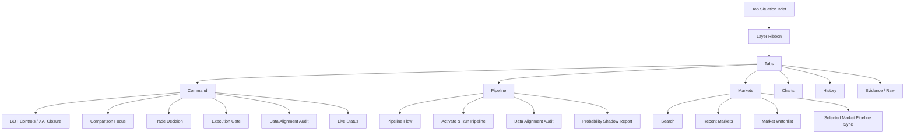
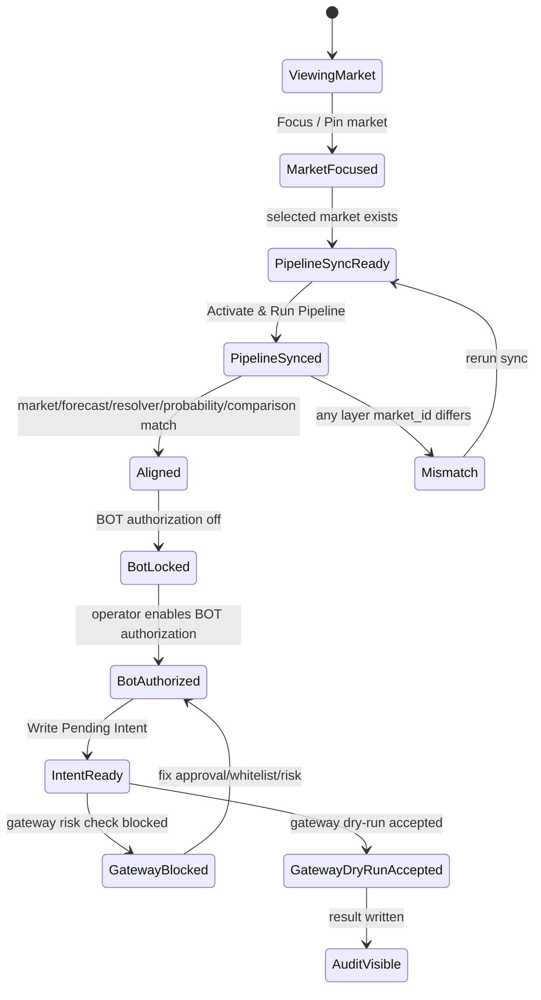

# AARS Polymarket Weather Trading Console UI Design 状态与路线图

版本：v0.2  
日期：2026-04-17  
设计定位：轻量工业交易台、证据论证控制台、BOT 授权与执行干跑工作台

关联文档：

- [AARS_Polymarket_Weather_Trading_Architecture.md](./AARS_Polymarket_Weather_Trading_Architecture.md)
- [AARS_Polymarket_Weather_Trading_Functional_Requirements.md](./AARS_Polymarket_Weather_Trading_Functional_Requirements.md)
- [AARS_Polymarket_Weather_Trading_Detailed_Design.md](./AARS_Polymarket_Weather_Trading_Detailed_Design.md)
- [AARS_Polymarket_Weather_Trading_Implementation_Plan_Status.md](./AARS_Polymarket_Weather_Trading_Implementation_Plan_Status.md)

---

## 1. UI 设计目标

当前 UI 的目标不是普通 dashboard，而是一个面向 Polymarket 天气 / 气候市场的操作台。

它必须同时服务三类认知任务：

| 任务 | 操作员问题 | UI 应答 |
|---|---|---|
| 市场态势 | 我现在看的是哪个市场，盘口是什么 | Market Focus, Live Status, Watchlist |
| 证据论证 | resolver / forecast 为什么支持或不支持该市场 | Resolver Status, Data Alignment Audit, Probability Shadow |
| 授权执行 | 当前条件下 BOT 能不能动 | Execution Gate, Operator Closure, Gateway Dry-Run |

核心设计原则：

1. 首屏回答关键状态，深层证据进入 tab 或 expander。
2. 动态数据局部刷新，避免全页面闪烁。
3. UI 选择必须驱动数据链路，而不只是改变前端展示。
4. 所有 execution 相关按钮必须显示风控语义，不制造“可直接下单”的错觉。
5. Probability Shadow 必须持续标注 heuristic / not calibrated。
6. 状态灯优先于长表格，表格只用于审计和深层检查。

---

## 2. 当前视觉方向

当前 UI 采用“浅色工业交易台”风格。

| 维度 | 当前方向 | 状态 |
|---|---|---|
| 色彩 | 浅色底、暖白卡片、墨绿 / 琥珀 / 红色状态线 | Done |
| 字体 | Condensed 标题 + 较紧凑正文梯度 | Partial |
| 密度 | 比传统 Streamlit 更紧凑，使用 tabs 和 cards 控制页面高度 | Done |
| 结构 | 顶部扁平总览 + tab 工作区 + 局部动态面板 | Done |
| 交易台感 | watchlist 卡片、状态灯、gateway gate、dry-run result | Done |
| 品牌签名 | `Created By Deerflow` 已由现有 command center 模块承载 | Done |

当前设计风格关键词：

```text
light industrial
trading cockpit
evidence console
operator control desk
dry-run risk gate
```

---

## 3. 页面信息架构

当前页面结构：



---

## 4. Tab 设计状态

### 4.1 Command Tab

定位：当前市场的操作员决策闭环。

| 区块 | 作用 | 状态 |
|---|---|---|
| BOT Controls / XAI Closure | 规程步骤、XAI 层、BOT 授权、动作日志 | Done, 默认折叠 |
| Comparison Focus | 市场、盘口、forecast、comparison 三栏聚焦 | Done |
| Trade Decision | heuristic 交易建议与反向概率 | Done |
| Execution Gate | Data/Auth/Whitelist/Gateway 四闸门 | Done |
| Data Alignment Audit | market input / forecast / resolver / probability / comparison 状态灯 | Done |
| Live Status | Polymarket snapshot 与 forecast snapshot | Done |
| Resolver Status | 当前 market 的 resolver rule + source contract + official URL | Done |

当前体验评价：

- 优点：能在一个 tab 内回答“能不能动”。
- 优点：resolver panel 现在能直接显示 `official / proxy / fallback` 与 `source match grade`。
- 风险：Command tab 内容仍偏多，需要进一步压缩面板高度。
- 下一步：把 Execution Gate 和 Alignment Audit 合并为一个更紧凑的 Gate Stack。

---

### 4.2 Pipeline Tab

定位：解释系统为什么给出当前状态，展示数据链路是否贯通。

| 区块 | 作用 | 状态 |
|---|---|---|
| Pipeline Flow | market -> resolver -> probability -> comparison -> execution | Done |
| Activate & Run Pipeline | 激活当前 market 并刷新 resolver / forecast / probability / comparison | Done |
| Data Alignment Audit | 显式检查每层 market_id 是否一致 | Done |
| Probability Shadow | 单 market fair value / edge | Done |
| Probability Shadow Report | watchlist 级别 active / blocked / top edges | Done |
| Live Status | 当前 market 与 forecast raw snapshot | Done |

当前体验评价：

- 优点：非常适合排查 selected market 与 forecast mismatch。
- 优点：resolver source contract 现在已进入 alignment warning，可直接暴露 `family_only / fallback`。
- 风险：pipeline sync 与 markets tab sync 存在重复入口。
- 下一步：保留 Pipeline tab 作为诊断入口，Markets tab 只保留轻量 sync。

---

### 4.3 Markets Tab

定位：市场搜索、watchlist 管理、market focus 控制。

| 区块 | 作用 | 状态 |
|---|---|---|
| Gamma Search | 从 Polymarket Gamma API 搜索市场 | Partial |
| Add to list | 搜索结果加入 watchlist 并持久化 | Done |
| Recent Markets | 显示最近选择时间和命中来源 | Done |
| Watchlist Cards | 按 family 分组展示 market | Done |
| Focus / Pin / Unpin / Remove | 控制当前 market 和 watchlist 状态 | Done |
| Hidden list | remove 后持久隐藏 | Done |

当前体验评价：

- 优点：已从普通列表升级为交易台式 watchlist。
- 风险：Gamma API 在本机 SSL 环境下可能失败，仍需 fallback 和证书修复说明。
- 下一步：增加 family filter、resolver status filter、edge filter 的横向筛选条。

---

### 4.4 Charts Tab

定位：传统图表和表格分析区。

| 区块 | 作用 | 状态 |
|---|---|---|
| Overview | 当前 filtered dashboard rows 概览 | Done |
| Comparison Table | 行级 comparison 表格 | Done |
| Signal Panel | signal payload 摘要 | Done |
| Divergence Chart | 当前 divergence 图 | Done |
| Timeseries Panel | model value / gap / market probability 时间序列 | Partial |

当前体验评价：

- 优点：保留原 dashboard 分析能力。
- 风险：历史赔率 vs forecast / official value 关系还不够显性。
- 下一步：升级成 Market Evidence Chart，以同一时间轴绘制 odds、forecast、official / resolver value。

---

### 4.5 History Tab

定位：历史 comparison 和 odds / forecast 关系追踪。

| 区块 | 作用 | 状态 |
|---|---|---|
| Divergence Trend | confidence_adjusted_gap 趋势 | Done |
| Timeline Panel | market drill-down timeline | Done |
| History Relationship | 历史赔率与 forecast 关系图初版 | Partial |

当前体验评价：

- 优点：已有 comparison history 的基本可视化。
- 风险：缺少标准 feature store 和 official outcome label，训练验证能力不足。
- 下一步：接入 Phase 7 historical feature store 后重构该 tab。

---

### 4.6 Evidence / Raw Tab

定位：审计、原始数据、低频检查。

| 区块 | 作用 | 状态 |
|---|---|---|
| Bias Summary | forecast bias 指标 | Done |
| Rule / Station Info | rulebook / station detail | Done |
| Raw JSON Panel | signal, bundle, rulebook, market snapshots | Done |
| Market Bundles | market metadata | Done |

当前体验评价：

- 优点：方便 debug。
- 风险：普通操作员不应频繁进入此 tab。
- 下一步：保留为 developer / audit 视图，默认折叠更多 raw 内容。

---

## 5. 核心组件状态

| 组件 | 文件 | 状态 | 后续动作 |
|---|---|---|---|
| Architecture Console | `ui/architecture_console.py` | Done | 继续压缩高度 |
| Market Watchlist | `ui/market_snapshots_panel.py` | Done | 增加筛选条 |
| Recent Markets | `ui/recent_markets_panel.py` | Done | 支持 remove recent |
| Data Alignment Audit | `ui/data_alignment_panel.py` | Done | 与 Execution Gate 合并摘要 |
| Execution Gate | `ui/execution_gate_panel.py` | Done | 接 Telegram approval status |
| Probability Shadow | `ui/probability_shadow_panel.py` | Done | 已接 probability contract；后续可增加 sparkline / edge badge |
| Resolver Status | `ui/resolver_status_panel.py` | Done | 增加 coverage by family |
| Live Status | `ui/live_status_panel.py` | Done | 进一步紧凑化 |
| Trade Decision | `ui/trade_decision_panel.py` | Done | 分离 heuristic 和 calibrated model |
| Command Center | `ui/command_center.py` | Done / Phase 20 | 已接 operator context、read-only exposure、pipeline sync alignment；后续进入 contract/gate 收口 |

---

## 6. 当前 UI 已解决的问题

| 历史问题 | 当前处理方式 | 状态 |
|---|---|---|
| 页面只显示标题 / 正文空白 | 禁用默认全局 theme，外部请求不阻塞首屏 | Done |
| 全页面实时刷新体验差 | 改为数据刷新按钮和局部 fragment | Done |
| UI selected market 与 comparison market 错位 | Activate & Run Pipeline + Data Alignment Audit | Done |
| forecast 仍停留旧 market | 新增 forecast once 到 pipeline sync | Done |
| Add to list 不持久化 | watchlist overrides JSON | Done |
| pinned 无法取消 | Pin / Unpin / Clear Pin 状态统一 | Done |
| remove 后刷新又出现 | removed watchlist JSON | Done |
| Execution 授权只是文案 | pending intent + gateway dry-run | Done |
| Gateway blocked 原因不透明 | dry-run result 回显 approval/risk/execution | Done |
| Probability Shadow 只看单 market | probability shadow report | Done |

---

## 7. 当前 UI 仍存在的问题

| 问题 | 影响 | 优先级 |
|---|---|---|
| Command tab 仍有较多纵向内容 | 一屏内信息密度还可提升 | P0 |
| Pipeline tab 和 Markets tab 的 sync 入口重复 | 操作路径可能让用户困惑 | P1 |
| Gamma Search 受本地 SSL 影响 | 搜索体验不稳定 | P1 |
| Historical odds vs forecast 图不够强 | 训练验证可视化不足 | P0 |
| DEV ONLY harness 与正式 gate 混在同一组件 | 长期需拆分 dev / production mode | P1 |
| UI 状态与 worker 健康状态未统一 | 不容易判断后台 worker 是否在跑 | P1 |
| Probability Shadow 缺少校准状态趋势 | 用户可能误读 heuristic | P0 |
| mobile 适配不是重点但仍较弱 | 小屏查看不理想 | P2 |

---

## 8. 推荐 UI 后续路线图

### UI Phase A: Command Tab 压缩与 Gate Stack 合并

状态：Next

目标：

- 把 `Data Alignment Audit` 和 `Execution Gate` 合并为一个 compact gate stack。
- 顶部只显示 5 个灯：Market、Forecast、Resolver、Probability、Execution。
- 详细 JSON 和 blockers 放入 expander。

验收标准：

| 标准 | 目标 |
|---|---|
| 首屏高度 | Command tab 无需大幅滚动即可看到核心状态 |
| 状态灯 | 5 个核心 gate 一眼可读 |
| 执行语义 | `BLOCKED / READY / DRY-RUN` 清晰 |

---

### UI Phase B: Market Watchlist Trading Desk

状态：Next

目标：

- Watchlist 更像交易台行情列表。
- 增加 family、resolver status、edge、freshness 筛选。
- 增加 pinned group 和 blocked group。

建议布局：

```text
Markets
├─ Search / Add
├─ Filter bar: family | resolver | edge | freshness
├─ Pinned markets
├─ Active shadow edges
├─ Blocked resolver markets
└─ Hidden / removed manager
```

验收标准：

| 标准 | 目标 |
|---|---|
| 搜索结果 | 能加入 watchlist 并立即 focus |
| 删除 | remove 后可从 hidden manager 恢复 |
| 分组 | pinned / active edge / blocked 清晰 |
| 筛选 | 可按 family 与 resolver status 快速定位 |

---

### UI Phase C: Model Validation Tab

状态：Next after feature store

目标：

- 为 Phase 7 / Phase 8 的训练验证提供主 UI。
- 显示 odds history、forecast history、official outcome、calibration。

建议布局：

```text
Model Validation
├─ Training sample coverage
├─ Historical odds vs forecast chart
├─ Calibration buckets
├─ Brier / log loss / hit rate
├─ Edge decile performance
└─ Family-level model quality
```

验收标准：

| 标准 | 目标 |
|---|---|
| 样本覆盖 | 每个 market family 有样本数量 |
| 校准 | 可看到 predicted probability vs observed frequency |
| 历史关系 | odds / forecast / official value 同轴展示 |
| 风险提示 | 明确标注 shadow / calibrated / live 状态 |

---

### UI Phase D: Worker Health and Monitoring

状态：Pending

目标：

- 让 operator 知道后台 worker 是否还在跑。
- 展示 market worker、weather poller、comparison worker、dashboard freshness。

建议状态卡：

| Worker | 指标 |
|---|---|
| Polymarket Realtime | snapshot age, asset count, last event type |
| Weather Realtime | forecast age, market_id, source mode |
| Resolver Once / Report | generated_at, matched/unmatched |
| Probability Shadow | generated_at, active/blocked |
| Comparison Worker | latest row age, history appended |
| Execution Gateway | last dry-run result, risk status |

验收标准：

| 标准 | 目标 |
|---|---|
| freshness | 每个 worker 有更新时间 |
| stale warning | 超时自动显示 amber / red |
| debug | 能看到最近错误或 blocked reason |

---

### UI Phase E: Production Execution UX

状态：Pending / Blocked

目标：

- 将 DEV ONLY harness 从生产 UI 中剥离。
- 生产 UI 只显示正式 approval、risk gate、kill switch、position exposure。

生产 UI 必须包含：

| 区块 | 说明 |
|---|---|
| Approval status | Telegram / operator approval 是否有效 |
| Risk gate status | whitelist, exposure, kill switch, slippage |
| Position exposure | 当前 market / total exposure |
| Execution mode | disabled, dry_run, live |
| Audit trail | signal -> approval -> intent -> execution result |

生产前禁止：

- 禁止将 `DEV: Create Local Approval` 暴露在 production mode。
- 禁止 dashboard 直接调用真实 execution client。
- 禁止未校准 probability 自动触发 live order。

---

## 9. UI 状态机



---

## 10. UI 验收清单

| 检查项 | 当前状态 |
|---|---|
| 页面打开不空白 | Passed |
| 顶部标题不遮挡 | Passed |
| 全局自动刷新不打断使用 | Passed |
| Markets tab 可搜索 / 添加 / focus / pin / remove | Passed |
| Pipeline sync 会刷新 forecast | Passed |
| Data Alignment 能发现 mismatch | Passed |
| Probability Shadow Report 可见 | Passed |
| Execution Gate 可写 pending intent | Passed |
| Gateway Dry-Run Check 可回显结果 | Passed |
| DEV ONLY harness 已明确标注 | Passed |
| 历史赔率 vs forecast 深度图 | Partial |
| Model Validation tab | Pending |
| Worker health monitor | Done |
| Production execution UX | Pending |

---

## 11. 下一次 UI 工作建议

建议下一次 UI 优先做：

| 优先级 | 工作 | 原因 |
|---|---|---|
| P0 | Command tab Gate Stack 合并 | Done |
| P0 | History / Model Validation 图升级 | 支撑训练验证阶段 |
| P1 | Watchlist filters | Done |
| P1 | Worker Health strip | Done |
| P2 | Production / Dev mode 分离 | 防止 DEV ONLY 工具误用 |

推荐下一步切入点：

```text
UI Phase A:
Data Alignment Audit + Execution Gate
-> Compact Gate Stack
-> one-line blockers
-> expandable raw diagnostics
```

这样可以进一步减少 Command tab 的纵向滚动，并让 operator 一眼看到：市场是否对齐、模型是否可用、BOT 是否可动、gateway 为什么拦截。

---

## 12. Phase 23 UI/通知桥接补充

当前新增的运行时告警链路对 UI/控制台的影响：

1. 状态展示层  
   - compact gate stack 已展示 `gate_source`、`severity`、`recommended_operator_action`
2. 通知桥接层  
   - `gate_stack_ops_alerts.jsonl` -> `telegram_ops_notifications.jsonl`
3. 通知生命周期层  
   - `pending -> sent -> acked`

建议 UI/Bot 下一步（对应 Phase 23 后续）：

- 在 Telegram 命令层增加 ops 通知查询（最近 N 条 pending/sent）。
- 在 dashboard 增加 ops alert 最近事件小卡（只读）。
- 增加同 market + reason 的告警冷却可视化（避免告警风暴）。

---

## 13. Dashboard 信息降噪重构

当前 dashboard 的主要问题不是能力缺失，而是每个 tab 默认展示过多行级数据，导致关键敏感信号被明细淹没。最新 UI 调整采用“关键态势前置、诊断明细后置、原始 payload 归档”的原则。

术语与字段统一基线见：

- `AARS_Polymarket_Weather_Trading_UI_Field_Dictionary.md`
- dashboard 代码侧 `weather_dashboard.ui.field_dictionary.FIELD_DICTIONARY_VERSION=dashboard_ui_field_dictionary.v1`

### 13.1 页面职责重新划分

| Tab | 默认展示重点 | 明细处理 |
|---|---|---|
| Command | execution brief、compact gate stack、trade decision、account risk、live status、comparison focus | detailed gate / resolver / probability / weather evidence 改为诊断开关 |
| Pipeline | pipeline contract health、pipeline flow、sync、data alignment、pipeline summary | execution gate、resolver、probability report 改为诊断开关 |
| Markets | market selection desk、watchlist counters、search、watchlist cards | selected market pipeline sync 改为按需显示 |
| Charts | signal charts、selected-market detail、timeseries | comparison rows 和 raw signal 改为按需显示 |
| History | evidence timeline、evidence chart、divergence trend | timeline 默认只显示最近 5 行，可切换完整 rows |
| Validation | validation / promotion 状态、model validation、calibration、coverage | raw validation reports 保持后置 |
| Evidence / Raw | raw contracts、rulebook、bias、market bundle | 专门承接 raw JSON / source evidence |

补充调整：

- 全局页面顶部不再默认展示 Worker Health 和 Unified Status 的完整秒级明细。
- Worker Health / Unified Status 移入 Evidence / Raw 的 `System Diagnostics` 开关。
- 顶部 header 文案缩短为单行定位，避免抢占第一屏注意力。

### 13.4 Command 指标卡重构

Command 页默认不再同时展示完整 `Compact Gate Stack`、`Operator Market Context`、`Account Snapshot`、`Comparison Focus` 明细。默认层改为一组可横向对比的小卡片：

| 卡片 | 回答的问题 | 显性关键参数 |
|---|---|---|
| Execution | 现在能不能执行 | gate_status、execution_gate、authorization_gate、primary blocker |
| Probability | 模型/概率允许到哪一步 | probability_mode、execution_constraint、edge、market_probability |
| Evidence | 证据是否支持当前判断 | comparison_status、confidence_adjusted_gap、resolver_gate、freshness_gate |
| Account | 当前市场和账户暴露是否安全 | selected market exposure、market usage、total usage |
| Telegram | 远程 operator 默认上下文是否一致 | market_id、selection_source、action、generated_at |

完整明细仍保留，但下沉到 `Show command diagnostics`，避免默认操作面重复表达同一状态。

### 13.5 Validation 指标卡重构

Validation 页默认层不再铺开 calibration curve、family validation、backtest family breakdown、resolver counts、edge deciles 和 raw JSON。默认只保留五张 promotion 相关卡片：

| 卡片 | 回答的问题 | 显性关键参数 |
|---|---|---|
| Promotion | 当前模型能否进入 live/promotion | approved_for_live、deployment_mode、calibration_status、primary blocker |
| Coverage | 标签覆盖是否够 | labeled_sample_count、labeled_ratio、minimum_labeled_rows |
| Freshness | 验证结果是否新鲜 | validation freshness status、freshness_seconds、sample_count |
| Model Quality | 模型质量是否可接受 | brier_score、calibration_error、hit_rate、roi_backtest |
| Resolver | resolver 质量是否拖累验证 | resolver_match_rate、unmatched_count、backtest trades、backtest ROI |

所有深层数据保留在 `Show validation diagnostics`，用于审计而不是默认操作视图。

### 13.6 Phase 24–26 下一步治理路线

当前 UI 的下一步，不是继续加更多默认明细，而是配合后端 phase 收口，把“谁说了算、怎么稳定运行、什么时候真的可以信”进一步压实到页面语义中：

| Phase | UI / Operator 侧体现 | 说明 |
|---|---|---|
| Phase 24 | gate source、schema version、fallback reason、contract consistency | Dashboard / Telegram / Gateway 统一消费 gate stack 唯一真源，UI 仅展示消费结果 |
| Phase 25 | ops alert 状态流、cooldown、suppressed_count、queue lifecycle | 让 operator 直接看到自动化告警是否被抑制、是否已送达、是否已确认 |
| Phase 26 | promotion state、demotion reason、validation freshness、label coverage、resolver precision | 让 promotion / execution constraint 的判断在页面上和后端 policy 完全一致 |

建议原则：

- 页面默认层只展示 policy / gate 的结果，不重新推导结论。
- 诊断层可以展开 raw 细节，但不抢占第一屏。
- 所有新的字段都必须先进入字段字典，再进入卡片和测试断言。

### 13.2 新增统一 Page Focus Strip

每个 tab 顶部新增统一的 `Page Focus` strip，从同一组 operator focus summary 读取关键字段：

- market_id / market question
- gate_status / severity / recommended_operator_action
- probability_mode / execution_constraint
- resolver_gate / freshness_gate / authorization_gate / execution_gate
- comparison_status / edge / confidence_adjusted_gap
- updated_at / gate_source / block_reasons

这样 operator 在任何页面都能先看到“能不能动、为什么不能动、下一步做什么”，再决定是否展开下方明细。

### 13.3 当前验收状态

| 检查项 | 状态 |
|---|---|
| Command 默认视图不再展示详细 gate/raw probability | Done |
| Pipeline 默认视图聚焦 contract health，不直接铺开 execution gate | Done |
| Charts 默认视图不再展示 full comparison table/raw signal | Done |
| History timeline 默认限制最近 5 行 | Done |
| Evidence / Raw 成为 raw payload 归档页 | Done |
| 单元测试覆盖 operator focus summary | Done |
