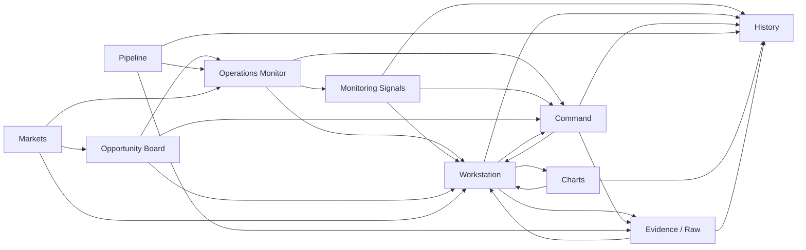
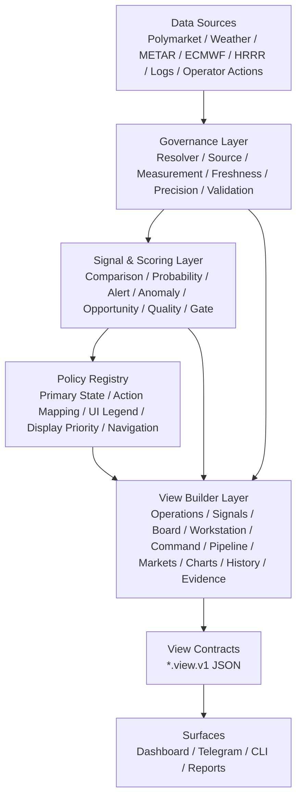

# AARS Polymarket Weather Trading Console UI Runtime Architecture Refactor v1

版本：v1.0  
日期：2026-04-25  
定位：页面角色、导航关系、状态治理、view contract、动作权限的 UI 运行时总规范

关联文档：

- [AARS_Polymarket_Weather_Trading_UI_Design_Status_Roadmap.md](./AARS_Polymarket_Weather_Trading_UI_Design_Status_Roadmap.md)
- [AARS_Polymarket_Weather_Trading_UI_Legend_Spec.md](./AARS_Polymarket_Weather_Trading_UI_Legend_Spec.md)
- [AARS_Polymarket_Weather_Trading_Architecture.md](./AARS_Polymarket_Weather_Trading_Architecture.md)
- [AARS_Polymarket_Weather_Trading_Detailed_Design.md](./AARS_Polymarket_Weather_Trading_Detailed_Design.md)
- [AARS_Polymarket_Weather_Trading_Implementation_Plan_Status.md](./AARS_Polymarket_Weather_Trading_Implementation_Plan_Status.md)

---

## 1. 重构目标

当前 UI 已经从普通 dashboard 演进为多页面、强状态、强导航、强治理的运行控制台。本轮重构目标是：

> 从“页面功能堆叠”升级为“页面角色清晰、导航关系明确、状态图例统一、动态参数受治理、前端只渲染 view contract”的 UI 运行时架构。

后续 UI 不应再由每个页面自行解释字段、判断状态或决定按钮显隐，而应统一走：

```text
Data / Signals / Governance
-> View Builders
-> View Contracts
-> Dashboard / Telegram / CLI / Reports
```

---

## 2. 页面角色总表

| 页面 | 新定位 | 核心问题 | 不应承担 |
|---|---|---|---|
| Operations Monitor | 运行总控台 | 现在系统与市场是否异常？ | 不做机会排序主入口，不做证据深挖 |
| Monitoring Signals | 信号与告警流 | 当前有哪些 alert / anomaly / ops signal？ | 不做多市场总控，不做执行 |
| Opportunity Board | 机会排序与候选研究入口 | 接下来优先研究哪些市场？ | 不做实时监控，不做执行 |
| Workstation | 单市场深度分析工作台 | 单个市场证据是否支持判断？ | 不做多市场管理，不做授权闭环 |
| Command | 操作员动作闭环与授权控制 | 下一步动作是否允许、如何确认并留痕？ | 不做证据深挖，不做市场池管理 |
| Pipeline | 数据管道与处理流程诊断 | 数据链路是否健康？ | 不做市场机会排序，不做操作员决策 |
| Markets | 市场池与 watchlist 管理 | 系统正在管理哪些市场？ | 不做机会排序，不做实时告警 |
| Charts | 趋势与可视化分析 | 历史趋势和关系如何？ | 不做实时处理，不做原始证据审计 |
| History | 事件回放与审计 | 什么时候发生了什么？ | 不做实时决策 |
| Evidence / Raw | 原始证据与数据血缘 | 数据从哪里来、如何转化？ | 不做 operator 主判断 |

---

## 3. 左侧导航分组

建议将左侧导航重构为：

```text
RUN
- Operations Monitor
- Monitoring Signals
- Command

RESEARCH
- Opportunity Board
- Workstation
- Charts

DATA
- Pipeline
- Markets
- Evidence / Raw
- History

SETTINGS
- Alerts & Rules
- Data & Sources
- System
```

该分组匹配操作员心智：

- `RUN`：值班、告警、闭环。
- `RESEARCH`：机会、分析、趋势。
- `DATA`：链路、市场池、证据、审计。
- `SETTINGS`：规则与配置。

---

## 4. 导航关系



### 4.1 主业务路径

| 路径 | 页面链路 | 用途 |
|---|---|---|
| 运行监控闭环 | Operations Monitor -> Quick Detail -> Workstation -> Command -> History | 从运行总控发现问题，到单市场分析，再到动作确认和留痕 |
| 信号处理闭环 | Monitoring Signals -> Signal Detail -> Workstation -> Command -> History | 从 alert / anomaly / ops signal 进入处理流程 |
| 机会研究闭环 | Opportunity Board -> Opportunity Explanation -> Add to Focus -> Workstation -> Command | 从机会排序发现候选市场，再进入 Focus / Workstation / Command |
| 数据诊断闭环 | Pipeline -> Evidence / Raw -> Charts -> History -> Workstation | 从数据管道问题进入源数据、图表、历史和市场证据分析 |

---

## 5. 页面动作统一规范

| 动作 | 可出现页面 | 目标页面 / 输出对象 | 是否改变 gate | 是否创建 intent |
|---|---|---|---|---|
| Open Workstation | Monitor / Signals / Board / Command / Markets / History | `market_workstation_view.v1` | 否 | 否 |
| Add to Focus | Board / Markets / Workstation / Command | `focus_market_list.v1` | 否 | 否 |
| Send to Command | Monitor / Signals / Board / Workstation | `command_context_view.v1` | 否 | 可选 |
| Review Evidence | Signals / Board / Workstation / Command | `evidence_raw_view.v1` | 否 | 否 |
| View History | Command / Workstation / Signals / Pipeline | `history_event_view.v1` | 否 | 否 |
| Acknowledge Signal | Signals / Command / Monitor detail | `signal_ack_event.v1` | 否 | 否 |
| Mute Signal | Signals / Command | `signal_mute_event.v1` | 否 | 否 |
| Create Pending Intent | Command only | `pending_intent.v1` | 否 | 是 |
| Run Dry-run Check | Command / Workstation gate panel | `gateway_dry_run_result.v1` | 否 | 否 |
| Live Execute | Command only, future gated mode | execution client | 是，必须 gate allow | 是 |

### 5.1 按钮显示规则

Board / Monitor / Markets 允许 `View`、`Add to Focus`、`Open Workstation`、`Send to Command`，不允许把 `Run Dry-run` 或 `Live Execute` 作为主按钮。

Workstation 允许 `Review Evidence`、`Open Charts`、`Send to Command`，`Run Dry-run Review` 只能作为 secondary action，不允许直接 live execute。

Command 允许 `Acknowledge`、`Mute`、`Create Pending Intent`、`Run Dry-run`，未来只有在强 gate 条件满足时显示 `Live Execute`。

---

## 6. 状态治理

### 6.1 状态总表

| 状态 | 类型 | 主状态可用 | 次状态可用 | 影响 gate | 可触发 operator action | 颜色 |
|---|---|---|---|---|---|---|
| LIVE | freshness | 否 | 是 | 间接 | 否 | green |
| STALE | freshness | 是 | 是 | 间接 | 是 | blue / amber |
| ALERT | market signal | 是 | 是 | 否 | 是 | red |
| ANOM | anomaly signal | 是 | 是 | 否 | 是 | amber |
| BLOCKED | gate state | 是 | 是 | 是 | 是 | red |
| NORMAL | display state | 是 | 否 | 否 | 否 | green / neutral |
| ALLOW | gate state | 否 | 是 | 是 | 否 | green |
| B | data quality | 否 | 是 | 间接 | 是 | magenta |
| OPS | system state | 不用于 market card 主状态 | 是 | 否 | 是 | red / amber |
| FOCUS | view state | 否 | 是 | 否 | 否 | blue |
| WATCH | view group | 否 | 是 | 否 | 否 | amber / neutral |

### 6.2 主状态 contract

所有市场卡片、Focus 卡、Quick Detail 必须使用统一字段：

```json
{
  "primary_state": "BLOCKED",
  "primary_state_reason": "Gate blocked by validation coverage below threshold",
  "secondary_states": ["LIVE", "DATA_QUALITY_B"],
  "display_priority": 92
}
```

主状态优先级：

```text
BLOCKED > ALERT > ANOM > STALE > NORMAL
```

生成规则：

```text
if can_execute == false and primary_block_reason exists:
    primary_state = BLOCKED
elif latest_alert_severity in ["red", "amber"]:
    primary_state = ALERT
elif latest_anomaly_score >= anomaly_threshold:
    primary_state = ANOM
elif freshness_status in ["stale", "unavailable"]:
    primary_state = STALE
else:
    primary_state = NORMAL
```

### 6.3 颜色使用原则

- 红色只用于 `BLOCKED`、`ALERT red`、critical `OPS`、顶部风险主数字。
- 琥珀 / 黄色只用于 `ANOM`、warning、medium risk。
- 绿色只用于 `LIVE`、`ALLOW`、`NORMAL`、healthy。
- 蓝色只用于 selected / focus / neutral info。
- 品红只用于数据质量问题 `B`。

---

## 7. 动静态元素治理

### 7.1 静态元素

静态元素应进入 `ui_static_registry.json`，包括：

```json
{
  "pages": [
    "operations_monitor",
    "monitoring_signals",
    "opportunity_board",
    "workstation",
    "command",
    "pipeline",
    "markets",
    "charts",
    "history",
    "evidence_raw"
  ],
  "navigation_groups": ["RUN", "RESEARCH", "DATA", "SETTINGS"],
  "standard_actions": [
    "open_workstation",
    "add_to_focus",
    "send_to_command",
    "review_evidence",
    "view_history",
    "acknowledge_signal",
    "mute_signal",
    "create_pending_intent",
    "run_dry_run_check"
  ]
}
```

### 7.2 动态元素

动态元素必须来自 builder / policy，不由前端推导。

| 动态字段 | 生成者 |
|---|---|
| `primary_state` | `primary_state_builder` |
| `secondary_states` | `primary_state_builder` |
| `display_priority` | `display_priority_builder` |
| `next_operator_action` | `action_mapping_policy` |
| `recommended_next_step` | `opportunity_action_policy` |
| `opportunity_score` | `opportunity_score_builder` |
| `quality_score` | `quality_score_builder` |
| `difficulty_label` | `difficulty_policy` |
| `freshness_status` | `freshness_policy` |
| `source_precision_score` | `source_precision_policy` |
| `alert_severity` | `alert_detector` |
| `anomaly_score` | `anomaly_detector` |
| `gate_summary` | `gate_stack_api` |
| `ops_status` | `ops_health_builder` |

---

## 8. View Contract 体系

| 页面 | 主 contract |
|---|---|
| Operations Monitor | `operations_monitor_view.v1` |
| Monitoring Signals | `monitoring_signals_view.v1` |
| Opportunity Board | `opportunity_board_view.v1` |
| Workstation | `market_workstation_view.v1` |
| Command | `command_context_view.v1` |
| Pipeline | `pipeline_status_view.v1` |
| Markets | `markets_inventory_view.v1` |
| Charts | `charts_analysis_view.v1` |
| History | `history_event_view.v1` |
| Evidence / Raw | `evidence_raw_view.v1` |

Dashboard、Telegram、CLI、报告都必须读取同一组 contract。示例：

```text
Dashboard /monitor  -> operations_monitor_view.v1
Telegram /monitor   -> operations_monitor_summary.v1
Dashboard /command  -> command_context_view.v1
Telegram /command   -> command_context_summary.v1
```

---

## 9. 新 UI 运行时架构

旧模式风险：

```text
raw data -> dashboard page calculates status -> page renders
```

该模式会导致不同页面状态解释不一致、颜色语义漂移、按钮规则分散、Telegram 与 Dashboard 结论不一致，以及 gate / alert / anomaly 被前端误用。

新模式：



---

## 10. View Builder Layer

建议新增：

```text
src/weather_comparison_engine/view_builders/
  operations_monitor_view_builder.py
  monitoring_signals_view_builder.py
  opportunity_board_view_builder.py
  market_workstation_view_builder.py
  command_context_view_builder.py
  pipeline_status_view_builder.py
  markets_inventory_view_builder.py
  charts_analysis_view_builder.py
  history_event_view_builder.py
  evidence_raw_view_builder.py
```

也可以按页面分模块：

```text
src/weather_comparison_engine/
  operations_monitor/
  monitoring_signals/
  opportunity_board/
  market_workstation/
  command_center/
  pipeline_status/
  markets_inventory/
  charts_analysis/
  history_events/
  evidence_raw/
```

---

## 11. Policy Registry 新增清单

建议新增：

```text
data/registries/ui_policy_registry/
  primary_state_policy.json
  display_priority_policy.json
  next_operator_action_policy.json
  action_visibility_policy.json
  navigation_policy.json
  ui_color_semantics_policy.json
  ui_legend_policy.json
```

| Policy | 职责 |
|---|---|
| `primary_state_policy` | 决定市场主状态 |
| `display_priority_policy` | 决定卡片 / 行排序优先级 |
| `next_operator_action_policy` | 决定下一步建议 |
| `action_visibility_policy` | 决定按钮是否显示 / enabled |
| `navigation_policy` | 决定按钮跳转目标与 context |
| `ui_color_semantics_policy` | 决定颜色语义 |
| `ui_legend_policy` | 决定图例说明 |

---

## 12. Phase 32-35

| Phase | 名称 | 目标 | 关键交付 |
|---|---|---|---|
| Phase 32 | Operations Monitor v3.1 UI Refactor | 固化 primary_state、Focus 去重复、Quick Detail 横条化、右栏状态灯矩阵化、红色强度分级 | `operations_monitor_view.v1` 更新、`primary_state_policy.default.v1`、`display_priority_policy.default.v1` |
| Phase 33 | Navigation & Page Contract Alignment | 重构左侧导航分组，统一页面间按钮跳转逻辑，所有页面读取统一 view contract | `navigation_policy.default.v1`、`action_visibility_policy.default.v1`、`page_context_schema.v1` |
| Phase 34 | Legend & Dynamic Parameter Governance | 统一图例、颜色、动态字段来源，防止前端自算状态 | `ui_legend_policy.default.v1`、`ui_color_semantics_policy.default.v1`、`dynamic_parameter_governance.md` |
| Phase 35 | Surface Consistency: Dashboard / Telegram / CLI | Dashboard 与 Telegram 读取同一 view contracts，命令行为与页面按钮一致，审计事件统一 | summary contracts、`/monitor`、`/signals`、`/opportunities`、`/command`、`/history` |

---

## 13. 结论

当前系统 UI 已经从页面原型进入运行时架构阶段。后续关键不是继续堆页面，而是把所有页面、按钮、状态、图例、动态参数和系统架构统一收口到 `View Contract + Policy Registry` 模式。

这样才能保证：

- Operations Monitor 看到的状态
- Opportunity Board 给出的机会
- Workstation 展示的证据
- Command 做出的动作
- Telegram 推送的摘要

全部来自同一套治理逻辑，不会各说各话。
