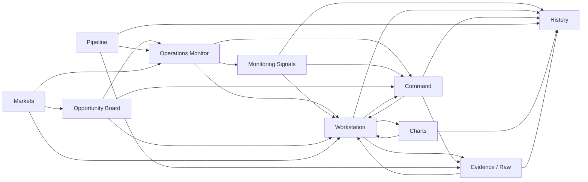

# AARS Polymarket Weather Trading Console
# UI Navigation Graph

版本：v1.0  
日期：2026-04-25

## Navigation Groups

```text
RUN
- Operations Monitor
- Monitoring Signals
- Command

RESEARCH
- Opportunity Board
- Workstation
- Charts

DATA
- Pipeline
- Markets
- Evidence / Raw
- History

SETTINGS
- Alerts & Rules
- Data & Sources
- System
```

## Page Graph



## Standard Flows

| Flow | Path |
|---|---|
| Runtime monitoring closure | Operations Monitor -> Quick Detail -> Workstation -> Command -> History |
| Signal handling closure | Monitoring Signals -> Signal Detail -> Workstation -> Command -> History |
| Opportunity research closure | Opportunity Board -> Opportunity Explanation -> Add to Focus -> Workstation -> Command |
| Data diagnostic closure | Pipeline -> Evidence / Raw -> Charts -> History -> Workstation |

