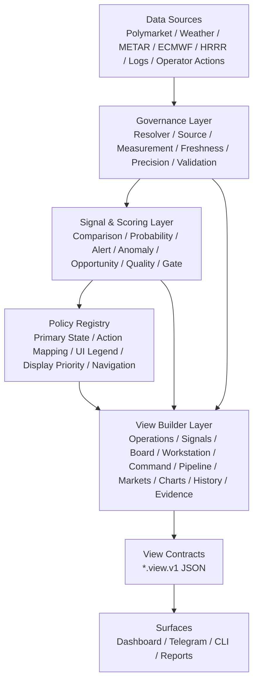

# AARS Polymarket Weather Trading Console
# UI Runtime Architecture

版本：v1.0  
日期：2026-04-25  
定位：页面角色、导航关系、动作模型、状态治理、动态参数治理、view contract 与 surface consistency 的主控规范

---

## 1. Purpose

This document defines the runtime UI architecture for the AARS Polymarket Weather Trading Console.

The console is not a conventional dashboard. It is a governed, safety-oriented operations interface for weather-market monitoring, opportunity research, evidence review, operator command, and execution-boundary control.

The UI runtime architecture is based on the following principles:

1. Pages render governed view contracts rather than deriving operational state locally.
2. UI states, colors, legends, and actions are controlled by policy registries.
3. Dashboard, Telegram, CLI, and reports must consume consistent contracts.
4. Alert, anomaly, gate, ops, freshness, and data-quality semantics must remain separated.
5. Opportunity ranking and operator command must never be confused with execution permission.

---

## 2. Architecture



---

## 3. Page Role Taxonomy

| Page | Role | Primary Question | Must Not Do |
|---|---|---|---|
| Operations Monitor | Runtime operations monitor | What is happening now across the monitored market universe? | Must not become a research ranking board or evidence deep-dive page |
| Monitoring Signals | Signal and alert feed | Which alert, anomaly, recovery, or ops signals are active? | Must not perform execution or long-form evidence analysis |
| Opportunity Board | Opportunity ranking and research candidate entry | Which markets should be researched next? | Must not become the realtime operations monitor or execution page |
| Workstation | Single-market evidence workstation | Does the evidence support the current market interpretation? | Must not perform authorization closure as its primary role |
| Command | Operator decision and authorization closure | What action is allowed next, and how is it recorded? | Must not repeat evidence deep-dive or multi-market monitoring |
| Pipeline | Data pipeline and processing diagnostics | Is the data pipeline healthy and synchronized? | Must not rank market opportunities or make operator decisions |
| Markets | Market inventory and watchlist administration | Which markets are known, watched, focused, hidden, or removed? | Must not duplicate Opportunity Board scoring logic |
| Charts | Visual analysis and trend exploration | What do historical trends and distributions show? | Must not serve as the realtime alert entry point |
| History | Event replay and audit trail | What happened, when, and through which chain of events? | Must not perform realtime action decisions |
| Evidence / Raw | Raw evidence, canonical conversion, and lineage review | Where did the data come from and how was it transformed? | Must not serve as the primary operator decision page |

---

## 4. Navigation Model

Navigation is grouped by operator intent rather than implementation module.

```text
RUN
- Operations Monitor
- Monitoring Signals
- Command

RESEARCH
- Opportunity Board
- Workstation
- Charts

DATA
- Pipeline
- Markets
- Evidence / Raw
- History

SETTINGS
- Alerts & Rules
- Data & Sources
- System
```

Design rationale:

- `RUN`: realtime monitoring, signal handling, and operator closure.
- `RESEARCH`: opportunity discovery, market analysis, and trend review.
- `DATA`: pipeline, market inventory, raw evidence, and replay.
- `SETTINGS`: rules, source configuration, and system configuration.

---

## 5. Core Workflows

| Workflow | Path | Use Case |
|---|---|---|
| Runtime monitoring closure | Operations Monitor -> Quick Detail -> Workstation -> Command -> History | Used when the operator starts from realtime monitoring, reviews evidence, closes the action loop, and records the outcome |
| Signal handling closure | Monitoring Signals -> Signal Detail -> Workstation -> Command -> History | Used when an alert, anomaly, recovery signal, or ops signal is generated |
| Opportunity research closure | Opportunity Board -> Opportunity Explanation -> Add to Focus -> Workstation -> Command | Used when the operator starts from ranked candidates and promotes a market into focus monitoring |
| Data diagnostic closure | Pipeline -> Evidence / Raw -> Charts -> History -> Workstation | Used when source quality, freshness, normalization, or validation anomalies require data-level diagnosis |

---

## 6. Action Model

Action visibility must be policy-driven. No frontend page may independently decide that an execution-related button is allowed.

| Action | Allowed Pages | Target / Output | Changes Gate? | Creates Intent? |
|---|---|---|---|---|
| Open Workstation | Monitor, Signals, Board, Command, Markets, History | `market_workstation_view.v1` | No | No |
| Add to Focus | Board, Markets, Workstation, Command | `focus_market_list.v1` | No | No |
| Send to Command | Monitor, Signals, Board, Workstation | `command_context_view.v1` | No | Optional |
| Review Evidence | Signals, Board, Workstation, Command | `evidence_raw_view.v1` | No | No |
| View History | Command, Workstation, Signals, Pipeline | `history_event_view.v1` | No | No |
| Acknowledge Signal | Signals, Command, Monitor detail | `signal_ack_event.v1` | No | No |
| Mute Signal | Signals, Command | `signal_mute_event.v1` | No | No |
| Create Pending Intent | Command only | `pending_intent.v1` | No | Yes |
| Run Dry-run Check | Command, Workstation gate panel | `gateway_dry_run_result.v1` | No | No |
| Live Execute | Command only, future gated mode | Execution client | Yes, must require gate allow | Yes |

---

## 7. UI State & Legend Governance

Primary state is for HMI display prioritization only and does not redefine gate semantics.

| State | Type | Primary State Allowed | Secondary State Allowed | Affects Gate | Triggers Operator Action | Color |
|---|---|---|---|---|---|---|
| LIVE | Freshness | No | Yes | Indirect | No | Green |
| STALE | Freshness | Yes | Yes | Indirect | Yes | Blue / Amber |
| ALERT | Market Signal | Yes | Yes | No | Yes | Red |
| ANOM | Anomaly Signal | Yes | Yes | No | Yes | Amber |
| BLOCKED | Gate State | Yes | Yes | Yes | Yes | Red |
| NORMAL | Display State | Yes | No | No | No | Green / Neutral |
| ALLOW | Gate State | No | Yes | Yes | No | Green |
| B | Data Quality | No | Yes | Indirect | Yes | Magenta |
| OPS | System State | Not for market-card primary state | Yes | No | Yes | Red / Amber |
| FOCUS | View State | No | Yes | No | No | Blue |
| WATCH | View Group | No | Yes | No | No | Amber / Neutral |

Primary state priority:

```text
BLOCKED > ALERT > ANOM > STALE > NORMAL
```

---

## 8. Dynamic Parameter Governance

Dynamic fields must be generated by builders / policies, not inferred by frontend pages.

| Dynamic Field | Owner / Builder | Policy Ref | Frontend May Derive? |
|---|---|---|---|
| `primary_state` | `primary_state_builder` | `primary_state_policy` | No |
| `secondary_states` | `primary_state_builder` | `primary_state_policy` | No |
| `display_priority` | `display_priority_builder` | `display_priority_policy` | No |
| `next_operator_action` | `action_mapping_builder` | `next_operator_action_policy` | No |
| `recommended_next_step` | `opportunity_action_builder` | `opportunity_action_policy` | No |
| `opportunity_score` | `opportunity_score_builder` | `opportunity_scoring_policy` | No |
| `quality_score` | `quality_score_builder` | `quality_scoring_policy` | No |
| `difficulty_label` | `difficulty_score_builder` | `difficulty_scoring_policy` | No |
| `freshness_status` | `freshness_builder` | `freshness_policy` | No |
| `source_precision_score` | `source_precision_builder` | `source_precision_policy` | No |
| `alert_severity` | `alert_detector` | `alert_policy` | No |
| `anomaly_score` | `anomaly_detector` | `anomaly_policy` | No |
| `gate_summary` | `gate_stack_api` | `gate_policy` | No |
| `ops_status` | `ops_health_builder` | `ops_policy` | No |

---

## 9. View Contract Architecture

| Page | Primary Contract | Summary Contract |
|---|---|---|
| Operations Monitor | `operations_monitor_view.v1` | `operations_monitor_summary.v1` |
| Monitoring Signals | `monitoring_signals_view.v1` | `monitoring_signals_summary.v1` |
| Opportunity Board | `opportunity_board_view.v1` | `opportunity_board_summary.v1` |
| Workstation | `market_workstation_view.v1` | `market_workstation_summary.v1` |
| Command | `command_context_view.v1` | `command_context_summary.v1` |
| Pipeline | `pipeline_status_view.v1` | `pipeline_status_summary.v1` |
| Markets | `markets_inventory_view.v1` | `markets_inventory_summary.v1` |
| Charts | `charts_analysis_view.v1` | `charts_analysis_summary.v1` |
| History | `history_event_view.v1` | `history_event_summary.v1` |
| Evidence / Raw | `evidence_raw_view.v1` | `evidence_raw_summary.v1` |

Cross-page operator navigation and local dashboard actions may additionally emit `ui_action_event.v1` records for replay and audit.

---

## 10. View Builder Layer

View builders are the only components allowed to assemble page-level UI state.

```text
src/weather_comparison_engine/view_builders/
  operations_monitor_view_builder.py
  monitoring_signals_view_builder.py
  opportunity_board_view_builder.py
  market_workstation_view_builder.py
  command_context_view_builder.py
  pipeline_status_view_builder.py
  markets_inventory_view_builder.py
  charts_analysis_view_builder.py
  history_event_view_builder.py
  evidence_raw_view_builder.py
```

Dashboard pages, Telegram commands, CLI summaries, and reports must not independently compute primary state, gate result, opportunity score, action recommendation, freshness category, source precision, or UI severity.

Operator-triggered UI actions should be captured as governed audit objects rather than remaining implicit in browser-local state. The first runtime form of this is `ui_action_event.v1`, which is replayed in `History`.

---

## 11. Policy Registry

Canonical UI policy samples currently live under:

```text
weather-comparison-engine/data/registries/ui_policy_registry/
```

Required policies:

- `primary_state_policy.json`
- `display_priority_policy.json`
- `next_operator_action_policy.json`
- `action_visibility_policy.json`
- `navigation_policy.json`
- `ui_color_semantics_policy.json`
- `ui_legend_policy.json`
- `ui_static_registry.json`

---

## 12. Surface Consistency

Dashboard, Telegram, CLI, and reports must consume the same contract family.

Examples:

```text
Dashboard /monitor   -> operations_monitor_view.v1
Telegram /monitor    -> operations_monitor_summary.v1
Dashboard /command   -> command_context_view.v1
Telegram /command    -> command_context_summary.v1
Dashboard /history   -> history_event_view.v1
Telegram /history    -> history_event_summary.v1
```

---

## 13. Implementation Phases

| Phase | Name | Goal |
|---|---|---|
| Phase 32 | Operations Monitor v3.1 UI Refactor | Solidify primary_state, remove Focus duplication, compact Quick Detail, matrix system rail |
| Phase 33 | Navigation & Page Contract Alignment | Align navigation groups, action routing, page context and view contracts |
| Phase 34 | Legend & Dynamic Parameter Governance | Govern legend, colors, dynamic fields and frontend derivation boundaries |
| Phase 35 | Surface Consistency | Align Dashboard / Telegram / CLI / Reports on shared contracts and audit events |
