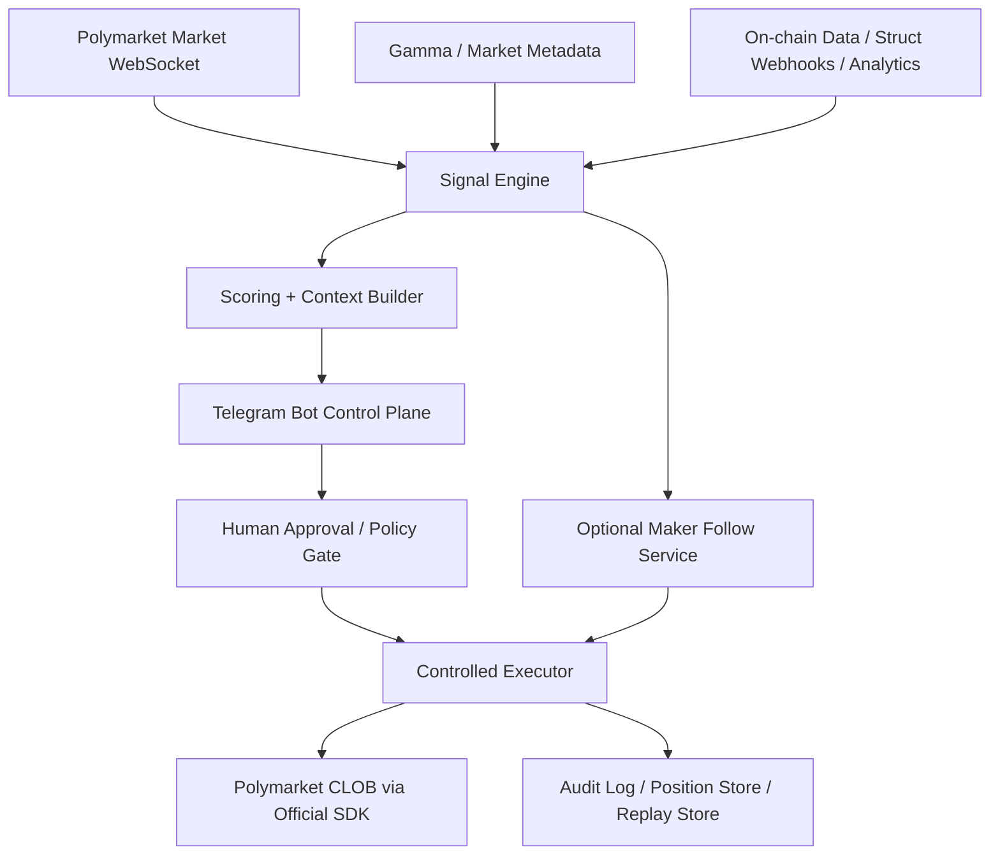

# Polymarket Telegram Bot 建议报告

## 元数据

- 日期：2026-04-09
- 主题：Polymarket GitHub Bot 功能与代码能力调研；形成“巨鲸异动检测 + Telegram 决策辅助 + 条件满足时的受控执行 + 可选 maker follow”的 Telegram bot 建议方案
- 结论置信度：中高
- 说明：本报告聚焦研究、工程规划与风险控制，不构成交易建议或法律意见。

## 执行摘要

Polymarket 官方能力的强项在于交易底座很完整，包括 CLOB 交易模型、Python / TypeScript / Rust SDK、L1 / L2 认证、下单 / 撤单、市场 WebSocket、用户 WebSocket、做市钱包与审批流程等。[citation:Polymarket Trading Overview](https://docs.polymarket.com/trading/overview) [citation:Polymarket Market Channel](https://docs.polymarket.com/market-data/websocket/market-channel) [citation:Polymarket User Channel](https://docs.polymarket.com/market-data/websocket/user-channel) [citation:Polymarket Market Makers Overview](https://docs.polymarket.com/market-makers/overview)

但“巨鲸异动检测、Telegram 交互式订阅、钱包跟踪、跟单/跟做市”这类能力，并不是官方单仓库直接打包提供，而是要把官方 SDK 与第三方模式拼起来。GitHub 上最有参考价值的组合是：官方 `py-clob-client` / `clob-client` / `poly-market-maker` 做交易与做市底座，[citation:Polymarket py-clob-client README](https://github.com/Polymarket/py-clob-client/blob/main/README.md) [citation:Polymarket clob-client README](https://github.com/Polymarket/clob-client/blob/main/README.md) [citation:Polymarket poly-market-maker README](https://github.com/Polymarket/poly-market-maker/blob/main/README.md) 第三方 `structbuild/polymarket-telegram-alerts-bot` 做 Telegram 监控与交互流程参考，[citation:Structbuild README](https://github.com/structbuild/polymarket-telegram-alerts-bot/blob/main/README.md) [citation:Structbuild event handler](https://github.com/structbuild/polymarket-telegram-alerts-bot/blob/main/src/struct/event-handler.ts) [citation:Structbuild callback handler](https://github.com/structbuild/polymarket-telegram-alerts-bot/blob/main/src/bot/callbacks/handler.ts) 再有像 `voicegn/polymarket-bot` 这类大而全项目可以参考跟单与执行器的模块拆分，但要谨慎看待其自述与未文档化端点依赖。[citation:voicegn README](https://github.com/voicegn/polymarket-bot/blob/main/README.md) [citation:voicegn Cargo](https://github.com/voicegn/polymarket-bot/blob/main/Cargo.toml) [citation:voicegn copy trade](https://github.com/voicegn/polymarket-bot/blob/main/src/strategy/copy_trade.rs) [citation:voicegn smart executor](https://github.com/voicegn/polymarket-bot/blob/main/src/executor/smart_executor.rs)

最稳妥的落地路径不是一上来做全自动交易，而是分四阶段推进：`告警` → `决策辅助` → `受控执行` → `可选 maker follow`。其中默认模式应当是 human-in-the-loop，由 Telegram 负责确认，自动执行只在明确规则、额度、熔断与审计全都齐备后开启。

## 一、Polymarket 在 GitHub 上 Bot 生态的关键能力

### 1. 官方仓库能直接复用的能力

| 仓库 | 角色 | 已验证能力 | 适合复用的层 |
| --- | --- | --- | --- |
| `Polymarket/py-clob-client` | Python 交易 SDK | 市场读取、订单簿、mid/price、限价单、市价单、撤单、批量撤单、trade 查询、通知、余额与 allowance、heartbeat、builder headers | 交易接入层、执行层 |
| `Polymarket/clob-client` | TypeScript 交易 SDK | 与 Python 版同类能力，适合 Node/Worker 服务 | 交易接入层、边缘服务 |
| `Polymarket/poly-market-maker` | 官方做市 keeper | 两种策略、30s 同步、按 mid 价重挂单、SIGTERM 退出前撤单 | maker 模块 |

`py-clob-client` 的 README 与客户端代码都证明，官方 Python SDK 已经覆盖了“读取 orderbook、签名订单、发送订单、撤单、批量撤单、查询交易、取消全部订单、heartbeat”这些核心动作。[citation:Polymarket py-clob-client README](https://github.com/Polymarket/py-clob-client/blob/main/README.md) [citation:Polymarket py-clob-client client.py](https://github.com/Polymarket/py-clob-client/blob/cc1740c11adf0be33590c1ee4976ce8bfd2f37c2/py_clob_client/client.py)

官方交易文档也明确说明了两级认证模型：L1 用私钥做 EIP-712 签名来生成或派生 API 凭证，L2 用 HMAC-SHA256 凭证来完成下单、撤单、查询交易；即便使用 L2，请求中的订单本体仍然需要私钥签名。[citation:Polymarket Trading Overview](https://docs.polymarket.com/trading/overview)

官方 WebSocket 里，`Market Channel` 是公开市场数据流，可订阅 token_id 获得订单簿、成交、best bid/ask、tick_size_change 等事件；`User Channel` 则只推送“你自己的”订单与成交更新。[citation:Polymarket Market Channel](https://docs.polymarket.com/market-data/websocket/market-channel) [citation:Polymarket User Channel](https://docs.polymarket.com/market-data/websocket/user-channel)

这意味着一个重要结论：如果目标是“巨鲸异动检测”，仅靠官方 `User Channel` 不够，因为它只覆盖自有账户。巨鲸检测必须引入公开市场数据、链上数据资源，或第三方钱包事件 webhook。[citation:Polymarket User Channel](https://docs.polymarket.com/market-data/websocket/user-channel) [citation:Polymarket Data Resources](https://docs.polymarket.com/resources/blockchain-data)

### 2. 第三方仓库里最值得借鉴的模式

#### `structbuild/polymarket-telegram-alerts-bot`

这是当前最贴近“Telegram 交互式监控 bot”的参考样本。它不是交易 bot，而是“市场/钱包监控 + Telegram 工作流 bot”。README、数据库 schema 与回调处理代码能验证以下能力：

- 支持市场监控事件：概率 spike、价格 spike、市场指标、close-to-bond。[citation:Structbuild README](https://github.com/structbuild/polymarket-telegram-alerts-bot/blob/main/README.md)
- 支持 trader 监控事件：first trade、new market entry、whale trade。[citation:Structbuild README](https://github.com/structbuild/polymarket-telegram-alerts-bot/blob/main/README.md)
- 用 D1 保存 `market_monitors`、`trader_monitors`、`monitor_drafts`、删除会话等状态，说明它已经把“交互式订阅配置”抽象成了持久化流程。[citation:Structbuild schema](https://github.com/structbuild/polymarket-telegram-alerts-bot/blob/d77362bca2e50e10581cfa3d85f0fad26c9bbae8/src/db/schema.sql)
- Webhook 入口实现了 HMAC-SHA256 校验、事件类型识别、过滤器匹配、订阅者路由和 Telegram 推送，这是“鲸鱼检测到 Telegram 通知”这一段链路的成熟参考。[citation:Structbuild event handler](https://github.com/structbuild/polymarket-telegram-alerts-bot/blob/main/src/struct/event-handler.ts) [citation:Structbuild hmac](https://github.com/structbuild/polymarket-telegram-alerts-bot/blob/main/src/utils/hmac.ts)
- 回调处理器实现了大量 inline keyboard、筛选条件、订阅确认、批量删除和多市场选择逻辑，非常适合直接借鉴到你的 bot UX 设计。[citation:Structbuild callback handler](https://github.com/structbuild/polymarket-telegram-alerts-bot/blob/main/src/bot/callbacks/handler.ts)

结论：它最适合被当成“Telegram 监控与交互层”的样板，而不是交易执行层。

#### `voicegn/polymarket-bot`

这个仓库的代码量明显更大，并且 `Cargo.toml`、`lib.rs`、`copy_trade.rs`、`smart_executor.rs` 能证明它确实实现了较完整的 Rust 服务骨架，而不只是 README 展示图。[citation:voicegn Cargo](https://github.com/voicegn/polymarket-bot/blob/main/Cargo.toml) [citation:voicegn lib.rs](https://github.com/voicegn/polymarket-bot/blob/main/src/lib.rs)

其中可借鉴的两块很直接：

- `copy_trade.rs` 已经把“关注用户名/地址、拉取 leaderboard、跟踪持仓变化、生成 copy signal”拆成了独立模块。[citation:voicegn copy trade](https://github.com/voicegn/polymarket-bot/blob/main/src/strategy/copy_trade.rs)
- `smart_executor.rs` 已经把“深度分析、限价保护、最大滑点、重试、分批执行、超时等待成交”抽成了智能执行器。[citation:voicegn smart executor](https://github.com/voicegn/polymarket-bot/blob/main/src/executor/smart_executor.rs)

但这个仓库也暴露出两个风险：

- 它的很多能力是仓库自述，虽有源码入口，但整体生产可用性仍需独立验证。
- 跟单模块依赖的部分端点，比如 `clob.polymarket.com/positions?user=` 和 `gamma-api.polymarket.com/leaderboard?limit=50`，在本次官方文档采样中没有看到稳定文档化入口，因此不应直接把它们当成强 SLA 能力。

结论：适合作为“模块拆法参考”，不适合作为无脑底座。

#### 低置信样本

类似 `dealermemefi/polymarket-signal-bot` 这类仓库，在 README 里描述了“orderbook imbalance、volume spike、smart money flow、Telegram/Discord 通知”等很贴题的能力，但本次采样没有继续取到等量的源码证据，所以更适合用来补足思路，而不是用来判断代码成熟度。[citation:Signal Bot README](https://github.com/dealermemefi/polymarket-signal-bot/blob/main/README.md)

## 二、对目标产品的建议架构

### 目标定义

目标不是一个单体 bot，而是“Telegram 作为控制台，后台由多个可替换服务组成”的系统：

1. `Whale Detection Engine`
2. `Decision Support Engine`
3. `Controlled Executor`
4. `Optional Maker Follow Module`
5. `Audit / Replay / Risk Control`

### 1. 巨鲸异动检测层

建议把“巨鲸异动”拆成三个来源，而不是只押一个来源：

- `订单簿/盘口异动`：基于官方 `Market Channel` 实时订阅 `book`、`best_bid_ask`、`tick_size_change`，识别盘口失衡、短时价差跳变、挂单深度坍塌。[citation:Polymarket Market Channel](https://docs.polymarket.com/market-data/websocket/market-channel)
- `市场级成交异动`：结合公共 trade/orderbook 数据做价格速度、成交密度、连续扫单识别。[citation:Polymarket Market Channel](https://docs.polymarket.com/market-data/websocket/market-channel)
- `钱包级巨鲸异动`：接链上数据资源或第三方 webhook，监控特定地址 first trade / new market / whale trade；官方 Data Resources 页面也明确把 trades、balances、positions 这类链上活动开放给 Goldsky、Dune、Allium 等平台。[citation:Polymarket Data Resources](https://docs.polymarket.com/resources/blockchain-data) [citation:Structbuild README](https://github.com/structbuild/polymarket-telegram-alerts-bot/blob/main/README.md)

建议不要把“鲸鱼”只定义成“大额成交”，而是做成一个综合分：

- 金额阈值
- 账户画像分
- 市场流动性占比
- 同方向连续成交次数
- 是否触发盘口失衡
- 事件临近程度

### 2. Telegram 决策辅助层

这是你这个产品最应该与纯信号 bot 拉开差距的地方。建议 Telegram 卡片里直接给出：

- 市场标题、事件、YES/NO 当前价、盘口简况
- 触发因子摘要：`wallet whale` / `price spike` / `orderbook imbalance` / `news correlation`
- 风险摘要：最大滑点、当前深度、距离结算时间、历史波动
- 策略建议：`仅观察` / `小仓位试单` / `等待二次确认` / `禁止执行`
- 操作按钮：`approve_once`、`paper_trade`、`snooze`、`block_wallet`、`raise_threshold`

这里可以直接借鉴 `structbuild` 的交互式 callback + 草稿状态机模型，也可以复用当前仓库里的 Telegram 菜单与 inline keyboard 习惯，把 bot 做成“监控 + 决策控制台”而不是单向告警器。[citation:Structbuild callback handler](https://github.com/structbuild/polymarket-telegram-alerts-bot/blob/main/src/bot/callbacks/handler.ts)

### 3. 条件满足时的受控执行层

执行层必须坚持“官方 SDK + 明确风控前置校验”的原则。

官方文档已经给足了完整执行底座：订单创建、post-only、批量订单、撤单、全部撤单、按市场撤单、用户成交回报、L1/L2 认证。[citation:Polymarket Trading Overview](https://docs.polymarket.com/trading/overview) [citation:Polymarket Create Order](https://docs.polymarket.com/trading/orders/create) [citation:Polymarket Cancel Order](https://docs.polymarket.com/trading/orders/cancel)

其中尤其值得纳入你的执行规则的能力：

- `post-only`：保证只做 maker，不会立即吃单；如果会穿价则直接拒绝。[citation:Polymarket Create Order](https://docs.polymarket.com/trading/orders/create)
- `cancelAll` / `cancelMarketOrders`：用于熔断、切换策略、或异常恢复。[citation:Polymarket Cancel Order](https://docs.polymarket.com/trading/orders/cancel)
- `User Channel`：确认自己的 order / trade 状态，从 `MATCHED`、`MINED` 到 `CONFIRMED`。[citation:Polymarket User Channel](https://docs.polymarket.com/market-data/websocket/user-channel)
- `heartbeat`：官方 Python 客户端代码已预留“若心跳停止则全部订单自动撤销”的机制，这非常适合做守护型 kill switch。[citation:Polymarket py-clob-client client.py](https://github.com/Polymarket/py-clob-client/blob/cc1740c11adf0be33590c1ee4976ce8bfd2f37c2/py_clob_client/client.py)

建议把执行 gate 固化为以下顺序：

1. 策略条件满足
2. 市场仍在允许列表
3. 账户与日内风险未触发红线
4. 实时深度与预估滑点合格
5. Telegram 人工批准或预注册规则命中
6. 用官方 SDK 发送订单
7. 用 `User Channel` / 查询接口确认状态
8. 失败则回退到撤单 / 降级 / 熔断

### 4. 可选 maker follow 模块

我建议把 `maker follow` 当作后置模块，而不是 MVP 核心。

原因很简单：官方做市文档强调了做市的基础要求是连续报价、库存管理、风险控制和避免负 spread；如果 bid 高于 ask，会在每次成交中亏钱。[citation:Polymarket Market Makers Overview](https://docs.polymarket.com/market-makers/overview)

更合理的做法是二选一：

- `钱包/账户跟随`：跟踪高质量地址或用户名的持仓与开仓行为，偏 copy-trade。
- `做市策略跟随`：复用 `poly-market-maker` 的策略骨架，在自有 inventory 上挂双边报价，偏 MM。

这两者不应混成一个开关。建议产品上单独列为：

- `copy_follow`：关注地址，生成跟单建议或小比例复制单
- `maker_mode`：在明确白名单市场上启动官方做市 keeper 思路

如果一定要做“maker follow”，推荐技术定义为“在白名单市场启用受限做市模式”，而不是“无差别复制未知做市者行为”。

## 三、建议的三条 Track

### A. Planning Track

#### 目标

把产品边界、数据源、执行边界、风险与仓位政策先定死。

#### 关键任务

- 明确 MVP 只做哪些事件：`whale trade`、`price/probability spike`、`orderbook imbalance`
- 确定市场范围：全市场、白名单市场、还是事件白名单
- 选技术栈：`Python + py-clob-client + python-telegram-bot` 或 `TypeScript + Cloudflare/Node + clob-client`
- 选数据源组合：官方 WebSocket + 链上数据平台 + 第三方钱包事件 webhook
- 定义审批策略：完全人工、半自动、规则自动
- 定义执行边界：单笔上限、日损上限、单市场暴露、熔断条件
- 明确 `maker follow` 是否放入 V1.0，还是放到 V2.0

#### 交付物

- 产品需求文档
- 风控策略文档
- 数据源 SLA 与降级矩阵
- 事件 / 信号 / 订单数据模型

### B. Execution Track

#### Phase 1：Alert-Only MVP

- 接入市场 WebSocket
- 接入链上 / 第三方钱包异动源
- 生成 Telegram 告警卡片
- 支持订阅、过滤、静音、黑名单

#### Phase 2：Decision Support

- 引入 signal scoring
- 在 Telegram 中加入上下文解释、风险摘要与人工按钮
- 加入 watchlist、钱包标签、市场标签

#### Phase 3：Controlled Execution

- 用官方 SDK 打通下单 / 撤单 / 状态确认
- 只允许白名单 market + 小额度 + 手动确认
- 建立 kill switch、cancelAll、订单审计与 replay log

#### Phase 4：Optional Maker Follow

- 复用官方 `poly-market-maker` 思想做独立服务
- 只在高流动性白名单市场启用
- 与主 bot 解耦部署，不共享执行开关

### C. Verification Track

#### 回放与仿真

- 重放 7d / 30d 市场数据，验证信号触发噪声比
- 重放巨鲸地址行为，验证检测延迟与误报率
- 做 paper trade，不连接真钱账户

#### 执行验证

- 单元测试：过滤器、评分器、审批 gate、滑点检查
- 集成测试：从告警到下单到成交回报的全链路
- 故障演练：WebSocket 中断、API 抖动、撤单失败、重复消息

#### 生产前门槛

- 连续 2 周 paper trade 稳定
- 所有 kill switch 演练通过
- 每笔执行都有审计记录
- 日损熔断与撤单保护经过人工演练

## 四、我给你的推荐方案

### 推荐技术路线

- `主语言`：Python
- `交易接入`：`Polymarket/py-clob-client`
- `Telegram Bot`：复用当前仓库 `telegram-aars-bot/` 的菜单/命令风格，再引入订阅、审批、审计按钮
- `实时信号`：官方 `Market Channel`
- `钱包监控`：第三方 webhook 或链上数据资源
- `持久层`：SQLite / Postgres
- `执行模式`：默认人工批准；自动执行仅用于明确规则、明确白名单的小额单

### 为什么推荐 Python

- 官方 Python SDK 最直接，样例与能力都完整。[citation:Polymarket py-clob-client README](https://github.com/Polymarket/py-clob-client/blob/main/README.md)
- 当前仓库已有 Python Telegram bot 样板，迁移成本最低。
- 做风控、规则引擎、回放脚本、数据分析都更顺手。

### 不推荐的一步到位方案

- 不建议一开始就上 LLM 驱动全自动交易。
- 不建议把“鲸鱼检测、跟单、做市、自动平仓”全部塞进一个单进程 bot。
- 不建议把未文档化 Polymarket 端点当核心依赖。

## 五、与当前仓库的结合点

当前工作区已经有一个本地 Telegram 控制台样板：[`telegram-aars-bot/app.py`](/Users/maolei/AARS-Platform/telegram-aars-bot/app.py) 与 [`telegram-aars-bot/bot_handlers.py`](/Users/maolei/AARS-Platform/telegram-aars-bot/bot_handlers.py)。它已经具备命令注册、错误处理、inline keyboard 菜单和多页面控制逻辑，适合直接借鉴成：

- `监控配置菜单`
- `信号确认菜单`
- `风控状态菜单`
- `执行批准 / 撤单 / 熔断菜单`

建议保留“Telegram 作为控制台”的交互思路，但把后端从 AARS 运行时替换为“市场监控 + 风控 + 执行”的模块化服务。

## 六、关键风险与开放问题

### 高优先级风险

- `数据源稳定性`：钱包级监控若依赖第三方 webhook 或未文档化端点，需准备降级方案。
- `资金安全`：私钥、API key、签名流程、撤单保护必须先于自动执行上线。
- `市场微结构风险`：低流动性市场很容易出现误判、滑点和成交不完整。
- `maker 风险`：官方文档明确提示 crossed market 会稳定亏损，maker 模式必须做价格校验。[citation:Polymarket Market Makers Overview](https://docs.polymarket.com/market-makers/overview)
- `合规风险`：不同地区对自动化交易、信号分发、钱包跟踪的约束不同，正式上线前应做法务审核。

### 需要你确认的业务问题

- 你说的 `maker follow`，是更偏“跟单某些优质账户”，还是更偏“在指定市场自动双边报价”？
- 你的优先级更偏 `信号质量`，还是更偏 `执行自动化`？
- 初期是否只做白名单事件 / 市场？

## 七、最终建议

最值得做的版本是：

1. 先做一个 `Polymarket Whale & Signal Telegram Bot`
2. 让它具备 `订阅市场 / 订阅钱包 / 评分 / 告警 / Telegram 决策卡`
3. 再接一个 `Controlled Executor`，默认人工确认
4. 最后把 `maker follow` 做成独立、可关闭的增强模块

一句话总结：

**官方 SDK 负责“可靠交易”，第三方样本负责“交互与监控模式”，你的产品竞争力会来自“信号到决策到执行之间的治理层”，而不是来自再造一个通用交易 bot。**

## 参考来源

- [Polymarket Trading Overview](https://docs.polymarket.com/trading/overview)
- [Polymarket Market Channel](https://docs.polymarket.com/market-data/websocket/market-channel)
- [Polymarket User Channel](https://docs.polymarket.com/market-data/websocket/user-channel)
- [Polymarket Create Order](https://docs.polymarket.com/trading/orders/create)
- [Polymarket Cancel Order](https://docs.polymarket.com/trading/orders/cancel)
- [Polymarket Market Makers Overview](https://docs.polymarket.com/market-makers/overview)
- [Polymarket Market Makers Getting Started](https://docs.polymarket.com/market-makers/getting-started)
- [Polymarket Data Resources](https://docs.polymarket.com/resources/blockchain-data)
- [Polymarket py-clob-client README](https://github.com/Polymarket/py-clob-client/blob/main/README.md)
- [Polymarket py-clob-client client.py](https://github.com/Polymarket/py-clob-client/blob/cc1740c11adf0be33590c1ee4976ce8bfd2f37c2/py_clob_client/client.py)
- [Polymarket clob-client README](https://github.com/Polymarket/clob-client/blob/main/README.md)
- [Polymarket poly-market-maker README](https://github.com/Polymarket/poly-market-maker/blob/main/README.md)
- [Structbuild README](https://github.com/structbuild/polymarket-telegram-alerts-bot/blob/main/README.md)
- [Structbuild schema](https://github.com/structbuild/polymarket-telegram-alerts-bot/blob/d77362bca2e50e10581cfa3d85f0fad26c9bbae8/src/db/schema.sql)
- [Structbuild event handler](https://github.com/structbuild/polymarket-telegram-alerts-bot/blob/main/src/struct/event-handler.ts)
- [Structbuild hmac](https://github.com/structbuild/polymarket-telegram-alerts-bot/blob/main/src/utils/hmac.ts)
- [Structbuild callback handler](https://github.com/structbuild/polymarket-telegram-alerts-bot/blob/main/src/bot/callbacks/handler.ts)
- [voicegn README](https://github.com/voicegn/polymarket-bot/blob/main/README.md)
- [voicegn Cargo](https://github.com/voicegn/polymarket-bot/blob/main/Cargo.toml)
- [voicegn lib.rs](https://github.com/voicegn/polymarket-bot/blob/main/src/lib.rs)
- [voicegn copy trade](https://github.com/voicegn/polymarket-bot/blob/main/src/strategy/copy_trade.rs)
- [voicegn smart executor](https://github.com/voicegn/polymarket-bot/blob/main/src/executor/smart_executor.rs)
- [Signal Bot README](https://github.com/dealermemefi/polymarket-signal-bot/blob/main/README.md)
